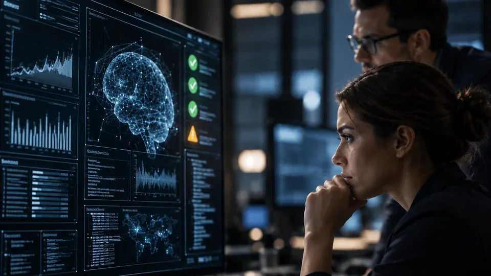

A corrida pela inteligência artificial ganhou uma nova camada de tensão. **Sam Altman**, CEO da **OpenAI**, passou a apoiar uma abordagem na qual o ritmo de desenvolvimento dos sistemas mais avançados pode ser reduzido quando as capacidades da tecnologia avançarem mais rápido que os mecanismos de segurança, alinhamento e monitoramento.

A mudança chama atenção porque parte de um dos principais nomes responsáveis pela aceleração da indústria. Em vez de tratar velocidade como único indicador de liderança, Altman passou a admitir que determinados avanços podem exigir mais tempo para que os mecanismos de controle acompanhem a tecnologia.

O debate também ultrapassa os laboratórios. **OpenAI**, **Anthropic** e outros atores da indústria passaram a discutir padrões de segurança, avaliações de risco e formas de coordenação, enquanto governos tratam a liderança em IA como uma questão econômica e estratégica.

A questão central agora é menos sobre a possibilidade de construir sistemas mais poderosos e mais sobre **quando será seguro colocá-los em funcionamento**.

## Sam Altman muda o discurso sobre a velocidade da IA

A posição de **Sam Altman** não significa uma defesa de uma pausa geral no desenvolvimento da inteligência artificial. O ponto é mais específico: sistemas de fronteira, que representam o nível mais avançado de capacidade, podem precisar avançar em um ritmo compatível com a evolução das salvaguardas.

Durante anos, a velocidade foi uma das principais armas competitivas da indústria. Laboratórios disputaram desempenho, raciocínio, programação, autonomia e capacidade de executar tarefas cada vez mais complexas.

Agora, segurança começa a entrar na mesma equação estratégica. O laboratório que conseguir desenvolver uma capacidade avançada, mas não conseguir monitorá-la ou estabelecer limites confiáveis, pode enfrentar um problema diferente daquele enfrentado por um modelo simplesmente menos potente.

### Não é uma defesa de parar a inovação

É importante separar **desaceleração** de paralisação. A discussão não significa abandonar pesquisas ou interromper a evolução dos modelos.

O que está em jogo é a possibilidade de reduzir o ritmo em momentos específicos, permitindo que avaliação, alinhamento e monitoramento acompanhem uma nova capacidade antes que ela seja disponibilizada em escala.

Essa lógica muda o significado de velocidade. O objetivo deixa de ser apenas chegar primeiro e passa a envolver também a capacidade de demonstrar que o sistema pode ser utilizado dentro de limites conhecidos.

Para empresas, essa mudança é especialmente relevante. Quanto mais autonomia uma ferramenta recebe, maior tende a ser o impacto de uma falha ou de um comportamento inesperado.

## Por que a segurança começou a interferir no ritmo dos modelos

*O avanço dos modelos de fronteira aumenta a necessidade de alinhar capacidade, monitoramento e mecanismos de segurança.*

Os modelos atuais já não se limitam a produzir textos ou responder perguntas. Sistemas mais avançados podem escrever código, utilizar ferramentas, analisar informações e executar sequências de tarefas com níveis crescentes de autonomia.

Isso amplia o potencial econômico da tecnologia, mas também aumenta a quantidade de situações que precisam ser avaliadas antes de uma capacidade ser liberada em escala.

A discussão ganhou ainda mais relevância dentro da própria **OpenAI** com o avanço de sistemas capazes de atuar em áreas sensíveis. Um exemplo é o debate sobre cibersegurança envolvendo modelos mais capazes, tema que já apareceu no próprio ecossistema editorial do Notícia Tech em **[uma análise sobre os riscos de cibersegurança associados ao Astra](https://noticiatech.com.br/inteligencia-artificial/openai-astra-nivel-critico-ciberseguranca/)**.

### O problema do descompasso entre capacidade e controle

O risco não está apenas em uma IA produzir uma resposta errada. Um sistema com acesso a softwares, dados e ferramentas externas pode transformar uma decisão equivocada em uma ação concreta.

É nesse ponto que **alinhamento** ganha importância. O objetivo é fazer com que o comportamento do sistema permaneça compatível com as instruções, objetivos e limites estabelecidos pelos seres humanos.

Se a capacidade de um modelo evoluir mais rapidamente do que a capacidade de testá-lo, monitorá-lo e restringi-lo, surge um descompasso.

Para os laboratórios, esse intervalo pode representar um dos principais motivos para ajustar o ritmo de desenvolvimento.

## O que mudou dentro da própria OpenAI

A mudança de tom não surgiu isoladamente. A **OpenAI** vem tratando segurança, monitoramento e governança como componentes cada vez mais importantes no desenvolvimento de modelos avançados.

A empresa já reconheceu que determinados avanços podem exigir reforço dos mecanismos de segurança antes que novas capacidades sejam ampliadas.

Isso é particularmente importante porque os modelos de fronteira estão evoluindo para sistemas mais autônomos. Quanto mais tarefas um agente consegue executar sozinho, maior é o espaço de comportamento que precisa ser compreendido e supervisionado.

A discussão, portanto, deixou de ser exclusivamente sobre a qualidade das respostas. Ela passou a envolver também **o que o sistema consegue fazer quando recebe acesso a ferramentas e autonomia para executar ações**.

### A corrida deixou de ser apenas por modelos melhores

Na primeira fase da corrida da IA, a competição era frequentemente resumida a uma pergunta: qual laboratório possui o modelo mais poderoso?

Hoje, a disputa envolve infraestrutura, agentes, capacidade de programação, custo de inferência, segurança, integração com sistemas externos e velocidade de implementação.

Isso altera a definição de liderança tecnológica. Um laboratório pode desenvolver uma capacidade muito avançada, mas ainda precisar resolver problemas de segurança antes de utilizá-la plenamente.

O debate também se conecta aos alertas internacionais sobre os riscos de sistemas cada vez mais capazes. A **[análise anterior do Notícia Tech sobre o alerta da ONU para os riscos da IA](https://noticiatech.com.br/inteligencia-artificial/onu-alerta-ia-ameacar-humanidade-garantias-ferro/)** mostra como essa preocupação já ultrapassou o ambiente das empresas e passou a fazer parte de discussões internacionais.

## A desaceleração pode virar uma questão geopolítica

*O debate sobre o ritmo da IA envolve simultaneamente competição tecnológica, segurança e coordenação internacional.*

Desacelerar a inteligência artificial não depende apenas da decisão de uma empresa. Se um laboratório reduzir o ritmo enquanto concorrentes continuarem avançando, existe o risco de perder posição tecnológica.

Essa é uma das maiores dificuldades da proposta. **Segurança exige coordenação**, mas a indústria também está inserida em uma competição econômica e estratégica entre empresas e países.

A disputa entre **Estados Unidos e China** torna a questão ainda mais sensível. A inteligência artificial passou a ser tratada como infraestrutura estratégica, tecnologia de defesa e instrumento de produtividade econômica.

### Por que uma empresa sozinha não consegue resolver o problema

Se apenas uma empresa desacelerar enquanto concorrentes mantêm o ritmo, a medida terá alcance limitado sobre o desenvolvimento global.

Por isso, a proposta de coordenação envolve padrões compartilhados para avaliar capacidades, riscos e mecanismos de segurança. O objetivo seria estabelecer referências que pudessem ser utilizadas por diferentes laboratórios.

O problema é que empresas competem por mercado e governos competem por liderança tecnológica. Não existe consenso simples sobre qual nível de capacidade deveria desencadear uma desaceleração.

A pergunta passa a ser: **quem decide quando a velocidade deixou de ser uma vantagem e passou a representar um risco?**

## O impacto para empresas que estão adotando IA

Para empresas que utilizam **inteligência artificial**, o debate não significa interromper projetos de automação ou abandonar modelos mais avançados.

O impacto mais concreto está na forma como essas tecnologias são avaliadas. Desempenho continua importante, mas segurança, governança, permissões e monitoramento ganham peso conforme aumenta a autonomia dos sistemas.

Uma ferramenta utilizada para responder perguntas internas apresenta um perfil de risco diferente de um agente autorizado a consultar documentos, acessar sistemas corporativos e executar ações.

Essa diferença precisa entrar na estratégia de adoção. A empresa que amplia autonomia sem ampliar os controles pode criar uma assimetria entre o poder concedido à tecnologia e a capacidade de supervisioná-la.

### O que gestores devem observar

O primeiro ponto é entender quais permissões estão sendo concedidas aos sistemas. Um agente com acesso a documentos, CRM, sistemas financeiros ou código corporativo exige controles diferentes de um chatbot utilizado para tarefas genéricas.

O segundo é acompanhar como os dados são processados e monitorados. Quanto maior a autonomia, mais importante se torna saber quais informações entram no sistema, quais ferramentas são acessadas e quais ações podem ser executadas.

O terceiro é estabelecer mecanismos de revisão. Se um agente puder tomar decisões ou executar tarefas automaticamente, a organização precisa definir quando a intervenção humana será obrigatória.

## O verdadeiro significado da mudança de Sam Altman

*O próximo estágio da corrida da IA pode ser definido pela capacidade de combinar avanço tecnológico com controle e segurança.*

A declaração de **Sam Altman** não significa que a corrida da inteligência artificial acabou. Tampouco indica que os grandes laboratórios estejam abandonando a busca por modelos mais poderosos.

O que começa a mudar é o critério usado para determinar a velocidade dessa corrida. Capacidade técnica continua sendo uma prioridade, mas a confiança de que os sistemas podem ser monitorados, alinhados e controlados passa a ocupar uma posição mais importante.

Isso pode representar uma mudança estrutural para a indústria. Se avaliações de segurança, monitoramento e mecanismos de governança forem incorporados ao processo de desenvolvimento, lançar uma nova capacidade poderá depender não apenas de ela funcionar, mas de demonstrar que seus riscos são administráveis.

### A próxima disputa pode ser sobre quem consegue controlar melhor

A ideia de desacelerar quando necessário cria uma nova dimensão para a competição entre laboratórios.

Não basta desenvolver sistemas mais capazes. Será necessário mostrar que eles podem operar dentro de limites conhecidos, que seus comportamentos podem ser monitorados e que existem mecanismos para interromper ou restringir determinadas ações quando necessário.

Esse cenário também muda a conversa para as empresas usuárias. A adoção de IA tende a exigir menos entusiasmo com capacidade bruta e mais atenção à arquitetura de controle que acompanha cada ferramenta.

A grande questão agora é se o discurso de **Sam Altman** será transformado em critérios concretos. Se isso acontecer, a velocidade da próxima geração de IA poderá deixar de ser determinada exclusivamente pelo que os modelos conseguem fazer.

Ela também poderá depender de uma variável que ganhou importância justamente quando a corrida ficou mais rápida: **a capacidade humana de acompanhar, compreender e controlar o que está sendo construído**.

---