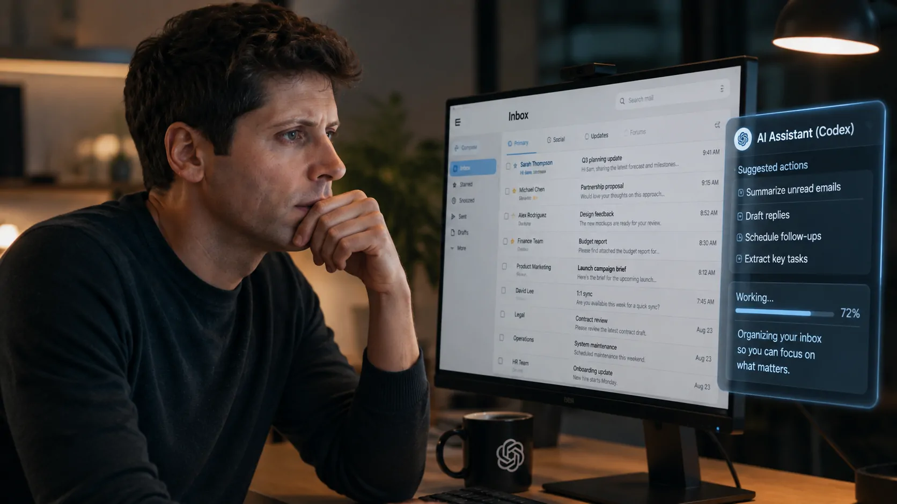
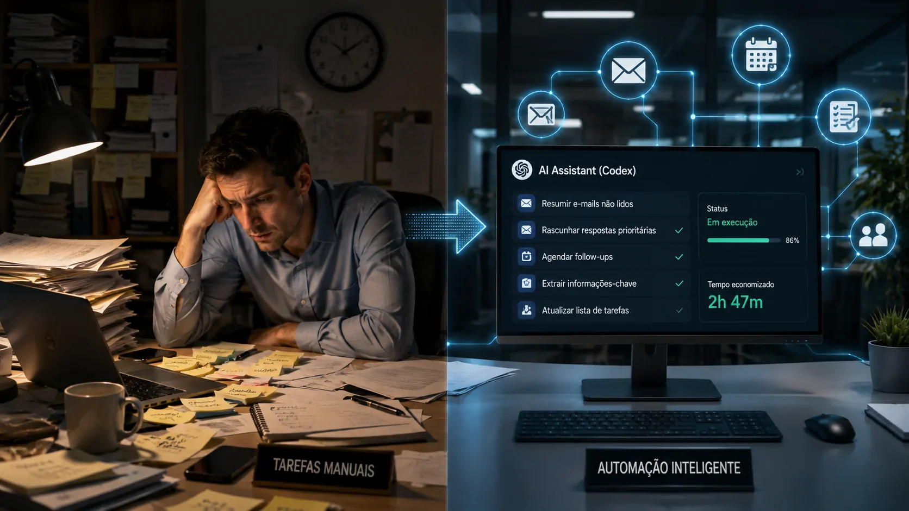
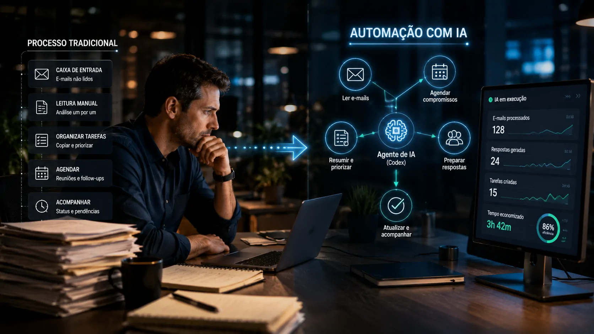

*O CEO da OpenAI reconheceu que continua usando o computador de uma forma que considera ultrapassada, mesmo tendo acesso a ferramentas capazes de automatizar parte dessas tarefas. O episódio mostra que o maior obstáculo à automação pode estar menos na capacidade da tecnologia e mais na dificuldade de mudar hábitos de trabalho.*

## Sam Altman reconhece que ainda trabalha como há 20 anos

**Sam Altman** admitiu que continua verificando e-mails manualmente e realizando outras tarefas repetitivas no computador, apesar de ter acesso ao **Codex**, ferramenta da **OpenAI** capaz de executar tarefas diretamente no computador. A declaração ocorreu em uma conversa com David Senra publicada em 23 de agosto.

Altman descreveu o comportamento como uma de suas maiores inconsistências psicológicas. Segundo ele, continua clicando entre aplicativos, copiando informações, percorrendo a caixa de entrada e mantendo uma lista de tarefas de maneira semelhante ao que fazia antes da chegada das ferramentas atuais.

O ponto mais interessante não é o fato de o CEO da **OpenAI** ainda responder e-mails manualmente. É que ele próprio reconhece existir uma maneira mais eficiente de executar essas tarefas e, mesmo assim, continua recorrendo ao processo antigo. 

A declaração ganha peso porque Altman está no centro da empresa que tenta justamente mudar a forma como as pessoas trabalham com computadores. O contraste entre o que a tecnologia já permite e o comportamento que permanece revela um problema maior para a adoção da IA.

## O hábito transforma trabalho manual em sensação de produtividade

*O contraste entre o fluxo tradicional de e-mails e a automação ilustra a dificuldade de abandonar processos que foram associados durante anos à ideia de produtividade.*

**O principal obstáculo identificado por Altman é comportamental:** tarefas manuais podem continuar parecendo trabalho mesmo quando deixaram de ser a maneira mais eficiente de produzir um resultado.

Ele explicou que existe algo incorporado à sua própria percepção de trabalho que associa atividades como percorrer e-mails, organizar tarefas e movimentar informações entre aplicativos à sensação de estar sendo produtivo. A contradição é que ele afirma não gostar desse processo quando questionado diretamente.

Esse mecanismo ajuda a explicar por que a introdução de uma ferramenta de **IA** não necessariamente produz uma mudança imediata no comportamento. O usuário pode reconhecer que uma tarefa pode ser automatizada e, ainda assim, continuar executando-a manualmente porque o processo antigo já está incorporado à rotina.

Para empresas, essa diferença é relevante. Comprar uma ferramenta de IA é uma decisão tecnológica. Fazer com que funcionários abandonem processos antigos e reorganizem seu trabalho é uma decisão operacional muito mais complexa.

## Ter uma IA capaz de executar tarefas não significa usá-la

O caso de **Sam Altman** também mostra uma diferença importante entre capacidade tecnológica e adoção real. O **Codex** pode realizar tarefas no computador, mas isso não significa que seu usuário automaticamente reorganizará toda a rotina ao redor dele.

Altman disse que poderia utilizar a ferramenta para lidar com uma pilha de e-mails, tarefas pendentes e outras atividades rotineiras. Mesmo reconhecendo essa possibilidade, ele continua executando parte dessas atividades pelo método tradicional. 

Essa situação pode ser descrita como uma fase intermediária da adoção. O trabalhador não abandonou o computador convencional, mas também já possui ferramentas capazes de executar algumas etapas do trabalho de maneira diferente.

É justamente essa convivência entre dois modelos que torna a transição mais difícil. O processo antigo continua disponível, conhecido e previsível. O novo processo exige que o usuário descubra quando delegar uma tarefa à IA, como supervisionar o resultado e como reorganizar o restante do fluxo.

A própria análise de Altman é que essa transformação precisa acontecer gradualmente. Ele também afirmou que produtos melhores podem tornar a transição mais natural, reduzindo o esforço necessário para mudar hábitos profundamente incorporados. 

## O problema da automação pode estar no fluxo de trabalho

*Empresas podem ter acesso a ferramentas avançadas de IA e ainda manter processos antigos quando a tecnologia não está integrada ao fluxo real de trabalho.*

**A experiência de Altman sugere que a próxima etapa da automação depende da integração da IA ao fluxo de trabalho, e não apenas da disponibilidade de ferramentas.**

Isso muda a pergunta que empresas deveriam fazer. Em vez de simplesmente perguntar qual ferramenta de IA comprar, é mais importante identificar quais etapas do trabalho ainda dependem de ações manuais e como essas etapas poderiam ser reorganizadas.

A diferença é significativa. Uma empresa pode disponibilizar um assistente de IA para seus funcionários e continuar exigindo que eles copiem informações entre sistemas, acompanhem tarefas manualmente e alternem entre várias aplicações. Nesse cenário, a tecnologia existe, mas o processo continua essencialmente igual.

O próprio **Notícia Tech** já acompanha essa mudança em conteúdos sobre integração de IA ao ambiente corporativo. Em uma análise anterior, o site mostrou como o **ChatGPT** pode trabalhar conectado a arquivos e informações empresariais, reduzindo a distância entre a IA e os dados usados diariamente pelas equipes. **[O ChatGPT já consegue trabalhar com o Google Drive nas empresas. Entenda o que muda](https://noticiatech.com.br/inteligencia-artificial/chatgpt-google-drive-ia-empresas/)**

A evolução mais importante, portanto, pode acontecer quando a IA deixa de ser uma janela adicional aberta no computador e passa a fazer parte do próprio processo operacional.

## Empresas podem enfrentar o mesmo dilema de Sam Altman

**O caso de Altman não prova que empresas resistirão à automação, mas mostra um obstáculo concreto que gestores precisam considerar: a mudança de comportamento pode ser mais lenta que a evolução tecnológica.**

Em ambientes corporativos, esse problema pode aparecer de diversas formas. Funcionários podem continuar produzindo relatórios manualmente porque estão acostumados ao processo, mesmo quando uma IA consegue preparar uma primeira versão. Equipes podem continuar transferindo informações entre sistemas porque esse procedimento já faz parte da rotina. Gestores podem continuar avaliando produtividade pelo volume de atividade executada, mesmo quando parte dessas tarefas poderia ser delegada a agentes.

Essa questão se torna ainda mais importante à medida que a IA passa de uma ferramenta que apenas responde perguntas para sistemas capazes de executar ações. O Sitemap do **Notícia Tech** já registra análises sobre agentes de IA e responsabilidade empresarial, mostrando que a discussão está avançando da simples geração de conteúdo para a execução autônoma de tarefas. **[Agentes de IA já criam um novo problema para as empresas: quem responde por suas ações](https://noticiatech.com.br/inteligencia-artificial/agentes-ia-responsabilidade-empresas-acoes-autonomas/)**

O desafio, então, deixa de ser apenas ensinar pessoas a usar uma ferramenta. Empresas precisam redesenhar processos para determinar quais atividades devem permanecer com humanos, quais podem ser delegadas à IA e quais exigem supervisão.

Essa mudança também altera a definição de produtividade. Fazer mais cliques, responder mais mensagens ou preencher mais campos não necessariamente significa produzir mais valor.

## A próxima barreira da IA pode ser mudar a maneira de trabalhar

*O próximo estágio da automação depende da combinação entre capacidade da IA, novos produtos e mudanças graduais nos hábitos de trabalho.*

**A declaração de Sam Altman aponta para uma barreira menos visível da adoção de IA: a dificuldade de abandonar uma rotina que durante anos foi sinônimo de produtividade.**

A tecnologia já permite que computadores executem tarefas que antes exigiam uma sequência de ações humanas. O que ainda não está resolvido é como transformar essa capacidade em um comportamento cotidiano que pareça natural para quem trabalha.

Altman comparou o momento atual aos smartphones antes do iPhone. A tecnologia necessária já existia, mas ainda faltava uma experiência suficientemente integrada para fazer as pessoas mudarem de comportamento. Para ele, a IA pode estar atravessando uma fase semelhante. 

Isso ajuda a explicar por que a adoção corporativa pode avançar de maneira diferente da evolução dos modelos. Uma empresa pode ter acesso a sistemas extremamente capazes e continuar operando com processos antigos durante algum tempo.

O caso de **Sam Altman** é revelador justamente por isso. Se até o executivo que lidera uma das empresas responsáveis por essa transformação reconhece que seus próprios hábitos ainda o puxam para o modelo antigo, a questão da automação deixa de ser apenas tecnológica.

A disputa passa a ser também pela criação de uma nova maneira de trabalhar. Quem conseguir tornar essa transição simples, integrada e confiável poderá reduzir a distância entre aquilo que a **IA** consegue fazer e aquilo que as empresas realmente conseguem incorporar às suas operações.

---