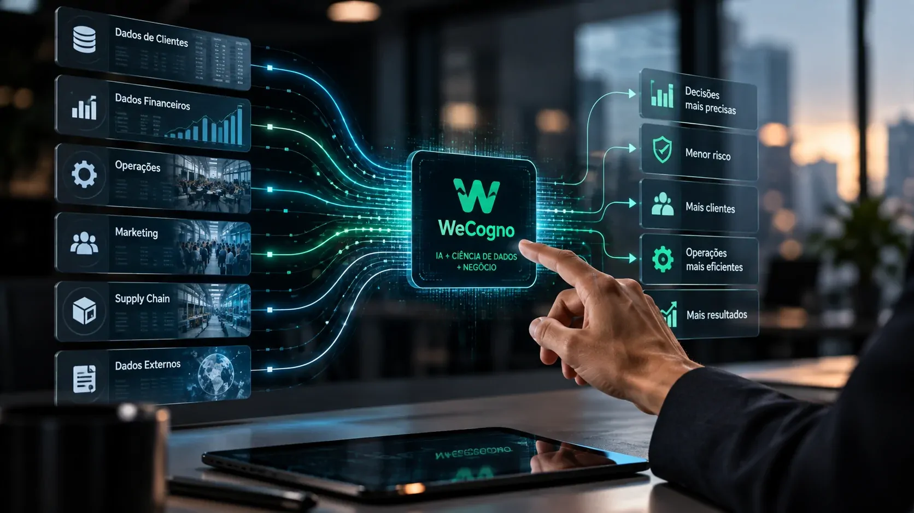

*O lançamento da brasileira **WeCogno** coloca no mercado uma proposta que vai além da geração de conteúdo por inteligência artificial: transformar dados empresariais em conhecimento capaz de orientar decisões. Com um investimento de **R$ 2,5 milhões**, a empresa aposta na combinação de IA, ciência de dados e conhecimento de negócio para atuar em áreas nas quais uma decisão errada pode representar perda de receita, aumento de risco ou desperdício operacional.*

## WeCogno nasce com uma proposta diferente para a IA empresarial

A **WeCogno** chega ao mercado com uma proposta centrada em transformar dados e informações empresariais em decisões mais precisas. A empresa combina **inteligência artificial, ciência de dados e conhecimento de negócio** para interpretar informações dentro do contexto específico de cada organização.

A estratégia é relevante porque o desafio de muitas empresas não está apenas em possuir grandes volumes de dados. O problema está em transformar essas informações em uma ação concreta: aprovar ou não um crédito, identificar um risco, priorizar um cliente, ajustar uma operação ou decidir onde investir.

### Da informação para a decisão

A empresa se apresenta como uma **Cognitech**, conceito que combina tecnologia, cognição e experiência aplicada ao negócio. A proposta é fazer com que a análise deixe de ser apenas uma etapa de diagnóstico e passe a participar diretamente dos processos de decisão.

Na prática, isso aproxima a IA de problemas empresariais específicos. Em vez de tratar os dados como um ativo isolado, a WeCogno busca conectá-los a objetivos, regras, processos e indicadores que fazem parte da operação.

### Uma nova fase depois da Datarisk

A história da empresa começa antes do nome **WeCogno**. A companhia informa que foi fundada em 2017 como **Datarisk** e passou por diferentes fases de desenvolvimento de produtos e serviços de dados.

Em sua trajetória, a empresa afirma ter lançado uma plataforma de AutoML, recebido investimentos e desenvolvido soluções de machine learning. Em 2026, a mudança para WeCogno marca um novo posicionamento, com a proposta de reunir essa experiência sob a categoria de Cognitech.

## O que a plataforma de IA da WeCogno pretende resolver

*Dados empresariais são conectados a modelos de inteligência artificial para apoiar decisões estratégicas e operacionais.*

A proposta da **WeCogno** está relacionada principalmente a decisões nas quais dados históricos e comportamentais podem ajudar uma empresa a reduzir incertezas. A plataforma combina modelos analíticos, inteligência artificial e conhecimento do negócio para transformar sinais dispersos em recomendações e decisões.

### Crédito e risco estão entre os principais casos de uso

No setor financeiro, a empresa trabalha com aplicações que podem apoiar decisões de **crédito, risco, fraude, cobrança e gestão de portfólio**.

Entre os exemplos estão modelos para estimar risco de inadimplência, apoiar políticas de aprovação, identificar padrões suspeitos, priorizar operações e acompanhar mudanças no comportamento de uma carteira.

Esse tipo de aplicação mostra onde a IA pode produzir valor mais diretamente: não apenas ao gerar uma análise, mas ao ajudar uma organização a decidir **quem aprovar, qual risco assumir, qual cliente priorizar e quando agir**.

### Marketing e operações também entram no modelo

A atuação não está restrita ao setor financeiro. A WeCogno também apresenta aplicações para **marketing, growth, produto, operações, supply chain, logística e atendimento**.

No marketing, por exemplo, modelos preditivos podem ser usados para identificar públicos com maior potencial, estimar valor de clientes e orientar investimentos. Em operações, a inteligência pode apoiar previsão de demanda, monitoramento e identificação de desvios.

A lógica permanece a mesma: conectar dados disponíveis na organização a uma decisão que tenha consequência mensurável para o negócio.

## Por que transformar dados em decisões virou um desafio empresarial

O lançamento acontece em um momento em que empresas brasileiras já ampliaram o uso de inteligência artificial, mas ainda enfrentam dificuldades para transformar experimentos em aplicações realmente integradas à operação.

Um levantamento recente sobre adoção corporativa de IA no Brasil mostra justamente essa diferença entre utilizar a tecnologia e avançar para aplicações mais maduras. O **[cenário de adoção de IA pelas empresas brasileiras](https://noticiatech.com.br/inteligencia-artificial/empresas-brasileiras-usam-ia-nivel-avancado/)** ajuda a entender por que soluções voltadas à integração entre dados, processos e decisões podem ganhar espaço.

### O problema não é apenas ter dados

Uma empresa pode possuir CRM, ERP, sistemas financeiros, histórico de vendas, informações de clientes e inúmeros dashboards sem necessariamente conseguir responder rapidamente às perguntas mais importantes do negócio.

O valor aparece quando essas fontes conseguem alimentar modelos capazes de encontrar padrões, antecipar comportamentos ou indicar situações que merecem atenção.

É justamente nesse ponto que a proposta da **WeCogno** tenta se posicionar: entre a infraestrutura de dados e a decisão executiva ou operacional.

### IA precisa chegar ao processo

A diferença entre um projeto experimental e uma aplicação empresarial está, em grande parte, na capacidade de colocar o modelo dentro do fluxo de trabalho.

A própria WeCogno descreve uma abordagem que envolve preparação de dados, desenvolvimento de modelos, integração com sistemas, publicação por API, monitoramento e evolução contínua.

Isso significa que o objetivo não é apenas criar um modelo que funcione em laboratório. A proposta é fazer com que a inteligência produzida seja utilizada no momento em que uma decisão precisa ser tomada.

## Onde a WeCogno pode competir no mercado de IA empresarial

*O foco da proposta está na aplicação da inteligência artificial a decisões que afetam receita, risco, produtividade e operação.*

O posicionamento da **WeCogno** coloca a empresa em uma área mais específica do mercado de inteligência artificial: soluções voltadas à aplicação da tecnologia em problemas empresariais concretos.

### O diferencial está na especialização

A competição em IA empresarial não acontece apenas pela qualidade de um modelo. Para empresas, também importam integração, segurança, governança, conhecimento do setor e capacidade de adaptar a tecnologia aos processos existentes.

A WeCogno tenta explorar justamente essa combinação. Sua proposta envolve **modelos preditivos, engenharia de dados, inteligência artificial, Business Intelligence, agentes e soluções sob medida**.

Esse posicionamento também permite que a empresa trabalhe com diferentes níveis de maturidade tecnológica, desde organizações que precisam estruturar seus dados até operações que já possuem modelos e precisam colocá-los em produção.

### Governança passa a ser parte da equação

Quanto mais a IA participa de decisões importantes, maior fica a necessidade de acompanhar como os modelos funcionam, quais dados utilizam e quando seus resultados deixam de ser confiáveis.

Esse debate também aparece no avanço dos agentes de IA dentro das empresas. O **[movimento em direção a uma nova governança para agentes de IA nas empresas](https://noticiatech.com.br/inteligencia-artificial/microsoft-governanca-agentes-ia-empresas/)** mostra que colocar inteligência artificial dentro dos processos corporativos exige mais do que simplesmente disponibilizar tecnologia.

Para uma empresa como a WeCogno, isso cria uma oportunidade, mas também uma exigência: demonstrar que os modelos entregam valor sem perder rastreabilidade, controle e capacidade de monitoramento.

## O investimento de R$ 2,5 milhões mostra onde a aposta está

O lançamento da **WeCogno** envolve um investimento de **R$ 2,5 milhões**, segundo informações divulgadas sobre a nova plataforma. O capital acompanha uma estratégia de posicionamento em um mercado no qual empresas buscam transformar seus investimentos em dados e IA em resultados concretos.

O valor também ajuda a dimensionar a aposta: a empresa não está apresentando apenas uma nova ferramenta de software, mas uma proposta de atuação baseada em projetos, modelos, dados e integração com operações corporativas.

### Uma aposta em decisões de alto impacto

A escolha dos setores ajuda a explicar esse posicionamento. **Crédito, risco, seguros, indústria, varejo, marketing e operações** possuem algo em comum: decisões recorrentes podem produzir efeitos financeiros relevantes.

Um modelo capaz de melhorar uma decisão de crédito, reduzir perdas, antecipar demanda ou identificar um cliente com maior potencial pode ter impacto direto no resultado de uma empresa.

Isso cria uma lógica diferente da IA voltada apenas à produtividade individual. O valor potencial está associado à escala da decisão que a tecnologia ajuda a melhorar.

### O desafio será provar o valor na operação

O lançamento, por si só, não comprova que a plataforma produzirá ganhos em todas as empresas ou setores em que pretende atuar. O ponto que merece acompanhamento é a capacidade da **WeCogno** de transformar sua proposta técnica em resultados mensuráveis e recorrentes.

A própria empresa afirma já ter ultrapassado **1 bilhão de scores calculados** e construído mais de **500 soluções de inteligência artificial**, números que ajudam a contextualizar sua experiência anterior.

O próximo estágio será demonstrar como essa experiência se converte em escala sob a nova marca e em resultados consistentes para clientes.

## A aposta da WeCogno acompanha uma mudança na IA empresarial

*O próximo desafio da IA empresarial é transformar capacidade tecnológica em decisões integradas aos processos reais das organizações.*

A proposta da **WeCogno** sinaliza uma mudança importante no foco da inteligência artificial aplicada aos negócios: depois da fase em que empresas buscavam principalmente experimentar ferramentas generativas, cresce a necessidade de conectar IA aos dados, processos e decisões que realmente movimentam a operação.

### O valor pode estar menos no modelo e mais no contexto

Modelos de IA estão se tornando cada vez mais acessíveis. Isso reduz parte da vantagem de simplesmente ter acesso à tecnologia e aumenta a importância de possuir **dados próprios, contexto empresarial e capacidade de integração**.

Nesse cenário, empresas especializadas podem disputar espaço ao resolver uma questão que os modelos genéricos não respondem sozinhos: como aplicar determinada capacidade de IA aos problemas específicos de uma organização.

É uma diferença estratégica relevante. O modelo fornece capacidade; os dados e o conhecimento do negócio determinam como essa capacidade será utilizada.

### O mercado brasileiro passa a ter mais casos para observar

A entrada da **WeCogno** também amplia a diversidade do ecossistema brasileiro de IA. Em vez de depender apenas das grandes plataformas internacionais, empresas nacionais estão criando soluções voltadas a problemas específicos do mercado local.

Ainda é cedo para afirmar que o modelo de Cognitech se tornará uma categoria consolidada no mercado. O que já pode ser observado é uma tentativa de aproximar **IA, ciência de dados e conhecimento empresarial** em torno de uma pergunta mais prática: qual decisão a tecnologia consegue melhorar?

É essa resposta, mais do que o lançamento em si, que deverá determinar a relevância da nova fase da WeCogno.

---