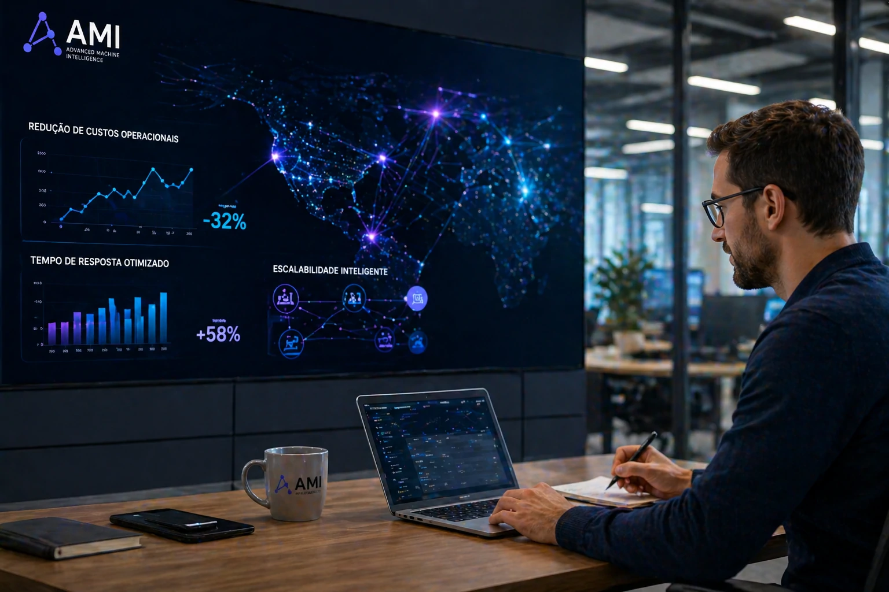

```markdown
---
title: "Startup francesa levanta US$ 1 bilhão para desenvolver nova geração de IA autônoma"
date: 2026-04-29T23:50:00-03:00
draft: false
description: "A startup francesa AMI levantou US$ 1 bilhão para acelerar sistemas de inteligência artificial autônoma. O movimento sinaliza uma nova fase da automação empresarial."
categories:
  - IA
tags:
  - inteligência artificial
  - agentes autônomos
  - automação empresarial
  - IA autônoma
  - inovação
cover:
  image: "capa.webp"
  alt: "Infraestrutura de inteligência artificial e automação empresarial"
  caption: "A nova fase da IA mira autonomia operacional."
---


**Deck editorial:**  
A startup francesa AMI levantou US$ 1 bilhão para acelerar uma nova geração de inteligência artificial baseada em autonomia operacional. O movimento reforça uma tendência que pode impactar diretamente empresas brasileiras nos próximos anos.

# Startup francesa levanta US$ 1 bilhão para desenvolver nova geração de IA autônoma

A corrida pela próxima geração da inteligência artificial ganhou um novo capítulo.

A startup francesa AMI (Advanced Machine Intelligence) anunciou uma captação de US$ 1 bilhão para acelerar o desenvolvimento de sistemas de inteligência artificial autônoma — um modelo que vai além da geração de conteúdo e mira execução de tarefas complexas sem supervisão constante.

O projeto é liderado por Yann LeCun, um dos nomes históricos da inteligência artificial e referência global em redes neurais profundas.

O movimento chama atenção não apenas pelo valor.

Mas pelo direcionamento estratégico do capital.

A nova aposta do mercado não está focada apenas em chatbots ou produção de conteúdo.

O foco agora é autonomia.

## O que é IA autônoma?


A inteligência artificial autônoma é uma evolução prática da IA generativa.

Enquanto modelos tradicionais dependem de comandos constantes, sistemas autônomos conseguem:

- interpretar contexto  
- tomar decisões  
- executar etapas múltiplas  
- ajustar estratégias durante o processo

Na prática, isso significa transformar IA de assistente em operador.

Um exemplo simples:

antes:

“escreva um e-mail comercial”

agora:

“analise leads, selecione oportunidades, envie contato inicial e atualize o CRM.”

A diferença está na execução.

## Por que investidores estão mudando o foco?


O investimento na AMI mostra uma tendência clara.

O mercado começa a buscar soluções com retorno operacional mais direto.

Nos últimos anos, grande parte do capital foi direcionada para IA generativa.

Agora o foco começa a migrar para automação inteligente com autonomia.

O motivo é econômico:

mais eficiência  
menos custo operacional  
mais escala

Para investidores, isso amplia o potencial de monetização.

Para empresas, amplia produtividade.

## O impacto para empresas brasileiras



Para o mercado brasileiro, especialmente pequenas e médias empresas, essa evolução pode ter efeito relevante.

Muitas empresas operam com equipes enxutas e processos manuais.

A IA autônoma pode mudar isso.

Aplicações práticas:

## Comercial

Qualificação automática de leads.

Follow-up inteligente.

Atualização automática de CRM.

## Atendimento

Triagem de clientes.

Respostas automáticas.

Priorização de urgência.

## Marketing

Execução de campanhas.

Otimização de anúncios.

Análise de performance.

## Operações

Automação de processos internos.

Monitoramento operacional.

Execução de rotinas repetitivas.

O ganho principal é produtividade sem expansão proporcional de equipe.

## A nova fase da automação empresarial

O avanço da IA autônoma pode representar uma mudança importante na forma como empresas operam.

Se a fase anterior da inteligência artificial foi marcada por geração de conteúdo, a próxima tende a ser marcada por execução.

Isso muda a lógica empresarial.

A IA deixa de apoiar.

E começa a operar.

Para empresas brasileiras, acompanhar esse movimento cedo pode significar vantagem competitiva.

Especialmente em mercados onde margem, velocidade e eficiência definem sobrevivência.

O investimento bilionário da AMI pode ser apenas o começo de uma nova corrida.

E dessa vez, o objetivo não é conversar melhor.

É trabalhar melhor.
```
