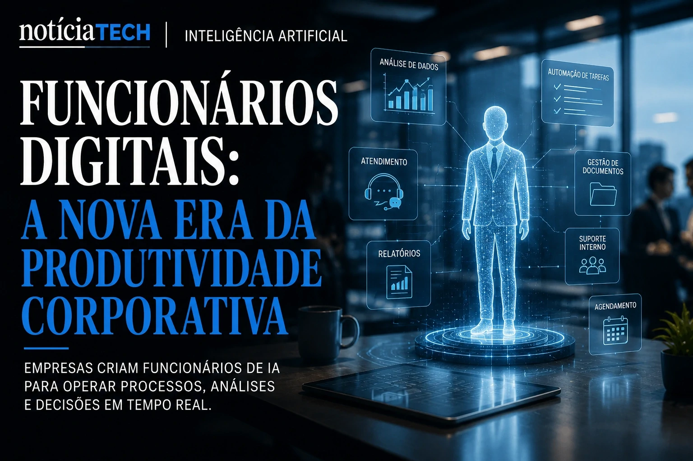
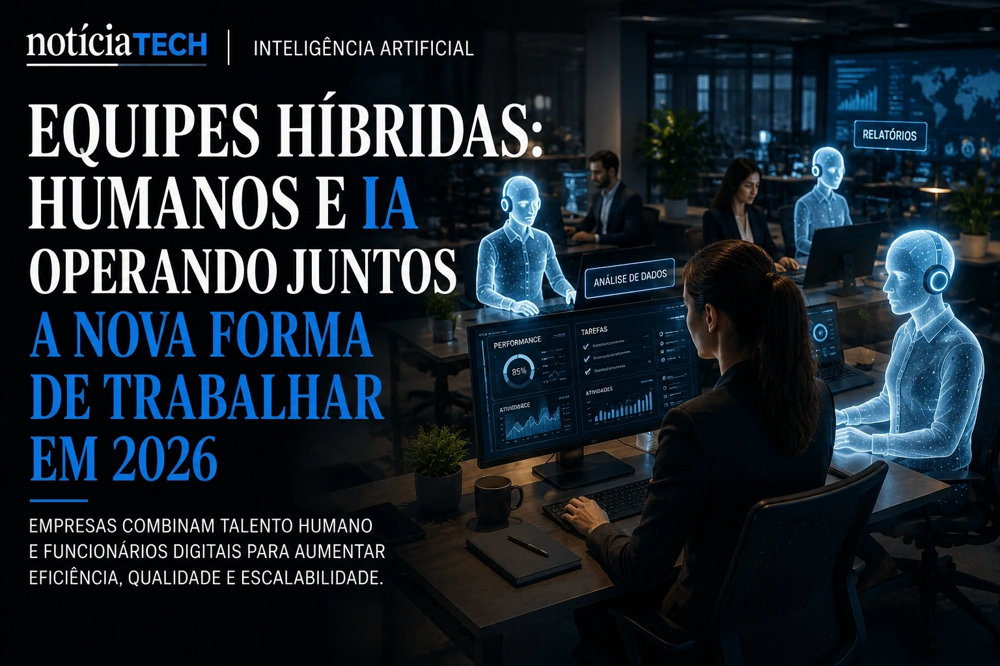
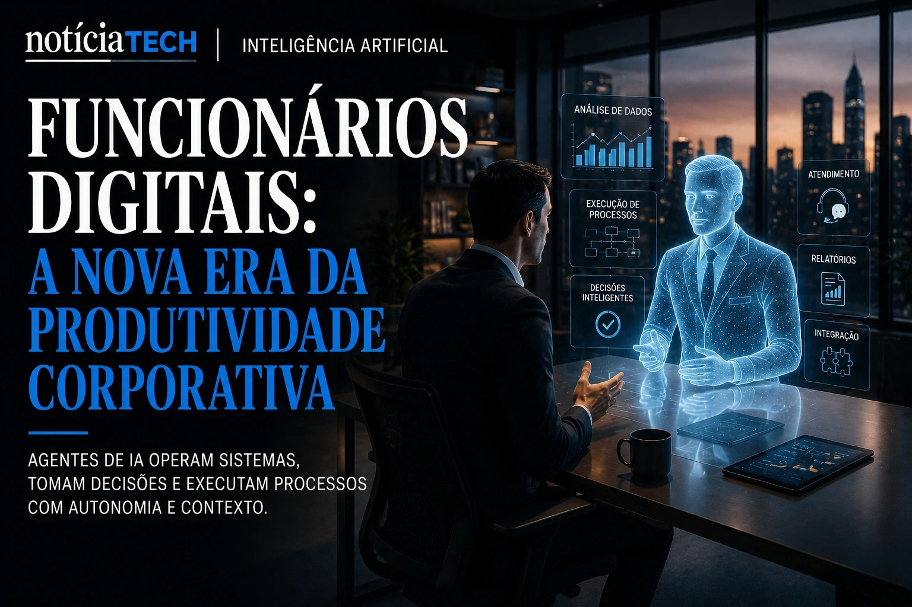

*Depois da explosão dos copilotos corporativos e dos agentes autônomos, uma nova camada da transformação empresarial começa a surgir silenciosamente em 2026: os chamados Synthetic Employees. Empresas globais passam a criar funcionários digitais movidos por inteligência artificial capazes de executar tarefas operacionais, analisar dados, responder clientes e operar sistemas corporativos quase sem intervenção humana.*

## O que são Synthetic Employees e por que empresas começam a adotá-los

**Synthetic Employees** são funcionários digitais baseados em inteligência artificial que operam tarefas específicas dentro das empresas de maneira contínua, contextual e integrada aos sistemas corporativos.

Na prática, esses agentes inteligentes podem:
- responder e-mails;
- atualizar CRMs;
- analisar contratos;
- gerar relatórios;
- operar sistemas internos;
- monitorar indicadores;
- executar suporte operacional;
- interagir com equipes humanas.

A diferença para automações tradicionais está na capacidade contextual.

Esses sistemas:
- compreendem linguagem natural;
- tomam decisões baseadas em regras corporativas;
- aprendem padrões operacionais;
- interagem com múltiplos softwares simultaneamente.

Empresas começam a enxergar esses agentes não apenas como ferramentas, mas como parte efetiva da operação diária.

### Por que o mercado começou a acelerar essa tendência

A pressão por produtividade, redução de custos e escalabilidade operacional acelerou o interesse por equipes híbridas compostas por humanos e IA.

Ao mesmo tempo:
- escassez de mão de obra especializada;
- aumento de custos operacionais;
- excesso de sistemas fragmentados;
- crescimento do volume de dados;

fizeram empresas buscar novas formas de operação.

Esse movimento possui forte relação com o crescimento dos ecossistemas autônomos já discutidos pelo NOTÍCIA TECH em:
[A era dos agentes de IA já começou: como Microsoft, OpenAI e Google estão transformando empresas em sistemas autônomos](https://noticiatech.com.br/inteligencia-artificial/a-era-dos-agentes-de-ia-j%C3%A1-come%C3%A7ou-como-microsoft-openai-e-google-est%C3%A3o-transformando-empresas-em-sistemas-aut%C3%B4nomos/)

## Como funcionários digitais começam a operar áreas inteiras dentro das empresas

Grandes empresas já começam a estruturar operações onde agentes de IA executam funções contínuas em diferentes departamentos.

Os Synthetic Employees podem atuar em:
- atendimento;
- financeiro;
- RH;
- vendas;
- suporte técnico;
- compliance;
- análise operacional;
- procurement;
- marketing.

Em muitos casos, um único funcionário humano começa a supervisionar múltiplos agentes inteligentes simultaneamente.

### O que muda na prática para empresas

O modelo tradicional de software corporativo começa a mudar rapidamente.

Antes:
- humanos operavam softwares;
- dashboards exigiam análise manual;
- equipes precisavam executar tarefas repetitivas continuamente.

Agora:
- agentes inteligentes operam sistemas;
- decisões simples são automatizadas;
- análises acontecem em tempo real;
- processos passam a funcionar continuamente.

Essa transformação também acelera o avanço dos copilotos analíticos:
[Empresas começam a substituir dashboards por copilotos analíticos movidos por IA generativa](https://noticiatech.com.br/negocios/empresas-come%C3%A7am-a-substituir-dashboards-por-copilotos-anal%C3%ADticos-movidos-por-ia-generativa/)

## Synthetic Employees podem transformar completamente a estrutura operacional das empresas

O impacto mais profundo talvez não esteja apenas na produtividade, mas na própria arquitetura organizacional das empresas.

Organizações começam a criar:
- equipes híbridas;
- operações autônomas;
- fluxos contínuos;
- sistemas autoexecutáveis;
- departamentos parcialmente automatizados.

Isso pode mudar:
- contratação;
- treinamento;
- gestão operacional;
- estrutura de equipes;
- produtividade corporativa.

### O que muda para pequenas empresas

Pequenas empresas talvez sejam algumas das maiores beneficiadas.

Com plataformas SaaS acessíveis, negócios menores passam a operar com:
- atendimento automatizado;
- suporte inteligente;
- geração de conteúdo;
- automação financeira;
- análise operacional;
- CRM inteligente.

Isso reduz barreiras históricas de escala.

Pequenas operações começam a acessar capacidades antes disponíveis apenas para grandes corporações.

Esse cenário se conecta diretamente à democratização da IA operacional discutida pelo NOTÍCIA TECH em:
[Ferramentas de IA para pequenas empresas: como automatizar atendimento, conteúdo e vendas sem equipe técnica](https://noticiatech.com.br/negocios/ferramentas-de-ia-para-pequenas-empresas-como-automatizar-atendimento-conte%C3%BAdo-e-vendas-sem-equipe-t%C3%A9cnica/)

## O crescimento dos funcionários digitais pode redefinir a próxima economia corporativa

A transformação provocada pelos Synthetic Employees pode criar uma das maiores mudanças organizacionais da história recente do mercado corporativo.

Empresas que conseguirem integrar:
- humanos;
- agentes inteligentes;
- automação;
- dados;
- IA generativa;

tendem a operar com:
- maior eficiência;
- escalabilidade superior;
- custos menores;
- velocidade operacional mais alta.

Ao mesmo tempo, organizações presas a modelos totalmente manuais podem enfrentar:
- baixa competitividade;
- custos operacionais elevados;
- lentidão decisória;
- dificuldade de escalar.

A inteligência artificial está deixando de funcionar apenas como ferramenta de apoio.

Ela começa a assumir funções operacionais contínuas dentro das empresas.

E quanto mais agentes autônomos evoluem para funcionários digitais contextualizados, mais o mercado percebe que a próxima revolução da IA talvez não seja apenas tecnológica — mas estrutural, organizacional e operacional.

---