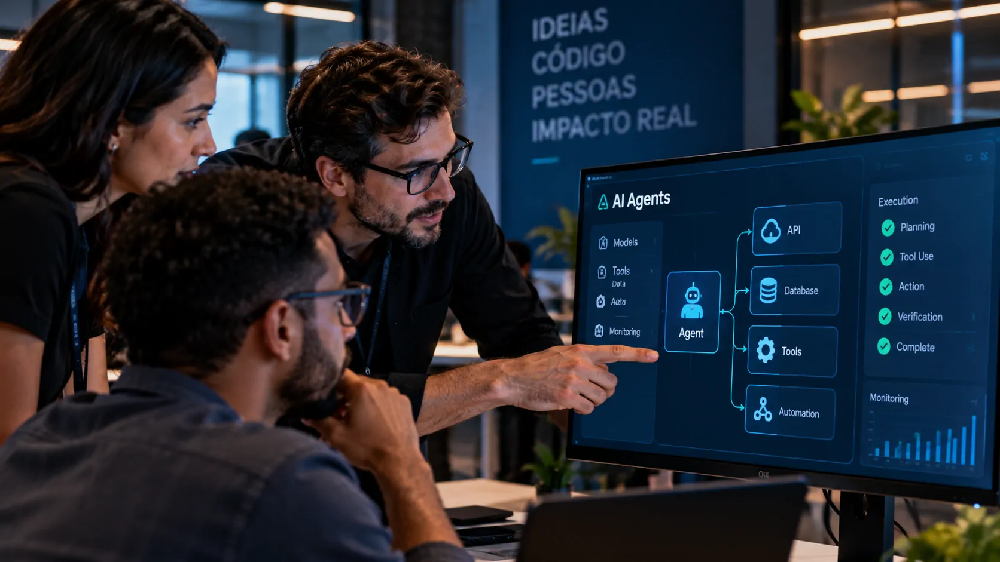
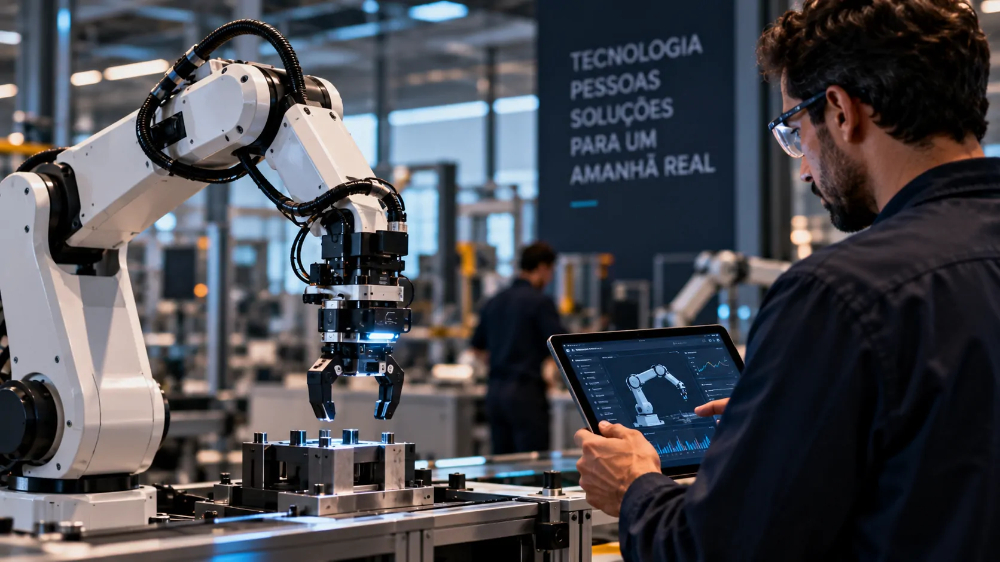

*O TDC São Paulo 2026 acontece nesta semana com uma programação que coloca agentes de IA, automação e Engenharia de IA no centro da discussão. A presença de empresas como Nubank, Google, Mercado Livre e AWS mostra como o debate está avançando da experimentação com IA para questões de desenvolvimento, infraestrutura, governança e aplicação prática nas organizações.*

## TDC 2026 acontece nesta semana em São Paulo

O **The Developers Conference (TDC)** chega à sua **20ª edição em São Paulo** entre os dias **23 e 25 de setembro de 2026**. O evento será realizado no **Pro Magno**, na capital paulista, em formato híbrido, com participação presencial e acompanhamento online.

A programação reúne desenvolvedores, arquitetos de software, engenheiros, especialistas, líderes técnicos e executivos. Entre as empresas representadas estão **Nubank**, **Google**, **Mercado Livre**, **AWS**, **Microsoft**, **Itaú**, **iFood**, **Oracle** e **Grupo Boticário**.

### Mais de 20 trilhas em três dias

O TDC terá **mais de 20 trilhas temáticas**, cobrindo áreas como arquitetura cloud, engenharia de dados, APIs e microsserviços, segurança, UX, desenvolvimento web, produto e growth.

A inteligência artificial aparece integrada a diferentes áreas, em vez de ficar restrita a uma única discussão. Entre os temas estão **agentes de IA**, **Governança de IA**, **Engenharia de IA**, **AI Code & Automação** e **Physical AI**.

### Por que o evento interessa ao mercado

Para empresas, a programação mostra que a discussão sobre IA está ficando mais ampla. Além da capacidade dos modelos, entram na pauta questões como infraestrutura, segurança, desenvolvimento, governança e integração com processos.

Esse movimento é relevante porque organizações que avançam na adoção de IA precisam lidar com a distância entre testar uma ferramenta e colocá-la funcionando de maneira consistente dentro da operação.

## Agentes de IA ganham espaço na programação

*Agentes de IA estão entre os principais temas da programação do TDC São Paulo 2026.*

A discussão sobre **agentes de IA** é um dos pontos centrais do TDC 2026. Diferentemente de uma aplicação que apenas responde a uma solicitação, um sistema agêntico pode combinar um modelo de IA com ferramentas, dados e etapas de execução para realizar tarefas dentro de um fluxo definido.

Na prática empresarial, isso coloca uma questão diferente para as equipes de tecnologia: não basta avaliar se um modelo produz uma boa resposta. É preciso pensar em como o sistema será integrado, controlado, monitorado e utilizado dentro de uma operação real.

### A AWS leva IA agêntica para o evento

A **AWS** preparou uma programação específica sobre o assunto. Entre as sessões divulgadas estão uma apresentação sobre **IA agêntica em tempo real e detecção de anomalias em escala**, marcada para 23 de setembro, e outra sobre **arquitetura de agentes e machine learning para aplicações financeiras**, no dia 24.

Também está prevista uma sessão sobre **AI-DLC**, voltada à industrialização do ciclo de vida de software no contexto de sistemas agênticos. Os temas aproximam a discussão de situações concretas de engenharia e operação.

### Do modelo para o processo

Esse é um dos pontos que tornam os agentes relevantes para empresas. O interesse deixa de estar apenas na geração de texto ou código e passa a envolver a execução de etapas de processos.

Isso pode significar conectar um sistema de IA a ferramentas internas, bases de dados ou serviços corporativos. Mas essa arquitetura também aumenta a necessidade de controles, porque um sistema com capacidade de executar ações exige regras claras sobre permissões, dados e supervisão.

## Engenharia de IA coloca o foco na produção

A programação do TDC também aborda um problema que aparece quando projetos de inteligência artificial deixam a fase de demonstração: **como colocar essas soluções em produção e mantê-las funcionando**.

Uma das trilhas do evento trata de **Engenharia de IA** e aborda a passagem do protótipo para a escala, incluindo **LLMOps** e infraestrutura de IA. LLMOps reúne práticas usadas para administrar aplicações baseadas em grandes modelos de linguagem ao longo de seu ciclo de vida.

### O desafio depois do protótipo

Criar uma demonstração com IA pode ser relativamente simples quando comparado ao trabalho necessário para integrar uma aplicação a sistemas corporativos.

Em produção, entram questões como disponibilidade, monitoramento, segurança, desempenho, custos de processamento, qualidade das respostas e manutenção. A infraestrutura também precisa acompanhar o volume de utilização sem transformar o projeto em uma operação difícil de controlar.

### Automação também chega ao desenvolvimento

O TDC inclui ainda a trilha **AI Code & Automação**, conectando inteligência artificial ao próprio processo de desenvolvimento de software.

O tema ganha importância à medida que ferramentas de IA passam a participar de atividades como geração e revisão de código. Um exemplo brasileiro ajuda a dimensionar esse movimento: a **B3** já aparece em uma aplicação prática desse tipo de tecnologia, com uso de IA na programação e redução no tempo de entrega.

Essa aplicação foi detalhada pelo Notícia Tech em **[como a B3 usa IA para programar e reduz em 35% o tempo de entrega](https://noticiatech.com.br/inteligencia-artificial/b3-usa-ia-programar-reduz-35-tempo-entrega/)**.

O caso ajuda a contextualizar por que a discussão do TDC não está limitada aos modelos de IA. A questão também é como incorporar essas ferramentas aos processos existentes sem perder controle sobre qualidade e segurança.

## Physical AI leva a inteligência artificial para o mundo físico

*O conceito de Physical AI amplia a discussão sobre inteligência artificial para sistemas capazes de interagir com o ambiente físico.*

Outro destaque do TDC 2026 é a trilha **Physical AI**, marcada para 25 de setembro. O conceito amplia a discussão tradicional sobre aplicações digitais de IA para sistemas que percebem o ambiente e podem participar de ações no mundo físico.

### Da tela para o ambiente físico

Em uma aplicação convencional, a IA pode analisar dados, gerar texto ou auxiliar uma pessoa em uma interface digital. Na chamada **Physical AI**, a inteligência artificial passa a ser relacionada a sistemas que precisam interpretar informações do ambiente e interagir com ele.

Robótica é um dos campos associados a essa abordagem. Isso adiciona novas exigências técnicas, porque decisões tomadas por sistemas computacionais podem precisar considerar sensores, movimento, segurança e condições físicas.

### Uma discussão que interessa à indústria

Para empresas, o assunto pode alcançar áreas como manufatura, logística e operações automatizadas, embora cada aplicação dependa de seus próprios requisitos técnicos e econômicos.

A presença de **Physical AI** entre as trilhas do TDC indica que o evento pretende discutir a IA não apenas como software, mas também em sua relação com sistemas físicos e automação.

## Governança passa a acompanhar a adoção de IA

*Governança de IA envolve decisões sobre riscos, segurança, responsabilidade e uso da tecnologia dentro das organizações.*

A programação também reserva espaço específico para **Governança de IA**. O tema trata de uma camada que ganha importância conforme as organizações ampliam o uso da tecnologia.

Para uma empresa, adotar IA significa mais do que escolher um modelo. É necessário estabelecer regras sobre dados, acesso, segurança, responsabilidades e formas de acompanhar o comportamento das aplicações.

### O debate sai do laboratório

Esse aspecto aproxima a IA da gestão empresarial. Uma aplicação pode funcionar tecnicamente e ainda assim exigir revisão de processos antes de ser utilizada em larga escala.

Por isso, governança aparece ao lado de temas como risco, investimento, competitividade e transformação organizacional. São questões que envolvem não apenas profissionais de tecnologia, mas também áreas responsáveis por decisões estratégicas.

### O papel dos executivos

O TDC também terá um **Fórum Executivo**, direcionado a líderes e executivos, com discussões sobre impacto, risco, governança, investimento e direcionamento estratégico.

A existência desse espaço reforça uma característica importante da edição de 2026: a IA está sendo tratada simultaneamente como questão técnica e empresarial.

Esse cenário também aparece em outros levantamentos sobre o mercado brasileiro. O Notícia Tech já analisou **[como empresas brasileiras estão avançando para níveis mais altos de adoção de IA](https://noticiatech.com.br/inteligencia-artificial/empresas-brasileiras-usam-ia-nivel-avancado/)**, mostrando que a discussão sobre inteligência artificial empresarial vai além da escolha de ferramentas.

## O que o TDC 2026 mostra sobre a próxima fase da IA

A programação do **TDC São Paulo 2026** ajuda a visualizar uma mudança no foco das discussões corporativas. Os temas não se concentram apenas em apresentar novos modelos ou ferramentas, mas em como construir sistemas, integrá-los aos processos e administrar os riscos associados à adoção.

### A distância entre experimentar e operar

Agentes de IA, Engenharia de IA, automação e governança aparecem como partes conectadas do mesmo problema: transformar capacidade técnica em aplicações que possam ser utilizadas dentro das organizações.

Essa conexão é relevante porque o valor de uma solução empresarial não depende apenas do que o modelo consegue produzir. Também depende de infraestrutura, integração, segurança, controle e capacidade de manutenção.

### O que acompanhar durante o evento

Entre 23 e 25 de setembro, as discussões do TDC devem mostrar quais desafios técnicos e organizacionais estão recebendo mais atenção de profissionais que trabalham diretamente com IA e software.

Para quem acompanha a adoção da tecnologia nas empresas brasileiras, o principal ponto de observação será justamente a passagem da IA como ferramenta experimental para sistemas incorporados aos processos de negócio.

É nessa etapa que agentes, automação, engenharia e governança deixam de ser assuntos separados e começam a fazer parte da mesma arquitetura de transformação digital.

---