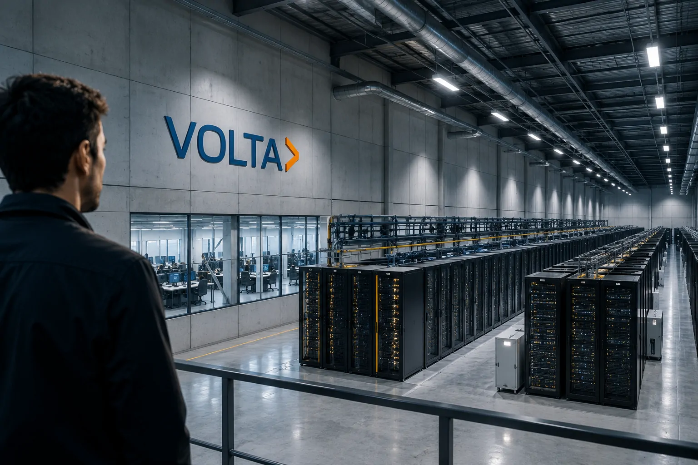
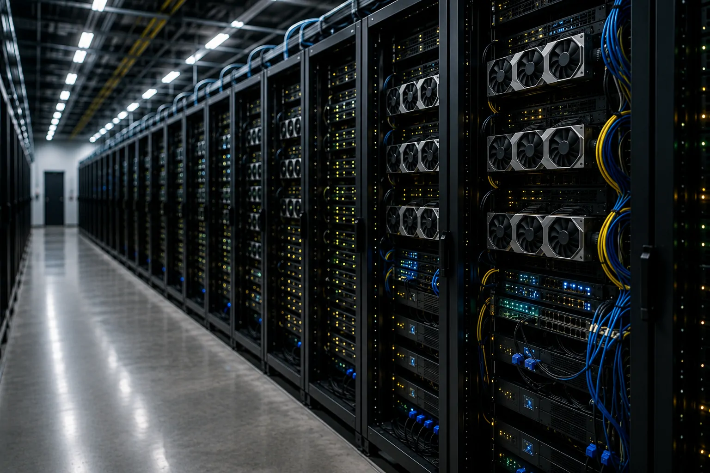
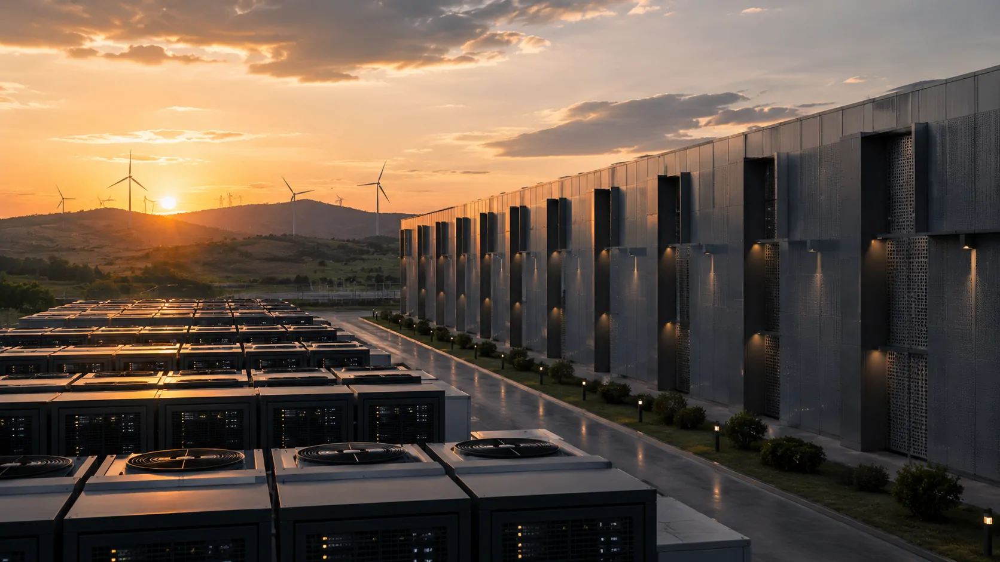

*Uma startup criada há apenas sete meses já alcançou uma avaliação de US$ 2,4 bilhões e anunciou um contrato de US$ 10 bilhões para fornecer capacidade de computação em nuvem. O movimento revela uma mudança importante na economia da inteligência artificial: a próxima grande disputa pode acontecer menos na tela dos chatbots e mais nos data centers que fazem esses sistemas funcionar.*

## Uma startup de sete meses entrou em uma disputa de bilhões

*Uma nova geração de empresas está tentando ocupar uma posição estratégica na infraestrutura que sustenta a expansão da inteligência artificial.*

A **Volta Infra** alcançou uma avaliação de **US$ 2,4 bilhões** apenas sete meses depois de sua criação. A startup também anunciou um contrato de aproximadamente **US$ 10 bilhões** para fornecer serviços de computação em nuvem para uma empresa de inteligência artificial na Europa, em parceria com a **Bitdeer Technologies**.

O tamanho dos números chama atenção, mas o ponto estratégico está em outro lugar. A **Volta Infra** não está tentando competir com **OpenAI**, **Anthropic**, **Google** ou **Meta** na criação do melhor modelo de IA.

A startup está disputando uma camada anterior: a infraestrutura necessária para que os modelos possam ser treinados e executados.

### O que a Volta Infra está construindo

A **Volta Infra** atua no segmento de infraestrutura de IA, uma área que reúne **data centers**, energia, hardware, redes e capacidade computacional.

Na prática, um laboratório de IA precisa de milhares de processadores especializados para desenvolver modelos avançados. Depois que um modelo é lançado, ele continua consumindo computação sempre que usuários fazem perguntas, empresas automatizam processos ou agentes executam tarefas.

Essa segunda etapa é chamada de **inferência**. É quando o modelo já treinado recebe uma solicitação e calcula uma resposta. Quanto maior a quantidade de usuários e tarefas, maior tende a ser a necessidade de capacidade computacional.

### Por que US$ 10 bilhões não significam US$ 10 bilhões de receita imediata

O valor anunciado representa um contrato de longo prazo, e não dinheiro já recebido pela startup.

Essa diferença é importante porque construir infraestrutura de IA exige investimentos enormes antes que a capacidade esteja totalmente operacional. A empresa ainda precisa garantir energia, equipamentos, instalações, redes e operação dos sistemas.

Mesmo assim, contratos dessa dimensão mostram que empresas de IA estão dispostas a comprometer grandes volumes de capital para garantir capacidade futura.

O movimento ajuda a explicar por que uma empresa tão jovem conseguiu alcançar uma avaliação tão elevada em um mercado no qual a demanda por computação cresce rapidamente.

## Por que a computação virou o novo gargalo da inteligência artificial

*Data centers especializados em IA concentram GPUs, energia e redes necessárias para executar cargas computacionais de grande escala.*

A computação se tornou um dos principais gargalos da IA porque modelos avançados dependem de enormes quantidades de processamento, memória, energia e infraestrutura física.

### GPUs deixaram de ser apenas componentes de hardware

Uma **GPU**, ou unidade de processamento gráfico, é um processador capaz de executar muitas operações matemáticas simultaneamente. Essa característica tornou as GPUs especialmente importantes para o treinamento e a execução de modelos de inteligência artificial.

O problema é que comprar GPUs não resolve sozinho a questão.

É necessário instalar esses equipamentos em data centers preparados para suportar seu consumo elétrico e sua produção de calor. Também é preciso conectar milhares de processadores por redes extremamente rápidas para que eles trabalhem como um sistema integrado.

Por isso, a capacidade de IA passou a depender de uma combinação de **chips, energia, espaço físico, refrigeração, redes e software**.

O crescimento dessa infraestrutura já aparece em movimentos de grandes laboratórios. A **Anthropic**, por exemplo, anunciou uma expansão de **US$ 35 bilhões** ligada à infraestrutura de IA, mostrando como a capacidade computacional passou a fazer parte da estratégia de crescimento das empresas que desenvolvem modelos avançados. **[Anthropic acelera expansão de US$ 35 bilhões e mostra por que infraestrutura virou questão estratégica](https://noticiatech.com.br/inteligencia-artificial/anthropic-expansao-35-bilhoes-infraestrutura-ia/)**.

### O verdadeiro ativo pode estar além do chip

A corrida atual ajuda a explicar por que uma empresa recém-criada pode alcançar uma avaliação tão elevada.

O ativo estratégico não é apenas possuir GPUs. É conseguir reunir todos os elementos necessários para transformar essas GPUs em capacidade computacional disponível para clientes.

Essa mudança altera a lógica do mercado.

Antes, a discussão sobre IA estava concentrada principalmente em quem tinha o melhor modelo. Agora, uma pergunta igualmente importante é: **quem consegue garantir computação suficiente para treinar e executar esses modelos em escala?**

Isso cria uma nova camada de competição entre laboratórios de IA, provedores de nuvem e empresas especializadas em infraestrutura.

## O surgimento das neoclouds muda a estrutura do mercado

*As neoclouds ocupam uma camada especializada do mercado ao oferecer capacidade computacional dedicada para cargas de inteligência artificial.*

As chamadas **neoclouds** são empresas especializadas em fornecer capacidade de computação para cargas intensivas de inteligência artificial.

Elas surgiram porque os grandes laboratórios de IA precisam de capacidade adicional e nem sempre querem depender exclusivamente de **AWS**, **Microsoft Azure** ou **Google Cloud**.

Esse movimento cria uma nova camada no mercado de nuvem, especialmente voltada para clientes que precisam de grandes volumes de processamento para **treinamento** e **inferência**.

### Por que empresas de IA estão procurando novos provedores

A demanda por computação cresceu em duas frentes.

A primeira é o **treinamento**, processo no qual grandes volumes de dados são utilizados para ajustar os parâmetros de um modelo de IA.

A segunda é a **inferência**, quando o modelo já pronto responde às solicitações dos usuários.

Modelos mais capazes, agentes que executam tarefas e aplicações empresariais de IA aumentam a necessidade nas duas etapas.

Isso cria uma situação na qual garantir capacidade futura pode ser tão importante quanto contratar capacidade atual.

Para um laboratório de IA, ficar sem computação suficiente no momento em que um produto começa a crescer pode significar limitar usuários, atrasar novos modelos ou aumentar custos.

### O modelo de negócio exige muito capital

O crescimento das neoclouds também revela um problema: infraestrutura de IA é extremamente intensiva em capital.

Uma empresa precisa investir antecipadamente em instalações, energia, GPUs e redes. O retorno depende de conseguir contratos suficientemente grandes e longos para justificar esse investimento.

É por isso que acordos bilionários têm tanto peso nesse mercado.

Eles permitem que o provedor tenha maior previsibilidade de receita e, ao mesmo tempo, dão ao cliente maior segurança de que haverá capacidade disponível quando seus modelos precisarem crescer.

O risco, porém, também aumenta.

Se a tecnologia mudar rapidamente ou se a capacidade instalada superar a demanda, empresas muito alavancadas podem enfrentar pressão sobre margens e retorno dos investimentos.

Essa questão é especialmente relevante porque o mercado já possui outros movimentos relacionados à infraestrutura e energia. O **Notícia Tech** analisou como a expansão dos data centers de IA está criando uma pressão crescente sobre o setor energético em **[Crise energética da inteligência artificial coloca data centers no centro da nova disputa tecnológica](https://noticiatech.com.br/inteligencia-artificial/crise-energetica-inteligencia-artificial-data-centers/)**.

A consequência é que a corrida pela IA começa a deixar de ser apenas uma disputa entre modelos. Ela passa a envolver também **capital, energia, chips, data centers e capacidade computacional**.

## Volta Infra mostra que a guerra da IA está mudando de lugar

O caso da **Volta Infra** representa uma mudança de escala na disputa pela inteligência artificial: a competição está avançando do modelo para a infraestrutura que sustenta o modelo.

A empresa não precisa desenvolver um chatbot melhor que o **ChatGPT** para ganhar relevância. Seu valor está na capacidade de fornecer os recursos computacionais que outras empresas precisam para desenvolver e operar seus próprios sistemas de IA.

### O que está mudando no mercado

A disputa começa a envolver uma combinação de **GPUs, energia, data centers, redes e contratos de longo prazo**.

Isso muda a posição da infraestrutura dentro da cadeia de valor da inteligência artificial. O poder econômico começa a se distribuir também entre empresas capazes de controlar os recursos necessários para colocar os modelos em funcionamento.

Um modelo sofisticado pode perder capacidade de crescimento se não houver computação suficiente para treiná-lo ou executá-lo. Da mesma forma, uma aplicação empresarial pode se tornar economicamente inviável se o custo de inferência subir demais.

A infraestrutura deixa, portanto, de ser apenas uma questão operacional e passa a fazer parte da estratégia competitiva das empresas de IA.

### Por que isso importa para a próxima fase da IA

A expansão da infraestrutura cria a possibilidade de uma nova onda de aplicações de inteligência artificial.

Mais capacidade pode permitir que empresas ofereçam modelos maiores, agentes mais ativos e serviços capazes de atender mais usuários simultaneamente.

Mas a expansão também exige investimentos cada vez maiores.

Isso significa que a próxima fase da corrida pela IA será determinada não apenas pela qualidade dos modelos, mas também pela capacidade de financiar e operar a infraestrutura necessária para colocá-los em escala.

O mercado começa a se aproximar de uma lógica conhecida em setores tradicionais de infraestrutura: quem consegue investir antes, garantir contratos e colocar capacidade em operação pode construir uma posição estratégica difícil de replicar.

## O que essa corrida muda para empresas que usam IA

Para empresas comuns, a disputa por data centers pode parecer distante, mas seus efeitos chegam diretamente aos produtos de inteligência artificial que elas utilizam.

Quando uma empresa usa um chatbot corporativo, um agente de IA, uma ferramenta de análise ou uma API de modelo, existe uma infraestrutura computacional por trás daquela experiência.

Isso significa que a expansão da infraestrutura pode afetar diretamente **preços, disponibilidade, velocidade e capacidade dos serviços de IA** utilizados pelas empresas.

### O custo da IA pode depender da infraestrutura

Empresas que utilizam **IA generativa** normalmente não compram GPUs diretamente. Elas pagam por APIs, assinaturas de software ou serviços de nuvem.

Isso não significa que estejam isoladas da economia da infraestrutura.

Se a capacidade computacional ficar mais cara ou escassa, provedores podem repassar parte desse custo aos clientes. Se a oferta aumentar e a eficiência dos chips melhorar, pode acontecer o contrário.

Por isso, a competição entre **Volta Infra**, **CoreWeave**, **Nebius**, grandes provedores de nuvem e empresas que constroem capacidade própria pode influenciar a economia da IA empresarial.

O impacto pode aparecer de forma indireta, na forma de preços de APIs, limites de uso, disponibilidade de modelos e capacidade para executar agentes de IA em escala.

### O que muda para pequenas e médias empresas

Para pequenas empresas, o efeito mais importante provavelmente não será a compra direta de infraestrutura.

Será a ampliação da oferta de serviços de IA.

Quanto mais capacidade computacional estiver disponível, maior tende a ser o espaço para fornecedores oferecerem modelos, agentes e automações com preços competitivos.

Isso pode acelerar a adoção de IA em áreas como **atendimento, vendas, análise de documentos, suporte interno e automação de processos**.

O cenário também reforça uma tendência importante: empresas não precisam necessariamente criar seus próprios modelos para capturar valor da IA.

Elas podem combinar modelos existentes com dados próprios, sistemas corporativos e ferramentas especializadas.

Essa transformação já aparece em outras áreas do mercado. O **Notícia Tech** analisou como dados corporativos podem ganhar valor quando passam a alimentar sistemas e agentes de IA em **[como dados corporativos podem se transformar em produtos para agentes de IA](https://noticiatech.com.br/negocios/ai-data-products-dados-corporativos-produtos-agentes-ia/)**.

### E para quem desenvolve produtos de IA

Para startups de IA, a questão é ainda mais importante.

Uma empresa pode ter um excelente produto, muitos usuários e uma tecnologia competitiva, mas ainda enfrentar limitações se não conseguir garantir capacidade computacional suficiente.

Isso ajuda a explicar por que contratos plurianuais de bilhões de dólares estão surgindo.

O objetivo não é apenas reduzir o custo de hoje. É garantir que a empresa consiga continuar crescendo quando a demanda aumentar.

Nesse cenário, infraestrutura passa a funcionar como uma espécie de capacidade produtiva. Uma startup que controla melhor seus custos computacionais pode ter mais liberdade para ampliar usuários, lançar novos produtos e competir por mercado.

## A próxima guerra pode ser por energia, não apenas por GPUs

A história da **Volta Infra** aponta para uma disputa ainda maior: a capacidade de computação começa a depender diretamente da capacidade energética disponível.

Uma GPU precisa de eletricidade para funcionar, e milhares ou milhões de GPUs concentradas em data centers transformam energia em um dos recursos mais importantes da economia da IA.

### O problema começa antes do data center

Construir um data center de IA não significa simplesmente comprar um terreno e instalar servidores.

É necessário ter acesso à rede elétrica, capacidade de transmissão, sistemas de refrigeração, conectividade e licenças. Dependendo da região, conseguir energia suficiente pode levar anos.

Isso cria uma situação importante para o mercado.

Uma empresa pode possuir capital para comprar GPUs, mas ainda assim não conseguir colocá-las para funcionar rapidamente porque não existe infraestrutura energética disponível.

A corrida, portanto, começa a migrar de **quem consegue comprar chips** para **quem consegue colocar capacidade computacional em operação mais rapidamente**.

Esse ponto pode ser decisivo para a próxima fase do mercado. A vantagem competitiva não estará necessariamente apenas no acesso ao hardware, mas na capacidade de transformar hardware em computação disponível.

### A Europa pode se tornar um campo estratégico

O contrato anunciado pela **Volta Infra** envolve capacidade de computação na Europa, em parceria com a **Bitdeer Technologies**.

A startup também anunciou um programa de **US$ 5 bilhões** com a gestora **Azora** para financiar instalações de infraestrutura de IA.

A escolha da Europa é relevante porque a região tenta ampliar sua capacidade tecnológica e reduzir dependências externas em setores considerados estratégicos.

Para empresas europeias, mais capacidade local pode significar menor dependência de infraestrutura localizada nos Estados Unidos e maior disponibilidade de computação para aplicações de IA.

Mas isso também cria uma disputa por energia e localização.

Os data centers de IA tendem a procurar regiões onde exista uma combinação favorável de **energia disponível, conectividade, terreno, estabilidade regulatória e acesso a clientes**.

Nesse sentido, infraestrutura de IA começa a se aproximar de uma questão de política industrial.

## O que pode acontecer nos próximos meses

A tendência mais provável é uma aceleração dos investimentos em infraestrutura acompanhada por uma disputa cada vez mais intensa pelo acesso às GPUs.

A **Volta Infra** é um dos sinais mais recentes dessa mudança. Em apenas sete meses, a empresa conseguiu atingir uma avaliação de **US$ 2,4 bilhões**, anunciar um contrato de **US$ 10 bilhões** e estruturar um programa adicional de **US$ 5 bilhões** para infraestrutura.

Mais contratos de longo prazo podem aparecer à medida que laboratórios de IA tentem garantir capacidade antes que a demanda aumente ainda mais.

Esses acordos permitem que os clientes assegurem recursos futuros e ajudam os provedores a financiar a construção de novos data centers.

O resultado pode ser um mercado cada vez mais parecido com infraestrutura tradicional: grandes investimentos antecipados, contratos de longo prazo e competição por localização, energia e capacidade.

### A concentração também pode aumentar

Existe, porém, um segundo cenário.

Se apenas empresas com acesso a dezenas de bilhões de dólares conseguirem construir capacidade em escala, o mercado pode ficar concentrado entre poucos fornecedores.

Nesse caso, a promessa de mais oferta de computação não necessariamente significará um mercado mais competitivo.

A disputa por GPUs pode continuar, especialmente se grandes empresas reservarem antecipadamente volumes expressivos dos chips mais avançados.

Isso coloca as empresas menores diante de uma questão decisiva: crescer rápido o suficiente para garantir infraestrutura ou depender de fornecedores que também estarão disputando capacidade com seus próprios clientes.

### A eficiência pode se tornar tão importante quanto a escala

Existe ainda uma terceira variável.

A próxima geração de sistemas de IA poderá fazer mais com a mesma quantidade de computação.

Melhorias em modelos, chips, técnicas de inferência e arquitetura de software podem reduzir o custo necessário para produzir cada resposta.

Isso significa que a corrida não será simplesmente para construir mais data centers.

Será também para construir **data centers mais eficientes**.

Uma empresa capaz de gerar mais processamento útil por megawatt poderá ter uma vantagem econômica significativa sobre outra que apenas adiciona mais GPUs.

A disputa, portanto, começa a ganhar uma nova dimensão: não basta controlar capacidade computacional. Será necessário transformar energia e hardware em capacidade de IA economicamente eficiente.

O caso da **Volta Infra** mostra justamente essa mudança. A inteligência artificial continua sendo uma disputa por modelos, dados e aplicações, mas a infraestrutura que sustenta tudo isso começa a ocupar uma posição central na economia do setor.

Para empresas que dependem de IA, a consequência é direta: acompanhar apenas quais modelos estão ficando melhores pode não ser suficiente. **Capacidade computacional, custos de inferência, disponibilidade de infraestrutura e eficiência energética** começam a entrar no mesmo cálculo estratégico.

A próxima guerra da inteligência artificial pode, portanto, ser decidida em lugares muito menos visíveis do que as interfaces dos chatbots: **data centers, redes elétricas, contratos de computação e instalações capazes de transformar bilhões de dólares em capacidade real de processamento**.

---