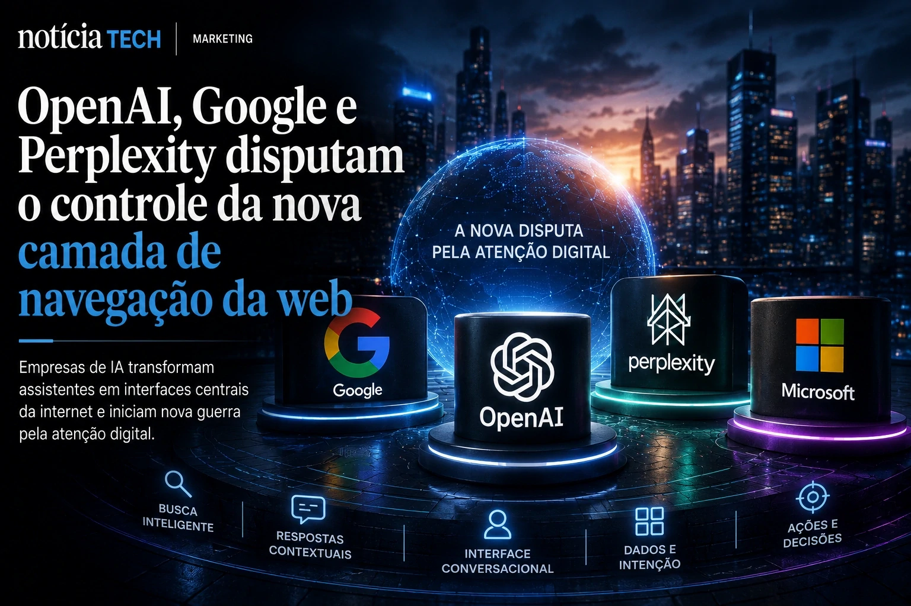

*O modelo tradicional da internet baseado em cliques, páginas e tráfego orgânico começa a enfrentar sua maior ruptura desde o surgimento do Google. Em 2026, plataformas movidas por **IA generativa** estão deixando de apenas indicar links para assumir o papel de intermediárias diretas da informação — e isso pode alterar profundamente a economia dos publishers, o comportamento dos usuários e o futuro do SEO.*

## A internet baseada em cliques começa a perder espaço para respostas prontas geradas por IA

A ascensão de plataformas como **ChatGPT**, **Perplexity**, **Google AI Overviews** e assistentes conversacionais integrados aos navegadores está acelerando uma mudança estrutural no comportamento digital dos usuários.

Durante mais de duas décadas, o modelo dominante da web funcionou de maneira relativamente previsível: usuários pesquisavam no Google, clicavam em links e navegavam entre sites para consumir conteúdo. Esse fluxo sustentou grande parte da economia digital moderna.

Agora, esse ciclo começa a ser interrompido.

Os novos sistemas de busca baseados em **IA generativa** entregam respostas completas diretamente na interface, reduzindo drasticamente a necessidade de cliques externos. Na prática, isso significa que o usuário passa mais tempo dentro do ecossistema da própria IA e menos tempo navegando na web aberta.

Essa transformação já está obrigando empresas de mídia, criadores independentes e plataformas editoriais a revisarem toda sua estratégia de distribuição digital.

O movimento possui relação direta com a expansão do chamado “Search Everywhere Optimization”, conceito que mostra como marcas estão disputando atenção não apenas no Google tradicional, mas também em assistentes inteligentes, interfaces conversacionais e redes sociais movidas por IA.

[Search Everywhere Optimization: por que marcas estão abandonando o SEO tradicional para disputar atenção em IA, redes sociais e assistentes inteligentes](https://noticiatech.com.br/marketing/search-everywhere-optimization-por-que-marcas-est%C3%A3o-abandonando-o-seo-tradicional-para-disputar-aten%C3%A7%C3%A3o-em-ia-redes-sociais-e-assistentes-inteligentes/)

A mudança também amplia a importância do chamado SEO semântico, onde contexto, autoridade editorial, profundidade analítica e confiabilidade passam a valer mais do que simples palavras-chave isoladas.

### O problema silencioso do “zero-click internet”

O fenômeno conhecido como “zero-click internet” ganhou força inicialmente nas redes sociais, mas agora começa a atingir diretamente os buscadores.

Em vez de enviar tráfego para os sites, os motores de IA resumem informações, sintetizam análises e entregam respostas prontas.

Para o usuário, a experiência parece mais eficiente.

Para publishers, o impacto pode ser devastador.

Empresas digitais que dependem de receita baseada em anúncios, pageviews e permanência no site começam a enfrentar um novo cenário onde parte do consumo informacional acontece sem visita direta às páginas originais.

Isso cria uma crise estrutural silenciosa para blogs, jornais, portais especializados e produtores independentes de conteúdo.

## OpenAI, Google e Perplexity disputam o controle da nova camada de navegação da web

A disputa atual vai muito além da simples busca online.

O que está em jogo é o controle da próxima interface dominante da internet.

Empresas como **OpenAI**, **Google**, **Microsoft** e **Perplexity** estão tentando transformar assistentes de IA em camadas universais de navegação digital.

Na prática, essas plataformas desejam se tornar intermediárias permanentes entre usuários e a web.

Esse movimento possui forte conexão com a corrida pelos navegadores inteligentes, tendência já analisada anteriormente pelo **Notícia Tech**.

[Google, OpenAI e Perplexity aceleram corrida pelos navegadores com IA e ameaçam a economia tradicional da web](https://noticiatech.com.br/inteligencia-artificial/google-openai-e-perplexity-aceleram-corrida-pelos-navegadores-com-ia-e-amea%C3%A7am-a-economia-tradicional-da-web/)

A lógica estratégica é clara:

- quanto mais tempo o usuário permanece dentro da IA;
- menos dependência existe de sites externos;
- maior se torna o controle sobre dados, publicidade e intenção de compra.

Isso explica por que grandes empresas de tecnologia estão investindo bilhões na criação de interfaces conversacionais persistentes.

O objetivo não é apenas responder perguntas.

É controlar toda a jornada informacional do usuário.

### A nova guerra pela atenção digital

A internet entra agora em uma nova fase da disputa pela atenção.

Se antes as plataformas brigavam por cliques, agora disputam permanência contextual.

Assistentes inteligentes conseguem:

- resumir conteúdos;
- comparar produtos;
- interpretar documentos;
- negociar serviços;
- gerar análises;
- organizar informações;
- executar tarefas em múltiplos sistemas.

Esse cenário converge diretamente com o avanço dos agentes autônomos de IA.

[A era dos agentes de IA já começou: como Microsoft, OpenAI e Google estão transformando empresas em sistemas autônomos](https://noticiatech.com.br/inteligencia-artificial/a-era-dos-agentes-de-ia-j%C3%A1-come%C3%A7ou-como-microsoft-openai-e-google-est%C3%A3o-transformando-empresas-em-sistemas-aut%C3%B4nomos/)

A consequência estratégica é profunda:

quanto mais inteligentes essas interfaces se tornam, menos necessário passa a ser o modelo tradicional baseado em navegação manual entre páginas.

## Publishers começam a adaptar conteúdo para IA generativa e AI Overviews

A resposta do mercado editorial já começou.

Empresas de mídia e produtores independentes estão adaptando suas operações para aumentar relevância dentro dos ecossistemas de IA.

Isso inclui:

- produção de conteúdo mais analítico;
- fortalecimento de E-E-A-T;
- otimização semântica;
- arquitetura editorial baseada em entidades;
- reforço de topical authority;
- contextualização profunda;
- criação de conteúdos evergreen premium.

Na prática, artigos rasos, genéricos e produzidos apenas para ranquear palavras-chave tendem a perder espaço.

Os modelos generativos favorecem conteúdos que oferecem:

- profundidade contextual;
- credibilidade;
- sinais de autoridade;
- consistência temática;
- interpretação estratégica;
- dados estruturados;
- experiência editorial real.

Esse movimento também acelera o crescimento de novos formatos de conteúdo híbrido entre mídia, automação e inteligência contextual.

Empresas começam inclusive a substituir dashboards tradicionais por interfaces conversacionais movidas por IA.

[Empresas começam a substituir dashboards por copilotos analíticos movidos por IA generativa](https://noticiatech.com.br/negocios/empresas-come%C3%A7am-a-substituir-dashboards-por-copilotos-anal%C3%ADticos-movidos-por-ia-generativa/)

### O futuro do tráfego orgânico pode mudar permanentemente

Especialistas do setor já começam a discutir um cenário onde o tráfego orgânico tradicional deixa de ser o principal indicador de relevância digital.

No novo ambiente informacional criado pela **IA generativa**, visibilidade contextual pode se tornar mais importante do que volume bruto de cliques.

Isso significa que marcas precisarão construir:

- autoridade temática;
- reconhecimento semântico;
- reputação digital;
- presença multiplataforma;
- distribuição adaptada para IA.

Ao mesmo tempo, cresce o debate sobre remuneração de publishers cujos conteúdos são utilizados para alimentar modelos generativos.

Grandes grupos de mídia já começam a negociar acordos de licenciamento com empresas de IA, enquanto outros ampliam barreiras de acesso e sistemas proprietários de distribuição.

A tendência aponta para uma possível reconfiguração da própria arquitetura econômica da web.

O que antes era uma internet baseada em links começa lentamente a se transformar em uma internet baseada em síntese algorítmica.

E para empresas digitais, criadores de conteúdo e marcas, entender essa transição pode deixar de ser apenas uma vantagem competitiva — e passar a ser uma questão de sobrevivência estratégica no novo ciclo da economia da atenção.

---