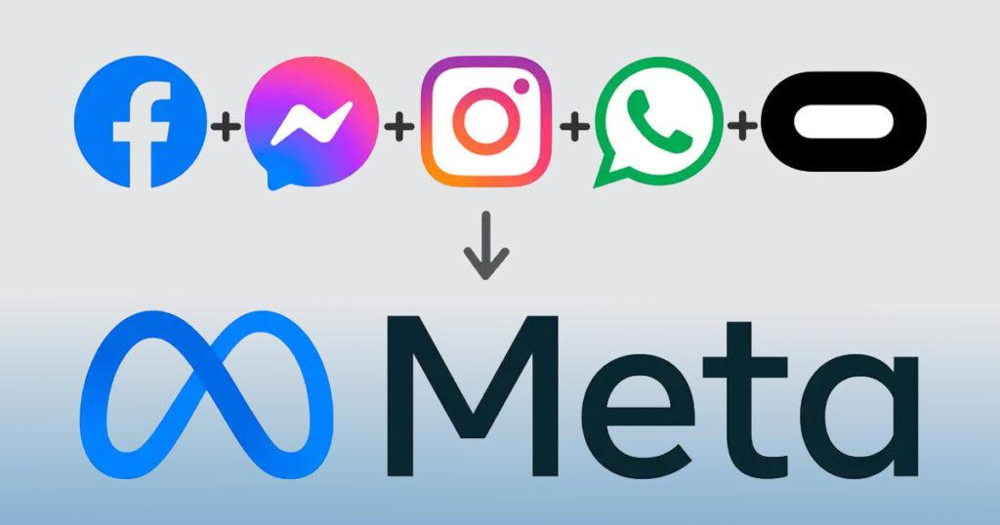
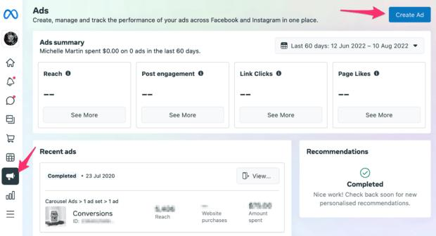
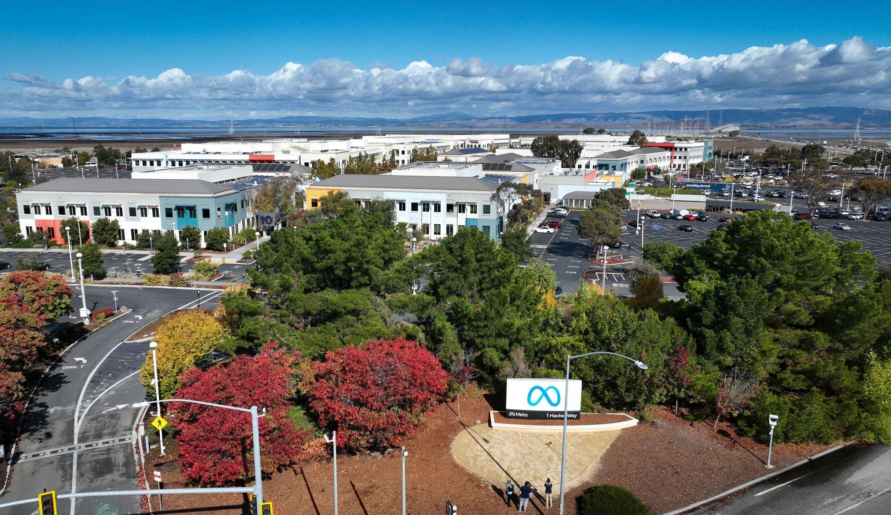

A Meta, dona do Facebook e Instagram, está automatizando a criação e gestão de anúncios com inteligência artificial. A mudança está reduzindo a necessidade de segmentação manual e alterando como empresas investem em marketing digital.

## A Meta está deixando a IA decidir quem verá seus anúncios

A empresa passou a usar sistemas de inteligência artificial que identificam automaticamente o público mais propenso a converter.

Na prática, o anunciante precisa definir apenas o objetivo da campanha e o orçamento.

A própria plataforma decide para quem mostrar o anúncio, quando mostrar e como otimizar o resultado.

## O que muda na prática para quem anuncia

Antes, empresas precisavam segmentar manualmente por idade, interesse e comportamento.

Agora, a IA analisa milhares de sinais em tempo real e ajusta a entrega automaticamente.

Isso reduz o trabalho técnico e aumenta a eficiência, principalmente para quem não tem equipe especializada.

## O que a Meta busca com essa mudança

A empresa quer simplificar o uso da plataforma e aumentar o número de anunciantes ativos.

Quanto mais fácil for anunciar, mais empresas entram e mais dinheiro circula dentro do ecossistema.

Isso também aumenta a dependência da própria ferramenta.

## O impacto real no mercado

A automação está mudando o papel do gestor de tráfego.

O trabalho deixa de ser técnico e passa a ser estratégico.

Empresas que dependiam de configurações manuais precisam se adaptar a um modelo onde a IA toma a maioria das decisões.

## O que isso significa na prática

Quem entende a lógica da plataforma e sabe criar bons anúncios sai na frente.

O diferencial deixa de ser segmentação e passa a ser:

- criativo  
- mensagem  
- oferta  

A IA entrega, mas o que vende continua sendo o conteúdo do anúncio.