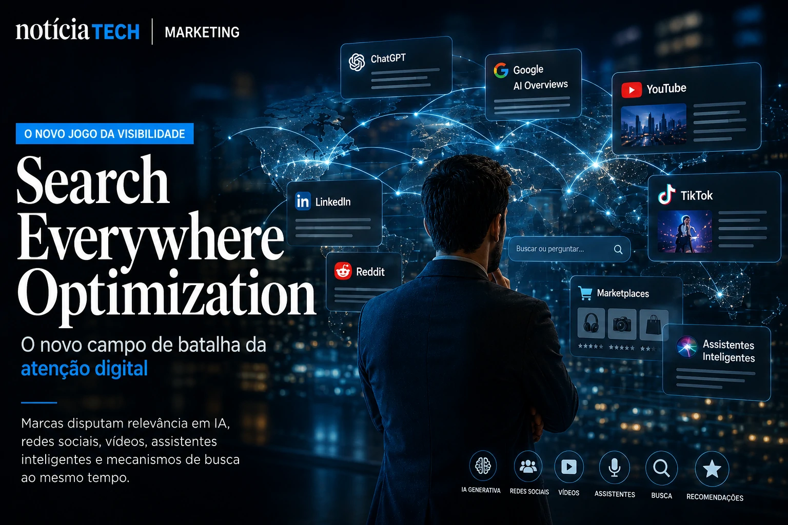
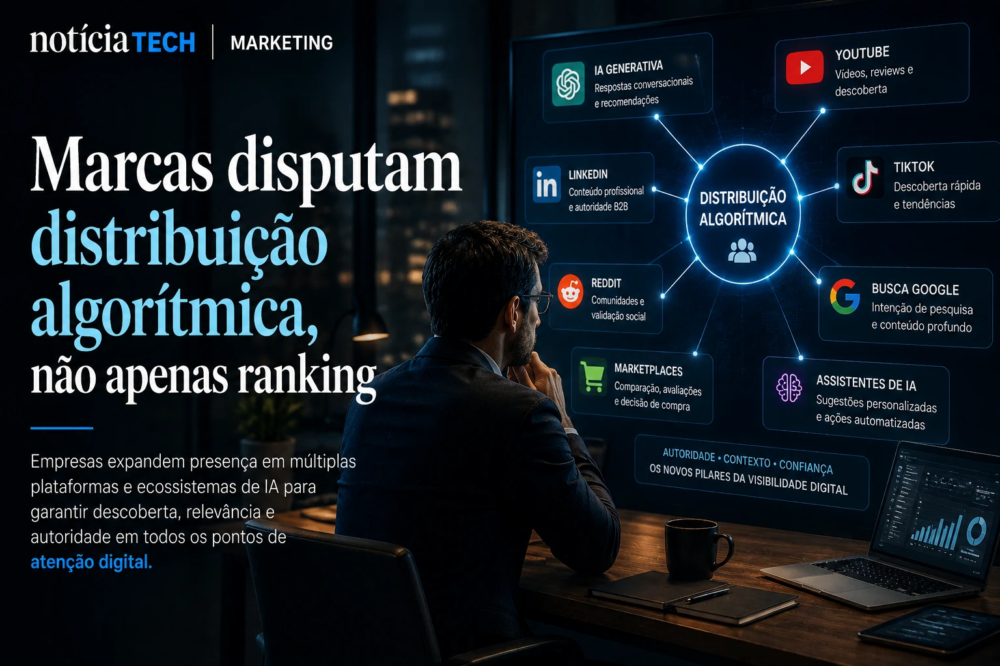

*Durante anos, o SEO tradicional foi tratado como a principal estratégia para capturar tráfego orgânico na internet. Mas a ascensão da **IA generativa**, das buscas conversacionais, dos vídeos curtos e dos ecossistemas fechados de plataformas sociais está alterando rapidamente a dinâmica de descoberta de conteúdo digital. Em vez de competir apenas pelo topo do Google, marcas agora tentam aparecer simultaneamente em respostas do **ChatGPT**, resultados do **Google AI Overviews**, vídeos do **YouTube**, pesquisas do **TikTok**, feeds do **LinkedIn** e sistemas de recomendação alimentados por inteligência artificial.*

## Search Everywhere Optimization: o novo campo de batalha da atenção digital

A transformação do comportamento digital criou um novo conceito dentro do mercado de marketing: o **Search Everywhere Optimization**.

Na prática, a ideia é simples: o usuário moderno não pesquisa mais apenas em buscadores tradicionais.

Hoje, decisões de compra, descoberta de marcas e consumo de informação acontecem em múltiplos ambientes simultaneamente:

- motores de IA;
- redes sociais;
- marketplaces;
- plataformas de vídeo;
- assistentes inteligentes;
- comunidades digitais;
- sistemas de recomendação automatizados.

Isso significa que empresas que dependem exclusivamente do tráfego tradicional do Google começam a enfrentar um risco estrutural crescente.

O fenômeno se conecta diretamente à mudança já observada no mercado corporativo em torno da inteligência artificial e dos novos modelos de navegação digital. O próprio avanço dos navegadores com IA mostra como a web está migrando para interfaces conversacionais mais inteligentes e menos dependentes da navegação clássica baseada em links. Esse movimento já aparece em análises recentes do próprio Notícia Tech sobre como **Google**, **OpenAI** e **Perplexity** estão acelerando a corrida pelos navegadores com IA e alterando a economia tradicional da web.

[Google, OpenAI e Perplexity aceleram corrida pelos navegadores com IA e ameaçam a economia tradicional da web](https://noticiatech.com.br/inteligencia-artificial/google-openai-e-perplexity-aceleram-corrida-pelos-navegadores-com-ia-e-amea%C3%A7am-a-economia-tradicional-da-web/)

### O usuário moderno pesquisa em camadas

A jornada digital deixou de ser linear.

Antes, o consumidor pesquisava no Google, acessava alguns sites e concluía uma decisão.

Agora, o comportamento se fragmentou:

- o usuário descobre tendências no **TikTok**;
- valida reputação no **Reddit**;
- pesquisa análises no **YouTube**;
- consulta IA conversacional;
- compara avaliações em marketplaces;
- recebe recomendações automatizadas;
- toma decisões sem necessariamente visitar um site.

Essa mudança altera completamente a lógica do marketing de conteúdo.

O conteúdo deixa de existir apenas para ranquear no Google e passa a funcionar como um ativo distribuído em ecossistemas algorítmicos diferentes.

## IA generativa está mudando o valor do tráfego orgânico

Com a expansão dos sistemas de resposta automática, parte do tráfego orgânico tradicional começa a sofrer erosão.

Ferramentas de IA conseguem resumir conteúdos diretamente na interface de busca, reduzindo a necessidade do clique.

Isso cria um novo cenário para publishers, blogs e empresas digitais.

O desafio deixa de ser apenas gerar visitas.

Agora, as marcas precisam garantir:

- presença contextual;
- autoridade temática;
- reconhecimento semântico;
- menções estruturadas;
- conteúdo reutilizável por IA.

Essa transformação está acelerando o crescimento do chamado **GEO (Generative Engine Optimization)**, estratégia focada em otimizar conteúdos para mecanismos generativos.

O próprio avanço das empresas em direção a sistemas mais autônomos mostra como a IA começa a assumir funções de intermediação informacional antes dominadas pelos buscadores tradicionais.

[A era dos agentes de IA já começou: como Microsoft, OpenAI e Google estão transformando empresas em sistemas autônomos](https://noticiatech.com.br/inteligencia-artificial/a-era-dos-agentes-de-ia-j%C3%A1-come%C3%A7ou-como-microsoft-openai-e-google-est%C3%A3o-transformando-empresas-em-sistemas-aut%C3%B4nomos/)

### Conteúdo passa a ser tratado como dado estruturado

Empresas mais avançadas já começaram a mudar a forma como produzem conteúdo.

O foco deixa de ser apenas densidade de palavras-chave.

A prioridade passa a incluir:

- contexto semântico;
- profundidade editorial;
- autoridade de marca;
- estrutura escaneável;
- clareza informacional;
- entidades reconhecíveis;
- linguagem compreensível para IA.

Na prática, isso aproxima estratégias de conteúdo de arquitetura de dados.

Conteúdos mais organizados, estruturados e semanticamente ricos tendem a possuir maior reutilização por sistemas inteligentes.

Além disso, conteúdos excessivamente superficiais começam a perder competitividade diante de plataformas generativas capazes de sintetizar rapidamente informações genéricas.

## Marcas começam a disputar distribuição algorítmica, não apenas ranking

Outro ponto importante dessa mudança é que o marketing digital começa a migrar de uma lógica de ranking para uma lógica de distribuição algorítmica.

Em vez de pensar apenas em posição no Google, empresas passam a disputar:

- recomendação em IA;
- relevância contextual;
- descoberta em plataformas sociais;
- distribuição automatizada;
- autoridade em clusters temáticos.

Isso explica por que muitas empresas estão ampliando investimentos em:

- conteúdo multimodal;
- vídeos curtos;
- newsletters;
- conteúdo para IA;
- presença em comunidades;
- estratégias de marca pessoal;
- distribuição omnichannel.

A própria transformação do **LinkedIn** em uma plataforma de distribuição impulsionada por IA reforça como o conteúdo corporativo está se tornando dependente de sistemas algorítmicos de recomendação.

[LinkedIn deixa de ser rede de currículos e vira plataforma de distribuição B2B impulsionada por IA](https://noticiatech.com.br/marketing/linkedin-deixa-de-ser-rede-de-curr%C3%ADculos-e-vira-plataforma-de-distribui%C3%A7%C3%A3o-b2b-impulsionada-por-ia/)

### O tráfego direto volta a ganhar importância

Com o crescimento das interfaces generativas, muitas empresas começam a perceber um risco estratégico:

dependência excessiva de plataformas externas.

Por isso, marcas mais maduras voltam a fortalecer ativos próprios:

- newsletters;
- aplicativos;
- comunidades fechadas;
- programas de fidelização;
- canais proprietários;
- bases de dados first-party.

O objetivo é reduzir vulnerabilidade diante das mudanças constantes dos algoritmos.

Ao mesmo tempo, cresce a percepção de que marcas fortes tendem a sobreviver melhor em ambientes dominados por IA.

Isso acontece porque sistemas generativos priorizam sinais de autoridade, reputação e recorrência contextual.

## O futuro do marketing será distribuído, conversacional e orientado por IA

A tendência de longo prazo aponta para um ecossistema digital muito menos centralizado.

Motores de busca tradicionais continuarão relevantes, mas deixarão de funcionar como único ponto de entrada da internet.

A disputa pela atenção tende a acontecer simultaneamente em:

- interfaces conversacionais;
- ecossistemas sociais;
- buscas multimodais;
- assistentes autônomos;
- agentes de IA;
- feeds algorítmicos personalizados.

Nesse cenário, empresas que conseguirem construir:

- autoridade editorial;
- distribuição multiplataforma;
- presença semântica;
- reconhecimento contextual;
- conteúdo reutilizável por IA;
- ativos digitais próprios;

terão vantagem estrutural importante nos próximos anos.

Mais do que otimizar páginas para mecanismos de busca, o novo desafio será construir presença digital capaz de sobreviver em um ambiente onde algoritmos, agentes inteligentes e sistemas generativos passam a decidir o que merece atenção, descoberta e relevância.