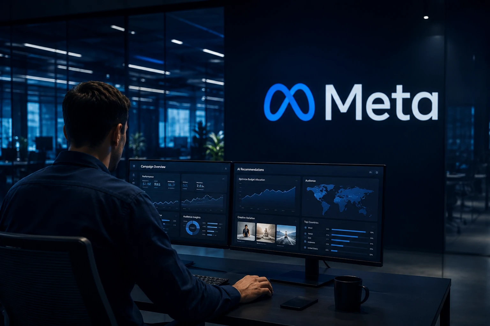
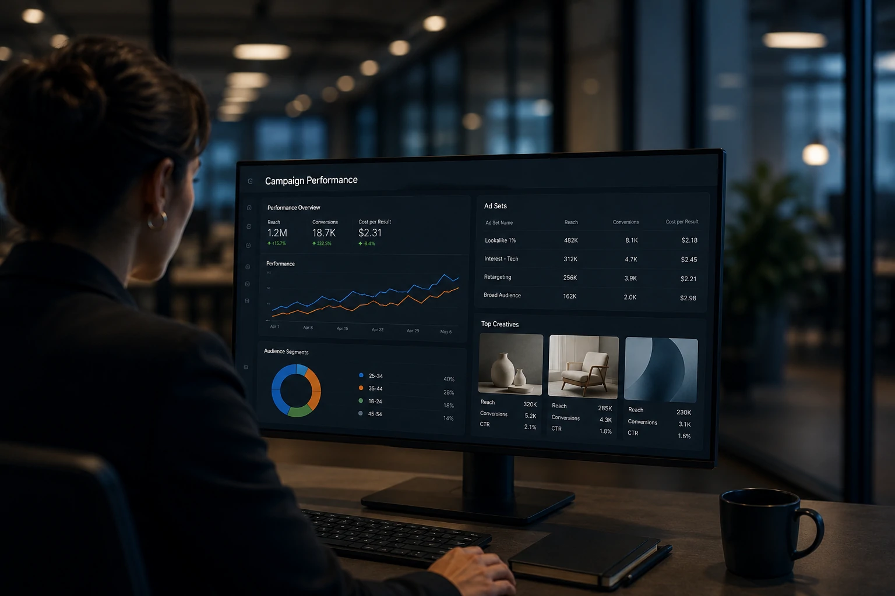
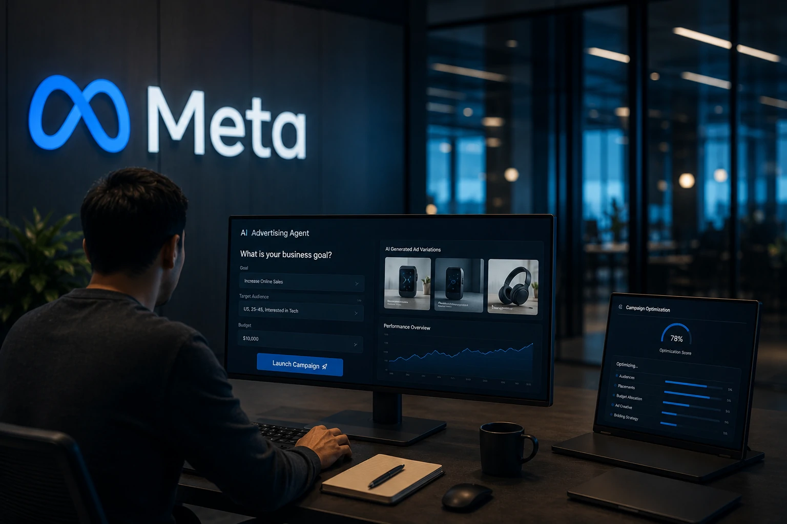

*Durante anos, empresas investiram milhões em equipes de marketing, especialistas em tráfego, designers e agências para planejar, executar e otimizar campanhas digitais. Agora, a **Meta** quer simplificar esse processo utilizando inteligência artificial. A estratégia liderada por **Mark Zuckerberg** busca permitir que anunciantes informem apenas seus objetivos e orçamento enquanto sistemas inteligentes assumem tarefas que antes dependiam de equipes completas. O movimento pode representar uma das maiores transformações da indústria publicitária desde o surgimento das redes sociais.*

## A Meta quer transformar publicidade em um processo totalmente automatizado

*Ferramentas de IA passam a executar atividades que tradicionalmente exigiam equipes especializadas.*

A estratégia da **Meta** é reduzir a complexidade da publicidade digital e aumentar o número de empresas capazes de anunciar dentro de suas plataformas.

Na prática, a companhia trabalha para que campanhas sejam criadas com cada vez menos intervenção humana. O anunciante informa objetivos comerciais, público desejado e orçamento disponível, enquanto a inteligência artificial assume a criação, distribuição e otimização dos anúncios.

O objetivo é tornar a publicidade mais simples, acessível e escalável.

*Legenda: A automação publicitária avança rapidamente dentro do ecossistema da Meta.*

### O que muda para os anunciantes?

Empresas passam a depender menos de conhecimento técnico para executar campanhas.

Atividades como segmentação, testes de criativos, distribuição de orçamento e otimização de desempenho podem ser realizadas automaticamente.

### Por que a Meta está fazendo isso?

Quanto mais fácil for anunciar, maior tende a ser o número de empresas investindo em publicidade.

A estratégia também fortalece a dependência dos anunciantes em relação ao ecossistema da própria plataforma.

## O modelo tradicional das agências começa a enfrentar uma nova pressão

*Serviços operacionais perdem valor à medida que a inteligência artificial assume tarefas repetitivas.*

O avanço da automação não significa necessariamente o fim das agências.

No entanto, ele pressiona uma parte importante do mercado que construiu sua receita em atividades operacionais e altamente repetitivas.

Configuração de campanhas, testes de anúncios, ajustes de segmentação e otimizações básicas podem deixar de ser diferenciais competitivos.

### O que a inteligência artificial consegue substituir?

Entre as atividades que podem ser automatizadas estão:

- Criação inicial de campanhas.
- Produção de variações criativas.
- Segmentação de públicos.
- Testes A/B.
- Otimização de orçamento.
- Análise básica de desempenho.

### O que continua exigindo inteligência humana?

Estratégia de marca.

Posicionamento competitivo.

Narrativa corporativa.

Construção de comunidade.

Planejamento de crescimento.

Essas atividades dependem de interpretação de mercado, contexto cultural e visão de longo prazo.

A transformação lembra movimentos recentes observados em plataformas profissionais, como no artigo [LinkedIn deixa de ser rede de currículos e vira plataforma de distribuição B2B impulsionada por IA](https://noticiatech.com.br/negocios/linkedin-deixa-de-ser-rede-de-curr%C3%ADculos-e-vira-plataforma-de-distribui%C3%A7%C3%A3o-b2b-impulsionada-por-ia/).

*O valor estratégico tende a superar o valor operacional dentro do marketing digital.*

## A publicidade entra definitivamente na era dos agentes inteligentes

*Plataformas começam a operar como sistemas autônomos orientados a resultados de negócio.*

O movimento da **Meta** faz parte de uma tendência maior observada em toda a indústria de tecnologia.

Empresas estão deixando de oferecer apenas ferramentas e passando a oferecer sistemas capazes de executar tarefas completas.

Nesse cenário, a publicidade deixa de ser uma atividade operacional conduzida por humanos e passa a funcionar como um processo orientado por objetivos.

### O que significa publicidade agentic?

Publicidade agentic é o modelo no qual sistemas inteligentes recebem metas específicas e executam ações necessárias para alcançar resultados.

O foco deixa de estar na operação e passa para os indicadores de negócio.

### Por que isso é importante?

Empresas não compram campanhas.

Empresas compram crescimento.

Ao automatizar grande parte da execução, plataformas como a **Meta** aproximam seus produtos dos resultados finais buscados pelos anunciantes.

Essa lógica já aparece em outras áreas da economia digital, como mostrado em [OpenAI e Salesforce aceleram a era do Agentic SaaS e pressionam empresas a repensarem seus softwares corporativos](https://noticiatech.com.br/negocios/openai-salesforce-agentic-saas-transformacao-softwares-corporativos/).

*Legenda: Sistemas inteligentes passam a operar processos inteiros sem depender de intervenção constante.*

## Pequenas empresas podem ser as maiores beneficiadas

A transformação promovida pela **Meta** tende a beneficiar principalmente empresas que possuem recursos limitados para marketing.

Negócios menores passam a acessar capacidades antes disponíveis apenas para organizações com equipes especializadas.

A barreira técnica diminui.

A velocidade de execução aumenta.

O custo operacional reduz.

### O que muda para pequenas empresas?

Pequenas empresas poderão:

- Criar campanhas rapidamente.
- Reduzir dependência de especialistas.
- Executar testes em escala.
- Melhorar eficiência do investimento.
- Aumentar competitividade.

### Surge uma nova vantagem competitiva

Se a operação se torna automatizada, a diferenciação passa a depender menos da execução e mais da capacidade de construir marca, reputação e relacionamento com clientes.

Empresas que desenvolverem posicionamento forte continuarão mantendo vantagens difíceis de replicar por algoritmos.

## A verdadeira disputa não é pela publicidade, mas pelos dados

O avanço da inteligência artificial dentro da publicidade revela uma transformação ainda mais profunda.

Sistemas inteligentes dependem de grandes volumes de dados para aprender, otimizar campanhas e melhorar resultados.

Quanto mais anunciantes utilizarem ferramentas automatizadas, mais informações retornam para alimentar os modelos da plataforma.

Isso fortalece um ciclo de aprendizado contínuo que aumenta a vantagem competitiva da **Meta**.

Ao mesmo tempo, reforça o papel da empresa como intermediária entre marcas e consumidores.

Nos próximos anos, a discussão mais importante para agências e profissionais de marketing talvez não seja como competir com a inteligência artificial. A questão central será identificar quais atividades continuam exigindo criatividade, estratégia e compreensão humana em um mercado cada vez mais automatizado.

