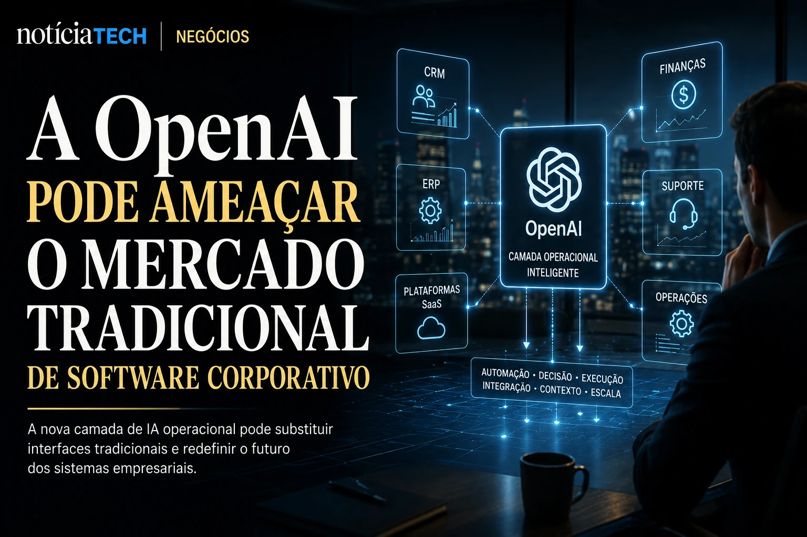
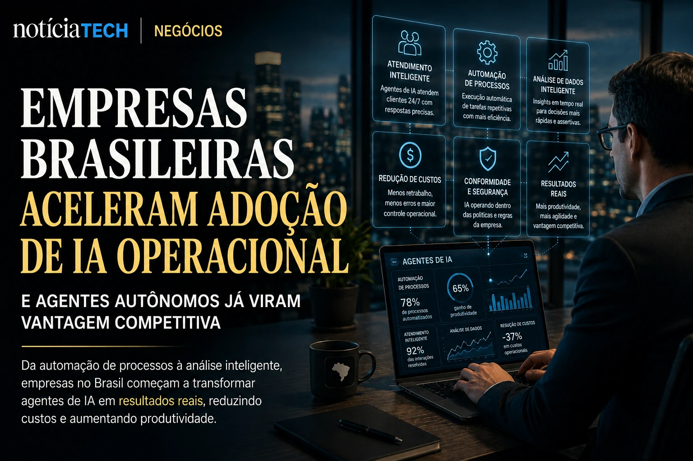

*O mercado corporativo de inteligência artificial está entrando em uma nova fase. Depois da corrida inicial por chatbots e copilotos, gigantes da tecnologia agora disputam algo muito maior: transformar a IA na infraestrutura operacional das empresas. No centro desse movimento está **Sam Altman**, CEO da **OpenAI**, que vem acelerando uma estratégia capaz de redefinir como softwares corporativos funcionam, como funcionários trabalham e como decisões empresariais serão tomadas nos próximos anos.*

## Sam Altman quer transformar agentes de IA em novos operadores digitais das empresas

A nova estratégia da **OpenAI** é clara: transformar agentes autônomos em uma camada operacional capaz de executar tarefas empresariais de forma contínua, integrada e contextual.

Na prática, isso significa que a IA deixa de funcionar apenas como uma ferramenta de consulta e passa a operar processos reais dentro das empresas.

Os chamados agentes de IA conseguem:
- analisar documentos;
- responder clientes;
- organizar fluxos internos;
- executar tarefas administrativas;
- gerar relatórios;
- interpretar dados corporativos;
- operar múltiplos softwares simultaneamente.

A visão defendida por **Sam Altman** é que empresas passarão a utilizar equipes híbridas compostas por humanos e agentes inteligentes trabalhando juntos em tempo real.

Esse movimento já começa a impactar:
- atendimento corporativo;
- vendas B2B;
- suporte técnico;
- marketing;
- análise financeira;
- operações internas.

O mercado percebe que a disputa atual não é apenas sobre modelos de linguagem mais inteligentes. A verdadeira guerra começou na camada operacional corporativa.

Essa transformação se conecta diretamente ao avanço dos agentes autônomos descrito em:
[“A era dos agentes de IA já começou”](https://noticiatech.com.br/inteligencia-artificial/a-era-dos-agentes-de-ia-j%C3%A1-come%C3%A7ou-como-microsoft-openai-e-google-est%C3%A3o-transformando-empresas-em-sistemas-aut%C3%B4nomos/)

### O que muda com os agentes corporativos?

Os agentes de IA começam a reduzir a dependência de interfaces tradicionais.

Em vez de:
- abrir sistemas;
- navegar menus;
- preencher telas manualmente;

o profissional poderá simplesmente delegar tarefas para a IA executar.

Isso altera completamente a lógica do software corporativo tradicional.

### Por que isso interessa ao mercado B2B?

O mercado B2B enxerga três vantagens imediatas:
- aumento de produtividade;
- redução de custos operacionais;
- aceleração de processos internos.

Segundo projeções de consultorias globais, empresas devem investir centenas de bilhões de dólares em automação baseada em IA até o final da década.

O motivo é simples:
a IA operacional começa a produzir impacto financeiro direto.

## A OpenAI pode se transformar em uma ameaça silenciosa ao mercado tradicional de software corporativo

A ambição da **OpenAI** vai muito além de competir com outros chatbots.

O movimento liderado por **Sam Altman** sugere que a empresa quer se posicionar como uma nova camada universal de interação entre humanos e softwares corporativos.

Na prática, isso significa que a IA pode começar a substituir parte da navegação tradicional dentro de:
- CRMs;
- ERPs;
- plataformas SaaS;
- softwares de produtividade;
- sistemas internos empresariais.

Em vez de aprender dezenas de plataformas, funcionários poderão utilizar apenas uma interface conversacional conectada a múltiplos sistemas.

Isso cria pressão sobre gigantes como:
- **Salesforce**;
- **SAP**;
- **Oracle**;
- **Microsoft**;
- **Google**;
- **ServiceNow**.

A transformação também reforça o conceito de “AI Operating Systems”, já discutido anteriormente pelo Notícia Tech:
[“AI Operating Systems: por que empresas começam a substituir softwares isolados por ecossistemas autônomos de IA”](https://noticiatech.com.br/negocios/ai-operating-systems-por-que-empresas-come%C3%A7am-a-substituir-softwares-isolados-por-ecossistemas-aut%C3%B4nomos-de-ia/)

### A nova disputa não é mais apenas sobre IA

O mercado percebe que a disputa agora envolve:
- controle do fluxo operacional;
- integração de dados;
- produtividade corporativa;
- automação em larga escala;
- dependência tecnológica empresarial.

Quem dominar essa camada operacional poderá controlar parte significativa da próxima geração do software corporativo.

### Por que a Microsoft continua central nessa disputa?

Apesar da expansão agressiva da **OpenAI**, a parceria com a **Microsoft** continua sendo estratégica.

O ecossistema formado por:
- **Azure**;
- **Copilot**;
- **Windows**;
- **Microsoft 365**;

ainda oferece enorme vantagem corporativa.

Por isso, o mercado acompanha de perto os movimentos entre as duas empresas:
[“Microsoft e OpenAI mudam parceria e deixam alerta para empresas sobre o risco de depender de uma única IA”](https://noticiatech.com.br/negocios/microsoft-e-openai-mudam-parceria-e-deixam-alerta-para-empresas-sobre-o-risco-de-depender-de-uma-%C3%BAnica-ia/)

## Empresas brasileiras começam a perceber que a IA operacional pode redefinir competitividade nos próximos anos

A adoção de IA corporativa no Brasil começa a acelerar, principalmente entre empresas que buscam produtividade e redução de custos.

O problema é que muitas organizações ainda tratam IA apenas como ferramenta experimental.

Enquanto isso, empresas mais avançadas já começam a:
- integrar agentes internos;
- automatizar fluxos;
- criar estruturas de AI Operations;
- conectar IA aos sistemas corporativos.

Esse movimento já levou empresas a criarem novos cargos focados exclusivamente na gestão de agentes autônomos:
[“Empresas começam a criar cargos de AI Operations para controlar agentes autônomos”](https://noticiatech.com.br/negocios/empresas-come%C3%A7am-a-criar-cargos-de-ai-operations-para-controlar-agentes-aut%C3%B4nomos/)

### O que muda para pequenas e médias empresas?

Pequenas empresas podem acessar capacidades que antes pertenciam apenas a grandes corporações.

A IA operacional permite:
- automatizar atendimento;
- gerar conteúdo;
- organizar vendas;
- analisar dados;
- acelerar suporte;
- reduzir equipes operacionais.

Isso reduz barreiras competitivas e acelera a transformação digital.

O impacto também já aparece no mercado de software B2B:
[“Agentes de IA começam a negociar contratos corporativos e podem transformar o mercado de software B2B”](https://noticiatech.com.br/negocios/agentes-de-ia-come%C3%A7am-a-negociar-contratos-corporativos-e-podem-transformar-o-mercado-de-software-b2b/)

### A próxima grande disputa será invisível para a maioria das empresas

Grande parte do mercado ainda enxerga a IA como uma ferramenta de produtividade.

Mas a visão defendida por **Sam Altman** aponta para algo muito maior:
uma infraestrutura operacional inteligente funcionando silenciosamente dentro das empresas.

Isso pode transformar:
- softwares;
- processos;
- produtividade;
- gestão;
- atendimento;
- tomada de decisão.

A corrida da IA corporativa deixa de ser apenas tecnológica e passa a ser estrutural.

Nos próximos anos, empresas não disputarão apenas quem possui mais dados ou melhores sistemas. A disputa será sobre quem conseguirá construir operações inteiras apoiadas por agentes inteligentes capazes de aprender, executar e evoluir continuamente dentro do ambiente corporativo.

---