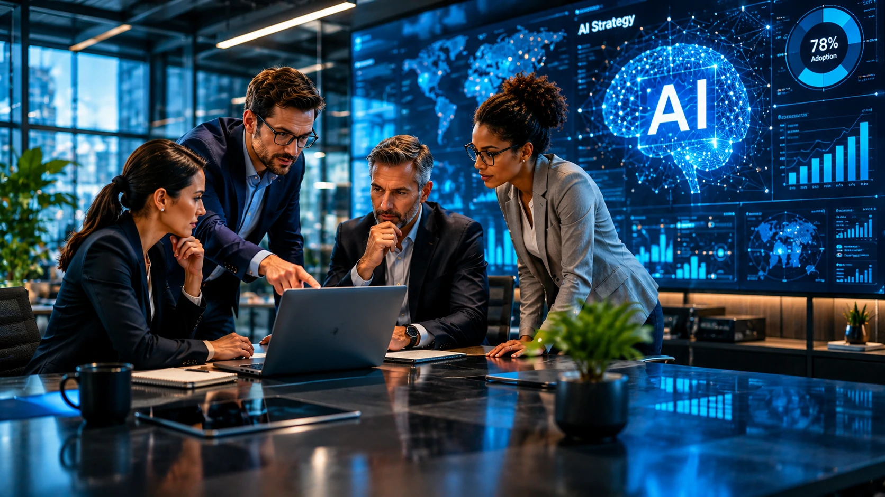
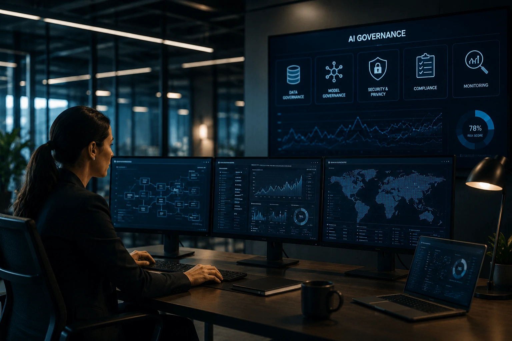

*Durante os primeiros anos da inteligência artificial generativa, muitas empresas experimentaram ferramentas isoladas sem uma estratégia clara de longo prazo. Agora, uma nova tendência começa a ganhar força: a criação de estruturas permanentes dedicadas à gestão, expansão e governança da IA. Nesse cenário, os chamados **AI Centers of Excellence** surgem como uma das principais apostas corporativas para transformar iniciativas experimentais em capacidades estratégicas de negócio.*

## AI Center of Excellence é uma estrutura criada para coordenar e acelerar a adoção de inteligência artificial dentro das empresas

*Estruturas especializadas estão se tornando a base da transformação corporativa baseada em IA.*

Um **AI Center of Excellence (AI CoE)** funciona como um núcleo especializado responsável por definir padrões, governança, métricas e prioridades relacionadas à inteligência artificial.

Em vez de permitir que cada departamento implemente soluções de forma independente, a empresa cria uma estrutura centralizada para coordenar iniciativas e compartilhar conhecimento.

O objetivo não é controlar toda inovação, mas garantir que a adoção da IA aconteça de forma sustentável, escalável e alinhada aos objetivos corporativos.

### Por que esse modelo ganhou força em 2026?

A expansão dos **agentes de IA**, copilotos corporativos e automações inteligentes aumentou significativamente a complexidade operacional das organizações.

Muitas empresas descobriram que dezenas de projetos paralelos criavam redundâncias, riscos de segurança e desperdício de investimento.

### O que normalmente compõe um AI Center of Excellence?

As estruturas mais maduras costumam reunir especialistas em:

- Dados
- Governança
- Segurança
- Operações
- Automação
- Compliance
- Estratégia de negócios

Essa combinação permite transformar IA em uma competência organizacional permanente.

## Empresas estão usando AI Centers of Excellence para transformar experimentos em resultados mensuráveis

*O foco das novas estruturas deixou de ser inovação isolada e passou a ser geração consistente de valor.*

A principal função do **AI Center of Excellence** é conectar iniciativas de IA aos objetivos reais da empresa.

Projetos deixam de ser avaliados apenas pelo aspecto tecnológico e passam a ser medidos por indicadores de produtividade, redução de custos, eficiência operacional e crescimento de receita.

Essa mudança representa uma evolução importante na maturidade da adoção de IA.

### Como o modelo reduz desperdícios?

Sem coordenação central, diferentes áreas frequentemente contratam ferramentas semelhantes para resolver problemas parecidos.

Isso gera duplicidade de custos e fragmentação tecnológica.

Ao centralizar diretrizes, o AI CoE reduz sobreposição de investimentos e melhora o aproveitamento dos recursos existentes.

### O que muda para gestores?

Executivos passam a ter maior visibilidade sobre:

- Projetos ativos
- Retorno financeiro
- Riscos operacionais
- Prioridades estratégicas
- Uso de dados corporativos

Esse nível de controle facilita decisões de investimento e acelera a expansão de iniciativas bem-sucedidas.

## Governança de IA se torna uma das funções mais importantes dessas estruturas

*À medida que agentes inteligentes ganham autonomia, a governança se torna um diferencial competitivo.*

Governança é um dos pilares centrais dos **AI Centers of Excellence**.

O crescimento dos modelos generativos elevou preocupações relacionadas à privacidade, segurança, compliance e confiabilidade dos resultados produzidos pela IA.

Por isso, empresas estão criando processos formais para supervisionar essas operações.

### Como o AI CoE reduz riscos?

A estrutura cria políticas para:

- Uso de modelos generativos
- Compartilhamento de dados
- Controle de acessos
- Auditoria de decisões automatizadas
- Monitoramento de agentes autônomos

Essa abordagem reduz exposição a falhas operacionais e problemas regulatórios.

### Qual a relação com AI Operations?

O crescimento dos AI CoEs acontece paralelamente ao avanço de práticas de **AI Operations**.

Para entender como essa disciplina está evoluindo, vale acompanhar a análise publicada pelo Notícia Tech sobre [AI Operations e governança de agentes de IA nas empresas](https://noticiatech.com.br/inteligencia-artificial/ai-operations-governanca-agentes-ia-empresas/).

## O próximo estágio da inteligência artificial corporativa será organizacional e não tecnológico

A vantagem competitiva da próxima década não dependerá apenas dos melhores modelos de IA.

Ela dependerá da capacidade das empresas de organizar pessoas, processos, dados e tecnologias em torno de uma estratégia consistente.

Nesse contexto, os **AI Centers of Excellence** funcionam como uma infraestrutura invisível que conecta inovação e execução.

### O que diferencia empresas líderes?

As organizações mais avançadas estão tratando IA como capacidade operacional permanente e não como projeto temporário.

Essa visão também aparece em movimentos relacionados à [AI Readiness e maturidade operacional para a nova economia da inteligência artificial](https://noticiatech.com.br/negocios/ai-readiness-por-que-empresas-comecam-a-medir-maturidade-operacional-para-sobreviver-a-nova-economia-da-inteligencia-artificial/).

### O que esperar nos próximos anos?

A tendência é que AI CoEs evoluam para estruturas responsáveis por coordenar:

- Agentes autônomos
- Plataformas corporativas de IA
- Governança algorítmica
- Gestão de conhecimento
- Automação em larga escala

À medida que a inteligência artificial se torna parte central das operações empresariais, empresas capazes de construir essas estruturas internas terão mais condições de capturar ganhos de produtividade, reduzir riscos e criar vantagens competitivas difíceis de replicar.

---