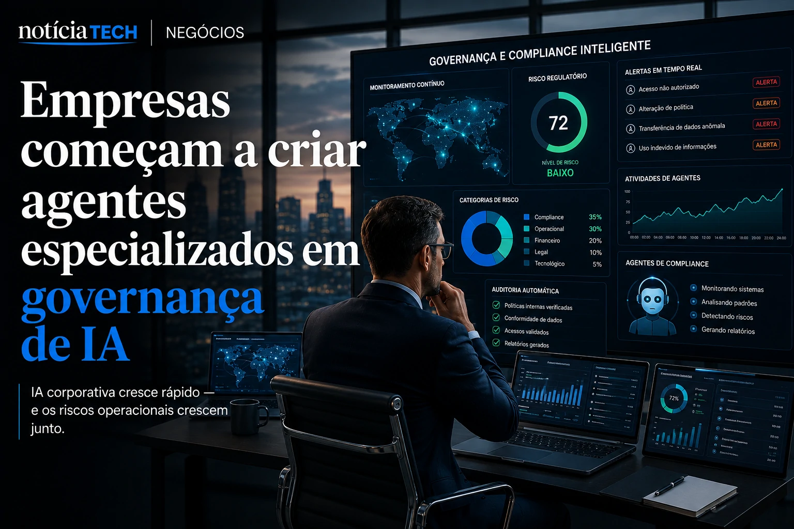
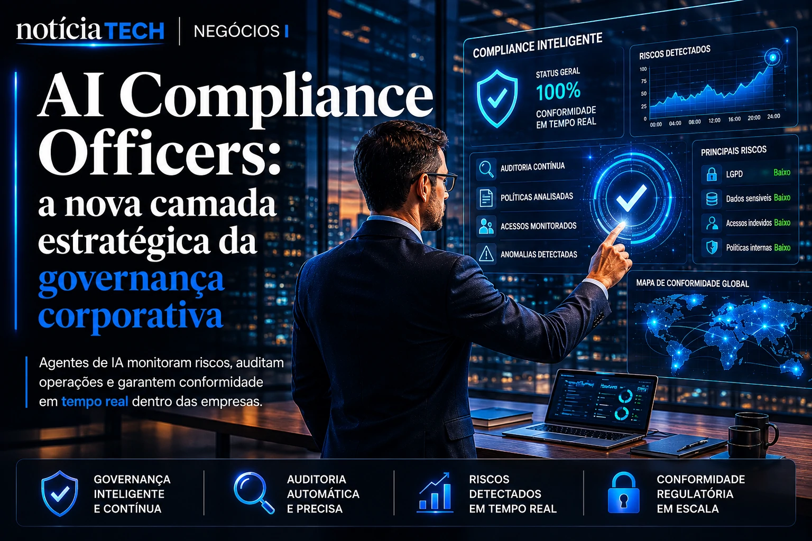
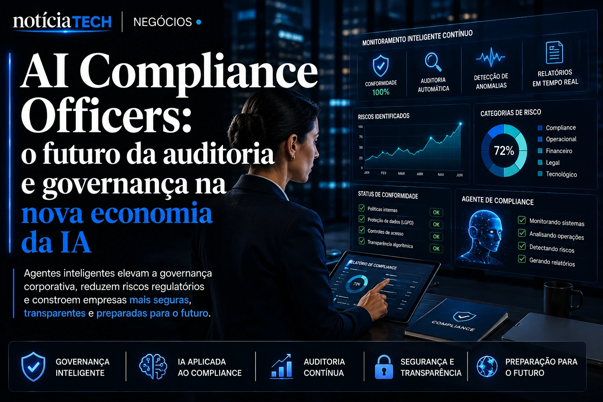

*O avanço da inteligência artificial dentro das empresas está criando uma nova prioridade silenciosa no mercado corporativo: controlar os próprios sistemas autônomos antes que eles criem riscos operacionais, jurídicos e financeiros difíceis de administrar. Em 2026, grandes companhias começaram a perceber que não basta apenas implementar IA — será necessário governar, auditar e supervisionar agentes inteligentes em escala.*

## Empresas começam a criar agentes especializados em governança de IA

Empresas estão desenvolvendo agentes autônomos focados exclusivamente em compliance, auditoria operacional e governança corporativa para monitorar riscos criados pela própria inteligência artificial.

O crescimento acelerado da IA corporativa criou um novo problema dentro das organizações: sistemas inteligentes começaram a operar em velocidade superior à capacidade humana de supervisão.

Na prática, isso significa que:
- agentes de IA negociam contratos;
- copilotos analisam dados financeiros;
- automações processam informações sensíveis;
- modelos acessam bancos de dados corporativos;
- plataformas geram decisões operacionais automaticamente.

O resultado é o surgimento de uma nova camada de risco invisível.

Empresas perceberam que o chamado **Shadow AI** — uso descentralizado e não supervisionado de inteligência artificial — começou a crescer de forma descontrolada dentro das organizações.

Esse movimento se conecta diretamente ao avanço discutido em:
[Shadow AI: empresas descobrem que uso invisível de inteligência artificial já virou risco operacional em 2026](https://noticiatech.com.br/negocios/shadow-ai-empresas-descobrem-que-uso-invis%C3%ADvel-de-intelig%C3%AAncia-artificial-j%C3%A1-virou-risco-operacional-em-2026/)

### Por que isso preocupa grandes empresas?

O principal problema é que a IA passou a operar em múltiplas áreas simultaneamente.

Hoje, modelos de IA já acessam:
- CRMs;
- ERPs;
- plataformas financeiras;
- sistemas jurídicos;
- ferramentas de RH;
- ambientes de atendimento;
- documentos internos sensíveis.

Quanto maior a autonomia dos agentes, maior o risco operacional.

Empresas começam a entender que o verdadeiro desafio não é apenas implementar IA, mas garantir:
- rastreabilidade;
- auditoria;
- transparência;
- governança;
- segurança regulatória.

## AI Compliance Officers podem virar nova categoria estratégica do mercado corporativo

Os chamados AI Compliance Officers representam uma nova camada operacional criada para supervisionar sistemas inteligentes dentro das empresas.

Diferente dos chatbots tradicionais, esses agentes funcionam como supervisores corporativos automatizados.

Eles conseguem:
- analisar políticas internas;
- monitorar fluxos de dados;
- detectar comportamento anômalo;
- identificar riscos de LGPD;
- rastrear decisões automatizadas;
- auditar acessos internos;
- gerar relatórios regulatórios em tempo real.

### Como esses sistemas funcionam na prática?

Os novos agentes utilizam:
- IA generativa;
- machine learning;
- análise semântica;
- automação de processos;
- integração com bancos de dados corporativos.

O objetivo é transformar compliance em uma operação contínua e não apenas em auditorias periódicas.

Esse movimento começa a se conectar com a ascensão dos chamados ecossistemas autônomos de IA discutidos em:
[AI Operating Systems: por que empresas começam a substituir softwares isolados por ecossistemas autônomos de IA](https://noticiatech.com.br/negocios/ai-operating-systems-por-que-empresas-come%C3%A7am-a-substituir-softwares-isolados-por-ecossistemas-aut%C3%B4nomos-de-ia/)

### O que muda para departamentos jurídicos e compliance?

O modelo tradicional de auditoria corporativa começa a ficar incompatível com operações movidas por IA em tempo real.

Em vez de análises trimestrais ou revisões manuais, empresas querem:
- supervisão contínua;
- detecção automática de risco;
- monitoramento em escala;
- alertas preditivos;
- rastreamento instantâneo.

Na prática, compliance começa a migrar de um processo burocrático para uma camada operacional integrada à infraestrutura tecnológica da empresa.

## A nova corrida da IA corporativa pode ser sobre controle e não apenas produtividade

O mercado começa a perceber que produtividade sem governança pode criar riscos financeiros e reputacionais gigantescos.

A primeira fase da IA corporativa foi baseada em expansão.

A segunda começa a ser baseada em controle.

Grandes empresas perceberam que:
- agentes autônomos podem tomar decisões críticas;
- modelos podem acessar dados sensíveis;
- automações podem gerar erros em escala;
- sistemas podem criar vulnerabilidades invisíveis.

### Por que a governança virou prioridade estratégica?

A combinação entre:
- IA generativa;
- agentes autônomos;
- integração corporativa;
- automação operacional;
- decisões descentralizadas;

está criando um novo ambiente de risco empresarial.

Esse movimento já aparece no avanço de:
[A era dos agentes de IA já começou: como Microsoft, OpenAI e Google estão transformando empresas em sistemas autônomos](https://noticiatech.com.br/inteligencia-artificial/a-era-dos-agentes-de-ia-j%C3%A1-come%C3%A7ou-como-microsoft-openai-e-google-est%C3%A3o-transformando-empresas-em-sistemas-aut%C3%B4nomos/)

e também em:
[Governança de IA vira prioridade para empresas](https://noticiatech.com.br/inteligencia-artificial/governanca-ia-prioridade-empresas/)

### O que isso pode gerar nos próximos anos?

O mercado pode entrar em uma nova corrida corporativa:
- empresas tentando controlar agentes autônomos;
- plataformas criando camadas de auditoria em tempo real;
- ERPs incorporando supervisão de IA;
- sistemas de compliance sendo automatizados;
- novas regulamentações exigindo rastreabilidade algorítmica.

Analistas começam a enxergar que o próximo grande diferencial competitivo talvez não seja apenas possuir IA avançada, mas conseguir governar inteligentemente operações movidas por inteligência artificial.

---