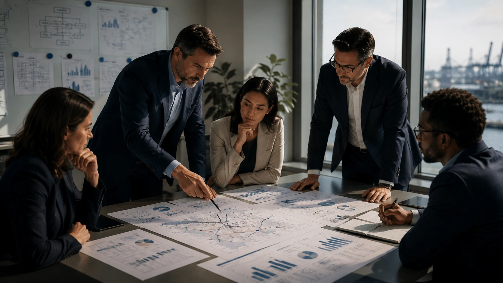
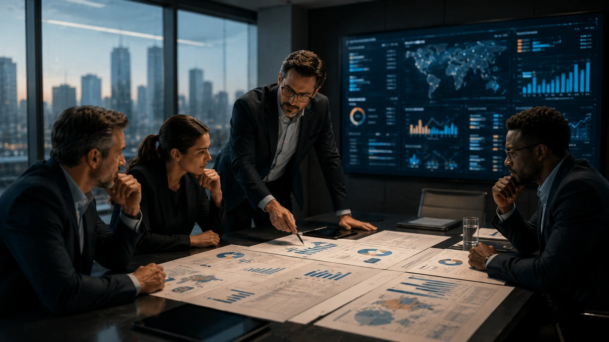

*Durante anos, empresas tomaram decisões estratégicas baseadas em relatórios históricos, planilhas e projeções limitadas. Agora, a combinação entre dados corporativos, computação em nuvem e inteligência artificial está criando uma nova camada operacional: ambientes digitais capazes de simular negócios inteiros antes que qualquer mudança aconteça no mundo real. Os chamados AI Digital Twins começam a se tornar um dos ativos mais estratégicos da transformação digital corporativa.*

## AI Digital Twins são réplicas digitais que permitem testar decisões antes da execução real

Os **AI Digital Twins** são representações digitais de operações, processos, cadeias produtivas ou até empresas inteiras.

A diferença em relação aos modelos analíticos tradicionais está na capacidade de incorporar dados em tempo real e utilizar **Inteligência Artificial** para prever comportamentos futuros.

Enquanto dashboards mostram o que aconteceu, os gêmeos digitais ajudam a entender o que provavelmente acontecerá.

### Como funciona um gêmeo digital corporativo?

O sistema reúne dados vindos de ERPs, CRMs, sensores, plataformas de vendas, sistemas financeiros e ferramentas operacionais.

Essas informações alimentam um ambiente virtual que replica o comportamento da operação real.

A partir daí, a empresa consegue testar hipóteses antes de tomar decisões críticas.

### Por que isso está ganhando força agora?

O crescimento dos **agentes de IA**, da computação em nuvem e dos modelos generativos tornou economicamente viável criar simulações cada vez mais complexas.

Além disso, empresas estão acumulando volumes históricos de dados suficientes para treinar modelos mais precisos.

O resultado é uma nova geração de plataformas capazes de prever impactos operacionais com um nível de detalhamento que não existia poucos anos atrás.

## Empresas utilizam AI Digital Twins para reduzir riscos e aumentar eficiência operacional

Empresas estão utilizando **AI Digital Twins** para validar decisões antes de comprometer recursos financeiros, equipes ou infraestrutura.

O objetivo não é substituir gestores.

O objetivo é permitir decisões mais informadas.

### O que pode ser testado dentro de um Digital Twin?

Entre os principais cenários simulados estão:

- expansão de unidades;
- mudanças logísticas;
- aumento de produção;
- contratações;
- campanhas comerciais;
- políticas de preços;
- reorganização operacional.

Cada cenário pode gerar milhares de combinações possíveis.

A **Inteligência Artificial** avalia essas alternativas e identifica quais caminhos possuem maior probabilidade de sucesso.

### Como isso impacta custos corporativos?

Pequenos erros operacionais podem gerar prejuízos milionários.

Ao simular decisões antecipadamente, empresas conseguem identificar gargalos antes que eles se transformem em problemas reais.

Esse modelo reduz desperdícios, acelera ciclos de planejamento e melhora a alocação de recursos.

É uma evolução natural do movimento observado em plataformas de analytics e copilotos corporativos.

Inclusive, a adoção de ambientes inteligentes se conecta diretamente com a transformação analisada em [Empresas começam a substituir dashboards por copilotos analíticos movidos por IA generativa](https://noticiatech.com.br/negocios/empresas-come%C3%A7am-a-substituir-dashboards-por-copilotos-anal%C3%ADticos-movidos-por-ia-generativa/).

## Agentes de IA podem transformar Digital Twins em sistemas autônomos de decisão

A próxima etapa dos **AI Digital Twins** envolve a integração com agentes autônomos.

Nesse modelo, a IA não apenas observa os cenários simulados.

Ela participa ativamente da construção e da avaliação das decisões.

### O que muda quando agentes entram na simulação?

Os agentes conseguem executar milhares de testes simultaneamente.

Eles podem alterar parâmetros, criar hipóteses e identificar oportunidades que dificilmente seriam percebidas por equipes humanas.

Isso cria um ciclo contínuo de aprendizado operacional.

Quanto mais dados entram no sistema, mais preciso o ambiente digital se torna.

### Digital Twins podem se tornar o cérebro operacional das empresas?

Cada vez mais especialistas acreditam que sim.

À medida que empresas constroem bases robustas de conhecimento interno, os gêmeos digitais passam a funcionar como camadas de inteligência operacional.

Essa tendência possui forte relação com o crescimento da chamada memória corporativa baseada em IA.

O tema foi explorado anteriormente em [Memória corporativa com IA: por que empresas estão transformando conhecimento interno em vantagem competitiva](https://noticiatech.com.br/negocios/mem%C3%B3ria-corporativa-com-ia-por-que-empresas-est%C3%A3o-transformando-conhecimento-interno-em-vantagem-competitiva/).

## AI Digital Twins podem redefinir planejamento estratégico na próxima década

Os **AI Digital Twins** representam uma mudança estrutural na forma como empresas tomam decisões.

Historicamente, organizações analisavam o passado para planejar o futuro.

Agora surge a possibilidade de experimentar múltiplos futuros antes de escolher qual caminho seguir.

### Por que isso interessa aos gestores?

Porque reduz incertezas.

Mercados cada vez mais voláteis exigem decisões rápidas e bem fundamentadas.

Empresas que conseguem prever impactos operacionais antes da execução ganham vantagem competitiva significativa.

### Quais setores devem liderar essa transformação?

Indústria, logística, energia, saúde, varejo e serviços financeiros aparecem entre os segmentos mais avançados.

Mas a tendência não deve ficar restrita às grandes corporações.

A redução dos custos de infraestrutura e o avanço das plataformas de IA podem democratizar essa tecnologia nos próximos anos.

Assim como aconteceu com analytics, automação e computação em nuvem, os gêmeos digitais caminham para deixar de ser uma inovação experimental e se tornar uma camada permanente da gestão corporativa.

A longo prazo, a principal diferença entre empresas não será apenas quem possui mais dados. Será quem consegue criar os melhores ambientes para transformar esses dados em previsões, decisões e vantagens competitivas antes que o mercado perceba a mudança.

---