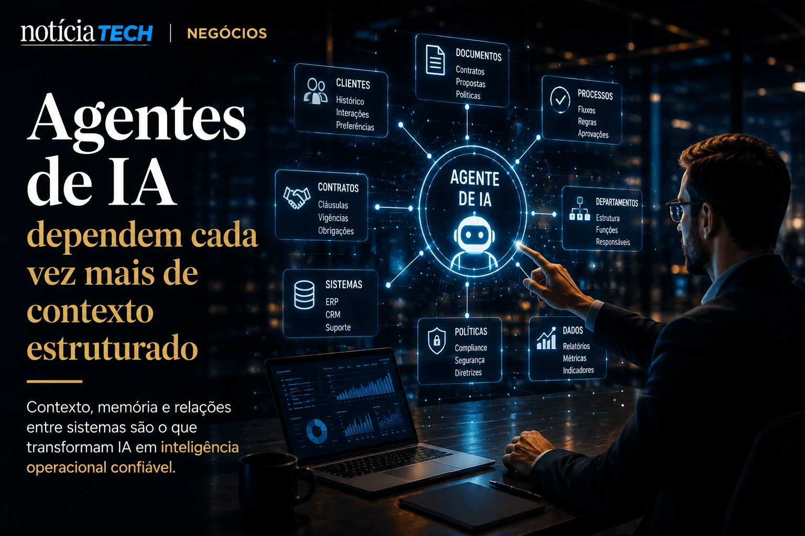
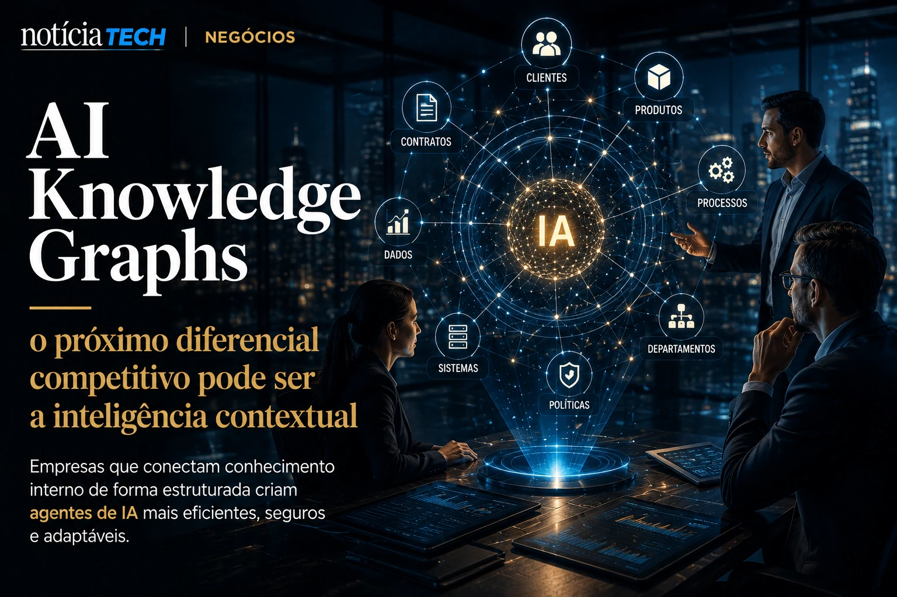

*Durante anos, empresas acumularam documentos, CRMs, planilhas, dashboards, tickets de suporte e bases internas desconectadas. Agora, com o avanço dos agentes autônomos de IA, o mercado começa a perceber que inteligência artificial sem contexto organizacional confiável cria um novo gargalo operacional silencioso.*

## AI Knowledge Graphs começam a virar infraestrutura estratégica da IA corporativa

Empresas estão descobrindo que modelos de IA generativa funcionam melhor quando conseguem acessar relações estruturadas entre dados, pessoas, sistemas e processos internos.


Os chamados **AI Knowledge Graphs** surgem justamente para resolver esse problema. A tecnologia organiza informações empresariais em redes contextuais que conectam entidades estratégicas como clientes, contratos, departamentos, produtos, políticas internas e fluxos operacionais.

Na prática, isso transforma dados isolados em memória operacional reutilizável por sistemas inteligentes.

A mudança acontece porque muitas empresas perceberam que apenas instalar um chatbot corporativo não resolve problemas estruturais de produtividade.

Sem contexto organizacional:
- agentes cometem erros;
- respostas ficam inconsistentes;
- processos perdem confiabilidade;
- equipes passam a desconfiar da IA.

Esse movimento amplia uma tendência já observada em plataformas de automação corporativa e agentes autônomos.

Empresas que começaram a estruturar operações orientadas por IA também passaram a enfrentar novos desafios de governança e organização de contexto interno, como já aparece em movimentos relacionados a [AI Readiness](https://noticiatech.com.br/negocios/ai-readiness-por-que-empresas-come%C3%A7am-a-medir-maturidade-operacional-para-sobreviver-%C3%A0-nova-economia-da-intelig%C3%AAncia-artificial/) e [memória corporativa com IA](https://noticiatech.com.br/negocios/mem%C3%B3ria-corporativa-com-ia-por-que-empresas-est%C3%A3o-transformando-conhecimento-interno-em-vantagem-competitiva/).

### O que muda na prática para as empresas?

A principal mudança é que dados deixam de ser apenas armazenamento passivo e passam a funcionar como camada operacional da inteligência artificial.

Isso altera completamente a lógica da transformação digital.

Antes:
- empresas focavam em armazenar dados;
- departamentos operavam de forma isolada;
- conhecimento dependia de pessoas específicas.

Agora:
- IA exige contexto contínuo;
- agentes precisam interpretar relações;
- sistemas precisam compreender intenção operacional.

Empresas começam a perceber que a verdadeira vantagem competitiva não está apenas no modelo de IA utilizado, mas na qualidade da organização contextual dos dados internos.

## Agentes de IA dependem cada vez mais de contexto estruturado

A nova geração de agentes autônomos exige mais do que prompts bem escritos. Ela depende de memória persistente, rastreabilidade e compreensão contextual profunda.



Esse movimento explica por que gigantes como **Microsoft**, **Google**, **OpenAI**, **Anthropic** e plataformas corporativas estão acelerando investimentos em arquiteturas orientadas por contexto.

O mercado percebeu que:
- IA sem memória contextual gera retrabalho;
- agentes sem governança ampliam riscos;
- sistemas desconectados reduzem eficiência operacional.

Em muitos casos, empresas já convivem com um fenômeno parecido ao chamado [Shadow AI](https://noticiatech.com.br/negocios/shadow-ai-empresas-descobrem-que-uso-invis%C3%ADvel-de-intelig%C3%AAncia-artificial-j%C3%A1-virou-risco-operacional-em-2026/), onde equipes usam inteligência artificial sem integração real com estruturas corporativas.

### Por que isso importa para o futuro dos negócios?

Porque o mercado começa a migrar de uma economia baseada apenas em software para uma economia baseada em contexto operacional.

Isso significa que:
- empresas com dados organizados terão vantagem;
- operações fragmentadas perderão eficiência;
- conhecimento interno ganhará valor estratégico.

Os **AI Knowledge Graphs** funcionam como uma espécie de camada cognitiva corporativa.

Eles permitem que agentes entendam:
- histórico de clientes;
- políticas internas;
- hierarquias organizacionais;
- contexto de contratos;
- relacionamento entre departamentos;
- dependências operacionais.

Essa capacidade pode reduzir erros, acelerar automações e melhorar decisões corporativas.

## O próximo diferencial competitivo pode ser a inteligência contextual

A corrida da IA corporativa começa a sair da fase experimental e entrar em uma disputa por infraestrutura semântica.



Durante os últimos anos, empresas disputaram acesso aos melhores modelos de IA. Agora, a próxima disputa parece caminhar para outro território: quem possui o melhor contexto organizacional estruturado.

Essa mudança pode criar um novo mercado bilionário envolvendo:
- plataformas de contexto corporativo;
- memória organizacional;
- governança semântica;
- integração entre agentes;
- inteligência operacional baseada em grafos.

Empresas que conseguirem conectar conhecimento interno de maneira estruturada poderão criar agentes mais eficientes, seguros e adaptáveis.

### O que pequenas e médias empresas podem aprender com isso?

Mesmo organizações menores já podem começar a construir vantagem competitiva organizando melhor seus dados internos.

Alguns movimentos possíveis incluem:
- centralizar documentação;
- integrar CRM e atendimento;
- criar bases de conhecimento reutilizáveis;
- padronizar fluxos operacionais;
- estruturar processos internos.

Ferramentas de automação e IA acessíveis já permitem que pequenas empresas criem sistemas operacionais mais inteligentes sem depender de grandes equipes técnicas.

Esse movimento também se conecta à tendência de [AI Operating Systems](https://noticiatech.com.br/negocios/ai-operating-systems-por-que-empresas-come%C3%A7am-a-substituir-softwares-isolados-por-ecossistemas-aut%C3%B4nomos-de-ia/) e à transformação dos softwares tradicionais em ecossistemas orientados por agentes.

A longo prazo, empresas talvez descubram que o ativo mais valioso da nova economia da IA não será apenas o modelo utilizado, mas a capacidade de transformar conhecimento interno em inteligência operacional reutilizável.
```
