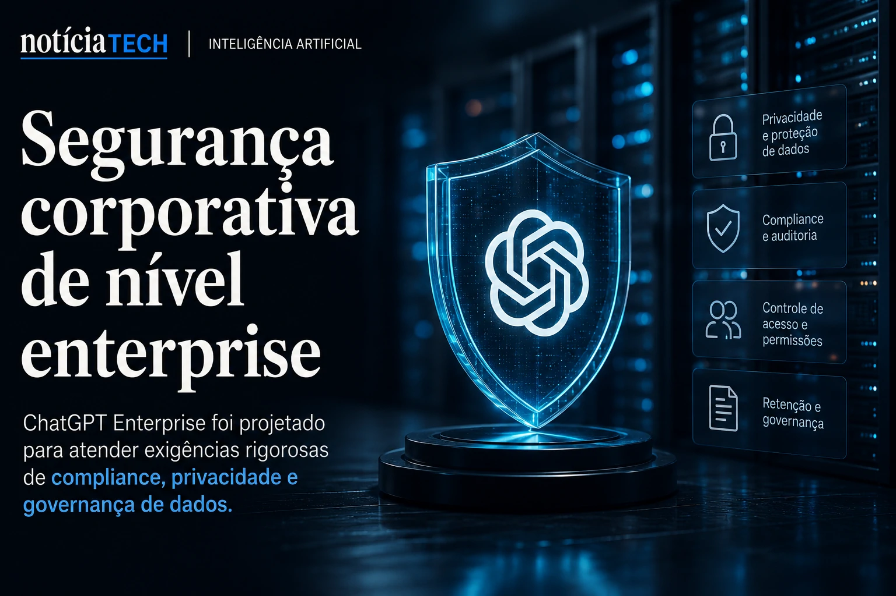
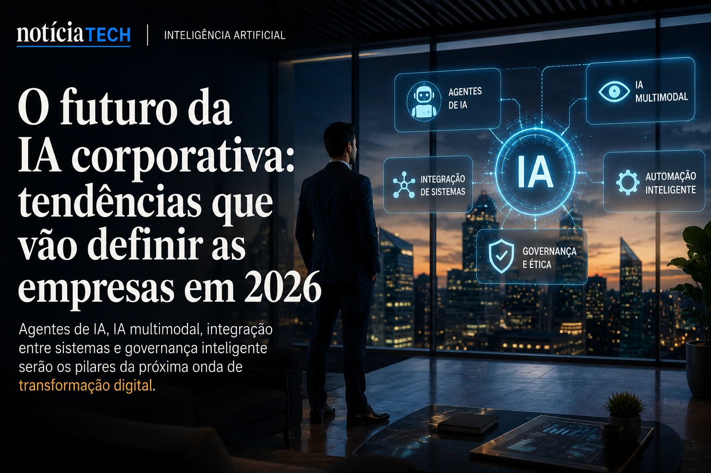

*Durante anos, empresas compraram softwares separados para CRM, atendimento, analytics, produtividade, marketing e operações. Agora, uma nova arquitetura corporativa começa a emergir silenciosamente: sistemas operacionais de IA capazes de integrar contexto, memória, automação e tomada de decisão dentro de uma única camada inteligente. O movimento já mobiliza gigantes como **Microsoft**, **OpenAI**, **Google**, **Salesforce** e **Oracle**, enquanto o mercado B2B acelera uma corrida para transformar a inteligência artificial no núcleo operacional das empresas.*

## A corrida para transformar IA em infraestrutura corporativa

O mercado de tecnologia corporativa começa a entrar em uma nova fase estrutural. Depois da explosão inicial dos copilotos, chatbots e automações isoladas, empresas passaram a perceber um problema crítico: ferramentas desconectadas geram fragmentação operacional.

A consequência é que departamentos inteiros acabam utilizando múltiplos sistemas sem memória compartilhada, sem contexto persistente e sem capacidade real de coordenação estratégica.

É justamente nesse ponto que surgem os chamados **AI Operating Systems**.

Na prática, essas plataformas funcionam como uma camada central de inteligência capaz de:

- integrar dados corporativos;
- conectar agentes autônomos;
- compreender contexto operacional;
- armazenar memória organizacional;
- executar automações complexas;
- tomar decisões baseadas em objetivos empresariais.

A mudança vai muito além de um chatbot corporativo.

O que começa a surgir é uma nova arquitetura operacional onde a IA deixa de ser ferramenta auxiliar para se tornar infraestrutura estratégica.

Empresas que já exploram esse modelo começam a substituir dashboards tradicionais por interfaces conversacionais inteligentes, tendência que já aparece em movimentos recentes do mercado B2B.

Nesse contexto, o avanço dos copilotos analíticos se conecta diretamente ao fenômeno já explorado pelo **Notícia Tech** em:

[Empresas começam a substituir dashboards por copilotos analíticos movidos por IA generativa](https://noticiatech.com.br/negocios/empresas-come%C3%A7am-a-substituir-dashboards-por-copilotos-anal%C3%ADticos-movidos-por-ia-generativa/)

A diferença agora é a escala.

Os copilotos deixam de operar em tarefas específicas e passam a coordenar fluxos inteiros de negócio.

### A IA começa a virar o “middleware” das empresas

Historicamente, sistemas corporativos foram construídos em camadas:

- banco de dados;
- ERP;
- CRM;
- analytics;
- automação;
- aplicações de produtividade.

O novo cenário adiciona uma camada acima de todas elas.

Essa camada é a inteligência contextual.

Ela consegue interpretar linguagem natural, acessar diferentes softwares simultaneamente, memorizar padrões organizacionais e agir de forma semi-autônoma.

É exatamente por isso que empresas como **Microsoft** e **OpenAI** vêm acelerando iniciativas voltadas para agentes empresariais conectados a múltiplas ferramentas.

O movimento também conversa diretamente com a ascensão dos agentes autônomos corporativos já discutidos anteriormente pelo portal:

[A era dos agentes de IA já começou: como Microsoft, OpenAI e Google estão transformando empresas em sistemas autônomos](https://noticiatech.com.br/inteligencia-artificial/a-era-dos-agentes-de-ia-j%C3%A1-come%C3%A7ou-como-microsoft-openai-e-google-est%C3%A3o-transformando-empresas-em-sistemas-aut%C3%B4nomos/)

## O fim da lógica tradicional dos softwares isolados

O software corporativo tradicional foi construído em torno da ideia de aplicações independentes.

Cada departamento contratava suas próprias ferramentas:

- marketing utilizava automação;
- vendas utilizava CRM;
- financeiro utilizava ERP;
- suporte utilizava help desk.

Agora, a IA começa a dissolver essas fronteiras.

Em vez de navegar manualmente entre dezenas de sistemas, usuários passam a interagir com uma única interface inteligente capaz de acessar todas as plataformas simultaneamente.

Isso muda completamente a experiência operacional.

Em vez de:

> “Abrir o software certo”

os funcionários começam a:

> “Conversar com a camada de IA”.

Esse modelo reduz atrito operacional, acelera produtividade e cria um novo paradigma para software empresarial.

### O software deixa de ser interface e vira infraestrutura invisível

Esse talvez seja um dos movimentos mais importantes da indústria de tecnologia em 2026.

Os aplicativos continuam existindo.

Mas deixam de ser o centro da experiência.

A interface principal passa a ser a IA.

Na prática:

- o CRM vira fonte de contexto;
- o ERP vira fonte de dados;
- o analytics vira motor analítico;
- os sistemas deixam de competir por interface;
- a IA se torna a camada dominante.

Isso ajuda a explicar por que empresas de software B2B estão correndo para adicionar agentes, memória persistente e automações inteligentes aos seus produtos.

A disputa não é mais apenas por funcionalidades.

Agora, a disputa é para se tornar a principal camada operacional de IA das empresas.

Essa transformação também se conecta ao crescimento do chamado **Shadow AI**, onde funcionários começam a utilizar inteligência artificial sem aprovação corporativa.

O tema foi aprofundado anteriormente em:

[Shadow AI: empresas descobrem que uso invisível de inteligência artificial já virou risco operacional em 2026](https://noticiatech.com.br/negocios/shadow-ai-empresas-descobrem-que-uso-invis%C3%ADvel-de-intelig%C3%AAncia-artificial-j%C3%A1-virou-risco-operacional-em-2026/)

## Memória corporativa pode se tornar o ativo mais valioso da próxima década

Um dos pilares centrais dos novos AI Operating Systems é a memória organizacional.

Enquanto softwares tradicionais armazenam apenas dados estruturados, os novos sistemas começam a construir memória contextual corporativa.

Isso inclui:

- padrões de decisão;
- histórico operacional;
- comportamento de clientes;
- processos internos;
- linguagem da empresa;
- objetivos estratégicos;
- políticas corporativas;
- histórico de negociações.

A consequência é profunda.

A IA deixa de responder apenas perguntas simples e passa a compreender o funcionamento interno da organização.

### O nascimento das empresas “context-aware”

Esse novo modelo cria empresas capazes de operar com contexto persistente.

A IA passa a lembrar:

- como a empresa negocia;
- quais decisões funcionaram;
- quais clientes possuem maior risco;
- quais fluxos geram gargalos;
- quais estratégias performam melhor.

Esse nível de memória operacional cria uma vantagem competitiva difícil de replicar.

Quanto mais uma organização utiliza IA integrada, mais inteligente sua operação tende a se tornar.

O resultado é uma espécie de efeito composto de contexto.

Empresas atrasadas nessa corrida podem enfrentar um problema semelhante ao que aconteceu na transformação digital da nuvem:

não será apenas uma questão de eficiência.

Será uma questão de sobrevivência competitiva.

### O impacto pode redefinir o mercado de software B2B

O surgimento dos AI Operating Systems também ameaça o modelo tradicional de SaaS.

Se a IA passa a intermediar toda interação entre usuários e softwares:

- a interface perde valor;
- o contexto ganha valor;
- a memória organizacional ganha valor;
- os dados passam a ser ativos centrais;
- agentes autônomos viram vantagem competitiva.

Isso pode criar um novo ciclo bilionário na indústria de tecnologia.

Empresas que conseguirem construir:

- memória persistente confiável;
- agentes empresariais coordenados;
- automação contextual;
- integração profunda entre sistemas;
- segurança operacional;

podem dominar a próxima geração do software corporativo.

Ao mesmo tempo, a mudança aumenta os desafios relacionados a:

- privacidade;
- governança;
- segurança de dados;
- dependência algorítmica;
- transparência decisional.

A tendência indica que o mercado corporativo começa a entrar em uma nova etapa da transformação digital.

Depois da nuvem, da mobilidade e da automação, a próxima camada estrutural parece ser a inteligência operacional persistente.

E dessa vez, a disputa não será apenas sobre quem possui o melhor software.

Será sobre quem consegue construir a IA que melhor entende como uma empresa realmente funciona.

---