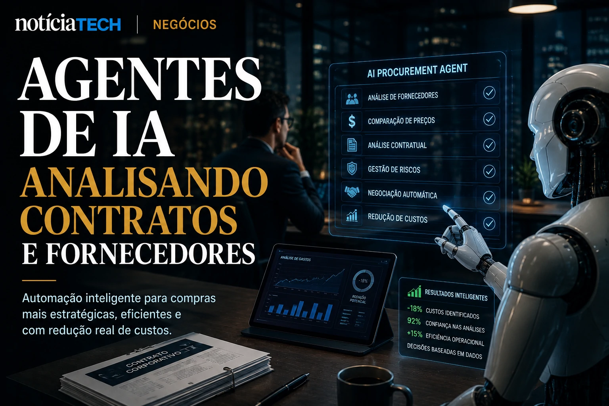
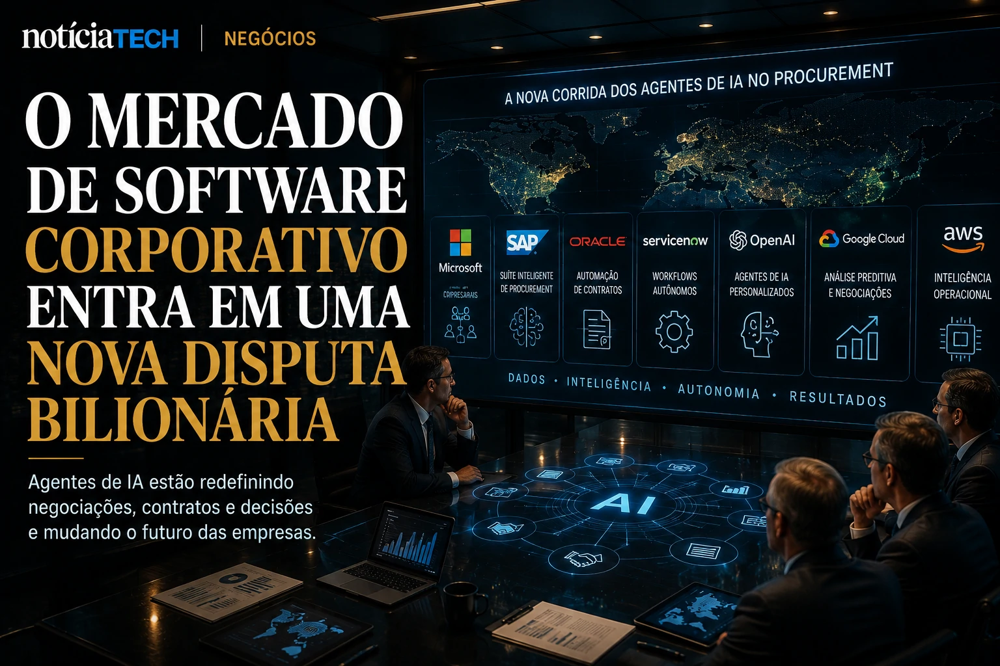

*Durante décadas, departamentos de compras corporativas foram tratados como estruturas operacionais lentas, burocráticas e altamente dependentes de processos humanos. Mas a chegada dos agentes de IA está começando a mudar silenciosamente essa lógica. Grandes empresas agora testam sistemas capazes de negociar contratos, comparar fornecedores, analisar riscos e até conduzir processos inteiros de procurement sem intervenção humana direta. O movimento pode inaugurar uma nova disputa bilionária no mercado global de software corporativo.*

## Empresas começam a transformar procurement em uma operação orientada por IA

Empresas estão utilizando **IA generativa**, **agentes autônomos** e sistemas analíticos para automatizar processos de compras corporativas, reduzir desperdícios operacionais e acelerar negociações estratégicas.

Na prática, o chamado **AI Procurement** representa a transformação do procurement tradicional em uma estrutura orientada por dados, automação e inteligência contextual.

O mercado global de procurement já movimenta trilhões de dólares anualmente. O problema é que grande parte das empresas ainda opera com:
- excesso de planilhas;
- múltiplos fornecedores descentralizados;
- baixa integração operacional;
- renegociações lentas;
- desperdício invisível;
- pouca inteligência preditiva.

Com a chegada dos **agentes de IA**, empresas começam a enxergar procurement não apenas como uma área administrativa, mas como um centro estratégico de eficiência financeira.

### O que os agentes de IA conseguem fazer em procurement?

Os novos sistemas corporativos conseguem:
- comparar milhares de fornecedores em segundos;
- identificar padrões de desperdício;
- prever aumentos de preços;
- sugerir renegociações;
- analisar riscos contratuais;
- automatizar cotações;
- acelerar compliance;
- detectar compras redundantes.

A diferença é que os agentes não operam apenas como dashboards passivos.

Eles passam a atuar como operadores ativos dentro da empresa.

Esse movimento possui forte conexão com a ascensão dos chamados:
- **AI Operating Systems**;
- copilotos corporativos;
- agentes autônomos empresariais;
- automação cognitiva.

Inclusive, o avanço desses ecossistemas já vem sendo discutido pelo próprio NOTÍCIA TECH em conteúdos como:

[AI Operating Systems: por que empresas começam a substituir softwares isolados por ecossistemas autônomos de IA](https://noticiatech.com.br/negocios/ai-operating-systems-por-que-empresas-come%C3%A7am-a-substituir-softwares-isolados-por-ecossistemas-aut%C3%B4nomos-de-ia/)

e também:

[Agentes de IA começam a negociar contratos corporativos e podem transformar o mercado de software B2B](https://noticiatech.com.br/negocios/agentes-de-ia-come%C3%A7am-a-negociar-contratos-corporativos-e-podem-transformar-o-mercado-de-software-b2b/)

## O verdadeiro impacto da IA em procurement está na redução invisível de custos

O maior impacto do **AI Procurement** não está apenas na automação.

Está na capacidade de revelar desperdícios invisíveis que empresas normalmente não conseguem detectar manualmente.

Em muitas organizações, diferentes departamentos:
- contratam ferramentas repetidas;
- utilizam fornecedores semelhantes;
- negociam contratos isoladamente;
- pagam preços inconsistentes;
- renovam serviços sem auditoria estratégica.

Agentes de IA conseguem consolidar esses dados em tempo real.

Isso cria um novo modelo de gestão operacional baseado em:
- inteligência preditiva;
- centralização analítica;
- monitoramento contínuo;
- otimização dinâmica de custos.

### Por que isso virou prioridade em 2026?

O cenário econômico global aumentou a pressão por eficiência operacional.

Ao mesmo tempo:
- custos de software cresceram;
- empresas passaram a operar mais ferramentas SaaS;
- estruturas ficaram mais complexas;
- operações híbridas aumentaram gastos invisíveis.

Segundo estimativas do mercado corporativo, empresas médias e grandes frequentemente desperdiçam entre 10% e 30% dos investimentos em software e fornecedores devido à fragmentação operacional.

É exatamente nesse ponto que os agentes de IA começam a ganhar relevância.

Eles funcionam como uma camada permanente de inteligência financeira operacional.

Esse avanço possui relação direta com o crescimento do chamado **AI Readiness**, tema que o NOTÍCIA TECH já analisou anteriormente:

[AI Readiness: por que empresas começam a medir maturidade operacional para sobreviver à nova economia da inteligência artificial](https://noticiatech.com.br/negocios/ai-readiness-por-que-empresas-come%C3%A7am-a-medir-maturidade-operacional-para-sobreviver-%C3%A0-nova-economia-da-intelig%C3%AAncia-artificial/)

## O mercado de software corporativo pode entrar em uma nova disputa bilionária

O avanço do **AI Procurement** pode desencadear uma nova corrida estratégica entre gigantes como:
- **Microsoft**;
- **Oracle**;
- **SAP**;
- **Salesforce**;
- **ServiceNow**;
- **OpenAI**;
- **Google Cloud**;
- **Amazon AWS**.

O motivo é simples:
quem controlar os agentes operacionais das empresas poderá controlar boa parte da tomada de decisão corporativa.

Isso muda completamente a lógica do software empresarial.

### O procurement deixa de ser apenas operacional

Historicamente, plataformas corporativas serviam para:
- registrar informações;
- organizar processos;
- armazenar contratos;
- centralizar documentos.

Agora, os sistemas começam a:
- interpretar contexto;
- sugerir decisões;
- prever cenários;
- executar ações;
- negociar automaticamente.

Esse é o início de uma transição estrutural:
do software passivo para o software agente.

### O que muda para pequenas e médias empresas?

Pequenas e médias empresas podem ser algumas das maiores beneficiadas.

Isso porque agentes de IA reduzem barreiras históricas de operação.

Negócios menores passam a conseguir:
- negociar melhor com fornecedores;
- automatizar compras;
- reduzir desperdícios;
- operar com equipes enxutas;
- aumentar eficiência financeira.

Ao mesmo tempo, empresas que demorarem para estruturar dados internos podem enfrentar dificuldades para integrar esses novos ecossistemas inteligentes.

Esse movimento se conecta diretamente ao crescimento da automação invisível nas empresas brasileiras:

[IA silenciosa: como pequenas empresas estão automatizando operações sem chamar atenção do mercado](https://noticiatech.com.br/automacao/ia-silenciosa-como-pequenas-empresas-est%C3%A3o-automatizando-opera%C3%A7%C3%B5es-sem-chamar-aten%C3%A7%C3%A3o-do-mercado/)

e também ao fortalecimento da governança operacional da IA:

[Governança de IA vira prioridade para empresas em meio à expansão dos agentes autônomos](https://noticiatech.com.br/inteligencia-artificial/governanca-ia-prioridade-empresas/)

O que começa a surgir agora é uma nova camada da economia digital:
empresas operando não apenas com softwares, mas com ecossistemas inteiros de agentes inteligentes negociando, analisando riscos, reduzindo custos e tomando decisões em tempo real.

E quanto mais a IA avança dentro da operação corporativa, mais procurement deixa de ser um setor administrativo para se tornar uma infraestrutura estratégica da nova economia empresarial baseada em inteligência artificial.

---