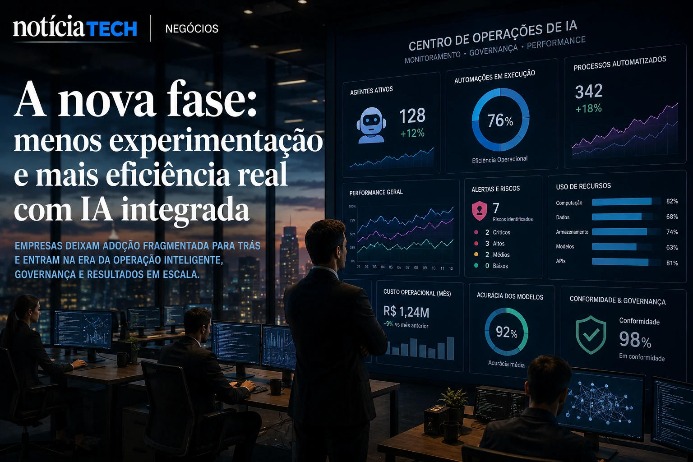

*Durante os últimos dois anos, o mercado corporativo viveu uma corrida acelerada por adoção de inteligência artificial. Mas em 2026, a lógica começa a mudar. Empresas perceberam que simplesmente contratar ferramentas de IA não garante produtividade, vantagem competitiva ou transformação real. A nova prioridade agora é medir o chamado AI Readiness — o nível de preparo operacional, estrutural e estratégico necessário para transformar IA em resultado sustentável.*

## O que é AI Readiness e por que empresas passaram a tratar isso como prioridade estratégica

**AI Readiness** representa o nível de preparação de uma empresa para operar inteligência artificial de maneira escalável, segura e integrada aos processos do negócio.

Na prática, isso significa avaliar fatores como:

- organização de dados;
- qualidade operacional;
- integração entre sistemas;
- maturidade digital;
- governança de IA;
- cultura corporativa;
- capacidade de automação;
- segurança da informação;
- treinamento de equipes.

O mercado começou a perceber que muitas empresas implementaram IA de maneira fragmentada.

Ferramentas foram adicionadas sem integração real.

Departamentos passaram a operar sistemas isolados.

Equipes começaram a utilizar agentes autônomos sem governança centralizada.

Esse cenário já vem sendo discutido em movimentos recentes do mercado corporativo, principalmente após o crescimento do chamado **Shadow AI**, onde colaboradores utilizam inteligência artificial sem supervisão oficial da empresa.

Esse movimento já apareceu em tendências recentes analisadas pelo próprio NOTÍCIA TECH:

- [Shadow AI: empresas descobrem que uso invisível de inteligência artificial já virou risco operacional em 2026](https://noticiatech.com.br/negocios/shadow-ai-empresas-descobrem-que-uso-invis%C3%ADvel-de-intelig%C3%AAncia-artificial-j%C3%A1-virou-risco-operacional-em-2026/)
- [Empresas descobrem que IA sem organização interna aumenta custos e reduz produtividade](https://noticiatech.com.br/negocios/empresas-descobrem-que-ia-sem-organiza%C3%A7%C3%A3o-interna-aumenta-custos-e-reduz-produtividade/)

Agora, o mercado começa a entender que o verdadeiro diferencial competitivo não será apenas possuir IA, mas conseguir operar IA de forma coordenada.

## Empresas começam a descobrir que IA sem maturidade operacional aumenta complexidade interna

A primeira fase da adoção de IA foi marcada pelo entusiasmo.

A segunda começa a ser marcada pela complexidade.

Empresas passaram a perceber que:

- múltiplos copilotos geram redundância;
- ferramentas desconectadas criam retrabalho;
- automações isoladas aumentam ruído operacional;
- excesso de plataformas fragmenta dados internos;
- agentes sem governança criam risco corporativo.

Em muitos casos, a IA aumentou a velocidade operacional, mas também ampliou desorganização estrutural.

Esse é exatamente o motivo pelo qual grandes empresas passaram a investir em novas áreas internas ligadas a:

- **AI Operations**;
- governança de IA;
- arquitetura de automação;
- integração de agentes;
- segurança operacional;
- observabilidade de IA.

O mercado começa a migrar da fase experimental para uma fase de industrialização operacional da inteligência artificial.

Esse movimento também se conecta diretamente com o crescimento dos chamados **AI Operating Systems**, onde empresas tentam substituir dezenas de ferramentas isoladas por ecossistemas unificados de IA.

O tema já vem sendo discutido pelo NOTÍCIA TECH em análises recentes:

- [AI Operating Systems: por que empresas começam a substituir softwares isolados por ecossistemas autônomos de IA](https://noticiatech.com.br/negocios/ai-operating-systems-por-que-empresas-come%C3%A7am-a-substituir-softwares-isolados-por-ecossistemas-aut%C3%B4nomos-de-ia/)
- [Empresas começam a criar cargos de AI Operations para controlar agentes autônomos](https://noticiatech.com.br/negocios/empresas-come%C3%A7am-a-criar-cargos-de-ai-operations-para-controlar-agentes-aut%C3%B4nomos/)

### O que empresas começam a medir dentro do AI Readiness

A nova geração de métricas corporativas começa a incluir fatores que antes não eram tratados como prioridade.

Entre os principais indicadores observados pelas empresas estão:

- qualidade da base de dados;
- integração entre plataformas;
- tempo de resposta operacional;
- autonomia dos agentes;
- custos de automação;
- risco regulatório;
- dependência de fornecedores;
- segurança de prompts;
- rastreabilidade de decisões da IA.

A mudança é importante porque o mercado percebeu que IA deixou de ser apenas software.

Agora, inteligência artificial começa a funcionar como infraestrutura operacional crítica.

## O mercado de IA entra em uma nova fase: menos experimentação e mais eficiência real

A próxima disputa do mercado não será sobre quem possui mais ferramentas de IA.

Será sobre quem consegue transformar IA em eficiência operacional sustentável.

Empresas começam a perceber que produtividade real depende de:

- integração de sistemas;
- qualidade organizacional;
- processos internos claros;
- dados estruturados;
- governança forte;
- cultura operacional adaptável.

Isso explica por que muitas organizações aceleraram investimentos em:

- plataformas unificadas;
- copilotos corporativos;
- infraestrutura de dados;
- observabilidade operacional;
- arquitetura de automação;
- agentes integrados.

A tendência também ajuda a explicar por que gigantes como **Microsoft**, **Google**, **OpenAI**, **Anthropic** e **Salesforce** passaram a disputar não apenas modelos de IA, mas o controle da infraestrutura operacional das empresas.

A corrida agora acontece dentro do fluxo corporativo.

### O que muda para pequenas e médias empresas

Pequenas empresas talvez sejam as maiores beneficiadas dessa nova fase.

Isso porque muitas organizações menores conseguem:

- implementar automações mais rapidamente;
- reduzir burocracia interna;
- integrar operações com mais agilidade;
- adaptar processos sem estruturas complexas;
- acelerar transformação digital com menor custo.

Ferramentas modernas já permitem que pequenas empresas operem:

- atendimento automatizado;
- marketing com IA;
- CRM inteligente;
- automação comercial;
- agentes de suporte;
- análise operacional em tempo real.

Esse cenário já aparece em outras transformações recentes analisadas pelo NOTÍCIA TECH:

- [Ferramentas de IA para pequenas empresas: como automatizar atendimento, conteúdo e vendas sem equipe técnica](https://noticiatech.com.br/negocios/ferramentas-de-ia-para-pequenas-empresas-como-automatizar-atendimento-conte%C3%BAdo-e-vendas-sem-equipe-t%C3%A9cnica/)
- [WhatsApp Business ganha automações com IA e vira ferramenta central para pequenas empresas no Brasil](https://noticiatech.com.br/negocios/whatsapp-business-ganha-automa%C3%A7%C3%B5es-com-ia-e-vira-ferramenta-central-para-pequenas-empresas-no-brasil/)
- [IA silenciosa: como pequenas empresas estão automatizando operações sem chamar atenção do mercado](https://noticiatech.com.br/automacao/ia-silenciosa-como-pequenas-empresas-est%C3%A3o-automatizando-opera%C3%A7%C3%B5es-sem-chamar-aten%C3%A7%C3%A3o-do-mercado/)

### A nova economia da IA começa a separar empresas preparadas das empresas apenas digitalizadas

Durante muitos anos, transformação digital significava possuir software.

Agora, isso não é mais suficiente.

A nova fase do mercado exige capacidade operacional para coordenar inteligência artificial em escala.

Empresas que conseguirem integrar:

- dados;
- automação;
- agentes autônomos;
- operações;
- governança;
- tomada de decisão;

tendem a construir vantagens competitivas difíceis de replicar.

O mercado começa a perceber que o verdadeiro valor da IA não está apenas no modelo generativo.

Está na capacidade da empresa de transformar inteligência artificial em estrutura operacional contínua.

E essa talvez seja a maior mudança silenciosa da economia digital em 2026.

---