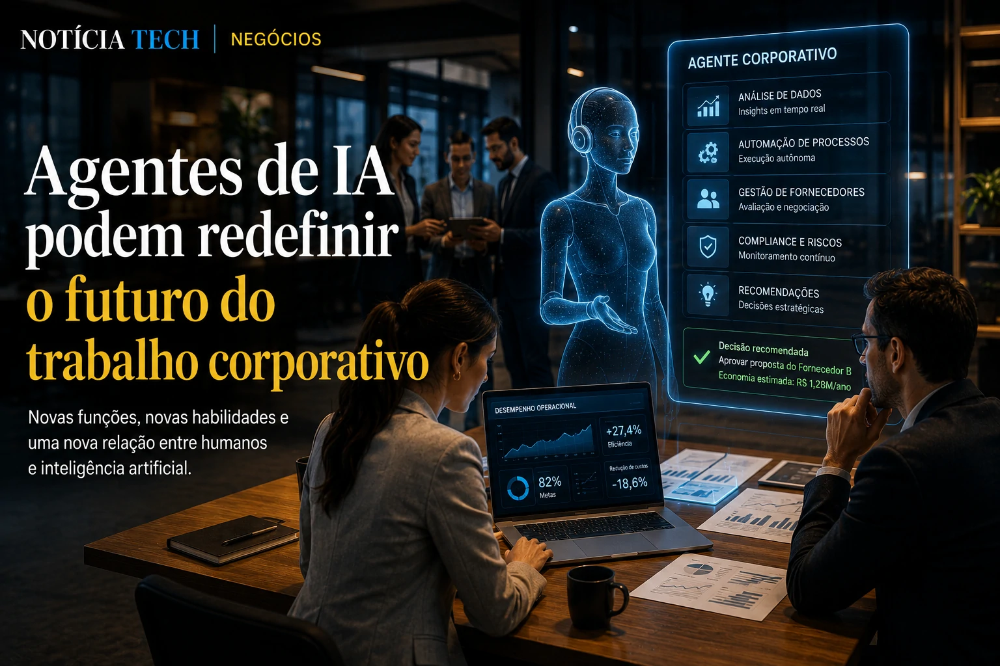

*O avanço da inteligência artificial corporativa está entrando em uma nova fase silenciosa, mas potencialmente muito mais disruptiva do que a simples automação de tarefas. Após acelerar atendimento, marketing, produtividade e desenvolvimento de software, grandes empresas começam agora a explorar agentes autônomos capazes de analisar fornecedores, comparar propostas, negociar preços e até recomendar decisões estratégicas em contratos B2B. O movimento pode alterar profundamente o funcionamento do mercado corporativo nos próximos anos.*

## Empresas começam a usar agentes de IA para reduzir o ciclo de negociação corporativa

O mercado de software corporativo vive uma transformação acelerada impulsionada por plataformas de inteligência artificial generativa. Depois da explosão dos copilotos corporativos, empresas começam a testar agentes de IA especializados em negociações comerciais.

Na prática, esses sistemas conseguem:

- analisar contratos;
- comparar fornecedores;
- cruzar preços históricos;
- identificar riscos jurídicos;
- calcular impacto operacional;
- sugerir melhores condições comerciais.

A mudança começa a chamar atenção porque reduz drasticamente o tempo de fechamento de contratos empresariais. Processos que antes levavam semanas passam a ser analisados em poucas horas.

Esse movimento surge em paralelo ao crescimento da chamada economia agentic, conceito que já começa a redefinir o comércio digital e a relação entre empresas e plataformas inteligentes. O tema se conecta diretamente ao avanço descrito em [Comércio Agentic: como ChatGPT, Google e Shopify estão transformando a internet em uma interface de compras por IA](https://noticiatech.com.br/inteligencia-artificial/com%C3%A9rcio-agentic-como-chatgpt-google-e-shopify-est%C3%A3o-transformando-a-internet-em-uma-interface-de-compras-por-ia/).

### O novo papel da IA dentro das áreas comerciais

Até pouco tempo atrás, a maior parte das implementações de **IA corporativa** estava concentrada em produtividade operacional. Agora, a tecnologia começa a avançar para áreas historicamente estratégicas dentro das empresas.

Isso inclui:

- procurement;
- compras corporativas;
- negociação B2B;
- gestão de fornecedores;
- compliance;
- análise contratual.

Em vez de apenas responder comandos, os novos agentes conseguem executar fluxos completos de tomada de decisão.

Esse cenário também reforça a corrida por plataformas capazes de centralizar inteligência operacional dentro das empresas, algo que já vem impactando o próprio mercado de desenvolvimento de software, como mostrado em [OpenAI quer transformar o VS Code na plataforma central da nova economia da IA](https://noticiatech.com.br/inteligencia-artificial/openai-quer-transformar-o-vs-code-na-plataforma-central-da-nova-economia-da-ia/).

## A próxima guerra da IA pode acontecer dentro das operações corporativas

O avanço dos agentes autônomos está criando uma nova disputa entre gigantes da tecnologia. Empresas como **OpenAI**, **Google**, **Microsoft**, **Anthropic** e **Amazon** aceleram investimentos para dominar a infraestrutura da próxima geração de softwares corporativos.

O objetivo deixou de ser apenas oferecer modelos de linguagem.

Agora, a disputa envolve:

- plataformas agentic;
- ecossistemas corporativos;
- integração com ERPs;
- automação de workflows;
- inteligência operacional;
- controle de processos críticos.

A mudança é estratégica porque empresas começam a perceber que agentes de IA podem funcionar como uma nova camada operacional sobre os softwares tradicionais.

Esse movimento se aproxima da tendência mostrada em [Empresas começam a substituir softwares tradicionais por agentes de IA](https://noticiatech.com.br/automacao/empresas-come%C3%A7am-a-substituir-softwares-tradicionais-por-agentes-de-ia/).

### A IA deixa de ser ferramenta e vira infraestrutura de decisão

O mercado corporativo começa a entrar em uma nova fase da inteligência artificial.

Na primeira onda, a tecnologia ajudava funcionários.

Na segunda, automatizava tarefas.

Agora, os agentes começam a participar diretamente da lógica operacional das empresas.

Isso muda completamente a forma como organizações:

- compram software;
- contratam serviços;
- analisam risco;
- definem fornecedores;
- gerenciam produtividade;
- tomam decisões estratégicas.

Ao mesmo tempo, cresce a preocupação com governança, rastreabilidade e dependência tecnológica.

O tema ganha relevância porque empresas já perceberam que decisões automatizadas podem criar riscos operacionais importantes quando não existe supervisão adequada. Esse debate aparece também em [Governança de IA vira prioridade nas empresas](https://noticiatech.com.br/inteligencia-artificial/governanca-ia-prioridade-empresas/).

## O mercado de trabalho corporativo pode mudar com a ascensão dos agentes autônomos

A ascensão dos agentes autônomos também começa a pressionar mudanças dentro das estruturas corporativas.

Equipes de compras, operações e tecnologia passam a trabalhar em conjunto para supervisionar sistemas inteligentes capazes de negociar, executar análises e gerar recomendações estratégicas automaticamente.

Ao invés de eliminar profissionais, o mercado tende a acelerar a criação de funções híbridas voltadas para:

- supervisão de agentes;
- auditoria de IA;
- AI Operations;
- engenharia de workflows inteligentes;
- governança algorítmica.

Essa mudança já começa a aparecer em empresas que estruturam novos departamentos focados na coordenação de agentes autônomos, tendência discutida em [Empresas começam a criar cargos de AI Operations para controlar agentes autônomos](https://noticiatech.com.br/negocios/empresas-come%C3%A7am-a-criar-cargos-de-ai-operations-para-controlar-agentes-aut%C3%B4nomos/).

### O software corporativo pode entrar em sua maior transformação em décadas

O avanço dos agentes de IA também ameaça alterar profundamente o modelo tradicional de software empresarial.

Historicamente, empresas precisavam operar múltiplos sistemas separados:

- CRM;
- ERP;
- atendimento;
- analytics;
- automação;
- gestão documental.

Com agentes inteligentes capazes de navegar entre plataformas e executar tarefas de forma contextual, parte dessa fragmentação começa a perder relevância.

Na prática, o agente se torna a interface principal.

Esse cenário reforça uma mudança estrutural no mercado de tecnologia: empresas deixam de comprar apenas softwares e passam a contratar inteligência operacional.

O movimento ainda está no início, mas começa a indicar que a próxima grande transformação corporativa pode não acontecer apenas dentro dos modelos de IA — e sim na forma como empresas inteiras passam a operar, negociar e tomar decisões usando agentes autônomos como camada central de execução estratégica.