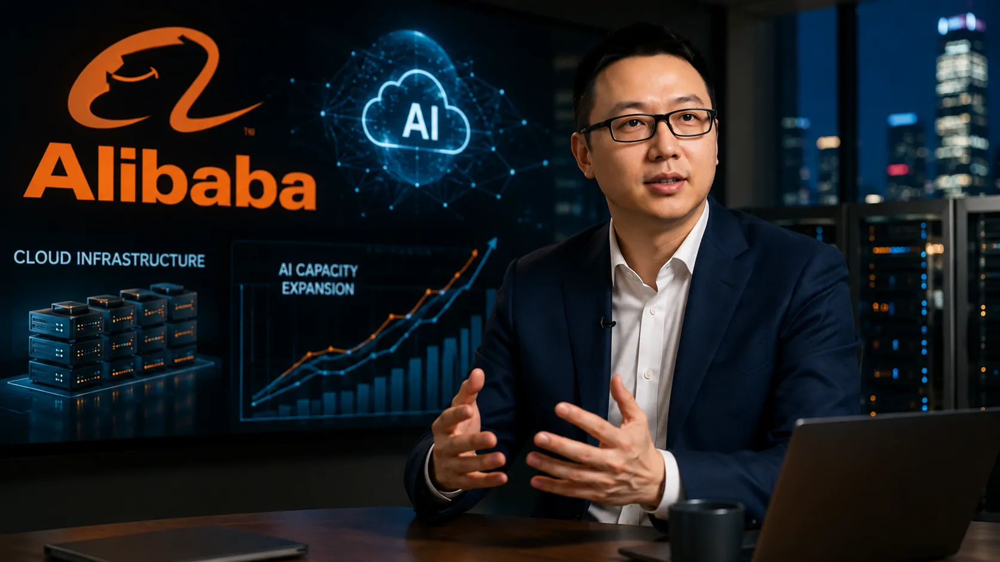
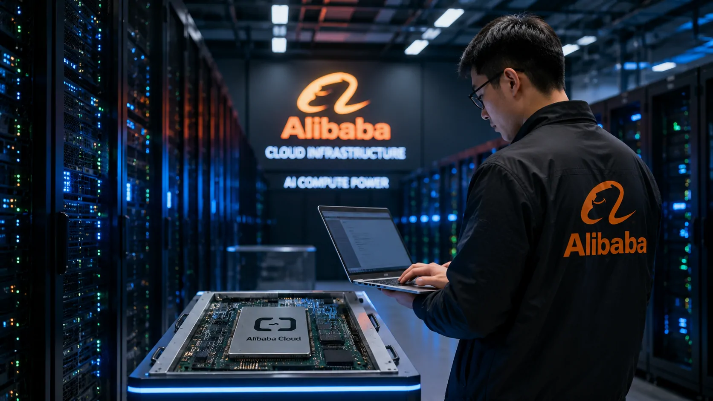
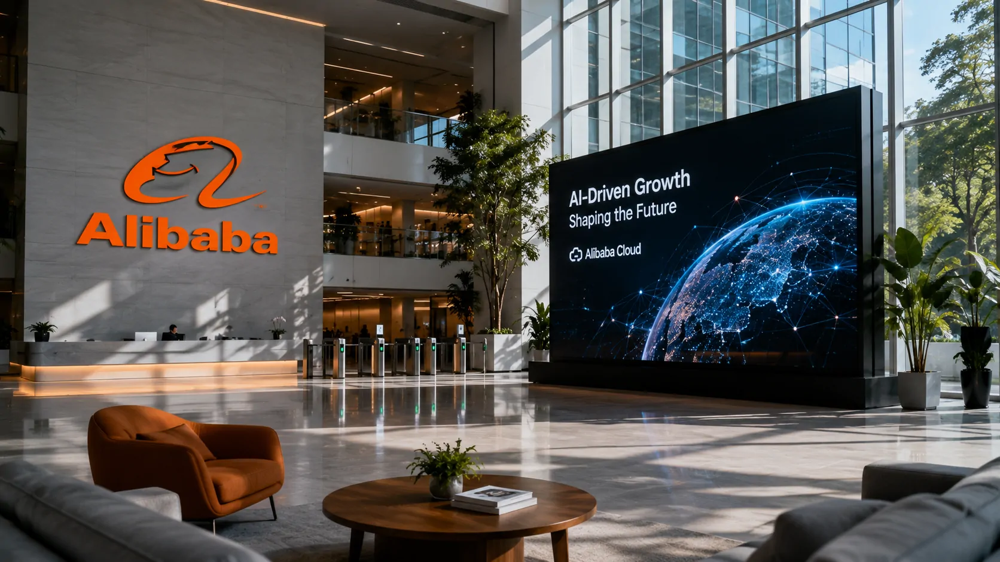

*O Alibaba está aceitando uma forte pressão sobre o lucro para acelerar sua infraestrutura de inteligência artificial. A estratégia liderada por Eddie Wu mostra como a corrida pela IA está obrigando grandes empresas de tecnologia a trocar parte da rentabilidade imediata por capacidade computacional e crescimento futuro.*

## O lucro do Alibaba despencou enquanto a IA ganhou espaço

O **Alibaba** registrou uma queda de 75% no lucro líquido no trimestre encerrado em junho de 2026. O resultado caiu para cerca de 10,5 bilhões de yuans, ante 43,1 bilhões de yuans no mesmo período do ano anterior.

A queda aconteceu em um momento de forte aumento dos investimentos em infraestrutura de **inteligência artificial**. As despesas de capital cresceram 75%, chegando a aproximadamente 67,7 bilhões de yuans no trimestre.

### O custo imediato da corrida pela IA

A expansão da capacidade computacional elevou os custos do Alibaba justamente quando a empresa tenta transformar a IA em uma nova fonte relevante de receita.

O movimento mostra uma característica importante do atual mercado de tecnologia: desenvolver e operar sistemas avançados de IA exige investimentos elevados antes que toda a capacidade instalada consiga gerar retorno financeiro.

### Receita cresce apesar da pressão sobre o lucro

Enquanto a rentabilidade sofreu forte impacto, a receita total do Alibaba cresceu cerca de 9%, chegando a aproximadamente 269 bilhões de yuans.

O contraste é relevante. A empresa não está simplesmente gastando mais sem crescimento. Ela está aumentando investimentos enquanto áreas diretamente relacionadas à IA e à computação em nuvem apresentam expansão acelerada.

## Eddie Wu mantém a aposta em infraestrutura de IA

Para **Eddie Wu**, CEO do **Alibaba**, o aumento dos investimentos precisa ser analisado como uma aposta de longo prazo. A empresa pretende ampliar a capacidade necessária para atender à demanda crescente por serviços de IA.

*Eddie Wu conduz a estratégia de expansão do Alibaba em inteligência artificial, computação em nuvem e infraestrutura própria.*

### Um investimento de 380 bilhões de yuans

O Alibaba estabeleceu um plano de investimento de 380 bilhões de yuans em infraestrutura de IA e computação em nuvem entre 2026 e 2029.

A escala do projeto mostra que a companhia não trata a inteligência artificial como apenas uma nova funcionalidade de seus produtos. A tecnologia passou a ocupar uma posição central na estratégia de infraestrutura e crescimento do grupo.

### A expectativa de retorno em três anos

Wu afirmou que, considerando as margens médias atuais dos produtos de IA, os investimentos em capacidade computacional podem atingir o ponto de equilíbrio em aproximadamente três anos.

Esse prazo transforma a decisão em uma aposta financeira de longo prazo. O Alibaba precisa aumentar a utilização da infraestrutura e, simultaneamente, elevar a monetização de seus serviços para que o investimento produza o retorno esperado.

## Alibaba Cloud mostra onde a estratégia começa a funcionar

A principal evidência de que a aposta do Alibaba não está restrita ao aumento de gastos aparece no desempenho de sua divisão de computação em nuvem.

A receita externa do **Alibaba Cloud** cresceu 45% no trimestre, alcançando aproximadamente 48,4 bilhões de yuans. O avanço foi impulsionado principalmente pela demanda por capacidade computacional e produtos relacionados à inteligência artificial.

### Empresas estão puxando a demanda

A expansão do mercado corporativo de IA aumenta a necessidade de infraestrutura para treinar, executar e integrar modelos aos sistemas empresariais.

Isso cria uma oportunidade para o Alibaba além do desenvolvimento de seus próprios modelos. A companhia pode monetizar a infraestrutura utilizada por outras empresas para construir aplicações baseadas em IA.

### IA deixa de ser apenas uma aposta de produto

O movimento também ajuda a explicar por que o Alibaba está investindo simultaneamente em modelos, nuvem, chips e agentes de IA.

A estratégia busca controlar diferentes partes da cadeia tecnológica. Quanto maior a integração entre esses componentes, maior pode ser a capacidade da companhia de reduzir custos, aumentar margens e capturar receita em diferentes etapas do mercado.

Essa transformação acompanha uma mudança mais ampla no valor das empresas de tecnologia, na qual infraestrutura e capacidade de IA começam a influenciar diretamente a posição competitiva. O cenário foi analisado pelo Notícia Tech em **[como a IA está mudando o valor das empresas de tecnologia](https://noticiatech.com.br/negocios/ia-muda-valor-empresas-tecnologia/)**.

## Chips próprios podem mudar a conta da infraestrutura

Um dos pontos estratégicos da aposta de **Eddie Wu** está no uso crescente de chips desenvolvidos internamente pelo Alibaba.

*O Alibaba busca ampliar o uso de tecnologia própria para reduzir dependências e melhorar a economia de sua infraestrutura de IA.*

### Menor dependência de chips comerciais

A expansão da IA exige grandes volumes de processamento, tornando o custo dos aceleradores e de outros componentes uma variável importante para a rentabilidade dos serviços.

O desenvolvimento e a utilização de chips próprios podem permitir ao Alibaba maior controle sobre a infraestrutura utilizada em seus data centers.

### Margem pode se tornar decisiva

Se a empresa conseguir aumentar a utilização de seus chips e melhorar a eficiência de sua infraestrutura, o custo de operação dos serviços de IA pode cair ao longo do tempo.

Essa possibilidade é importante para a tese defendida por Wu. O retorno do investimento não depende apenas de vender mais serviços, mas também de construir uma estrutura capaz de operar esses serviços com margens melhores.

## A aposta coloca o Alibaba em uma corrida maior

A decisão de continuar investindo mesmo diante da queda expressiva do lucro não acontece isoladamente. Grandes empresas de tecnologia estão aumentando os gastos com computação porque a capacidade de IA passou a ser um ativo estratégico.

O Alibaba está competindo não apenas por usuários, mas também por infraestrutura, modelos, desenvolvedores e clientes corporativos.

### A disputa por capacidade computacional

O crescimento de agentes de IA e aplicações empresariais aumenta a quantidade de processamento necessária para executar essas tecnologias em escala.

Nesse cenário, possuir infraestrutura suficiente pode ser tão importante quanto ter um modelo competitivo. Empresas que não conseguirem acompanhar a expansão da demanda podem enfrentar limitações de capacidade ou custos elevados para depender de terceiros.

### O Alibaba quer transformar escala em vantagem

A estratégia de Wu parte da ideia de que o investimento atual pode criar uma vantagem operacional no futuro.

Se a demanda continuar crescendo, a infraestrutura construída agora poderá ser utilizada por mais clientes e produtos. O desafio será transformar esse aumento de escala em receita recorrente e, posteriormente, em rentabilidade.

## Eddie Wu aposta que a IA pagará a conta no futuro

A estratégia do **Alibaba** revela uma mudança importante na forma como grandes empresas estão tratando a inteligência artificial.

A companhia está aceitando uma redução significativa do lucro no curto prazo para construir capacidade em uma tecnologia que considera fundamental para os próximos anos.

*O Alibaba tenta transformar investimentos em infraestrutura, modelos e serviços de IA em uma plataforma de crescimento para os próximos anos.*

### O risco está no retorno do investimento

A principal questão agora não é apenas quanto o Alibaba consegue investir, mas se conseguirá transformar esse capital em crescimento sustentável.

O aumento de 45% na receita externa do Alibaba Cloud é um sinal positivo. Porém, a companhia ainda precisa provar que o crescimento da demanda será suficiente para compensar o enorme volume de capital destinado à infraestrutura.

### A estratégia de Wu será testada pela execução

A promessa de recuperar o investimento em aproximadamente três anos coloca uma referência clara para a estratégia de **Eddie Wu**.

Se a receita de IA continuar crescendo e a infraestrutura ganhar escala, o Alibaba poderá transformar o atual impacto sobre o lucro em uma vantagem competitiva. Se a monetização não acompanhar o ritmo dos investimentos, a pressão financeira poderá se prolongar.

É justamente essa equação que torna a estratégia do Alibaba relevante para outras empresas: a corrida pela IA não envolve apenas escolher um modelo ou adotar uma ferramenta, mas decidir quanto capital uma organização está disposta a comprometer para construir capacidade própria.

Para empresas que acompanham essa transformação, o avanço dos serviços corporativos de IA também mostra por que a infraestrutura está se tornando parte central da estratégia digital. O próprio Notícia Tech já analisou esse movimento ao mostrar como o **ChatGPT integrado ao Google Drive** amplia o uso da IA dentro das empresas: **[veja como a integração pode mudar o trabalho corporativo com IA](https://noticiatech.com.br/inteligencia-artificial/chatgpt-google-drive-ia-empresas/)**.

---