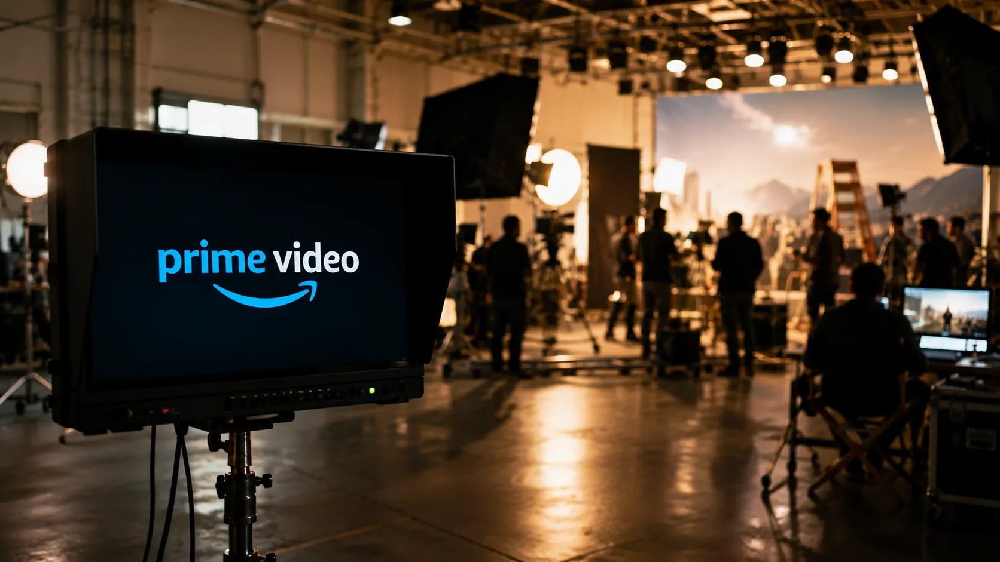
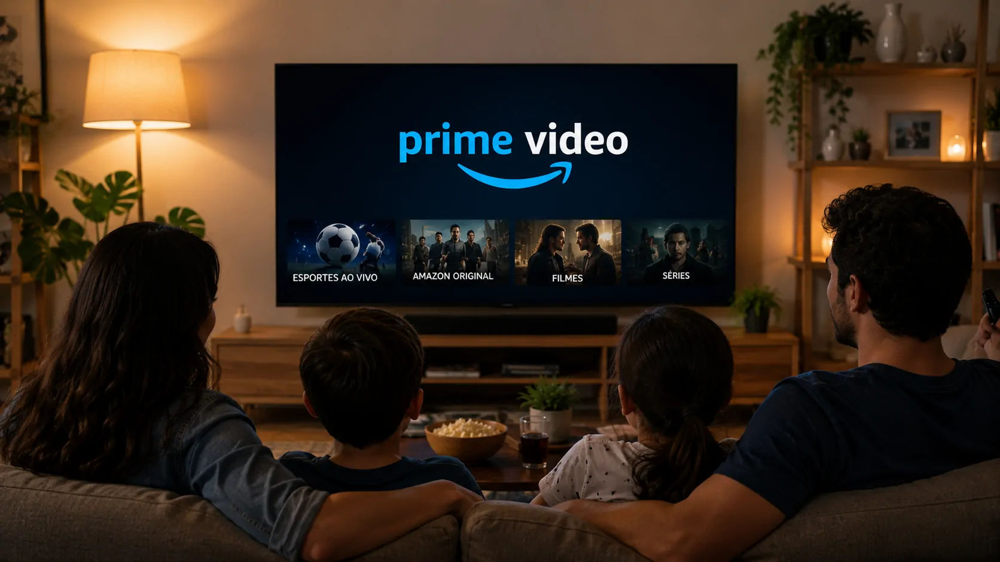
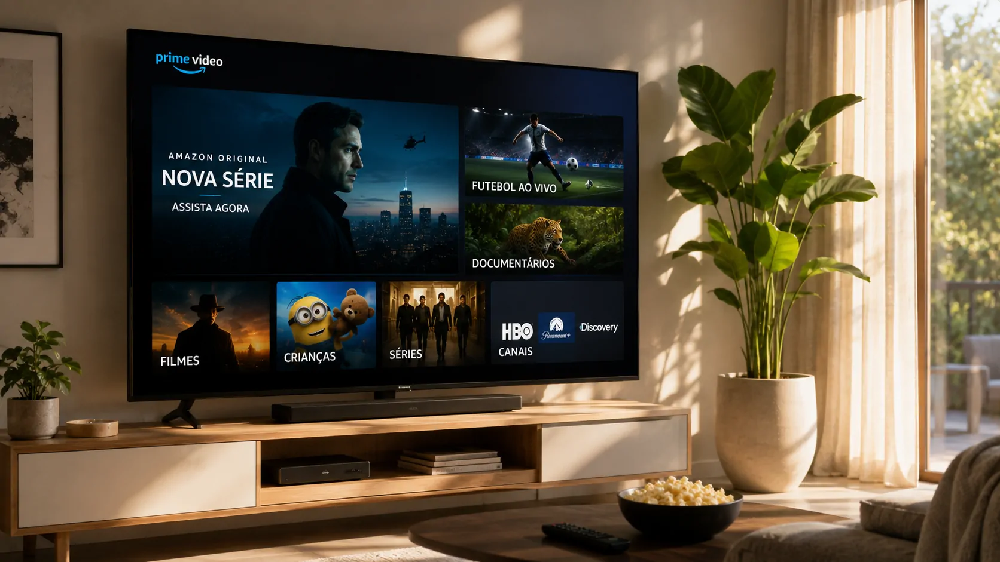

*O Prime Video está elevando sua aposta na América Latina em um movimento que vai além de novas séries. Com mais de US$ 2 bilhões previstos até 2030, a Amazon quer ampliar conteúdo local, esportes e distribuição, colocando o Brasil no centro de uma disputa cada vez mais estratégica pela audiência.*

## Amazon transforma a América Latina em prioridade para o Prime Video

### O investimento anunciado

A **Amazon** anunciou em 20 de agosto que o **Prime Video** investirá mais de **US$ 2 bilhões** na América Latina entre 2027 e 2030. O dinheiro será direcionado para programação original, conteúdo produzido ou adquirido localmente e direitos de esportes ao vivo.

O plano envolve **Brasil, México, Argentina, Colômbia e Chile**, cinco dos principais mercados considerados pela empresa na região. A companhia também pretende mais que dobrar o número de produções originais locais em relação a 2026.

### Mais de 25 produções em 2027

A primeira demonstração dessa estratégia já está prevista para 2027, quando o Prime Video espera lançar mais de **25 títulos locais**, entre séries roteirizadas, filmes, reality shows e outros formatos.

A mudança é relevante porque mostra uma tentativa de aproximar o catálogo das preferências de cada mercado sem abandonar a possibilidade de levar essas produções para públicos internacionais.

## O Brasil ganha peso na estratégia da Amazon

*O Brasil está entre os mercados que receberão investimentos em produção local e direitos esportivos.*

### Conteúdo brasileiro como ativo estratégico

O **Brasil** aparece diretamente no plano regional da **Amazon**, e não apenas como mercado consumidor do serviço. A empresa pretende ampliar sua produção local e continuar desenvolvendo parcerias com profissionais e produtoras brasileiras.

Essa estratégia também se conecta ao desenvolvimento de uma cadeia criativa local. A Amazon cita programas de formação e iniciativas voltadas à produção audiovisual brasileira como parte de seu investimento de longo prazo.

### Esportes ampliam o alcance

Os esportes são outro componente importante. O **Prime Video** ampliou a cobertura da **NBA** no Brasil e no México para mais de 200 jogos por temporada e também expandiu sua presença no futebol brasileiro.

Segundo a Amazon, mais de 20 milhões de lares latino-americanos assistiram a esportes no Prime Video em 2026 até o momento do anúncio, superando o total registrado durante todo o ano de 2025.

## A Amazon não está apostando apenas em séries

### O modelo está ficando mais amplo

O movimento mostra que o **Prime Video** está sendo estruturado como uma plataforma de distribuição de entretenimento, e não apenas como um catálogo de produções próprias.

Além dos conteúdos da Amazon MGM Studios, a plataforma permite acesso a serviços de terceiros, canais gratuitos com publicidade e aluguel ou compra de filmes. Essa combinação amplia as possibilidades de monetização dentro do mesmo ambiente.

### Uma estratégia que vai além do streaming

A expansão também precisa ser observada dentro da estratégia mais ampla da **Amazon**, que combina comércio eletrônico, publicidade, dispositivos, infraestrutura digital e serviços de assinatura.

O movimento do Prime Video segue essa lógica: aumentar a quantidade de serviços associados ao relacionamento com o consumidor pode tornar a assinatura mais relevante e ampliar as oportunidades de receita dentro do ecossistema da empresa.

## O investimento aumenta a pressão sobre os concorrentes

*O aumento dos investimentos amplia a disputa por audiência, conteúdo local e direitos esportivos.*

### Conteúdo local vira campo de competição

Para os concorrentes, a expansão da **Amazon** significa uma disputa maior por produções, talentos, direitos e atenção do público.

O diferencial não está apenas na quantidade de títulos. Produções locais podem ajudar as plataformas a criar identificação com o público de cada país, enquanto conteúdos esportivos podem gerar consumo recorrente e concentrado em eventos de grande audiência.

### Esporte pode funcionar como âncora

O avanço dos esportes é particularmente estratégico porque eventos ao vivo podem criar uma frequência de uso diferente daquela proporcionada por filmes e séries.

No caso do **Prime Video**, a combinação entre esportes, produções locais e conteúdo internacional permite que a plataforma tente ocupar mais momentos da rotina do assinante. Isso pode aumentar a importância do serviço dentro do ecossistema de entretenimento da Amazon.

## O movimento também cria oportunidades para a indústria brasileira

### Mais demanda por produção

O investimento pode beneficiar produtoras, profissionais técnicos, atores, roteiristas e empresas que participam da cadeia audiovisual brasileira.

A própria **Amazon** afirma que pretende ampliar iniciativas de formação e desenvolvimento de talentos na região. No Brasil, o programa Brasil no Set já alcançou diferentes regiões e trabalha com empresas de produção e formação profissional.

### O efeito pode ir além do Prime Video

O impacto potencial não se limita aos títulos exibidos na plataforma. Mais investimentos em produção podem aumentar a capacidade da indústria local e estimular novas parcerias entre plataformas, produtoras e profissionais.

Esse efeito ainda precisa ser acompanhado ao longo dos próximos anos, mas a escala anunciada pela **Amazon** torna o movimento relevante para o mercado audiovisual brasileiro.

## A Amazon está construindo uma plataforma mais integrada

*O Prime Video amplia seu papel ao combinar conteúdo próprio, esportes e serviços de terceiros.*

### Entretenimento como parte do ecossistema

A decisão de investir mais de US$ 2 bilhões na região ganha ainda mais importância quando observada junto à estratégia digital da **Amazon**.

A empresa já utiliza o **Prime** para conectar diferentes serviços ao consumidor. O avanço do Prime Video amplia esse ecossistema para o entretenimento, enquanto outras iniciativas da companhia buscam fortalecer sua presença em infraestrutura e tecnologia.

O Notícia Tech já analisou outro movimento dessa estratégia ao mostrar como a **Amazon** vem ampliando sua atuação em infraestrutura digital com a internet via satélite, em uma disputa que vai além do varejo tradicional: **[Amazon lança internet via satélite para rivalizar com a Starlink e acelerar a corrida pela infraestrutura digital global](https://noticiatech.com.br/negocios/amazon-lan%C3%A7a-internet-via-sat%C3%A9lite-para-rivalizar-com-a-starlink-e-acelerar-a-corrida-pela-infraestrutura-digital-global/)**.

### O que observar daqui para frente

O principal indicador será a capacidade do **Prime Video** de transformar esse investimento em audiência recorrente e relevância local.

A evolução da produção brasileira, o desempenho dos direitos esportivos e a expansão de serviços de terceiros serão sinais importantes para entender se a estratégia conseguirá aumentar o peso do Prime Video no mercado latino-americano.

O movimento também reforça uma característica da **Amazon**: a empresa não precisa disputar apenas uma categoria de mercado. Ao conectar comércio, assinatura, entretenimento, publicidade e infraestrutura, ela pode utilizar diferentes negócios para fortalecer o relacionamento com o mesmo consumidor.

Essa lógica ajuda a explicar por que o investimento anunciado para o Prime Video merece ser observado além do universo do streaming. A disputa não envolve somente quem produzirá a próxima série de sucesso, mas quem conseguirá construir a plataforma mais relevante para concentrar diferentes formas de consumo digital.

O **Brasil**, por seu tamanho de mercado e pela força de sua produção audiovisual e esportiva, será um dos principais mercados para medir o resultado dessa estratégia.

Essa expansão ocorre ao mesmo tempo em que a Amazon amplia outras frentes tecnológicas. O Notícia Tech também acompanhou como a empresa vem acelerando sua estratégia de inteligência artificial com a evolução da **Alexa**, movimento que mostra como diferentes serviços podem ser integrados ao ecossistema da companhia: **[Amazon acelera Alexa com IA generativa e entra na disputa com ChatGPT e Gemini](https://noticiatech.com.br/inteligencia-artificial/amazon-alexa-ia-generativa-chatgpt-gemini-assistentes-inteligentes/)**.

---