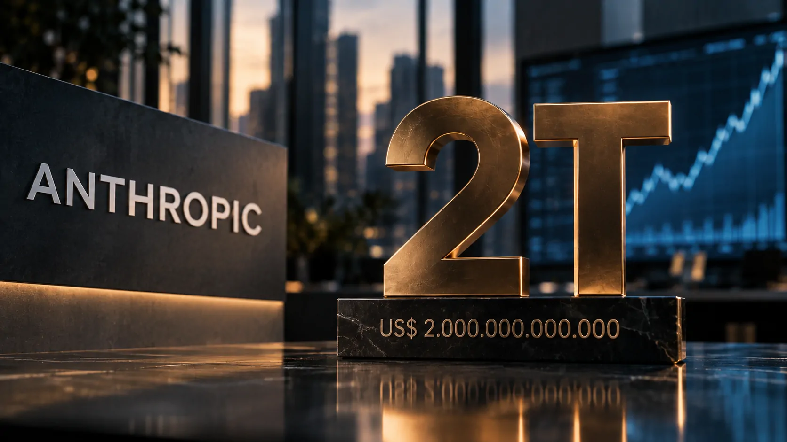

*O possível IPO da Anthropic ganhou novo peso no mercado de tecnologia. A empresa responsável pelo Claude agora é esperada para avançar com a oferta em outubro, enquanto investidores trabalham com uma avaliação que pode chegar a US$ 2 trilhões. Mais do que uma operação financeira, o movimento pode se tornar um dos maiores testes públicos para o valor econômico atribuído às empresas de inteligência artificial.*

## Anthropic desloca o cronograma do possível IPO

A **Anthropic** adiou o avanço de seu possível IPO para outubro, segundo informações mais recentes sobre o processo. A expectativa agora é que a empresa comece a apresentar a oferta aos investidores em meados do mês, depois de um cronograma que anteriormente apontava para uma etapa pública do processo ainda em setembro.

A mudança não significa que a abertura de capital foi cancelada. O movimento mostra, porém, que o calendário ainda está sujeito às etapas de preparação da operação e às condições encontradas pela companhia antes de colocar suas ações no mercado.

Para uma empresa de inteligência artificial, essa preparação tem peso adicional. O IPO colocará diante dos investidores públicos uma companhia cujo crescimento está diretamente ligado à expansão da demanda por modelos de IA, infraestrutura computacional e aplicações empresariais.

### O que mudou no calendário

A expectativa anterior era de que o prospecto da oferta avançasse no início de setembro. O novo cronograma desloca essa etapa para o fim do mês, com o marketing da operação podendo começar em outubro.

Esse intervalo é relevante porque o mercado terá mais tempo para avaliar os números apresentados pela empresa e comparar a expectativa de crescimento da **Anthropic** com o ritmo observado nos negócios de IA.

### Por que outubro ganhou importância

Uma oferta em outubro colocaria a Anthropic diante de investidores em um momento particularmente importante para o setor. O mercado já acompanha movimentos de outras empresas de inteligência artificial que também podem buscar acesso ao mercado público.

O resultado será observado não apenas pelo tamanho da operação, mas pela disposição dos investidores de atribuir valores muito elevados a empresas cuja principal vantagem competitiva está em modelos de IA e produtos construídos sobre eles.

## Os US$ 2 trilhões ainda são uma expectativa de investidores

*As projeções de investidores colocam a possível avaliação da Anthropic em até US$ 2 trilhões, mas o valor ainda não foi formalmente definido pela empresa.*

O número de **US$ 2 trilhões** é o elemento mais chamativo da operação, mas precisa ser interpretado com cuidado. A cifra não representa uma avaliação oficial já estabelecida pela **Anthropic**. Ela está associada a projeções feitas por investidores com base nas perspectivas de crescimento da companhia.

Essa distinção é importante porque uma avaliação de mercado não é determinada apenas pela receita atual. Investidores também consideram crescimento futuro, margens, custos de computação, posição competitiva e capacidade de transformar expansão de uso em geração de caixa.

A referência privada mais recente da empresa já havia alcançado aproximadamente **US$ 965 bilhões**, após uma rodada de financiamento de US$ 65 bilhões. Uma eventual avaliação de US$ 2 trilhões representaria, portanto, uma mudança significativa em relação ao valor privado atribuído à companhia poucos meses antes.

### O crescimento que sustenta a expectativa

Parte do otimismo está ligada ao ritmo de expansão da receita da **Anthropic**. Dados recentes indicam que a empresa alcançou uma taxa anualizada de receita de aproximadamente **US$ 65 bilhões em julho**, embora esse ritmo tenha ficado abaixo de projeções mais agressivas feitas anteriormente por alguns investidores.

O mercado está tentando determinar quanto desse crescimento pode ser mantido quando a empresa estiver sujeita às exigências de transparência e previsibilidade de uma companhia aberta.

### O mercado terá de separar crescimento de expectativa

O ponto central será descobrir quanto da avaliação representa desempenho já comprovado e quanto representa crescimento futuro.

Uma empresa pode apresentar expansão extraordinária e, ainda assim, enfrentar dificuldades para transformar receita em lucro quando os custos de treinamento e operação dos modelos permanecem elevados. Por isso, o possível IPO será também um teste da qualidade econômica do crescimento da IA.

## Claude transforma a Anthropic em uma empresa de negócios, não apenas de modelos

O tamanho potencial da oferta está relacionado à transformação da **Anthropic** em uma companhia com produtos utilizados diretamente por empresas e profissionais.

O **Claude** deixou de ser apenas um chatbot concorrente de outras ferramentas de IA e passou a ocupar espaço em aplicações corporativas, programação, análise e automação. Esse movimento amplia a importância comercial da plataforma e ajuda a explicar por que investidores estão avaliando a empresa com base em uma trajetória de receita muito mais agressiva.

O próprio ecossistema de produtos ajuda a entender essa mudança. O avanço do **Claude Code**, por exemplo, aproxima a Anthropic de uma categoria em que inteligência artificial passa a executar tarefas diretamente relacionadas ao desenvolvimento de software.

### A expansão empresarial aumenta o potencial de receita

O mercado corporativo é especialmente importante porque contratos empresariais podem gerar receitas recorrentes e ampliar a utilização dos modelos dentro das organizações.

Esse movimento também aumenta a relevância estratégica da Anthropic em setores nos quais empresas procuram incorporar IA aos seus fluxos de trabalho, em vez de utilizá-la apenas como ferramenta individual.

O crescimento da companhia precisa, portanto, ser analisado também pela capacidade de transformar o Claude em infraestrutura de trabalho para empresas.

### Claude Code amplia o alcance da estratégia

O **Claude Code** representa uma camada adicional dessa estratégia porque leva os modelos diretamente para processos de desenvolvimento de software.

Para entender melhor essa expansão do ecossistema, o Notícia Tech já analisou **[como o Claude Code está mudando o desenvolvimento de software com IA](/ferramentas/o-que-e-claude-code-desenvolvimento-software-ia/)**.

A lógica é relevante para o IPO: quanto mais produtos da Anthropic forem incorporados a processos empresariais, maior pode ser a capacidade da companhia de sustentar crescimento além do uso tradicional de chatbots.

## O IPO pode mudar a forma como o mercado precifica empresas de IA

*Uma eventual listagem da Anthropic pode criar uma nova referência para a avaliação pública de empresas de inteligência artificial.*

Se a **Anthropic** conseguir chegar ao mercado próximo de uma avaliação de US$ 2 trilhões, o impacto ultrapassará a própria empresa. A operação estabeleceria uma referência para investidores que precisam decidir quanto vale uma companhia de IA com crescimento acelerado, enormes custos computacionais e forte dependência de infraestrutura.

O movimento também criaria um parâmetro para comparar empresas privadas e abertas do setor. Até agora, grande parte dessas avaliações ocorre em rodadas privadas, nas quais poucos investidores determinam o preço das ações.

No mercado público, a avaliação passa a ser atualizada continuamente pelas expectativas dos investidores. Isso pode produzir uma visão muito mais clara sobre quanto o mercado está disposto a pagar pelo crescimento da inteligência artificial.

### O precedente para outras empresas

Uma operação dessa escala pode aumentar a pressão para que outras empresas de IA demonstrem resultados financeiros capazes de justificar avaliações elevadas.

O caso também será observado por companhias que ainda permanecem privadas. Se a Anthropic conseguir sustentar uma avaliação próxima dos US$ 2 trilhões, outras empresas poderão encontrar um ambiente mais favorável para buscar capital público.

O inverso também é possível. Uma demanda fraca ou uma avaliação muito abaixo das expectativas mostraria que o mercado público está mais cauteloso do que os investidores privados.

### A disputa pela liderança ganha uma nova dimensão

A competição entre **Anthropic**, **OpenAI**, Google e outras empresas de IA normalmente é observada pelo desempenho dos modelos. Um IPO adiciona outra dimensão: a capacidade de transformar liderança tecnológica em valor financeiro sustentável.

Isso torna a possível oferta particularmente relevante para o setor. O mercado não estará avaliando apenas qual empresa possui bons modelos, mas qual delas consegue construir um negócio grande, recorrente e economicamente viável em torno da inteligência artificial.

## A infraestrutura financeira também mostra o tamanho da operação

A preparação da oferta inclui movimentos financeiros que ajudam a dimensionar a escala da operação. A **Anthropic** está finalizando uma linha de crédito rotativo de aproximadamente **US$ 15 bilhões**, com participação de grandes bancos internacionais.

Esse tipo de estrutura não determina o valor do IPO, mas mostra que a empresa está construindo uma infraestrutura financeira compatível com uma companhia que pretende operar em uma escala muito maior.

Para empresas de IA, capital é especialmente estratégico porque crescimento exige acesso contínuo a capacidade computacional. Modelos avançados precisam de chips, data centers, energia e infraestrutura para treinamento e inferência.

### Capital passa a ser uma vantagem competitiva

O acesso a capital pode determinar a velocidade com que uma empresa consegue ampliar capacidade computacional e lançar novos produtos.

Nesse contexto, uma eventual abertura de capital pode oferecer à **Anthropic** uma nova fonte de recursos e, ao mesmo tempo, aumentar a exposição da empresa às expectativas do mercado financeiro.

O desafio será equilibrar crescimento e disciplina financeira. Quanto maior a escala dos modelos, maior pode ser a necessidade de investimento para mantê-los competitivos.

### A competição pelo mercado corporativo continua

A expansão da Anthropic acontece em um mercado no qual empresas estão cada vez mais incorporando agentes e modelos de IA a processos internos.

O Notícia Tech já mostrou como **[a disputa entre OpenAI e Anthropic por padrões de agentes de IA pode afetar a automação empresarial](/inteligencia-artificial/agentic-ai-foundation-openai-anthropic-block-padrao-agentes-ia/)**.

Esse contexto ajuda a explicar por que investidores não estão olhando apenas para o chatbot Claude. O valor potencial da Anthropic está ligado à possibilidade de se tornar uma camada importante da infraestrutura de software utilizada por empresas.

## O verdadeiro teste começa quando a Anthropic chegar ao mercado

*O possível IPO transformará as expectativas privadas sobre a Anthropic em uma avaliação submetida diariamente ao mercado.*

A cifra de **US$ 2 trilhões** chama atenção, mas o indicador mais importante será a capacidade da Anthropic de justificar essa avaliação depois que suas ações estiverem expostas ao mercado.

A empresa precisará demonstrar que o crescimento do Claude pode continuar, que os produtos empresariais conseguem gerar receitas recorrentes e que os custos associados à infraestrutura de IA podem ser administrados conforme a escala aumenta.

O mercado também terá de decidir quanto do crescimento atual representa uma vantagem estrutural e quanto depende de um ciclo excepcional de investimento em inteligência artificial.

### O que acompanhar até outubro

Os próximos passos mais importantes serão o avanço do prospecto, os números financeiros apresentados pela companhia, a demanda dos investidores e a faixa de avaliação que começar a ser discutida oficialmente.

Também será importante observar se o crescimento da receita continua acelerando ou começa a desacelerar à medida que a base da Anthropic fica maior.

### A avaliação será o primeiro grande julgamento público

Se a operação avançar, a **Anthropic** passará de uma empresa avaliada principalmente por investidores privados para uma companhia submetida diariamente ao julgamento do mercado.

Esse pode ser o aspecto mais importante da notícia. O IPO não servirá apenas para levantar capital. Ele poderá estabelecer um novo parâmetro para responder quanto o mercado financeiro acredita que uma empresa de inteligência artificial pode valer.

Até outubro, portanto, a principal questão não será simplesmente se a Anthropic conseguirá chegar a US$ 2 trilhões. Será se o mercado aceitará pagar por essa expectativa e, principalmente, quais resultados a empresa precisará entregar para sustentá-la.

---