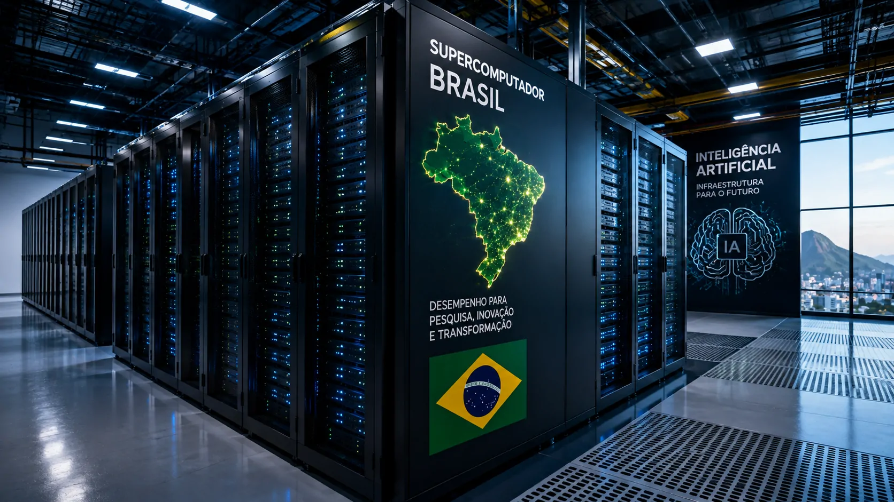
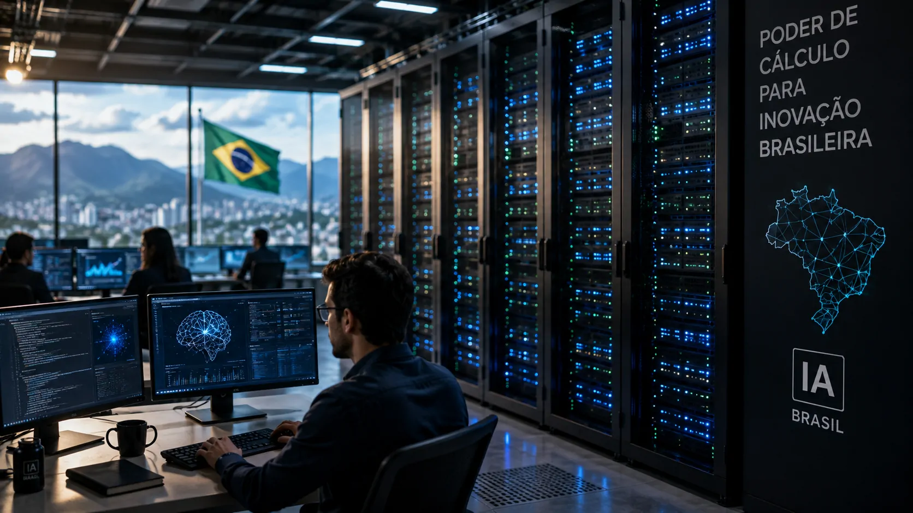
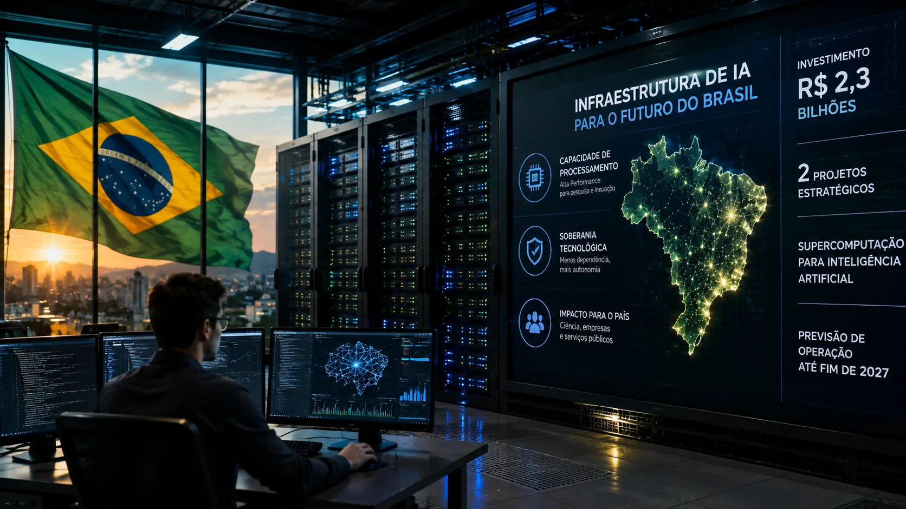

*O Brasil está tratando capacidade de computação para inteligência artificial como uma questão de infraestrutura estratégica. O investimento de R$ 2,3 bilhões em dois projetos de supercomputação coloca o país diante de uma escolha que vai além da compra de máquinas: construir capacidade própria sem ficar preso a uma única rota tecnológica.*

## Brasil transforma capacidade de computação em prioridade para IA

O Brasil anunciou aproximadamente **R$ 2,3 bilhões** para ampliar sua infraestrutura de **inteligência artificial**, dividindo os recursos entre dois projetos de supercomputação. A estratégia envolve fornecedores dos Estados Unidos e da China e tem como objetivo ampliar a capacidade brasileira de desenvolver tecnologia de IA.

Mais da metade do investimento, cerca de **R$ 1,3 bilhão**, será destinada a uma infraestrutura de supercomputação no Rio de Janeiro em parceria com a **Huawei** e a **iFlytek**. O projeto deverá apoiar o desenvolvimento de modelos de linguagem e aplicações de IA de uso geral e setorial.

Outros **R$ 1 bilhão** serão destinados a um supercomputador no Rio Grande do Norte, com expectativa de ficar entre os dez sistemas de maior capacidade de processamento para IA do mundo. A tecnologia deverá utilizar equipamentos da **NVIDIA**.

A escolha por duas rotas é o aspecto mais estratégico do anúncio. Em vez de concentrar toda a infraestrutura em um único fornecedor, o Brasil tenta ampliar sua capacidade computacional enquanto reduz o risco de dependência tecnológica.

## Dois supercomputadores atendem a estratégias diferentes

Os dois projetos não representam simplesmente a duplicação da mesma infraestrutura. Eles fazem parte de uma estratégia mais ampla para aumentar a capacidade brasileira de processamento e, ao mesmo tempo, diversificar as fontes de tecnologia.

*Os novos projetos devem ampliar a capacidade de processamento disponível para pesquisa e desenvolvimento de inteligência artificial no Brasil.*

### A rota associada à tecnologia NVIDIA

O projeto previsto para o **Rio Grande do Norte** deverá receber R$ 1 bilhão e utilizar tecnologia da **NVIDIA**, uma das principais fornecedoras mundiais de aceleradores utilizados em inteligência artificial.

A capacidade computacional é importante porque modelos avançados de IA exigem grandes volumes de processamento tanto durante o treinamento quanto na execução de aplicações. Quanto maior a escala dos modelos e das cargas de trabalho, maior tende a ser a demanda por infraestrutura especializada.

### A parceria com Huawei e iFlytek

No **Rio de Janeiro**, o projeto de aproximadamente R$ 1,3 bilhão será desenvolvido em parceria com a **Huawei** e a **iFlytek**, empresas chinesas com atuação em infraestrutura e inteligência artificial.

A proposta amplia a possibilidade de desenvolver modelos e aplicações voltados ao contexto brasileiro, ao mesmo tempo em que cria uma segunda rota tecnológica para o país.

Essa diversificação ganha importância em um mercado no qual restrições comerciais e disputas geopolíticas podem afetar o acesso a chips, equipamentos e tecnologias avançadas.

## Por que a dependência tecnológica virou um problema estratégico

A decisão brasileira ocorre em um momento em que **computação, chips, energia e data centers** passaram a ser partes centrais da competição por inteligência artificial.

A infraestrutura não é apenas o local onde um modelo é executado. Ela determina quanto processamento pode ser disponibilizado, quais pesquisas podem ser realizadas e quais empresas conseguem experimentar aplicações de maior escala.

Esse movimento também aparece fora do Brasil. A expansão de infraestrutura para IA está criando uma disputa por energia, terrenos, data centers, redes e aceleradores especializados. O crescimento dessa camada física da IA já é um dos principais desafios para empresas e governos.

A dimensão desse movimento pode ser observada na estratégia da **Mistral AI**, que vem ampliando sua infraestrutura computacional na Europa para sustentar o crescimento de seus modelos e serviços. O tema é aprofundado no artigo **[Mistral AI planeja infraestrutura de IA de 1 GW na Europa até 2030](https://noticiatech.com.br/inteligencia-artificial/mistral-ai-infraestrutura-ia-europa-1-gw-2030/)**.

Esse movimento mostra como a competição deixou de estar concentrada apenas na qualidade dos modelos e passou a envolver também quem controla a capacidade necessária para executá-los.

## O que muda para empresas e pesquisadores brasileiros

A principal mudança potencial é a ampliação da capacidade nacional de acesso a computação de alto desempenho para **inteligência artificial**.

*O acesso a maior capacidade computacional pode reduzir algumas barreiras para projetos brasileiros de pesquisa e desenvolvimento em inteligência artificial.*

### Empresas podem ganhar uma nova camada de infraestrutura

Empresas que desenvolvem modelos, aplicações ou soluções especializadas de IA dependem de capacidade computacional para treinamento, testes e execução.

Uma infraestrutura nacional de maior escala pode abrir espaço para projetos que hoje dependem de provedores estrangeiros ou precisam competir por recursos limitados de computação.

Isso não significa que empresas brasileiras deixarão de utilizar nuvens internacionais. O efeito mais provável é a ampliação das alternativas disponíveis para determinados projetos de pesquisa, desenvolvimento e processamento.

### Universidades também entram na estratégia

A infraestrutura pode ter impacto relevante sobre universidades e centros de pesquisa, especialmente em projetos que exigem processamento de grande escala.

O ganho estratégico está menos na existência de uma máquina isolada e mais na possibilidade de criar um ecossistema capaz de transformar capacidade computacional em conhecimento, modelos, software e aplicações.

É esse ponto que pode determinar o retorno tecnológico do investimento. Comprar capacidade de processamento não garante, por si só, a criação de uma indústria nacional competitiva de IA.

## A infraestrutura pode reduzir dependência, mas não elimina riscos

A diversificação entre **NVIDIA**, **Huawei** e **iFlytek** reduz a concentração em uma única rota tecnológica, mas não significa independência completa.

O desenvolvimento de infraestrutura de IA depende de uma cadeia internacional que inclui chips, memória, redes, sistemas de resfriamento, energia, software e equipamentos especializados.

*Diversificar fornecedores pode reduzir determinados riscos, mas a infraestrutura de inteligência artificial continua integrada a uma cadeia tecnológica global.*

A própria escolha brasileira mostra essa contradição. O país busca maior autonomia, mas continua precisando recorrer a empresas estrangeiras para obter tecnologias avançadas de computação.

A expansão dessa infraestrutura também aumenta a pressão sobre o consumo de energia. Empresas de tecnologia já estão buscando novas formas de garantir eletricidade para data centers voltados à IA, como mostra o caso da **Amazon**, que anunciou uma usina de **765 MW** associada à expansão de sua infraestrutura de inteligência artificial. O contexto ajuda a entender por que energia se tornou parte da estratégia de expansão da computação de IA e pode ser aprofundado em **[Amazon planeja usina de 765 MW para alimentar data centers de IA](https://noticiatech.com.br/inteligencia-artificial/amazon-usina-765-gw-alimentar-ia-data-centers/)**.

Por isso, o componente mais importante do projeto brasileiro pode estar na **transferência de conhecimento e tecnologia**, e não apenas na capacidade bruta dos supercomputadores.

Se a infraestrutura gerar formação de profissionais, desenvolvimento de software, pesquisa aplicada e novos negócios, o investimento poderá criar capacidades que permaneçam no país depois da implantação das máquinas.

## O verdadeiro teste será transformar computação em capacidade tecnológica

O investimento de **R$ 2,3 bilhões** coloca o Brasil em uma posição mais ambiciosa na corrida pela infraestrutura de inteligência artificial, mas ainda não permite concluir que o país terá autonomia tecnológica.

A previsão é que os projetos estejam operacionais até o final de **2027**. Até lá, contratação, implantação, disponibilidade de energia, integração dos sistemas e definição das regras de acesso serão fatores decisivos para medir o resultado da estratégia.

O ponto central para empresas e pesquisadores será descobrir se a nova capacidade computacional estará efetivamente disponível para desenvolver produtos, modelos e pesquisas nacionais.

O Brasil já possui iniciativas de infraestrutura e pesquisa em IA. O novo investimento muda a escala da ambição. A questão agora é se essa capacidade será convertida em **propriedade intelectual, empresas, modelos, profissionais especializados e aplicações competitivas**.

A escolha simultânea por tecnologias americanas e chinesas também revela uma estratégia de equilíbrio. Em vez de apostar em uma única potência, o país tenta construir espaço próprio em uma infraestrutura que se tornou essencial para a economia da IA.

Nos próximos anos, portanto, o indicador mais importante não será apenas a potência dos supercomputadores, mas o que o Brasil conseguirá construir sobre eles.

---