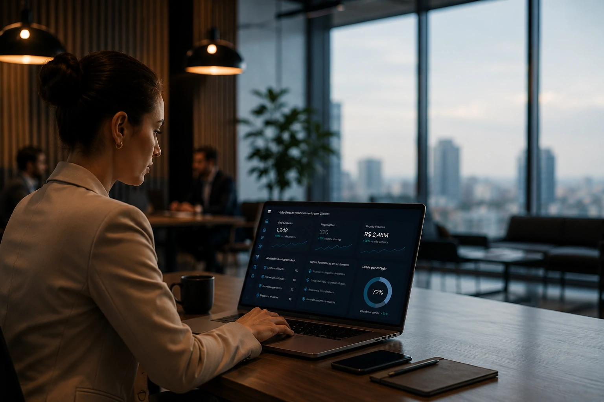
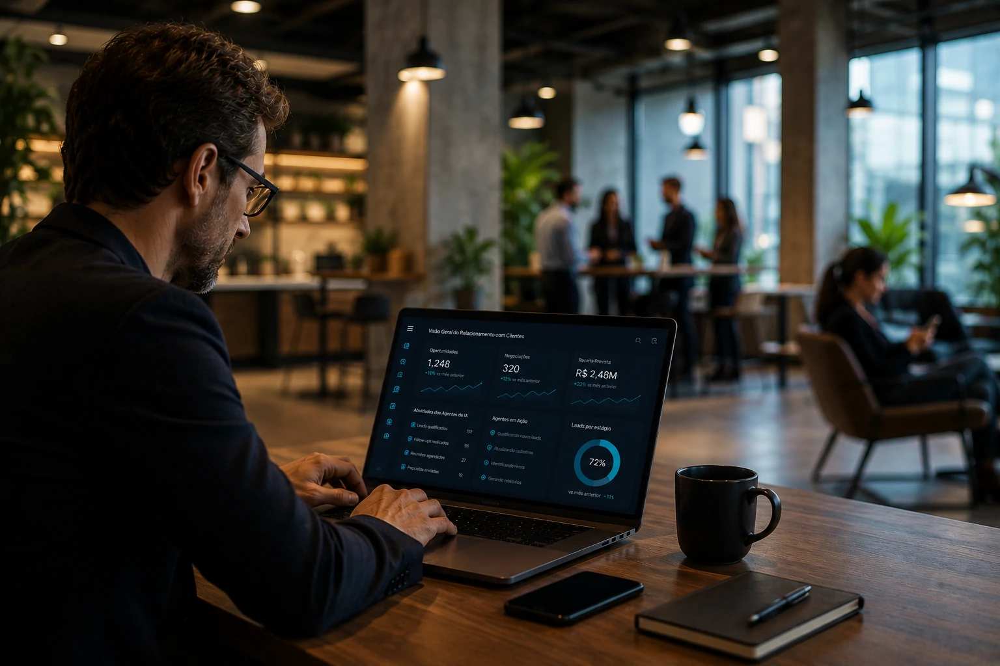

*Durante anos, os CRMs funcionaram principalmente como repositórios de dados. Em 2026, essa lógica começou a mudar. A chegada dos agentes de IA está transformando essas plataformas em sistemas capazes de analisar, decidir e executar tarefas comerciais de forma autônoma. O movimento pode redefinir a forma como empresas geram receita, atendem clientes e administram relacionamentos em escala.*

## O CRM deixou de registrar informações para começar a agir

*Os novos CRMs utilizam inteligência artificial para transformar dados em ações operacionais.*

A evolução da **Inteligência Artificial** corporativa está deslocando o papel tradicional do CRM. O que antes era uma ferramenta focada em armazenamento de contatos e histórico de negociações agora passa a executar tarefas de forma proativa.

Empresas do setor vêm incorporando agentes capazes de monitorar oportunidades, identificar riscos de cancelamento, sugerir abordagens comerciais e até iniciar ações automaticamente.

O movimento ganhou força após grandes fornecedores ampliarem seus investimentos em plataformas agentic AI integradas ao ambiente de relacionamento com clientes.

### O modelo tradicional começa a mostrar limitações

Em muitas organizações, vendedores ainda gastam horas atualizando registros, organizando pipelines e buscando informações dispersas.

Essas atividades geram baixo valor estratégico e reduzem o tempo disponível para negociações, relacionamento e geração de receita.

Com agentes de IA, parte desse trabalho passa a ocorrer de forma automática.

### A nova geração de CRMs executa tarefas

Os sistemas mais avançados não apenas recomendam ações.

Eles conseguem abrir chamados, atualizar registros, gerar resumos de reuniões, identificar oportunidades e disparar fluxos de comunicação.

Esse avanço aproxima os CRMs da visão apresentada em tendências recentes de agentes corporativos e AI Operations.

Para entender essa transformação, vale conhecer também o conceito de [AI Operations e governança de agentes de IA](https://noticiatech.com.br/inteligencia-artificial/ai-operations-governanca-agentes-ia-empresas/).

## Por que os agentes de IA estão chegando ao CRM

*Agentes inteligentes começam a assumir processos operacionais em vendas e atendimento.*

O crescimento dos agentes corporativos não acontece por acaso.

Empresas buscam ganhos de produtividade em áreas onde processos repetitivos ainda consomem recursos humanos relevantes.

O relacionamento com clientes está entre os ambientes mais ricos em dados e mais adequados para automação inteligente.

### O volume de dados tornou-se impossível de acompanhar manualmente

Equipes comerciais lidam diariamente com milhares de interações.

E-mails, mensagens, reuniões, propostas e tickets geram um volume de informação que dificilmente pode ser analisado manualmente.

Os agentes de IA surgem como uma camada operacional capaz de processar esse contexto em tempo real.

### O mercado está migrando para plataformas agentic

Analistas de mercado observam uma transição acelerada dos modelos baseados apenas em assistentes para arquiteturas orientadas por agentes.

Nesse cenário, a IA deixa de responder perguntas e passa a executar fluxos completos de trabalho.

Esse movimento é semelhante ao avanço observado em tecnologias como **MCP** e sistemas multiagentes.

Quem ainda não conhece essa infraestrutura pode aprofundar o tema em [Como funciona o MCP e por que ele se tornou importante para agentes de IA](https://noticiatech.com.br/inteligencia-artificial/como-funciona-mcp-guia-completo-agentes-ia/).

## O impacto para pequenas e médias empresas

*Pequenas empresas podem ganhar eficiência sem ampliar equipes comerciais.*

Embora grandes empresas liderem a adoção inicial, pequenas e médias organizações podem ser algumas das maiores beneficiadas.

Isso acontece porque equipes menores normalmente possuem menos recursos para executar processos operacionais.

### Mais produtividade sem ampliar o quadro de funcionários

Um agente de IA pode monitorar leads, qualificar oportunidades, gerar relatórios e organizar informações automaticamente.

Na prática, isso permite que pequenas equipes operem com maior eficiência.

O ganho potencial não está apenas em reduzir custos, mas em aumentar capacidade operacional.

### Atendimento e vendas passam a funcionar de forma integrada

Historicamente, vendas e atendimento operavam em sistemas separados.

A nova geração de CRMs tende a unificar essas informações.

O resultado é uma visão mais completa do cliente durante toda a jornada.

Essa convergência também se conecta à tendência de empresas adotarem estruturas AI First para suas operações.

## O que muda para gestores nos próximos anos

A principal mudança não será tecnológica.

Será gerencial.

À medida que agentes passam a executar tarefas comerciais, gestores deixam de supervisionar apenas pessoas e passam a coordenar ecossistemas compostos por profissionais e sistemas autônomos.

### Surgem novas métricas de desempenho

Indicadores tradicionais continuarão importantes.

Mas métricas relacionadas à eficiência dos agentes, qualidade dos dados e governança ganharão relevância crescente.

A gestão comercial tende a se tornar cada vez mais orientada por inteligência operacional.

### O CRM pode se tornar o centro dos agentes corporativos

Se a tendência atual continuar, o CRM deixará de ser apenas uma ferramenta de relacionamento.

Ele poderá se tornar a principal camada operacional dos agentes empresariais.

Nesse cenário, empresas não competirão apenas pela qualidade dos seus vendedores.

Competirão pela capacidade de combinar pessoas, dados e agentes inteligentes dentro de uma única estrutura operacional.

A corrida pela adoção de **CRM com IA** está apenas começando. O que está em jogo não é apenas automação de processos comerciais. É a construção de uma nova infraestrutura de relacionamento capaz de transformar dados em ações, decisões e resultados em tempo real.

---