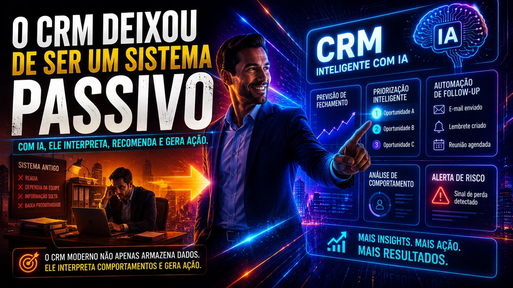
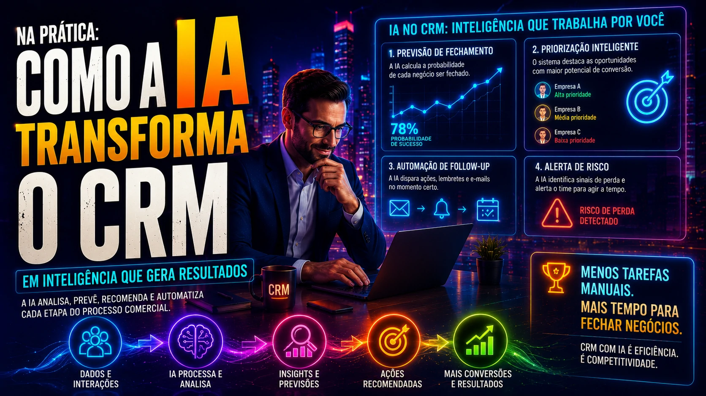

*Durante anos, o **CRM (Customer Relationship Management)** foi tratado apenas como ferramenta de organização comercial. Guardar contatos, registrar negociações e acompanhar funis. Mas isso mudou. Com a entrada da **inteligência artificial**, plataformas como **HubSpot**, **Salesforce** e **Pipedrive** começaram a operar como verdadeiros motores de decisão comercial. E isso está mudando profundamente a forma como empresas vendem.*

## O CRM deixou de ser um sistema passivo

*O CRM moderno não apenas armazena dados. Ele interpreta comportamento e gera ação.*

Antes, o CRM dependia totalmente da equipe.

O vendedor alimentava.

O gestor analisava.

O comercial executava.

Era um sistema reativo.

Agora não.

Com **IA integrada**, o CRM identifica padrões, alerta riscos, recomenda ações e prioriza oportunidades.

Na prática, ele deixa de ser um “arquivo comercial” e vira um sistema ativo.

Isso muda velocidade.

Muda previsibilidade.

Muda conversão.

Esse movimento acompanha a transformação maior do mercado:

Leia também:  
**Como empresas estão usando IA para gerar leads qualificados sem depender de SDR**  
https://noticiatech.com.br/negocios/ia-prospeccao-b2b-geracao-leads-qualificados/ :contentReference[oaicite:0]{index=0}

## Como a IA está mudando o CRM na prática

*A IA transforma dados comerciais em decisões mais rápidas e inteligentes.*

A grande mudança não está apenas na automação.

Está na inteligência aplicada.

Hoje os principais sistemas trabalham com quatro camadas:

### Previsão de fechamento

A IA analisa histórico de negociações.

Ela cruza:

- tempo médio de fechamento  
- perfil do cliente  
- comportamento do lead  
- taxa de resposta  
- engajamento comercial  

Com isso, o sistema calcula probabilidade real de conversão.

Isso melhora previsibilidade.

E ajuda gestores a tomarem decisões melhores.

### Priorização automática de oportunidades

Nem toda oportunidade tem o mesmo peso.

A IA entende isso.

Ela reorganiza o pipeline automaticamente.

Mostrando primeiro:

- leads mais quentes  
- contas com maior intenção  
- clientes com maior chance de compra  

Isso melhora produtividade.

E reduz desperdício de energia.

### Automação de follow-up

Um dos maiores gargalos comerciais é consistência.

Muitos negócios morrem por falta de acompanhamento.

A IA resolve isso.

Ela dispara:

- e-mails automáticos  
- lembretes  
- notificações  
- cadências de follow-up  

Sem depender da memória do vendedor.

### Identificação de risco de perda

Alguns CRMs modernos detectam sinais de perda.

Exemplo:

- demora excessiva  
- queda no engajamento  
- mudança de comportamento  
- baixa interação  

Isso permite reação rápida.

E recuperação de oportunidades.

## O impacto real nas equipes comerciais

*Com tarefas repetitivas automatizadas, vendedores focam no que gera receita.*

O vendedor moderno está mudando.

Antes gastava energia com:

- atualizar CRM  
- organizar pipeline  
- criar lembretes  
- revisar contatos  
- analisar histórico  

Agora isso pode ser automatizado.

O impacto é direto:

mais tempo em negociação.

Mais foco em relacionamento.

Mais fechamento.

Esse padrão segue a mesma lógica da transformação operacional que outras áreas estão vivendo.

Leia também:  
**Como empresas usam IA para automatizar processos**  
https://noticiatech.com.br/automacao/como-empresas-usam-ia-para-automatizar-processos/ :contentReference[oaicite:1]{index=1}

## O CRM com IA melhora a qualidade da decisão

Vender não é apenas executar.

É decidir.

Quem atacar.

Quando atacar.

Como atacar.

A IA ajuda nisso.

Ela transforma dados em inteligência.

E isso reduz erro humano.

Empresas que usam **CRM inteligente** conseguem responder perguntas como:

- qual lead tem maior chance de fechar?  
- qual vendedor converte melhor?  
- onde o funil está travando?  
- quais contas precisam de atenção imediata?  

Esse tipo de clareza acelera crescimento.

## CRM com IA e WhatsApp estão se tornando inseparáveis

O comercial moderno já não opera isolado.

Hoje o **WhatsApp Business** virou parte central do funil.

Quando integrado ao CRM com IA, o sistema consegue:

- registrar conversas automaticamente  
- identificar intenção  
- nutrir relacionamento  
- automatizar atendimento  
- agendar reuniões  

Esse movimento está acelerando no Brasil.

Leia também:  
**WhatsApp Business ganha automações com IA e vira ferramenta central para pequenas empresas**  
https://noticiatech.com.br/negocios/whatsapp-business-ganha-automacoes-com-ia-e-vira-ferramenta-central-para-pequenas-empresas-no-brasil/ :contentReference[oaicite:2]{index=2}

## O que muda daqui para frente

O CRM tradicional vai sobreviver.

Mas o CRM sem IA vai perder valor.

O mercado está ficando rápido demais.

Volume demais.

Complexidade demais.

Empresas precisam de sistemas que não apenas armazenem informação.

Precisam de sistemas que pensem.

Que priorizem.

Que recomendem.

Que alertem.

No novo cenário comercial, vender melhor não depende só de talento.

Depende de inteligência operacional.

E cada vez mais, essa inteligência será artificial.