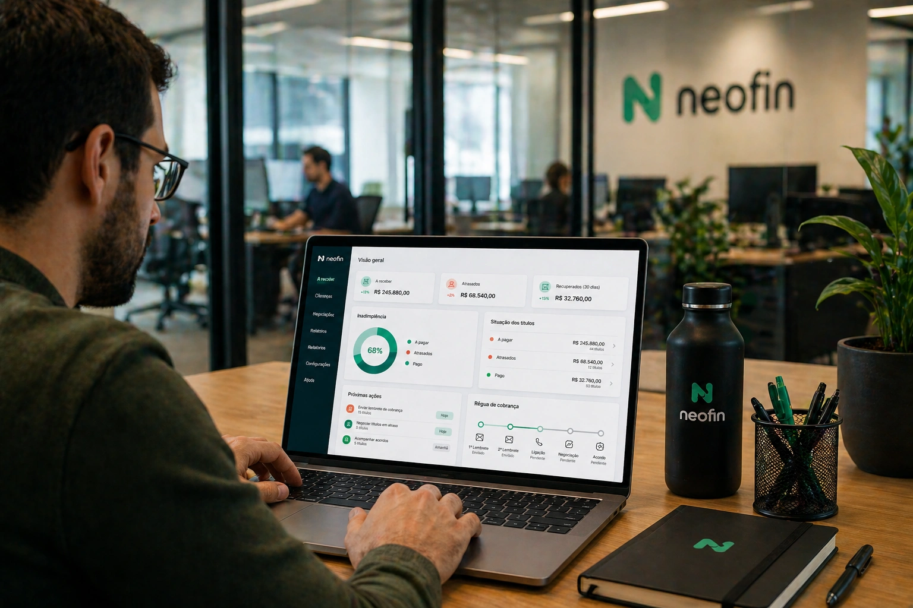

Dinheiro parado é um problema que muitas empresas só percebem quando o caixa aperta.

A venda acontece, o serviço é entregue, a nota é emitida… mas o pagamento atrasa.

E quando os atrasos se acumulam, o impacto vai além do financeiro: afeta planejamento, operação e crescimento.

É por isso que empresas estão começando a usar **inteligência artificial** para transformar um processo antigo e desgastante em algo mais eficiente.

Plataformas como a Neofin estão ajudando negócios a automatizar cobranças, acelerar negociações e recuperar receita sem precisar ampliar equipe.

## A cobrança manual virou um gargalo financeiro

Em muitas empresas, a cobrança ainda funciona de forma improvisada.

Planilhas, mensagens manuais, lembretes isolados e acompanhamento sem padrão.

O problema é que esse modelo gera falhas.

Clientes esquecem.

A equipe esquece.

Os prazos passam.

E a inadimplência cresce.

Além disso, cobrar manualmente exige tempo de pessoas que poderiam estar focadas em áreas mais estratégicas.

Esse mesmo movimento de substituição de tarefas operacionais por automação já vem acontecendo em outros setores, como mostramos no artigo sobre [como empresas estão usando IA para reduzir custos operacionais sem aumentar equipes](https://noticiatech.com.br/como-empresas-estao-usando-ia-para-reduzir-custos-operacionais-sem-aumentar-equipes/).

## Como a IA está mudando a lógica da cobrança

A diferença não está apenas em automatizar.

Está em automatizar com inteligência.

A **IA aplicada à cobrança** consegue analisar comportamento de pagamento e definir estratégias melhores para recuperação financeira.

Ela identifica padrões como:

### Histórico de atrasos

Clientes com maior tendência de atraso.

### Canal com maior resposta

WhatsApp, e-mail ou SMS.

### Melhor momento para contato

Horários com mais chances de retorno.

### Melhor abordagem

Cobrança amigável, reforço ou renegociação.

Isso aumenta eficiência e reduz atrito.

## Como a Neofin funciona na prática

A Neofin é uma plataforma especializada em automação de cobrança e recuperação de receita.

Na prática, o fluxo funciona assim:

### Cadastro dos recebíveis

A empresa organiza os pagamentos pendentes.

### Criação de régua de cobrança

Define quando e como os contatos serão feitos.

### IA acompanha comportamento

O sistema aprende com respostas e pagamentos.

### Comunicação automática

Mensagens são enviadas sem ação manual.

### Negociação digital

O cliente pode negociar sem depender de um atendente.

Isso reduz tempo operacional e acelera recuperação.

É um modelo parecido com a evolução do atendimento automatizado via [WhatsApp Business com IA para pequenas empresas](https://noticiatech.com.br/whatsapp-business-ganha-automacoes-com-ia-e-se-torna-peca-central-para-pequenas-empresas-no-brasil/), mas aplicado ao financeiro.

## Por que empresas estão adotando isso agora

A pressão por eficiência financeira aumentou.

Custos operacionais subiram.

Margens ficaram menores.

E o caixa passou a ser ainda mais importante.

Nesse cenário, a cobrança automatizada resolve três problemas ao mesmo tempo.

### Reduz custo operacional

Menos tempo da equipe em cobranças repetitivas.

### Acelera entrada de caixa

Menos atraso nos pagamentos.

### Organiza previsibilidade financeira

Mais clareza sobre receita futura.

Empresas estão entendendo algo importante:

**cobrança não é apenas recuperar dinheiro.**

É proteger o crescimento.

## Exemplo prático de uso

Imagine uma empresa com:

- 250 clientes ativos  
- 60 pagamentos atrasados  
- dezenas de cobranças mensais  

No modelo manual:

um colaborador precisa lembrar, cobrar, negociar e registrar.

No modelo automatizado com Neofin:

- lembrete automático  
- follow-up inteligente  
- negociação estruturada  
- histórico completo  

O resultado tende a ser simples:

menos inadimplência.

mais eficiência.

mais caixa disponível.

## Cobrança automatizada melhora até o relacionamento com clientes

Muitas empresas evitam cobrar porque associam isso a desgaste.

Mas a automação muda isso.

A comunicação fica:

- padronizada  
- profissional  
- previsível  
- organizada  

Isso reduz constrangimento e melhora o processo.

É parte do mesmo movimento que já está redesenhando processos empresariais, como mostramos no artigo sobre [por que empresas estão redesenhando processos internos com IA em vez de apenas automatizar tarefas](https://noticiatech.com.br/por-que-empresas-estao-redesenhando-processos-internos-com-ia-em-vez-de-apenas-automatizar-tarefas/).

## A próxima grande automação das empresas pode estar no financeiro

Durante anos, empresas automatizaram marketing, vendas e atendimento.

Agora, o financeiro está entrando nesse ciclo.

E a cobrança é uma das áreas com retorno mais rápido.

Porque impacta diretamente:

- fluxo de caixa  
- estabilidade  
- crescimento  
- previsibilidade  

Ferramentas como a Neofin mostram que a **inteligência artificial** não serve apenas para produtividade.

Ela também serve para recuperar receita que já deveria estar no caixa.

E para muitas empresas, isso pode ser um divisor entre crescer com estabilidade ou viver apagando incêndios.