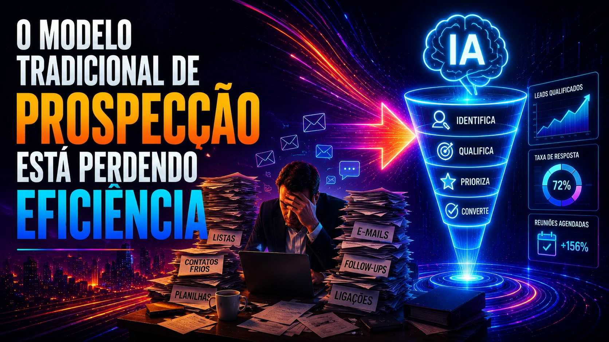
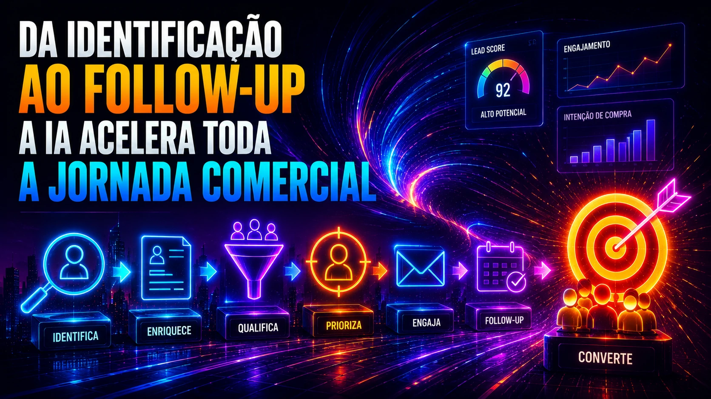

*Por anos, a prospecção B2B foi sustentada por equipes de **SDR (Sales Development Representative)**, processos manuais e listas frias. Agora, isso está mudando rápido. Com o avanço da **inteligência artificial**, empresas estão automatizando etapas críticas da geração de demanda e criando funis comerciais mais eficientes, previsíveis e escaláveis.*

## O modelo tradicional de prospecção está perdendo eficiência

*Empresas estão substituindo processos manuais por sistemas inteligentes de prospecção.*

A lógica antiga era simples:

- montar listas  
- fazer contato manual  
- acompanhar respostas  
- qualificar interesse  

Mas esse modelo tem limitações.

O maior problema é escala.

Quanto maior a operação, maior o custo humano.

E o mercado está mudando rápido.

Empresas que já aplicam **IA comercial** conseguem identificar padrões, prever comportamento e acelerar o funil.

Esse movimento se conecta diretamente com outra mudança importante no mercado:  
a forma como a **inteligência artificial** está redefinindo vendas B2B.

Leia também:  
**Seu cliente já decidiu antes da reunião**  
https://noticiatech.com.br/negocios/seu-cliente-ja-decidiu-antes-da-reuniao-como-a-ia-esta-redefinindo-as-vendas-b2b-no-brasil/

## Como a IA está transformando a geração de leads

*Da identificação ao follow-up: a IA acelera toda a jornada comercial.*

A nova geração de prospecção usa **machine learning**, automação e análise comportamental.

Na prática, funciona assim:

### Enriquecimento automático de leads

A IA cruza dados públicos, sinais digitais e histórico de comportamento.

Isso permite identificar:

- tamanho da empresa  
- segmento  
- maturidade digital  
- intenção de compra  

O lead chega mais completo.

Mais contexto.

Mais precisão.

### Lead scoring inteligente

Nem todo lead vale o mesmo.

Ferramentas como **HubSpot**, **Salesforce** e plataformas de automação usam IA para pontuar oportunidades.

Isso reduz desperdício de tempo.

E aumenta conversão.

### Personalização em escala

A IA consegue adaptar abordagem baseada em perfil.

Isso muda completamente o outbound.

Em vez de mensagens genéricas, empresas criam comunicações específicas para cada perfil.

O resultado é mais resposta.

Mais reuniões.

Mais vendas.

## O impacto operacional nas equipes comerciais

*Com IA, equipes comerciais focam mais em fechar negócios e menos em tarefas repetitivas.*

A grande mudança não é eliminar pessoas.

É reposicionar.

Os times deixam de gastar energia em:

- pesquisa manual  
- qualificação inicial  
- follow-up repetitivo  

E passam a focar no que realmente importa:

**fechamento.**

Empresas que já automatizam processos internos estão percebendo isso.

Inclusive em áreas fora do comercial.

Leia também:  
**Como empresas usam IA para automatizar processos**  
https://noticiatech.com.br/automacao/como-empresas-usam-ia-para-automatizar-processos/

## IA no WhatsApp também virou ferramenta de prospecção

O **WhatsApp Business** virou parte central desse novo modelo.

Com IA integrada, empresas conseguem:

- responder automaticamente  
- qualificar interesse  
- agendar reuniões  
- nutrir leads  

Esse canal virou peça estratégica.

Principalmente no Brasil.

Leia também:  
**WhatsApp Business ganha automações com IA**  
https://noticiatech.com.br/negocios/whatsapp-business-ganha-automacoes-com-ia-e-vira-ferramenta-central-para-pequenas-empresas-no-brasil/

## O que muda nos próximos anos

A tendência é clara.

A prospecção vai se tornar cada vez mais orientada por dados.

Cada interação vai alimentar modelos.

Cada resposta vai melhorar previsões.

Cada lead vai ficar mais inteligente.

Empresas que começarem agora terão vantagem.

Porque no novo mercado, vender mais não depende apenas de equipe.

Depende de sistema.

E cada vez mais, esse sistema será movido por **inteligência artificial**.