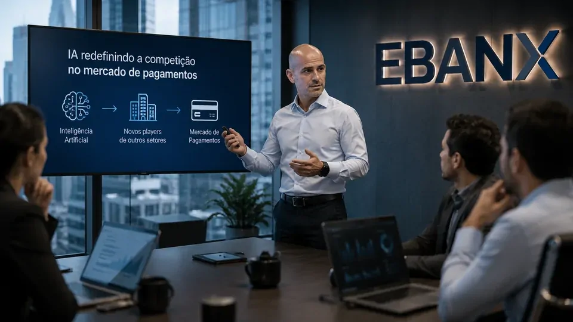
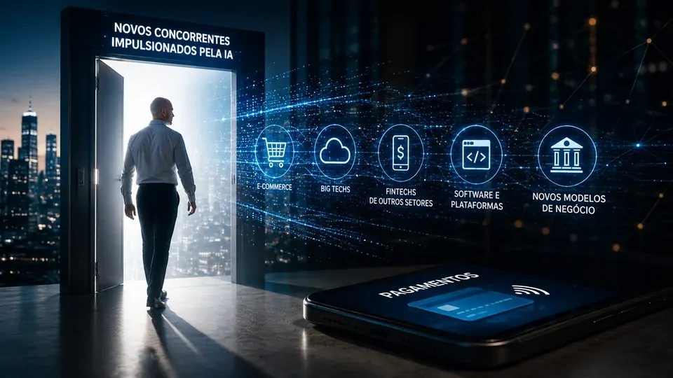

*O alerta do **EBANX** coloca a inteligência artificial em uma perspectiva mais ampla: a tecnologia pode não apenas mudar como empresas de pagamentos trabalham, mas também quem terá condições de disputar esse mercado nos próximos anos.*

## A próxima ameaça pode não parecer uma empresa de pagamentos

A **inteligência artificial** pode mudar a origem da concorrência no mercado de pagamentos ao reduzir parte das barreiras necessárias para criar produtos e operações digitais. Essa é a avaliação de **João Del Valle**, cofundador e CEO do **EBANX**.

A questão é relevante porque o setor de pagamentos tradicionalmente reúne empresas com infraestrutura, tecnologia, conhecimento regulatório e relações comerciais construídos durante anos.

Se algumas dessas capacidades puderem ser desenvolvidas mais rapidamente com IA, empresas que hoje estão fora desse ecossistema podem passar a enxergar oportunidades antes consideradas difíceis de alcançar.

### A fronteira entre setores pode ficar menos clara

A mudança não significa que qualquer empresa poderá criar uma operação de pagamentos de uma hora para outra.

O ponto é diferente: a tecnologia pode diminuir o esforço necessário para desenvolver determinadas camadas digitais de um negócio. Isso pode permitir que empresas com modelos diferentes testem produtos, automatizem processos e encontrem novas formas de chegar ao consumidor.

A consequência estratégica é que a definição de concorrente pode ficar menos previsível.

### A competição pode começar antes de uma empresa entrar no setor

Para uma companhia estabelecida, acompanhar apenas seus concorrentes diretos pode deixar de ser suficiente.

Uma organização de comércio digital, software ou infraestrutura pode desenvolver capacidades que, combinadas com IA, criem uma oferta concorrente em determinada parte da cadeia de pagamentos.

Esse cenário ainda é uma possibilidade, e não uma transformação já consolidada. Mas é justamente essa possibilidade que torna o alerta de **João Del Valle** relevante para gestores do setor.

## IA pode reduzir barreiras tecnológicas para novos participantes

A inteligência artificial pode acelerar o desenvolvimento de software, a automação de processos e a experimentação de produtos. Para o mercado de pagamentos, isso significa que parte da vantagem baseada exclusivamente na capacidade de construir tecnologia pode ficar menos protegida.

*IA pode reduzir barreiras tecnológicas e ampliar o número de empresas capazes de experimentar novos modelos digitais.*

### Tecnologia deixa de ser a única barreira

Construir uma empresa competitiva continua exigindo capital, infraestrutura, segurança, conformidade e conhecimento do mercado.

A diferença é que a IA pode acelerar algumas etapas desse processo. Uma equipe menor pode conseguir produzir e testar software em uma velocidade que antes exigiria estruturas maiores.

Isso não elimina as barreiras do setor, mas pode alterar sua composição.

### O valor pode migrar para ativos difíceis de copiar

Quando determinadas capacidades tecnológicas se tornam mais acessíveis, ativos como **relacionamento com clientes, distribuição, presença geográfica, conhecimento regulatório e parcerias** podem ganhar peso estratégico.

No caso do **EBANX**, essa questão é particularmente relevante porque a companhia atua conectando empresas globais a métodos de pagamento locais em mercados de crescimento.

A infraestrutura tecnológica continua importante, mas não é o único componente que sustenta uma posição competitiva.

## O desafio do EBANX também é interno

A discussão sobre IA no **EBANX** não envolve apenas a chegada de novos concorrentes. A tecnologia também está sendo tratada como uma ferramenta para transformar a própria organização e a forma como equipes trabalham.

Um **agente de IA** é um sistema capaz de executar tarefas seguindo etapas e utilizando ferramentas para alcançar determinado objetivo. No ambiente corporativo, isso permite que a IA deixe de atuar apenas como interface de perguntas e respostas e passe a participar de processos.

### Conhecimento corporativo ganha novo valor

Quando sistemas de IA conseguem acessar informações internas, documentos e dados de diferentes áreas, o conhecimento acumulado pela organização pode ser utilizado de maneira mais ampla.

Essa transformação se conecta a um movimento maior que o **Notícia Tech** já analisou ao mostrar **[como a memória corporativa com IA pode transformar conhecimento interno em vantagem competitiva](https://noticiatech.com.br/negocios/mem%C3%B3ria-corporativa-com-ia-por-que-empresas-est%C3%A3o-transformando-conhecimento-interno-em-vantagem-competitiva/)**.

Para empresas de pagamentos, esse conhecimento pode envolver operações, mercados locais, clientes, riscos, processos e regras específicas.

### A liderança também precisa acompanhar a mudança

A avaliação de Del Valle sugere que compreender IA não pode ficar restrito às equipes técnicas.

Executivos precisam entender como a tecnologia pode alterar processos, produtos e estruturas organizacionais. Caso contrário, existe o risco de a empresa continuar administrando o negócio com premissas construídas para uma realidade tecnológica diferente.

Nesse contexto, a IA deixa de ser apenas uma ferramenta de produtividade e passa a fazer parte da discussão sobre estratégia empresarial.

## O que muda para as empresas de pagamentos

A principal mudança é estratégica: empresas de pagamentos precisam ampliar o radar competitivo. A IA pode fazer com que a ameaça futura venha de organizações que hoje não são classificadas como concorrentes diretas.

Uma companhia tradicionalmente acompanha bancos, fintechs, adquirentes, processadoras e outras plataformas. Esse conjunto pode se tornar insuficiente se empresas de outros setores começarem a desenvolver capacidades semelhantes.

### Velocidade passa a ser um ativo competitivo

Quando diferentes empresas conseguem utilizar IA para desenvolver produtos e automatizar processos, a capacidade de experimentar rapidamente pode ganhar importância.

Uma companhia que consegue testar uma hipótese, lançar uma solução, analisar os resultados e ajustar o produto em ciclos menores pode aprender mais rápido que seus concorrentes.

Essa transformação se aproxima do movimento analisado pelo **Notícia Tech** em **[sua cobertura sobre empresas que começam a substituir softwares tradicionais por agentes de IA](https://noticiatech.com.br/automacao/empresas-come%C3%A7am-a-substituir-softwares-tradicionais-por-agentes-de-ia/)**.

### A vantagem competitiva pode mudar de lugar

Se a tecnologia se torna mais acessível, possuir software sofisticado deixa de ser uma proteção suficiente por si só.

A vantagem pode migrar para uma combinação de tecnologia, confiança, distribuição, conhecimento local, dados, relacionamento comercial e capacidade de operar dentro das regras de cada mercado.

Para o setor de pagamentos, essa combinação é especialmente importante porque a competição não acontece apenas pela interface digital. Ela envolve infraestrutura e confiança para movimentar dinheiro.

## A IA pode mudar o mapa da concorrência

A avaliação do **EBANX** aponta para uma possibilidade que merece atenção: a próxima empresa capaz de disputar uma parte relevante do mercado de pagamentos pode não nascer como uma fintech.

A inteligência artificial pode reduzir algumas barreiras tecnológicas e permitir que organizações de outros setores experimentem modelos que antes exigiam estruturas especializadas.

*O avanço da IA pode obrigar empresas estabelecidas a ampliar o monitoramento de possíveis concorrentes.*

### Isso não elimina as empresas estabelecidas

É importante separar possibilidade de fato confirmado.

A IA não significa que plataformas tradicionais serão automaticamente substituídas. Empresas estabelecidas ainda possuem infraestrutura, clientes, conhecimento regulatório, relações comerciais e presença em mercados que novos participantes precisam conquistar.

Esses ativos podem funcionar como barreiras competitivas mesmo quando a tecnologia necessária para construir novos produtos se torna mais acessível.

### O radar estratégico precisa ficar maior

A mudança está na pergunta que os gestores devem fazer.

Em vez de observar apenas quem já vende produtos semelhantes, será necessário identificar quais empresas estão adquirindo capacidades que poderiam colocá-las no mesmo mercado.

Essa análise pode envolver organizações de tecnologia, comércio digital, infraestrutura e outras áreas que estejam desenvolvendo produtos cada vez mais apoiados por IA.

## A próxima disputa pode acontecer antes do concorrente aparecer

O principal sinal deixado por **João Del Valle** é que a inteligência artificial pode alterar não apenas a produtividade das empresas, mas a própria estrutura da competição.

*O avanço da IA pode aproximar empresas de diferentes setores e tornar as fronteiras competitivas menos previsíveis.*

### O setor precisa acompanhar capacidades, não apenas empresas

Essa mudança exige uma visão mais ampla de inteligência competitiva.

O concorrente relevante de amanhã pode ser uma empresa que hoje não possui uma oferta de pagamentos, mas que está construindo tecnologia, distribuição ou relacionamento suficientes para entrar nesse mercado.

É uma diferença importante: acompanhar empresas mostra quem compete hoje. Acompanhar capacidades ajuda a identificar quem poderá competir amanhã.

### A vantagem estará na combinação

A IA pode tornar determinadas ferramentas mais acessíveis, mas não elimina a necessidade de confiança, escala, segurança e conhecimento do mercado.

Para empresas como o **EBANX**, o desafio será transformar IA em velocidade e eficiência sem permitir que a redução das barreiras tecnológicas também reduza sua própria diferenciação.

É nesse ponto que o alerta ganha dimensão estratégica. A IA pode fazer o mercado de pagamentos ficar mais eficiente, mas também pode torná-lo mais disputado. E, quando as fronteiras tecnológicas entre setores começam a desaparecer, a pergunta mais importante deixa de ser quem são os concorrentes atuais e passa a ser **quem está adquirindo capacidade para se tornar um concorrente**.

---