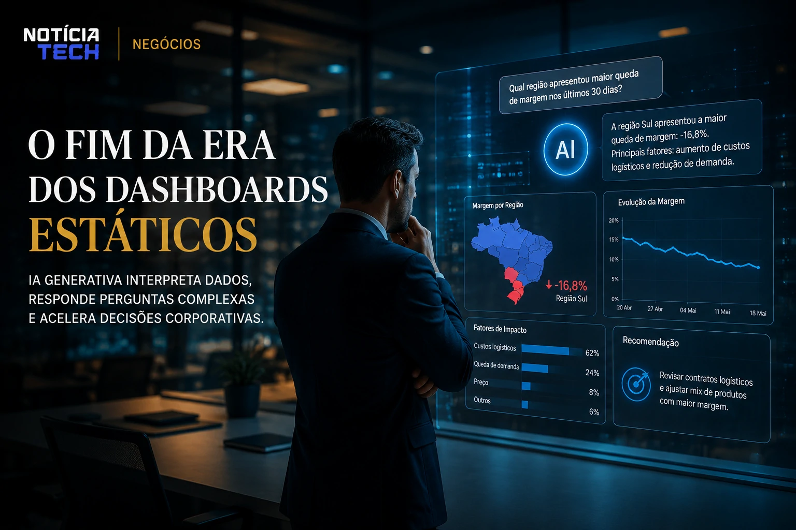

*Durante anos, os dashboards dominaram o universo corporativo como principal ferramenta de análise de dados. Agora, uma nova transformação impulsionada pela **IA generativa** começa a alterar profundamente esse cenário. Em vez de navegar manualmente por gráficos, filtros e relatórios complexos, empresas estão migrando para copilotos analíticos capazes de interpretar informações, responder perguntas estratégicas e até sugerir decisões em tempo real.*

## O fim da era dos dashboards estáticos

Os tradicionais sistemas de **Business Intelligence (BI)** foram construídos para uma lógica operacional baseada em leitura humana. Executivos precisavam interpretar métricas, cruzar indicadores e transformar dados em decisões estratégicas manualmente.

Com o avanço da **IA generativa**, esse modelo começa a parecer lento diante das novas demandas corporativas.

Empresas como **Microsoft**, **Google**, **Salesforce** e **Oracle** passaram a integrar modelos de linguagem diretamente em plataformas analíticas, criando experiências conversacionais capazes de substituir boa parte da navegação tradicional por dashboards.

Agora, gestores podem simplesmente perguntar:

- “Qual região apresentou maior queda de margem?”
- “Por que as vendas desaceleraram esta semana?”
- “Quais produtos possuem maior risco de churn?”

E receber respostas contextualizadas, interpretadas e acompanhadas de recomendações estratégicas.

Esse movimento acelera uma mudança estrutural no mercado de dados corporativos.

### A nova camada operacional da análise empresarial

O foco deixa de ser apenas visualização de métricas e passa para interpretação automatizada.

Os copilotos analíticos começam a atuar como:

- intérpretes de dados;
- assistentes executivos;
- sistemas preditivos;
- mecanismos de recomendação operacional;
- plataformas de tomada de decisão contextual.

Isso reduz drasticamente a dependência de equipes altamente técnicas para tarefas analíticas básicas.

Além disso, democratiza o acesso à inteligência de negócios dentro das empresas.

Em vez de depender exclusivamente de analistas especializados, áreas como marketing, vendas, RH e operações passam a conversar diretamente com sistemas inteligentes.

Esse cenário se conecta diretamente ao avanço da automação corporativa já discutido em:
[Empresas aceleram adoção de agentes autônomos de IA para reduzir custos operacionais](https://noticiatech.com.br/ia/empresas-aceleram-ado%C3%A7%C3%A3o-de-agentes-aut%C3%B4nomos-de-ia-para-reduzir-custos-operacionais/)

## IA generativa transforma dados em decisões acionáveis

O diferencial dos copilotos analíticos não está apenas em responder perguntas.

O verdadeiro impacto aparece na capacidade de interpretar contexto corporativo.

Os novos sistemas começam a conectar:

- históricos operacionais;
- tendências de mercado;
- comportamento do consumidor;
- sazonalidade;
- metas financeiras;
- movimentações competitivas.

Isso permite que a IA entregue não apenas informação, mas direção estratégica.

### O surgimento das análises preditivas conversacionais

Uma das tendências mais relevantes é a popularização das chamadas análises preditivas conversacionais.

Nesse modelo, a IA não espera apenas comandos humanos.

Ela começa a sugerir automaticamente:

- riscos operacionais;
- possíveis quedas de receita;
- gargalos logísticos;
- mudanças no comportamento do cliente;
- oportunidades comerciais.

Em alguns casos, os sistemas já conseguem recomendar ações específicas para equipes internas.

Esse avanço cria um novo paradigma dentro do mercado de software corporativo.

Ferramentas deixam de ser passivas.

Passam a atuar como entidades proativas dentro da operação empresarial.

Esse movimento acompanha a crescente integração entre IA e produtividade corporativa observada em:
[Microsoft amplia integração de IA no ambiente de trabalho e redefine produtividade corporativa](https://noticiatech.com.br/ia/microsoft-amplia-integra%C3%A7%C3%A3o-de-ia-no-ambiente-de-trabalho-e-redefine-produtividade-corporativa/)

## O impacto estratégico para empresas e profissionais

A ascensão dos copilotos analíticos deve alterar profundamente o perfil profissional dentro das organizações.

A tendência aponta para uma redução gradual de tarefas operacionais ligadas à extração manual de dados.

Em paralelo, cresce a valorização de profissionais capazes de:

- interpretar contexto estratégico;
- validar recomendações da IA;
- construir narrativas orientadas por dados;
- supervisionar automações analíticas;
- integrar inteligência artificial aos processos de negócio.

### O novo diferencial competitivo será velocidade de interpretação

Empresas sempre tiveram acesso crescente a dados.

O problema nunca foi escassez de informação.

O verdadeiro desafio sempre esteve na velocidade de interpretação.

Os copilotos analíticos reduzem esse gargalo.

Organizações que conseguirem integrar IA diretamente à tomada de decisão poderão responder mais rapidamente a:

- mudanças de mercado;
- oscilações de consumo;
- movimentos competitivos;
- crises operacionais;
- tendências emergentes.

Ao mesmo tempo, cresce a disputa entre gigantes da tecnologia pelo domínio dessa nova camada operacional.

O mercado de BI tradicional começa a entrar em uma fase de reinvenção forçada.

Plataformas que não incorporarem IA generativa tendem a perder relevância rapidamente diante de soluções conversacionais muito mais acessíveis e eficientes.

Esse cenário também reforça a crescente consolidação da IA como infraestrutura central das empresas modernas, tendência observada em:
[Google acelera disputa corporativa de IA com integração avançada do Gemini no Workspace](https://noticiatech.com.br/ia/google-acelera-disputa-corporativa-de-ia-com-integra%C3%A7%C3%A3o-avan%C3%A7ada-do-gemini-no-workspace/)

À medida que os copilotos analíticos evoluem, a tendência é que dashboards tradicionais deixem de ser o centro da experiência corporativa e passem a funcionar apenas como suporte visual secundário. A próxima geração da inteligência de negócios será menos baseada em navegação manual e cada vez mais orientada por conversas inteligentes, contexto operacional e decisões automatizadas em tempo real.

---