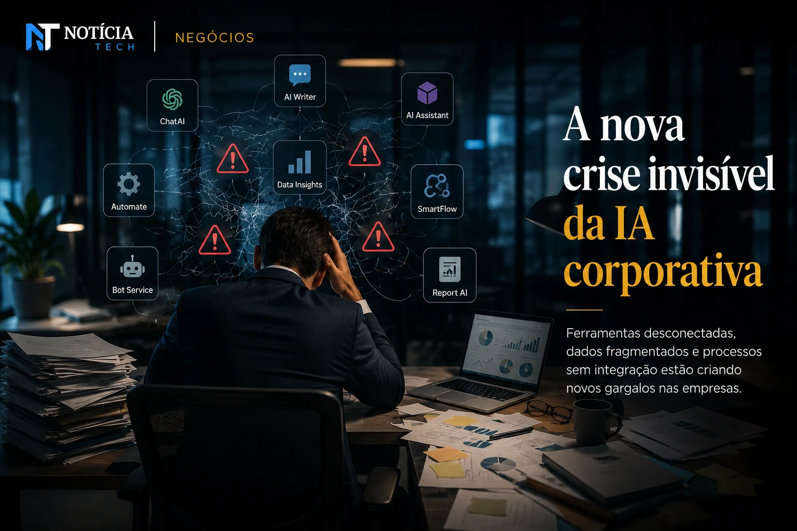

*Durante os últimos dois anos, a corrida corporativa pela adoção de **Inteligência Artificial** criou uma percepção de urgência quase absoluta dentro das empresas. O problema é que muitas organizações passaram a implementar ferramentas de IA antes mesmo de organizar processos internos, fluxos operacionais e estruturas de governança. O resultado agora começa a aparecer nos bastidores: aumento de custos, retrabalho, fragmentação de dados e queda silenciosa de produtividade.*

## A nova crise invisível da IA corporativa

A primeira onda da adoção de **IA generativa** foi guiada principalmente pelo medo de ficar para trás. Empresas passaram a integrar ferramentas de automação, copilotos inteligentes e plataformas de produtividade sem revisar a própria maturidade operacional.

Na prática, muitos times passaram a operar com múltiplas plataformas desconectadas, criando um ambiente corporativo fragmentado.

Segundo analistas do setor, o problema não está na tecnologia em si, mas na ausência de estratégia operacional para absorver o impacto da IA dentro das empresas.

Esse cenário começa a gerar um fenômeno silencioso: profissionais gastando mais tempo gerenciando ferramentas do que executando tarefas estratégicas.

Em vez de simplificar processos, algumas implementações acabam criando novas camadas de complexidade.

Esse movimento também amplia preocupações ligadas à governança de dados, compliance e integração entre departamentos.

Empresas que aceleraram a adoção sem planejamento agora começam a perceber que produtividade real depende menos da ferramenta e mais da organização estrutural interna.

O movimento acompanha uma transformação mais ampla do mercado corporativo, especialmente após plataformas digitais passarem a disputar atenção e distribuição automatizada de conteúdo corporativo, como mostrado na análise sobre o [LinkedIn deixa de ser rede de currículos e vira plataforma de distribuição B2B impulsionada por IA](https://noticiatech.com.br/marketing/linkedin-deixa-de-ser-rede-de-curr%C3%ADculos-e-vira-plataforma-de-distribui%C3%A7%C3%A3o-b2b-impulsionada-por-ia/).

### O excesso de ferramentas virou um novo problema corporativo

O crescimento acelerado do mercado de IA criou uma explosão de plataformas prometendo aumento imediato de produtividade.

Hoje, muitas empresas operam simultaneamente com:
- copilotos de texto;
- plataformas de automação;
- agentes de IA;
- sistemas de análise preditiva;
- ferramentas de atendimento automatizado;
- soluções de gestão inteligente.

O problema é que poucas dessas ferramentas conversam adequadamente entre si.

Isso gera:
- duplicação de processos;
- inconsistência operacional;
- dados descentralizados;
- aumento do custo operacional oculto;
- dependência excessiva de plataformas terceiras.

Em alguns casos, departamentos inteiros passaram a desenvolver fluxos paralelos utilizando ferramentas diferentes para executar funções semelhantes.

## O mercado começa a valorizar governança em vez de velocidade

Após a fase inicial de euforia, o mercado começa a entrar em uma nova etapa da transformação digital.

Agora, investidores e executivos começam a priorizar:
- integração operacional;
- segurança de dados;
- padronização de fluxos;
- redução de redundâncias;
- controle de custos;
- eficiência real.

Empresas que antes anunciavam dezenas de iniciativas de IA simultaneamente começam a reduzir projetos e concentrar investimentos em soluções realmente integradas ao negócio.

Essa mudança representa uma maturidade importante do mercado.

A percepção atual é que IA isolada não gera vantagem competitiva sustentável.

O diferencial começa a surgir nas empresas que conseguem transformar IA em infraestrutura operacional integrada.

Isso inclui:
- treinamento interno;
- revisão de processos;
- integração de dados;
- criação de políticas de uso;
- controle de automações;
- gestão de produtividade baseada em métricas reais.

A tendência também fortalece um movimento crescente de busca por eficiência operacional sustentável, semelhante ao avanço observado em plataformas de automação corporativa discutidas em [Empresas abandonam equipes gigantes e adotam estruturas enxutas impulsionadas por IA](https://noticiatech.com.br/automacao/empresas-come%C3%A7am-a-substituir-softwares-tradicionais-por-agentes-de-ia/).

### IA sem processos organizados amplia gargalos internos

Muitas empresas descobriram que a IA acelera exatamente o nível de organização já existente.

Se a estrutura interna é eficiente:
- a IA potencializa produtividade.

Se a estrutura é caótica:
- a IA acelera o caos.

Esse efeito ficou evidente em áreas como:
- atendimento;
- marketing;
- produção de conteúdo;
- suporte corporativo;
- análise de dados;
- gestão operacional.

Em vários casos, profissionais passaram a produzir mais volume, mas com menor consistência estratégica.

A consequência direta aparece no crescimento do retrabalho corporativo.

## A próxima vantagem competitiva será operacional

A próxima fase da transformação digital deve favorecer empresas menos obcecadas por velocidade e mais focadas em eficiência operacional inteligente.

Isso significa que:
- processos bem definidos;
- integração de dados;
- padronização operacional;
- governança de IA;
- alinhamento entre equipes;

podem se tornar ativos mais valiosos do que simplesmente possuir acesso às ferramentas mais avançadas do mercado.

O cenário também cria uma mudança importante no perfil dos profissionais valorizados pelas empresas.

A tendência é que organizações passem a buscar pessoas capazes de:
- integrar sistemas;
- coordenar fluxos automatizados;
- validar qualidade operacional;
- supervisionar agentes de IA;
- organizar processos híbridos entre humanos e automações.

Esse movimento começa a redefinir o próprio conceito de produtividade corporativa.

Em vez de apenas produzir mais rapidamente, empresas começam a perceber que crescimento sustentável depende de estrutura operacional inteligente, integração eficiente e capacidade de adaptação contínua diante do avanço acelerado da IA no ambiente corporativo.

---