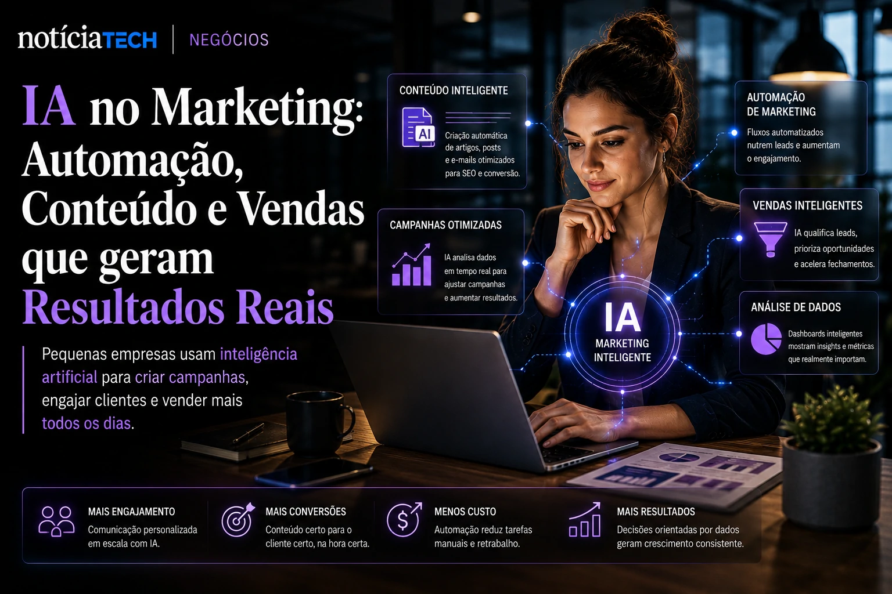
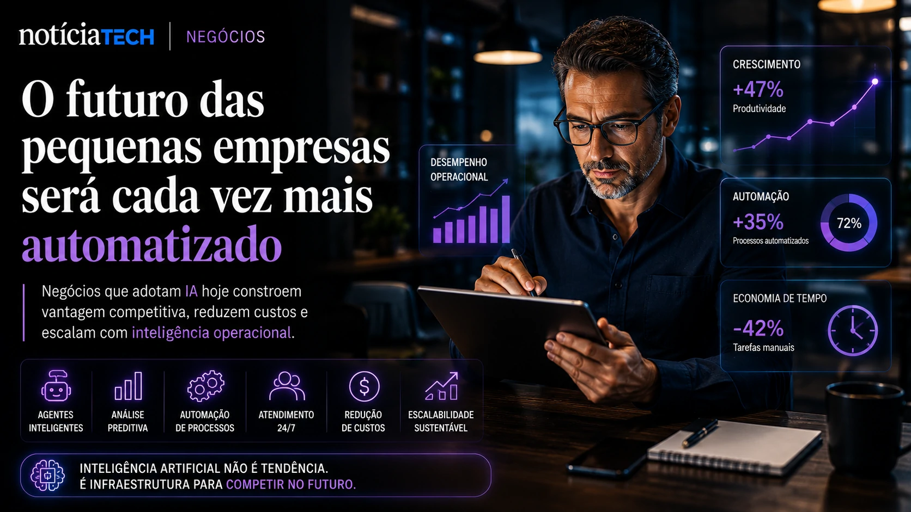

*Enquanto grandes corporações disputam espaço na corrida da inteligência artificial, pequenas empresas descobriram um movimento silencioso que pode redefinir competitividade nos próximos anos: utilizar ferramentas de IA para operar com mais velocidade, menos custo e maior eficiência comercial. O avanço de plataformas acessíveis está transformando negócios locais, e-commerces, agências e operações B2B em estruturas altamente automatizadas — mesmo sem equipes técnicas internas.*

## A nova geração de ferramentas de IA deixou de ser exclusiva das grandes empresas

Durante anos, automação corporativa exigia infraestrutura complexa, equipes de TI e altos investimentos. Isso mudou rapidamente com a popularização de plataformas baseadas em **IA generativa**, automação no-code e agentes inteligentes.

Hoje, pequenas empresas conseguem automatizar:

- atendimento ao cliente;
- geração de conteúdo;
- funis comerciais;
- suporte interno;
- análise de dados;
- gestão operacional;
- prospecção B2B.

Esse movimento está acelerando principalmente porque plataformas como **ChatGPT**, **Gemini**, **Notion AI**, **Zapier**, **HubSpot** e **Make** reduziram drasticamente a barreira técnica para adoção de automação.

O mercado já percebe que a disputa deixou de ser apenas “quem possui mais funcionários” e passou a ser “quem opera com mais inteligência operacional”.

Esse novo cenário conversa diretamente com o avanço da chamada economia dos agentes autônomos, tema que já vem transformando o mercado corporativo global.

[**A era dos agentes de IA já começou: como Microsoft, OpenAI e Google estão transformando empresas em sistemas autônomos**](https://noticiatech.com.br/inteligencia-artificial/a-era-dos-agentes-de-ia-j%C3%A1-come%C3%A7ou-como-microsoft-openai-e-google-est%C3%A3o-transformando-empresas-em-sistemas-aut%C3%B4nomos/)

### O custo operacional começa a cair rapidamente

Negócios que antes dependiam de múltiplas assinaturas, freelancers e processos manuais agora conseguem centralizar tarefas em plataformas automatizadas.

Em muitos casos, uma pequena operação consegue:

- produzir artigos otimizados para SEO;
- responder clientes automaticamente;
- criar campanhas de e-mail;
- organizar CRM;
- gerar relatórios;
- automatizar vendas;
- criar páginas de captura.

Tudo isso utilizando ferramentas acessíveis por assinatura mensal.

O impacto comercial dessa mudança é enorme porque pequenas empresas passam a operar com produtividade próxima de empresas muito maiores.

---

## IA aplicada ao marketing digital virou diferencial competitivo real

O marketing digital está entre os setores mais impactados pela inteligência artificial.

Ferramentas modernas conseguem analisar comportamento de usuários, gerar textos persuasivos, criar anúncios e otimizar campanhas praticamente em tempo real.

Esse movimento criou uma nova disputa conhecida como **Search Everywhere Optimization**, onde marcas tentam aparecer não apenas no Google, mas também em assistentes de IA, buscas conversacionais e plataformas sociais.

[**Search Everywhere Optimization: por que marcas estão abandonando o SEO tradicional para disputar atenção em IA, redes sociais e assistentes inteligentes**](https://noticiatech.com.br/marketing/search-everywhere-optimization-por-que-marcas-est%C3%A3o-abandonando-o-seo-tradicional-para-disputar-aten%C3%A7%C3%A3o-em-ia-redes-sociais-e-assistentes-inteligentes/)

### Pequenas empresas conseguem competir usando automação inteligente

O ponto mais importante dessa transformação não é apenas produtividade.

É alcance.

Negócios pequenos agora conseguem:

- produzir conteúdo em escala;
- criar presença digital consistente;
- automatizar relacionamento;
- aumentar retenção de clientes;
- reduzir tempo operacional;
- fortalecer branding digital.

Em muitos mercados, empresas menores estão crescendo porque conseguem executar mais rápido que concorrentes tradicionais.

Além disso, a IA também começou a mudar a forma como plataformas distribuem conteúdo e atenção.

O próprio **LinkedIn**, por exemplo, está se transformando em um ecossistema de distribuição inteligente voltado para negócios, criadores e empresas B2B.

[**LinkedIn deixa de ser rede de currículos e vira plataforma de distribuição B2B impulsionada por IA**](https://noticiatech.com.br/marketing/linkedin-deixa-de-ser-rede-de-curr%C3%ADculos-e-vira-plataforma-de-distribui%C3%A7%C3%A3o-b2b-impulsionada-por-ia/)

### Oportunidade comercial para quem entrar cedo

Existe um fator estratégico importante acontecendo neste momento.

A maioria das pequenas empresas ainda utiliza IA apenas para tarefas básicas.

Quem aprender a integrar automação com marketing, conteúdo e vendas tende a construir vantagem competitiva difícil de recuperar depois.

Empresas que adotam IA agora conseguem:

- reduzir CAC;
- aumentar produtividade;
- criar operações mais enxutas;
- melhorar atendimento;
- ampliar escala sem contratar proporcionalmente.

Isso cria uma oportunidade comercial relevante para consultorias, criadores de conteúdo, agências, freelancers e negócios digitais.

---

## O futuro das pequenas empresas será cada vez mais automatizado

O avanço da inteligência artificial deixou de ser tendência experimental.

A tecnologia começou a se tornar infraestrutura operacional.

Nos próximos anos, negócios que não adotarem automação provavelmente enfrentarão:

- maior custo operacional;
- menor velocidade de execução;
- dificuldade de competir em marketing;
- menor retenção de clientes;
- perda de eficiência comercial.

Ao mesmo tempo, empresas que aprenderem a usar IA estrategicamente poderão operar com estruturas extremamente enxutas e altamente escaláveis.

A transformação já começou em áreas como:

- suporte automatizado;
- vendas conversacionais;
- geração de conteúdo;
- automação de CRM;
- análise de comportamento;
- personalização de campanhas;
- agentes inteligentes corporativos.

O mercado ainda está nos estágios iniciais dessa mudança, o que significa que existe espaço relevante para empresas menores construírem vantagem antes que a automação se torne padrão obrigatório no ambiente digital.

A próxima grande diferença competitiva talvez não seja mais o tamanho da empresa — mas sim o nível de inteligência operacional que ela consegue integrar no próprio negócio.

---