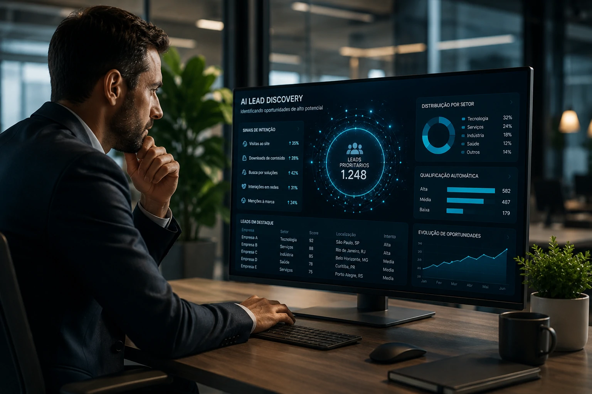
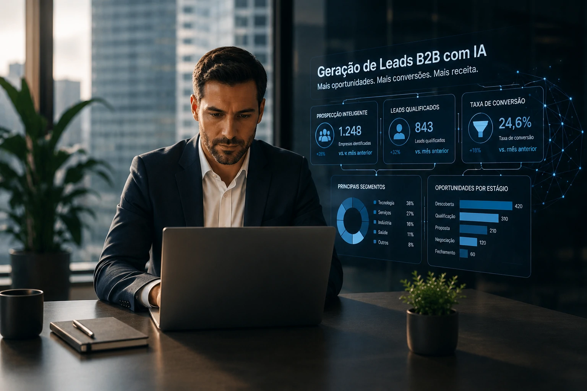
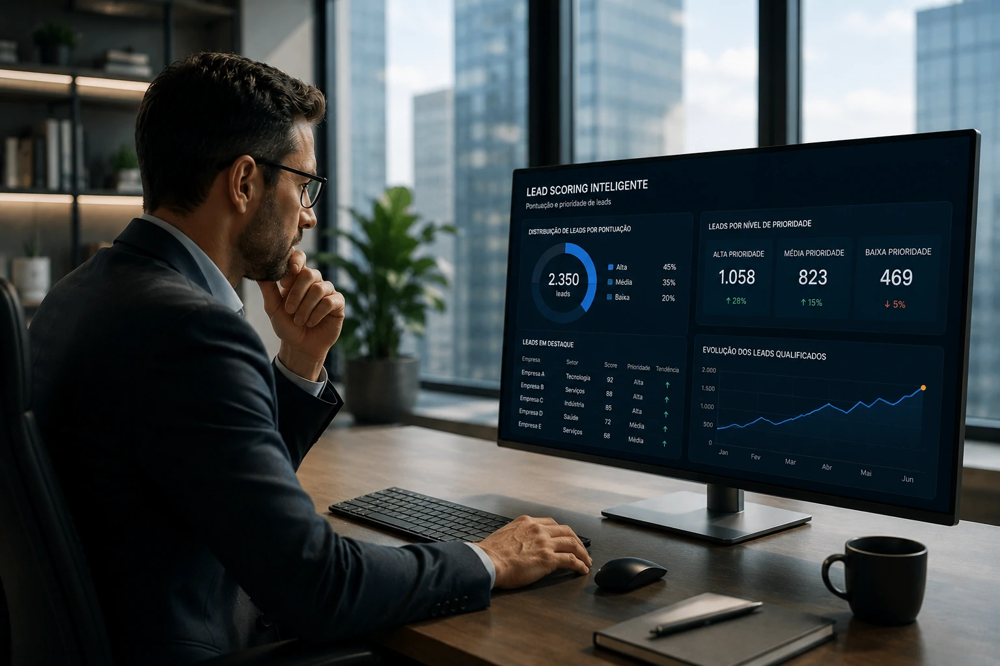

*Enquanto muitas empresas ainda utilizam planilhas, listas estáticas e processos manuais para prospectar clientes, uma nova geração de ferramentas baseada em Inteligência Artificial está transformando a maneira como oportunidades comerciais são encontradas, qualificadas e convertidas. O movimento não representa apenas uma evolução tecnológica. Trata-se de uma mudança estrutural na forma como as áreas de vendas operam, competem e crescem.*

A geração de leads sempre foi uma das atividades mais importantes do mercado B2B. Sem novas oportunidades entrando continuamente no funil comercial, o crescimento se torna limitado e imprevisível.

O problema é que os métodos tradicionais dependem de grande esforço humano, baixa escala operacional e decisões baseadas em intuição.

Com o avanço da **Inteligência Artificial**, empresas estão substituindo processos manuais por sistemas capazes de identificar potenciais clientes, analisar comportamento, prever intenção de compra e automatizar abordagens comerciais.

## O que é geração de leads B2B com IA?

A geração de leads B2B com **Inteligência Artificial** consiste na utilização de algoritmos, automação e análise de dados para identificar empresas e profissionais com maior probabilidade de se tornarem clientes.

*Plataformas de IA conseguem identificar oportunidades comerciais antes mesmo do primeiro contato da equipe de vendas.*

Diferentemente dos modelos tradicionais, a IA não trabalha apenas com listas estáticas.

Ela analisa milhares de sinais digitais para compreender quais empresas demonstram interesse, necessidade ou potencial de compra.

### Como a IA identifica oportunidades comerciais

Os sistemas modernos avaliam informações como:

- comportamento de navegação;
- pesquisas realizadas;
- interações em redes profissionais;
- tecnologias utilizadas pela empresa;
- crescimento do negócio;
- movimentações de mercado.

Com base nesses dados, a plataforma cria um perfil de oportunidade muito mais preciso.

Isso reduz o desperdício de tempo com contatos que possuem baixa probabilidade de conversão.

### Por que o modelo tradicional está perdendo eficiência

O crescimento da concorrência digital tornou a prospecção manual mais cara e menos eficiente.

Muitas equipes comerciais passam horas pesquisando empresas, atualizando planilhas e enviando mensagens genéricas.

Enquanto isso, plataformas baseadas em IA conseguem realizar a mesma atividade em escala muito maior.

Esse movimento segue a mesma lógica observada em estratégias como **AI First**, onde processos passam a ser desenhados considerando a automação desde o início.

Para entender melhor esse conceito, vale conferir o artigo:

[O que é AI First e por que essa estratégia está redefinindo a competitividade das empresas](https://noticiatech.com.br/negocios/o-que-e-ai-first-estrategia-empresas/)

## Como a Inteligência Artificial está automatizando a prospecção B2B

A automação da prospecção é uma das aplicações mais avançadas da IA no ambiente corporativo.

*Ferramentas modernas combinam automação, análise preditiva e enriquecimento de dados para acelerar a prospecção.*

Em vez de depender exclusivamente da busca manual de contatos, plataformas inteligentes monitoram continuamente o mercado em busca de novas oportunidades.

### Enriquecimento automático de dados

Uma das maiores dificuldades das equipes comerciais é manter informações atualizadas.

A IA resolve esse problema ao conectar múltiplas fontes de dados e atualizar automaticamente informações relevantes.

Entre os dados enriquecidos estão:

- cargo dos decisores;
- porte da empresa;
- setor de atuação;
- tecnologias utilizadas;
- localização;
- crescimento da organização.

Esse processo melhora significativamente a qualidade do pipeline comercial.

### Personalização em escala

Outro avanço importante é a capacidade de personalizar comunicações em larga escala.

Em vez de enviar mensagens genéricas para centenas de contatos, os sistemas geram abordagens contextualizadas.

A IA pode adaptar mensagens considerando:

- segmento da empresa;
- desafios do setor;
- histórico de interações;
- perfil do decisor.

Essa personalização aumenta taxas de resposta e melhora o relacionamento comercial desde o primeiro contato.

A evolução está diretamente conectada ao crescimento dos **agentes de IA**, que já começam a assumir funções operacionais em diversas áreas corporativas.

O tema foi aprofundado pelo Notícia Tech em:

[CRM com IA entra na era dos agentes autônomos e muda a gestão de vendas nas empresas](https://noticiatech.com.br/negocios/crm-com-ia-era-agentes-autonomos-vendas-empresas/)

## Como a IA está transformando a qualificação de leads

A Inteligência Artificial está mudando a qualificação de leads ao substituir critérios subjetivos por análises baseadas em dados e probabilidade de conversão.

*Modelos preditivos permitem que equipes comerciais concentrem esforços nas oportunidades com maior potencial de receita.*

Tradicionalmente, a qualificação dependia da experiência individual dos vendedores.

Hoje, sistemas inteligentes analisam centenas de variáveis simultaneamente para determinar quais oportunidades merecem prioridade.

### O que é Lead Scoring baseado em IA

Lead Scoring é o processo de atribuir pontuações para potenciais clientes.

Quando impulsionado por **Inteligência Artificial**, esse processo se torna muito mais sofisticado.

Os algoritmos analisam:

- histórico de conversão;
- comportamento digital;
- engajamento com conteúdos;
- características da empresa;
- perfil dos decisores;
- sinais de intenção de compra.

O resultado é uma classificação dinâmica que muda conforme novos dados são recebidos.

### Como empresas reduzem desperdícios comerciais

Uma das maiores perdas em operações B2B acontece quando vendedores dedicam tempo para oportunidades sem potencial real.

Com IA, o foco passa a ser direcionado para leads com maior chance de fechamento.

Isso reduz:

- custo de aquisição de clientes;
- tempo gasto em negociações improdutivas;
- duração do ciclo comercial;
- desperdício de recursos operacionais.

Essa capacidade de tomada de decisão baseada em dados também está relacionada ao crescimento de estruturas corporativas voltadas para governança e escala de IA.

Um exemplo é o conceito de:

[AI Center of Excellence: por que empresas estão criando centros internos para escalar inteligência artificial](https://noticiatech.com.br/negocios/ai-center-of-excellence-empresas-escalar-inteligencia-artificial/)

## O futuro da geração de leads será operado por agentes de IA

O futuro da geração de leads não está apenas na automação de tarefas isoladas. O próximo estágio será a utilização de agentes de IA capazes de executar processos comerciais completos.

Esses agentes poderão identificar empresas, pesquisar informações, qualificar oportunidades, criar abordagens personalizadas e alimentar sistemas de CRM de forma autônoma.

### O que muda para pequenas e médias empresas

Historicamente, apenas grandes organizações tinham acesso a tecnologias avançadas de prospecção.

A redução dos custos de IA está democratizando esse cenário.

Pequenas e médias empresas passam a ter acesso a recursos antes disponíveis apenas para grandes equipes comerciais.

Entre os principais benefícios estão:

- aumento de produtividade;
- redução de custos operacionais;
- maior previsibilidade de vendas;
- melhor aproveitamento da equipe comercial;
- crescimento sustentável do pipeline.

### O impacto estratégico para os próximos anos

O mercado B2B está entrando em uma fase onde velocidade e inteligência analítica se tornam vantagens competitivas fundamentais.

Empresas que continuarem dependendo exclusivamente de processos manuais enfrentarão dificuldades crescentes para competir com organizações que utilizam automação inteligente.

Mais do que uma ferramenta operacional, a **Inteligência Artificial** está se tornando uma infraestrutura estratégica para vendas, marketing e crescimento empresarial.

A tendência aponta para um cenário em que a geração de leads será cada vez mais orientada por dados, modelos preditivos e agentes autônomos capazes de executar atividades comerciais em escala.

Nesse contexto, a diferença entre crescer ou perder espaço no mercado poderá estar menos relacionada ao tamanho da equipe de vendas e mais à capacidade de utilizar tecnologia para identificar oportunidades antes da concorrência. O avanço da IA na prospecção comercial indica que o futuro das vendas B2B será definido por quem conseguir transformar dados em relacionamento, relacionamento em oportunidade e oportunidade em receita de forma mais rápida e eficiente.

---