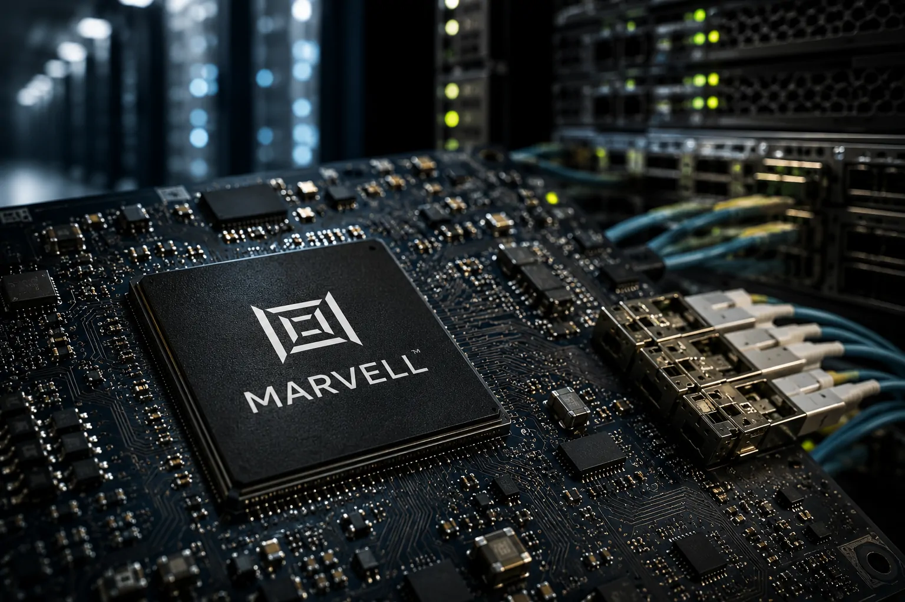
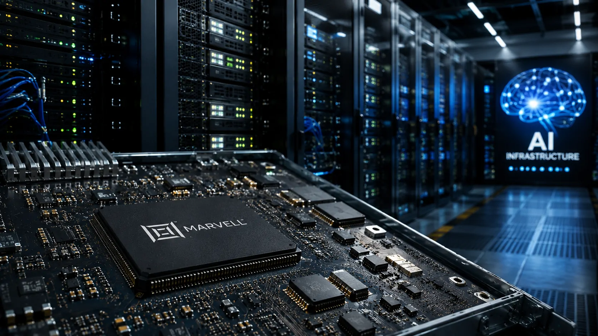
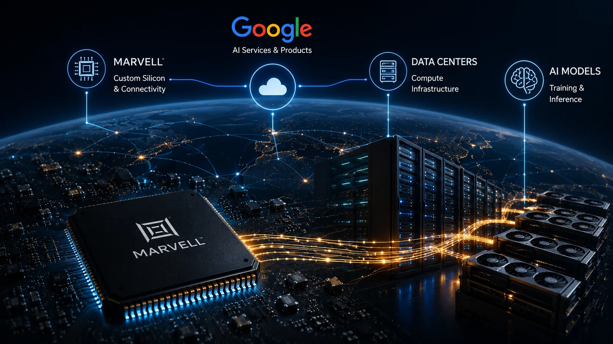

*O avanço da inteligência artificial está criando uma disputa que vai muito além dos modelos como Gemini, ChatGPT e Claude. Enquanto as empresas ampliam seus investimentos em IA, também precisam decidir quem vai fornecer a infraestrutura necessária para processar essa demanda. O novo acordo entre Google e Marvell mostra como essa disputa está chegando ao coração da cadeia de chips.*

## Google amplia sua estratégia para controlar a infraestrutura de IA

### Um acordo que vai além de um fornecedor

O **Google** fechou um acordo com a **Marvell Technology** para ampliar o desenvolvimento de chips personalizados destinados à infraestrutura de inteligência artificial. A parceria coloca uma empresa especializada em semicondutores no centro da estratégia de expansão computacional do Google.

O negócio pode gerar até **US$ 120 bilhões em receita para a Marvell até o ano fiscal de 2033**, desde que as metas previstas sejam atingidas. O valor, portanto, representa um potencial de longo prazo e não um pagamento imediato.

A operação também mostra que a estratégia de IA do **Google** está cada vez mais ligada à capacidade de controlar componentes críticos da infraestrutura que sustenta seus serviços.

### Por que o Google quer chips personalizados

A demanda por computação para IA cresceu rapidamente e tornou a infraestrutura um dos maiores custos da indústria. Em vez de depender exclusivamente de componentes desenvolvidos para diferentes tipos de aplicações, grandes empresas passaram a buscar soluções ajustadas às próprias necessidades.

O Google já desenvolve sua família de **TPUs**, aceleradores projetados para cargas de trabalho de inteligência artificial. A parceria com a **Marvell** amplia esse ecossistema e envolve tecnologias relacionadas ao processamento, armazenamento e movimentação de dados.

Essa estratégia também ajuda a explicar por que a infraestrutura virou uma questão de negócios. Quanto maior o uso de IA, maior a importância de controlar desempenho, disponibilidade e custo computacional.

## Quem é a Marvell e por que ela ganhou importância

*A Marvell atua no desenvolvimento de semicondutores e soluções de silício usadas na infraestrutura digital e em sistemas de inteligência artificial.*

### Uma empresa que trabalha nos bastidores

A **Marvell Technology** não possui a mesma visibilidade de empresas como Nvidia, Google ou AMD entre o público geral. Seu negócio, porém, está diretamente ligado à infraestrutura que permite que grandes volumes de dados sejam processados e movimentados.

A companhia desenvolve soluções de semicondutores para processamento, armazenamento, conectividade e redes. Também trabalha com **silício personalizado**, permitindo que grandes clientes desenvolvam componentes ajustados a necessidades específicas.

Essa posição ajuda a explicar por que a empresa pode se beneficiar do crescimento da IA mesmo sem vender um produto de consumo conhecido pelo público.

### O papel do silício personalizado

Chips personalizados permitem que uma empresa adapte hardware às características de seus próprios sistemas. No caso da IA, isso pode ser relevante porque diferentes aplicações exigem combinações específicas de processamento, memória e comunicação.

Para o Google, essa flexibilidade pode complementar suas **TPUs** e outros componentes utilizados nos data centers. Para a Marvell, contratos desse tipo representam uma oportunidade de participar diretamente da expansão da infraestrutura de grandes empresas de tecnologia.

O acordo transforma, portanto, uma empresa pouco conhecida pelo consumidor em uma peça relevante da economia construída ao redor da IA.

## O que os US$ 120 bilhões realmente significam

### Não é um pagamento de US$ 120 bilhões

O número de **US$ 120 bilhões** precisa ser interpretado corretamente. Ele representa uma estimativa de receita que a Marvell pode obter ao longo do período do acordo, e não um valor que o Google está pagando agora.

A operação também prevê que o **Google** possa adquirir até aproximadamente US$ 12,2 bilhões em ações da Marvell por meio de um instrumento que, se totalmente exercido, faria do Google um dos maiores acionistas da companhia.

Isso cria uma relação econômica mais profunda entre as duas empresas. O Google passa a ter interesse ainda maior no crescimento de um fornecedor estratégico de sua infraestrutura.

### O mercado reagiu ao anúncio

A dimensão financeira da operação chamou atenção imediatamente dos investidores. As ações da **Marvell** subiram após o anúncio, enquanto as ações da **Broadcom**, que vinha sendo uma das principais parceiras do Google em chips personalizados, recuaram.

O movimento mostra que o mercado não enxerga o acordo apenas como um contrato comercial. Ele também representa uma mudança na distribuição de oportunidades dentro da cadeia de infraestrutura de IA.

Para o setor, a mensagem é clara: o crescimento da inteligência artificial está criando espaço para diversos fornecedores especializados, não apenas para os fabricantes mais conhecidos de GPUs.

## A corrida pelos chips está mudando o mercado de IA

*O crescimento dos serviços de IA aumenta a importância de chips personalizados para processamento, armazenamento e comunicação de dados.*

### Nvidia continua dominante, mas o mercado se diversifica

A **Nvidia** continua sendo uma das empresas mais importantes da infraestrutura de IA, especialmente por sua posição no mercado de GPUs e pelo ecossistema de software que acompanha seus aceleradores.

O avanço dos chips personalizados, entretanto, cria uma segunda frente de competição. Empresas como Google, Amazon e outras grandes companhias de tecnologia procuram desenvolver componentes capazes de atender a cargas de trabalho específicas.

Esse movimento também aparece na estratégia de outras empresas de IA. A **Anthropic**, por exemplo, já avançou em uma estratégia própria de chips para o Claude, movimento que mostra como os grandes desenvolvedores de modelos estão tentando ter maior controle sobre a infraestrutura.

Isso não significa necessariamente substituir as GPUs. Na prática, grandes data centers podem combinar diferentes arquiteturas conforme o tipo de processamento necessário.

### O custo virou uma questão estratégica

A expansão da IA transformou o custo computacional em uma questão diretamente ligada à estratégia empresarial. Cada melhoria de eficiência pode representar uma diferença significativa quando milhares de servidores trabalham continuamente.

É por isso que os chips personalizados ganharam importância. Eles permitem que grandes empresas tentem otimizar a relação entre desempenho, consumo de energia e custo de operação.

Essa transformação também ajuda a entender por que a infraestrutura de IA está se tornando um dos principais campos de investimento da indústria de tecnologia.

## O impacto para as empresas que usam inteligência artificial

### A infraestrutura começa a afetar o preço da IA

O movimento entre **Google** e **Marvell** parece distante de uma empresa que simplesmente utiliza ferramentas de IA. Mas decisões desse tipo podem influenciar a economia dos serviços oferecidos na nuvem.

Quando os provedores conseguem aumentar a eficiência de seus data centers, eles ganham mais espaço para oferecer processamento de IA em diferentes faixas de preço. Isso pode afetar empresas que utilizam APIs, plataformas de nuvem e aplicações baseadas em modelos generativos.

A infraestrutura, portanto, deixa de ser um assunto exclusivamente técnico e passa a influenciar diretamente o planejamento financeiro das empresas.

### A cadeia de IA está ficando mais especializada

O acordo também reforça uma tendência: a economia da IA está formando uma cadeia cada vez mais especializada, composta por fabricantes de aceleradores, empresas de semicondutores, provedores de nuvem, operadores de data centers e desenvolvedores de modelos.

Essa transformação também está mudando a própria estrutura tecnológica das empresas. Para entender como diferentes componentes de IA se conectam aos sistemas corporativos, vale consultar o guia sobre **[arquitetura de IA empresarial, RAG, MCP, agentes, automação e copilotos](https://noticiatech.com.br/inteligencia-artificial/arquitetura-ia-empresarial-mcp-rag-apis-agentes-workflows-copilotos/)**.

Esse movimento ajuda a explicar por que o valor econômico da IA não está concentrado apenas nas empresas que criam os modelos. Há oportunidades relevantes em todas as camadas necessárias para colocar esses sistemas em funcionamento.

Para gestores e empreendedores, acompanhar essa cadeia se torna importante porque mudanças na infraestrutura podem alterar custos, disponibilidade e capacidade de expansão dos serviços de IA.

## Google e Marvell mostram para onde a economia da IA está indo

*Google e Marvell fazem parte de uma cadeia cada vez mais integrada de empresas que sustentam a expansão da inteligência artificial.*

### O hardware virou parte da estratégia empresarial

A parceria mostra que a competição em **inteligência artificial** não está restrita à qualidade dos modelos. O controle sobre hardware, redes, armazenamento e capacidade computacional também pode determinar a velocidade com que uma empresa consegue expandir seus serviços.

Esse movimento acompanha uma tendência maior entre as Big Techs: investir diretamente em infraestrutura para reduzir gargalos e aumentar o controle sobre os custos de IA.

Para entender como essa necessidade de infraestrutura vem crescendo entre as empresas de IA, o Notícia Tech também analisou a **[expansão da infraestrutura da Anthropic e a pressão sobre a capacidade computacional](https://noticiatech.com.br/inteligencia-artificial/anthropic-expansao-35-bilhoes-infraestrutura-ia/)**.

Para o Google, o acordo amplia as alternativas disponíveis para sua infraestrutura. Para a Marvell, abre uma oportunidade potencialmente gigantesca em um dos mercados de maior crescimento da tecnologia.

### Uma mudança que pode durar anos

O mais relevante no acordo não é apenas o número de US$ 120 bilhões. É o horizonte de longo prazo criado pela parceria.

Se a demanda por IA continuar crescendo, empresas especializadas em componentes para infraestrutura poderão capturar uma parcela cada vez maior do valor gerado pelo setor. Isso significa que a próxima fase da competição tecnológica será disputada também nos bastidores.

A parceria entre **Google** e **Marvell** é um exemplo de como a inteligência artificial está reorganizando relações entre grandes empresas, fornecedores de tecnologia e investidores. Para quem acompanha o mercado, o sinal é importante: **a economia da IA está sendo construída tanto pelos modelos que aparecem na tela quanto pelos chips que trabalham longe dela.**

---