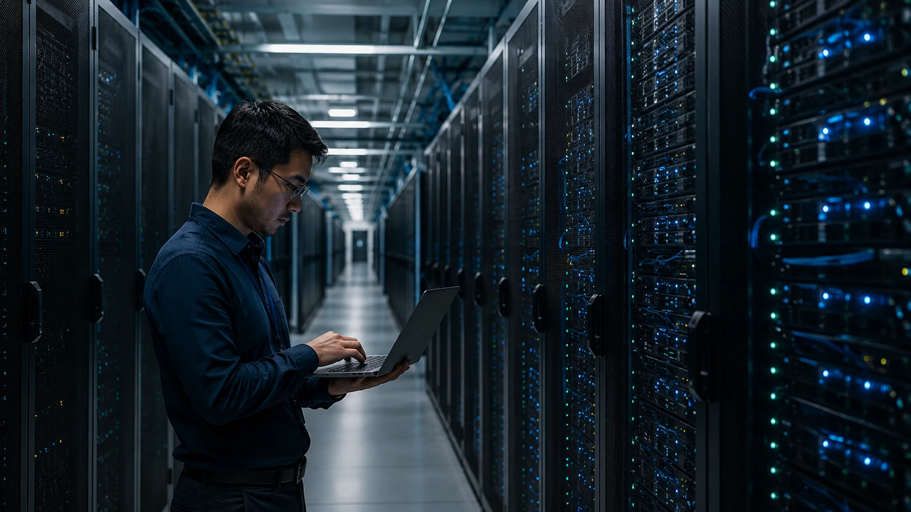

*Durante anos, a disputa tecnológica girou em torno de softwares, aplicativos e plataformas digitais. Agora, a inteligência artificial está mudando as regras do jogo. A nova movimentação bilionária da **Alphabet**, controladora do **Google**, mostra que a batalha deixou de acontecer apenas nos algoritmos e passou a ocorrer na infraestrutura capaz de sustentar a próxima geração da economia digital.*

## O investimento bilionário do Google revela uma mudança estratégica no mercado de IA

Empresas de tecnologia estão percebendo que o verdadeiro diferencial competitivo da inteligência artificial não está apenas nos modelos, mas na capacidade de operar sistemas em escala global.

A decisão da **Alphabet** de buscar aproximadamente **US$ 80 bilhões** para acelerar seus investimentos em inteligência artificial reforça uma mudança importante na indústria. O foco já não está apenas em criar modelos mais avançados, mas em garantir a infraestrutura necessária para executá-los.

### A corrida deixou de ser apenas sobre modelos

Nos últimos dois anos, o mercado concentrou sua atenção em nomes como **ChatGPT**, **Gemini** e **Claude**.

Embora esses produtos continuem relevantes, o novo campo de disputa está nos bastidores. Data centers, capacidade energética, redes globais e chips especializados tornaram-se os ativos mais estratégicos da economia digital.

### O custo da liderança em IA aumenta rapidamente

Treinar modelos avançados exige bilhões de dólares em infraestrutura.

Quanto mais empresas adotam agentes inteligentes, copilotos corporativos e sistemas autônomos, maior se torna a necessidade de processamento computacional em larga escala.

Esse cenário ajuda a explicar por que gigantes como **Google**, **Microsoft**, **Amazon** e **Meta** estão ampliando investimentos mesmo em um ambiente econômico mais cauteloso.

## A infraestrutura se tornou a nova moeda da inteligência artificial

A infraestrutura tecnológica passou a ser o principal gargalo para expansão da IA.

Modelos avançados podem ser replicados. Infraestrutura global, porém, leva anos para ser construída.

Por isso, empresas que possuem grandes redes de data centers ganharam uma vantagem competitiva difícil de reproduzir.

### Data centers viram ativos estratégicos

O mercado começa a enxergar data centers da mesma forma que enxergava ferrovias, rodovias ou redes elétricas em ciclos anteriores da economia.

Quem controla a infraestrutura controla a distribuição.

Esse conceito está diretamente relacionado à expansão dos agentes corporativos analisada em [Nvidia aposta em agentes de IA e AI PCs corporativos](https://noticiatech.com.br/inteligencia-artificial/nvidia-agentes-ia-ai-pcs-corporativos/).

### Energia virou fator competitivo

Outro elemento que ganhou importância é a energia.

Grandes modelos de inteligência artificial exigem consumo energético crescente.

Por isso, empresas de tecnologia estão investindo não apenas em servidores, mas também em contratos energéticos de longo prazo, sistemas de refrigeração e expansão física de suas operações.

## O movimento do Google aumenta a pressão sobre OpenAI, Microsoft e Anthropic

A nova fase da corrida da IA pode alterar o equilíbrio competitivo entre as principais empresas do setor.

Até recentemente, o debate estava concentrado em qual modelo entregava melhores respostas.

Agora a questão principal é quem conseguirá operar esses modelos em escala global de forma sustentável.

### O efeito sobre a OpenAI

A **OpenAI** continua liderando parte da conversa pública sobre inteligência artificial.

No entanto, a empresa depende de infraestrutura externa para sustentar sua expansão.

Esse tema já aparece em discussões recentes sobre a evolução do ecossistema corporativo da IA, como mostrado em [OpenAI quer transformar o VS Code na plataforma central da nova economia da IA](https://noticiatech.com.br/inteligencia-artificial/openai-quer-transformar-o-vs-code-na-plataforma-central-da-nova-economia-da-ia/).

### O papel da Nvidia continua crescendo

Enquanto empresas disputam plataformas, a **Nvidia** permanece como fornecedora crítica da infraestrutura.

Os chips da companhia continuam sendo a base para treinamento e execução de sistemas avançados de IA.

Não por acaso, a estratégia defendida por **Jensen Huang** já apontava para um cenário em que a inteligência artificial seria tratada como infraestrutura empresarial, conforme discutido em [Jensen Huang acelera visão da Nvidia e transforma IA em infraestrutura estratégica para empresas](https://noticiatech.com.br/negocios/jensen-huang-acelera-vis%C3%A3o-da-nvidia-e-transforma-ia-em-infraestrutura-estrat%C3%A9gica-para-empresas/).

## O que essa nova guerra da infraestrutura significa para empresas

Empresas de todos os setores serão impactadas pela consolidação dessa infraestrutura global de IA.

A maioria das organizações não construirá seus próprios modelos nem seus próprios data centers.

Elas dependerão cada vez mais das plataformas criadas pelos grandes provedores de tecnologia.

### O acesso à IA ficará mais simples

A tendência é que ferramentas avançadas se tornem mais acessíveis.

Empresas menores poderão utilizar recursos sofisticados sem investir diretamente em infraestrutura própria.

Isso acelera a democratização da inteligência artificial corporativa.

### A dependência tecnológica pode aumentar

Ao mesmo tempo, cresce a concentração de poder nas mãos de poucos fornecedores globais.

A escolha da plataforma utilizada por uma empresa poderá ter impacto semelhante à escolha de um sistema operacional ou provedor de nuvem.

### O futuro da competição será invisível

O usuário final continuará vendo aplicativos, assistentes e agentes inteligentes.

Por trás dessas interfaces, porém, ocorrerá uma disputa silenciosa por capacidade computacional, energia e infraestrutura.

Essa transformação sugere que a próxima geração da economia digital será definida menos pelos aplicativos que vemos e mais pelas plataformas invisíveis que tornam a inteligência artificial possível.

A movimentação da **Alphabet** reforça exatamente essa tendência. A nova guerra tecnológica não acontece apenas nos modelos de IA que aparecem ao público. Ela está sendo travada em data centers, redes globais e investimentos bilionários que podem definir quem controlará a infraestrutura da próxima década digital.

---