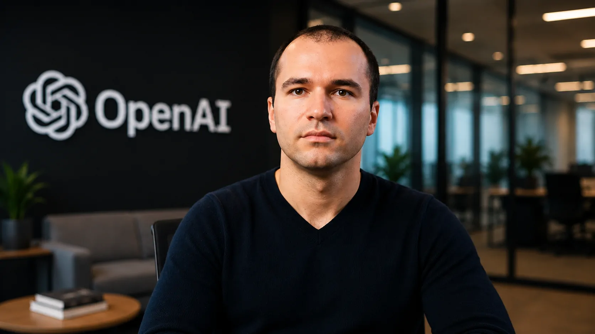
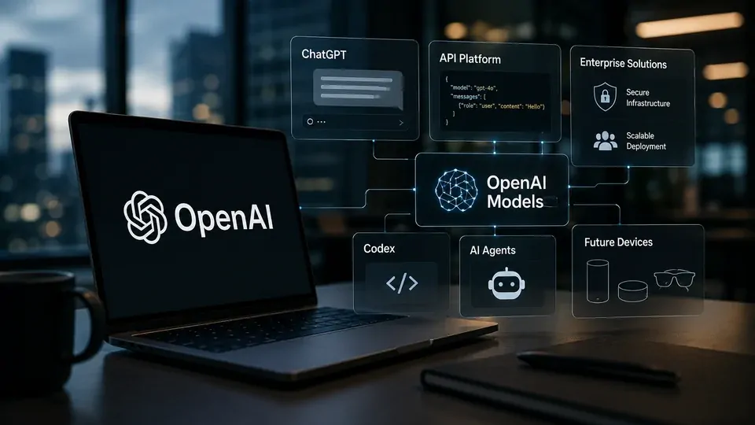
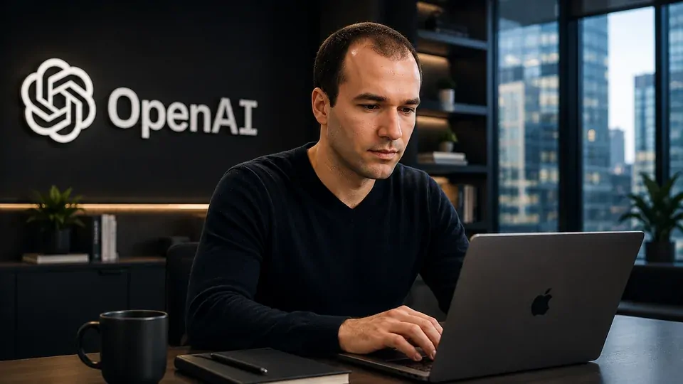

*Greg Brockman deixou de ocupar apenas um papel ligado à engenharia e passou a ganhar influência sobre decisões centrais da OpenAI. A mudança acontece enquanto a empresa enfrenta saídas de executivos, amplia sua operação comercial e tenta transformar sua escala em uma vantagem sustentável diante de concorrentes como Anthropic e Google.*

## A OpenAI está concentrando mais decisões em Brockman

A **OpenAI** atravessa uma das maiores reorganizações de sua história recente. A companhia perdeu executivos importantes em diferentes áreas e, ao mesmo tempo, passou a distribuir responsabilidades estratégicas de maneira diferente dentro da organização.

Nesse processo, **Greg Brockman**, cofundador e presidente da empresa, ganhou espaço. Reportagens recentes apontam que ele passou a atuar mais diretamente sobre diferentes áreas, incluindo estratégia de produtos, escala e operações comerciais.

A mudança é relevante porque Brockman sempre teve uma posição diferente da de executivos tradicionais. Seu perfil combina experiência técnica profunda com participação na definição da direção estratégica da companhia.

O resultado é uma concentração maior de decisões em torno de uma das pessoas que conhece a OpenAI desde sua formação. Para uma empresa que cresceu rapidamente com o ChatGPT, essa proximidade entre engenharia, produto e estratégia pode acelerar a execução.

## O papel de Brockman mudou junto com a escala da empresa

*Greg Brockman passou a exercer uma influência mais ampla sobre áreas estratégicas da OpenAI.*

Quando a **OpenAI** ainda era uma organização de pesquisa, o papel de Brockman estava fortemente associado à engenharia e à construção da infraestrutura necessária para desenvolver sistemas avançados de inteligência artificial.

A escala atual da empresa mudou essa equação. O ChatGPT transformou a OpenAI em uma companhia com mais de um bilhão de usuários semanais e mais de dois milhões de empresas utilizando seus produtos, segundo a própria empresa.

Esse crescimento exige decisões diferentes das tomadas por um laboratório de pesquisa. Produto, infraestrutura, distribuição, vendas e relacionamento com clientes corporativos passaram a depender de uma execução coordenada.

Brockman também assumiu formalmente a estratégia de produtos em uma reorganização anterior, quando a OpenAI buscou integrar esforços envolvendo **ChatGPT**, **Codex** e sua infraestrutura de IA. A mudança ajudou a aproximar o desenvolvimento técnico da estratégia de produto.

Agora, sua influência mais ampla sugere que a empresa está tentando reduzir a distância entre quem constrói a tecnologia e quem define como ela será transformada em negócio.

## A saída de executivos acelerou a reorganização

A ampliação do papel de Brockman acontece em paralelo a uma sequência de mudanças no alto escalão da **OpenAI**. Executivos responsáveis por áreas como operações, receita e outras funções estratégicas deixaram a companhia durante um período de forte transformação.

A empresa, porém, não está simplesmente substituindo pessoas. Algumas mudanças indicam uma tentativa de redesenhar a estrutura para uma organização que cresceu muito além do modelo de laboratório de pesquisa.

A nomeação de **Dali Rajic** como novo diretor de receita é um exemplo. A OpenAI afirmou que ele terá a missão de estruturar uma operação comercial capaz de acompanhar a próxima etapa de expansão da empresa.

Esse movimento ajuda a explicar por que a atuação de Brockman se tornou mais importante. A companhia precisa conectar desenvolvimento tecnológico, produtos e geração de receita com menos fragmentação.

### A pressão competitiva também aumentou

A reorganização acontece enquanto a **Anthropic** avança no mercado corporativo e outras empresas tentam disputar diferentes partes da cadeia de valor da inteligência artificial.

A competição deixou de depender apenas de quem possui o modelo mais avançado. Empresas precisam transformar capacidade computacional em produtos, serviços e contratos de longo prazo.

Nesse cenário, uma liderança com forte domínio técnico pode ajudar a OpenAI a decidir quais produtos devem receber recursos e quais projetos precisam ser reduzidos ou integrados.

## A estratégia de produtos ganhou importância para a OpenAI

*A OpenAI busca integrar produtos e infraestrutura para competir em uma etapa mais orientada à execução.*

A disputa pela liderança em IA está migrando para uma questão mais ampla: **quem conseguirá transformar modelos avançados em plataformas utilizadas diariamente por pessoas e empresas?**

Para a OpenAI, isso significa integrar diferentes partes de seu ecossistema. ChatGPT, Codex, APIs, agentes e futuros dispositivos precisam funcionar dentro de uma estratégia que permita à companhia aumentar utilização sem criar uma estrutura excessivamente fragmentada.

Esse movimento também ajuda a contextualizar a entrada da OpenAI na disputa por hardware. O Notícia Tech já analisou como a empresa **[entrou na corrida do hardware e prepara uma nova geração de dispositivos para o ChatGPT](https://noticiatech.com.br/inteligencia-artificial/openai-guerra-hardware-dispositivos-chatgpt/)**.

A questão central é que hardware, software e serviços de IA podem passar a fazer parte de uma mesma experiência. Para isso funcionar, a empresa precisa tomar decisões de produto com velocidade e manter uma direção tecnológica coerente.

É justamente nesse ponto que a influência de Brockman ganha importância. Seu perfil técnico pode facilitar a conexão entre infraestrutura, engenharia e produto, enquanto a empresa tenta transformar essa integração em vantagem competitiva.

## O que muda para a OpenAI com mais poder concentrado

A concentração de responsabilidades pode trazer uma vantagem imediata: **velocidade de decisão**.

Em uma empresa que cresce rapidamente, estruturas muito fragmentadas podem criar disputas internas por recursos, prioridades diferentes entre equipes e demora para transformar decisões estratégicas em produtos.

Ao aproximar mais áreas de uma liderança central, a **OpenAI** pode reduzir parte dessa fricção. Isso é especialmente importante quando a companhia precisa decidir onde concentrar enormes quantidades de capacidade computacional e talento técnico.

Mas existe um contraponto.

Quanto maior a concentração de decisões, maior também é a dependência da capacidade de poucos líderes. Uma organização do tamanho atual da OpenAI precisa manter velocidade sem criar um gargalo de gestão.

### A próxima fase será mais empresarial

A transformação também revela uma mudança na própria natureza da OpenAI.

A empresa não está mais apenas tentando desenvolver sistemas cada vez mais capazes. Ela precisa demonstrar que consegue transformar esses sistemas em produtos sustentáveis, conquistar empresas e construir uma operação comercial compatível com sua escala.

Essa mudança ocorre em paralelo aos preparativos para uma possível abertura de capital. Por isso, decisões sobre estrutura, liderança e eficiência operacional ganham peso muito maior do que tinham quando a companhia ainda funcionava essencialmente como um laboratório de pesquisa.

## Brockman terá papel decisivo na próxima fase da OpenAI

*A maior influência de Brockman coloca sua capacidade de execução no centro da próxima etapa da OpenAI.*

A ascensão de **Greg Brockman** não significa que Sam Altman tenha deixado de ser a principal figura executiva da OpenAI. Altman continua como CEO e permanece responsável pela direção geral da companhia.

O que mudou é a distribuição das responsabilidades. Brockman passou a ocupar uma posição mais central na execução de uma estratégia que exige integração entre tecnologia, produtos e negócios.

Para a OpenAI, essa combinação pode ser importante justamente porque a próxima batalha não será vencida apenas com novos modelos. A empresa precisa transformar sua tecnologia em uma plataforma cada vez mais presente no cotidiano de consumidores e organizações.

O mercado deverá observar, principalmente, se a nova estrutura consegue produzir três resultados: **mais velocidade de execução, maior integração entre produtos e crescimento sustentável da operação empresarial**.

A resposta determinará se a concentração de responsabilidades em Brockman será apenas uma solução para o atual período de turbulência ou se representará uma mudança permanente na forma como a OpenAI será administrada.

Enquanto isso, a empresa continua ampliando sua presença no mercado corporativo e ajustando sua estratégia para uma competição que envolve modelos, infraestrutura, agentes, software e hardware. O movimento já vinha sendo acompanhado pelo Notícia Tech em análises sobre **[a estratégia da OpenAI para ampliar o foco em empresas antes de uma possível abertura de capital](https://noticiatech.com.br/inteligencia-artificial/openai-estrategia-ipo-foco-empresas-inteligencia-artificial/)**.

O próximo teste para Brockman será transformar essa influência ampliada em execução consistente. Para uma empresa do tamanho da OpenAI, ganhar velocidade pode ser importante, mas fazer essa velocidade funcionar em escala será o verdadeiro desafio.

---