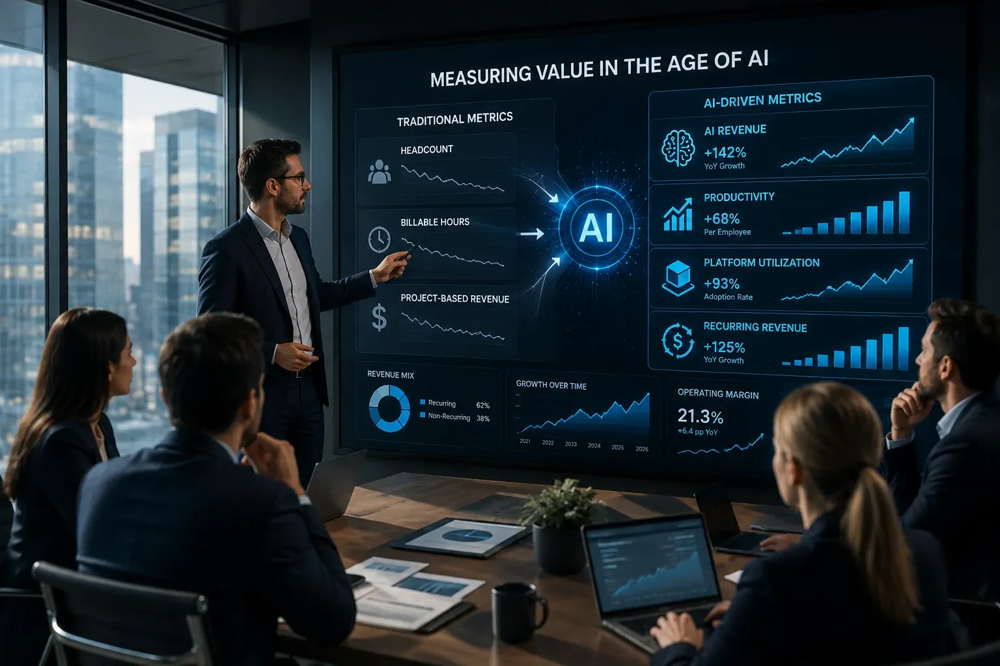
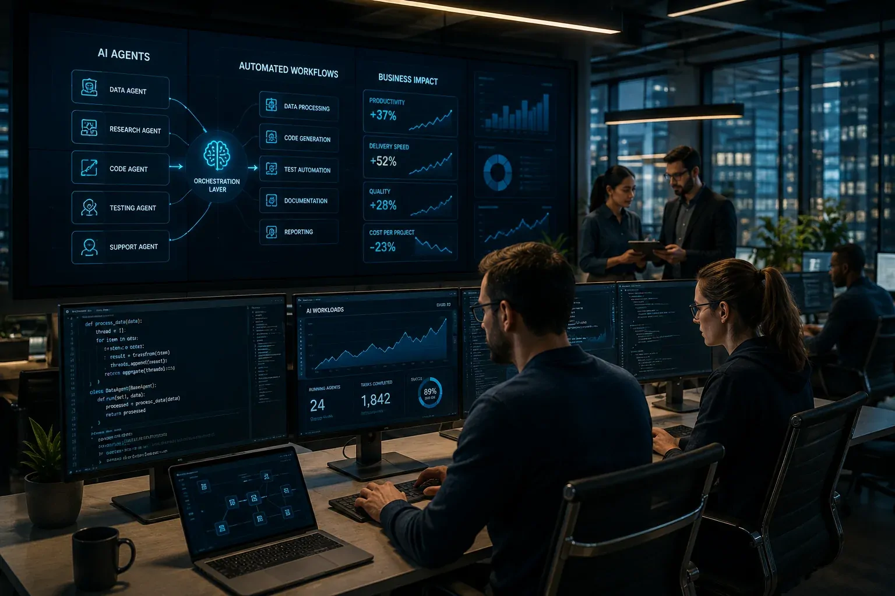
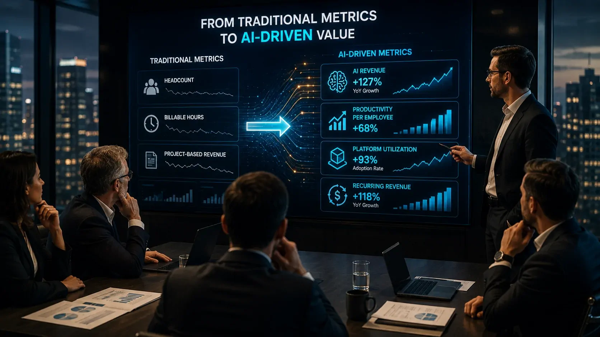

*Empresas de tecnologia começam a enfrentar uma mudança que vai além da adoção de ferramentas de inteligência artificial: a própria forma de medir produtividade, crescimento e valor econômico está sendo pressionada pela nova tecnologia.*

## A IA está mudando o que significa ser uma empresa de tecnologia eficiente

A **IA** começa a alterar a relação entre crescimento, trabalho humano e receita nas empresas de tecnologia. O efeito é especialmente relevante em companhias de serviços, nas quais o tamanho da força de trabalho e as horas faturáveis historicamente ajudaram a representar a capacidade de geração de receita.

### O modelo baseado em horas perde parte da força

Ferramentas de **IA** podem executar tarefas que antes exigiam trabalho humano direto. Isso significa que uma equipe pode entregar mais projetos sem necessariamente aumentar o número de funcionários na mesma proporção.

Esse movimento cria um problema para métricas tradicionais. Se duas empresas possuem equipes de tamanhos semelhantes, mas uma consegue produzir significativamente mais utilizando **IA**, o número de funcionários deixa de explicar sozinho a capacidade econômica de cada negócio.

### Produtividade passa a ser uma variável estratégica

A mudança não significa que headcount ou horas trabalhadas deixaram de ter importância. Eles continuam relevantes para entender custos e capacidade operacional, mas passam a contar apenas uma parte da história.

O ponto central é que a produtividade gerada pela **IA** pode alterar a relação entre pessoas, tempo e receita. Para gestores, isso significa que avaliar tecnologia apenas pelo custo da equipe ou pela quantidade de horas economizadas pode ser insuficiente.

## Empresas começam a procurar métricas que capturem o valor da IA

*O valor econômico da IA começa a ser observado por indicadores que vão além do tamanho da força de trabalho.*

A busca por novos indicadores já aparece no setor de serviços de tecnologia. A **Reuters** destacou que empresas estão começando a considerar métricas como receita associada à **IA**, receita recorrente e utilização de plataformas para refletir melhor o novo modelo econômico.

### Receita de IA ganha importância

A **Tata Consultancy Services (TCS)** oferece um exemplo concreto dessa mudança. No primeiro trimestre do **ano fiscal de 2027**, referente ao **período encerrado em junho de 2026**, a empresa informou que seu negócio de IA atingiu uma receita anualizada de **US$ 2,6 bilhões**, alta de **13,6%** em relação ao trimestre anterior

O indicador é relevante porque transforma a adoção de **IA empresarial** em uma métrica diretamente relacionada ao negócio. Em vez de comunicar apenas quantos funcionários receberam treinamento ou quantos projetos utilizam IA, a empresa consegue mostrar quanto desse mercado já se converte em receita.

### Receita recorrente aproxima serviços do modelo de software

Outro movimento importante é a tentativa de transformar serviços de **IA** em ofertas reutilizáveis e recorrentes. Uma plataforma que pode ser implementada em diferentes clientes possui características econômicas diferentes de um projeto construído integralmente do zero.

Essa mudança aproxima parte do mercado de serviços de tecnologia da lógica de **software**, na qual uma mesma base tecnológica pode atender muitos clientes. Para investidores e gestores, isso pode alterar a maneira de analisar escalabilidade, margem e previsibilidade de receita.

## O que muda para empresas que estão adotando IA

Para as empresas compradoras de tecnologia, a mudança significa que o retorno da **IA** precisa ser analisado além da simples redução de tarefas manuais. O valor está na capacidade de transformar produtividade em resultado empresarial.

### Reduzir horas não é necessariamente criar valor

Uma empresa pode automatizar uma atividade e reduzir o tempo necessário para executá-la. Isso representa ganho operacional, mas não garante sozinho aumento de receita ou vantagem competitiva.

O indicador mais importante passa a ser o que acontece depois da automação. A equipe utiliza o tempo liberado para atender mais clientes, melhorar produtos, aumentar vendas ou acelerar processos estratégicos? É essa conexão que transforma produtividade em valor econômico.

### A arquitetura de IA passa a importar

Quanto mais a **IA empresarial** deixa de ser uma ferramenta isolada e passa a integrar diferentes processos, maior é a importância da arquitetura tecnológica.

Empresas que estão avançando nessa direção precisam considerar integração de dados, agentes, automação e governança. Para entender essa camada estrutural, o Notícia Tech já explicou **[como funciona uma arquitetura de IA para empresas com RAG, MCP e agentes](/inteligencia-artificial/arquitetura-ia-empresas-rag-mcp-agentes-orquestracao/)**.

## A mudança também altera a lógica das empresas de serviços

*Com a IA aumentando a capacidade de entrega, empresas de serviços podem atender mais clientes sem ampliar suas equipes na mesma proporção.*

O impacto pode ser ainda maior nas empresas cujo modelo de negócio depende diretamente da venda de trabalho humano. Se a **IA** aumenta a produtividade, simplesmente contratar mais pessoas deixa de ser a única forma de aumentar a capacidade de entrega.

### Mais produtividade pode significar uma nova equação econômica

Uma empresa que utiliza **IA** para aumentar a produtividade pode atender mais clientes com a mesma estrutura. Isso abre espaço para crescimento sem que custos e receita precisem avançar na mesma proporção.

Mas existe um efeito contrário. Se os clientes perceberem que a IA permite entregar o mesmo trabalho com menos esforço, podem pressionar fornecedores por preços menores. Nesse cenário, parte do ganho de produtividade pode ser transferida para o cliente.

### Serviços começam a se aproximar de produtos

A resposta estratégica pode ser transformar conhecimento e processos internos em plataformas, ferramentas e serviços recorrentes. Em vez de vender somente horas de especialistas, a empresa passa a vender uma combinação de tecnologia, conhecimento e resultado.

Esse movimento ajuda a explicar por que **receita recorrente**, receita de IA e utilização de plataformas aparecem como métricas cada vez mais interessantes. A questão deixa de ser apenas quantas pessoas trabalham no negócio e passa a incluir quanto valor cada camada tecnológica consegue gerar.

## O impacto para profissionais e gestores pode ser maior do que parece

A mudança nas métricas também afeta quem trabalha dentro dessas empresas. Se produtividade passa a ser medida de outra forma, as competências valorizadas tendem a acompanhar essa transformação.

### O profissional deixa de ser avaliado apenas pelo volume produzido

Em ambientes com **IA**, executar uma tarefa rapidamente pode ser menos importante do que saber definir o problema, supervisionar sistemas e avaliar a qualidade do resultado.

Isso aumenta a importância de competências relacionadas a **IA**, análise, processos e tomada de decisão. O profissional que consegue combinar conhecimento de negócio com ferramentas de IA pode gerar mais valor do que aquele que apenas utiliza uma ferramenta de maneira isolada.

### Gestores precisam conectar tecnologia a indicadores de negócio

Para lideranças, o desafio é evitar que a adoção de **IA** seja medida por indicadores fáceis, mas pouco relevantes. Número de licenças, usuários ativos ou prompts realizados não mostram necessariamente retorno financeiro.

Uma avaliação mais útil conecta **IA** a custos, receita, produtividade, qualidade, tempo de entrega e satisfação do cliente. Essa lógica também aparece quando empresas redesenham processos inteiros em vez de simplesmente automatizar tarefas. O Notícia Tech já analisou **[como empresas usam IA para automatizar processos](/automacao/como-empresas-usam-ia-para-automatizar-processos/)**.

## O mercado ainda está aprendendo quais métricas realmente importam

*O próximo desafio das empresas será transformar ganhos de produtividade proporcionados pela IA em indicadores claros de crescimento e valor.*

A mudança não significa que exista uma nova fórmula universal para avaliar empresas de tecnologia. O que existe é uma pressão para complementar indicadores antigos com métricas capazes de capturar o efeito econômico da **IA**.

### O tamanho da equipe não desaparece da análise

Headcount continua sendo importante para entender custos, capacidade e estrutura organizacional. A diferença é que ele pode deixar de funcionar como um indicador isolado de capacidade produtiva.

Uma empresa com menos funcionários pode ser mais eficiente se possuir tecnologia, processos e produtos capazes de multiplicar a produção de cada profissional. Ao mesmo tempo, uma empresa maior pode continuar tendo vantagem se conseguir transformar escala em receita e distribuição.

### O próximo indicador pode ser a capacidade de transformar IA em receita

O movimento mais importante a acompanhar é a distância entre adoção de **IA** e geração de valor. Empresas podem utilizar inteligência artificial em praticamente todos os departamentos e ainda assim não produzir retorno econômico relevante.

Por isso, métricas como **receita de IA**, recorrência, margem, produtividade por funcionário e capacidade de reutilizar plataformas podem ganhar espaço ao lado dos indicadores tradicionais. Ainda é cedo para afirmar que existe um novo padrão consolidado, mas os primeiros sinais mostram que a forma de avaliar empresas de tecnologia está começando a mudar.

Para os gestores, a consequência prática é direta: investir em **IA** não deve ser tratado apenas como uma decisão tecnológica. A pergunta mais importante passa a ser quanto valor econômico a tecnologia consegue produzir e como esse valor aparece nos indicadores do negócio.