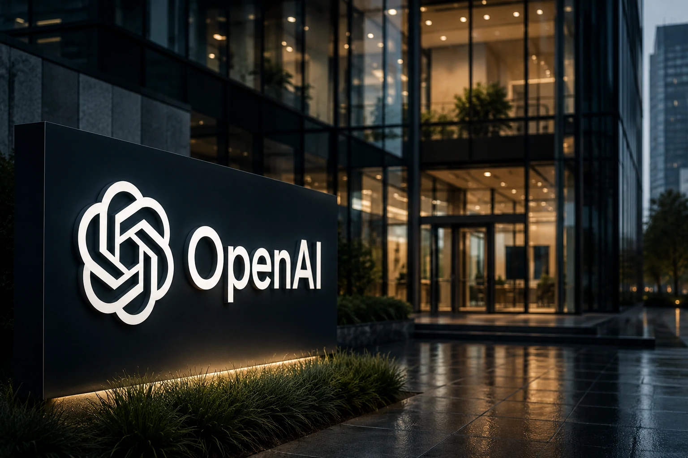
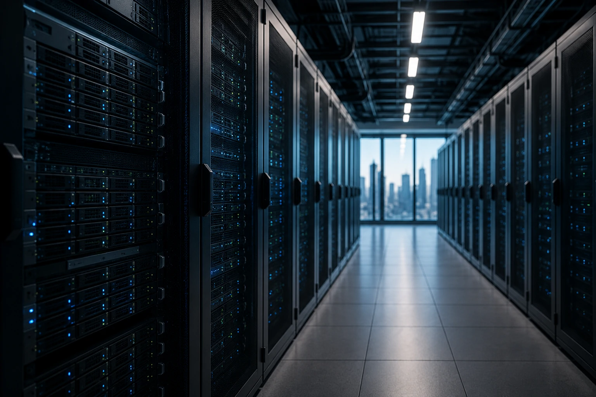
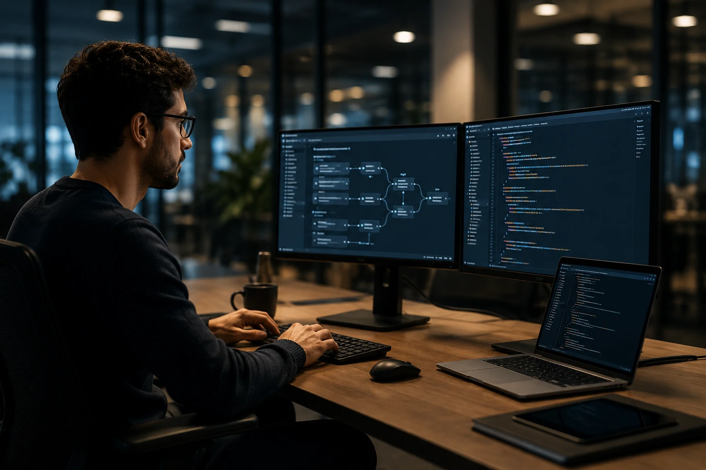

*Durante anos, a inteligência artificial foi tratada como uma aposta tecnológica. Agora, ela começa a ser tratada como uma classe de ativos. O movimento da **OpenAI** em direção ao mercado de capitais mostra que a disputa pela liderança da IA entrou em uma nova fase, na qual infraestrutura, receita e escala financeira passam a ser tão importantes quanto inovação técnica.*

## O pedido de IPO da OpenAI representa uma mudança estrutural no mercado de IA

*O movimento aproxima a inteligência artificial dos grandes ciclos históricos de expansão tecnológica do mercado financeiro.*

O pedido confidencial de IPO da **OpenAI** não deve ser interpretado apenas como uma operação financeira. O movimento sinaliza que a empresa acredita ter atingido um nível de maturidade capaz de sustentar expectativas típicas de companhias globais de tecnologia.

Nos últimos anos, a **OpenAI** deixou de ser vista apenas como criadora do **ChatGPT** para se tornar uma plataforma de infraestrutura digital utilizada por empresas, desenvolvedores e governos.

A abertura de capital também reforça a percepção de que a inteligência artificial está migrando da fase experimental para a fase operacional.

### Por que esse movimento acontece agora?

O mercado vive uma explosão de investimentos em infraestrutura computacional, data centers e agentes inteligentes.

Ao mesmo tempo, concorrentes como **Anthropic**, **Google**, **Microsoft** e **Meta** aceleram suas estratégias para capturar participação em um mercado que pode movimentar centenas de bilhões de dólares na próxima década.

### O que o IPO sinaliza para investidores?

O principal sinal é que a corrida da IA deixou de ser apenas tecnológica.

Agora existe uma disputa simultânea por capital, infraestrutura, distribuição e monetização em escala global.

## A disputa pela infraestrutura de IA está se tornando mais importante que os próprios modelos

*O centro da competição passa a ser a capacidade de sustentar operações massivas de IA.*

A maior vantagem competitiva das próximas líderes da IA pode não estar apenas nos modelos mais avançados.

Cada vez mais, o diferencial está na capacidade de financiar e operar gigantescas estruturas computacionais.

A própria **OpenAI** depende de investimentos bilionários em hardware, energia e capacidade de processamento para sustentar o crescimento de seus produtos.

### O custo oculto da inteligência artificial

Treinar modelos avançados exige infraestrutura que poucas empresas conseguem financiar.

Isso explica por que gigantes como **Microsoft**, **Google**, **Amazon** e **Oracle** vêm ampliando investimentos em data centers especializados.

Esse movimento se conecta diretamente com tendências já discutidas no Notícia Tech, como a aposta da **Oracle** em infraestrutura para IA:

[Oracle aposta na infraestrutura que pode sustentar a próxima geração da inteligência artificial](https://noticiatech.com.br/negocios/larry-ellison-oracle-infraestrutura-ia-empresas/)

### A nova corrida não é apenas por usuários

Durante a era das redes sociais, a disputa era por atenção.

Na era da IA, a disputa é por capacidade computacional.

Quem controlar infraestrutura terá vantagem na entrega de agentes inteligentes, plataformas corporativas e novos serviços digitais.

## Agentes de IA podem se tornar o principal motor de crescimento após a abertura de capital

*Os agentes inteligentes surgem como a próxima fronteira de monetização das plataformas de IA.*

A fase inicial da IA generativa foi dominada por chatbots.

A próxima etapa está sendo liderada por agentes capazes de executar tarefas, acessar sistemas e tomar decisões assistidas.

Para empresas abertas em bolsa, esse tipo de solução possui enorme potencial de receita recorrente.

Isso porque agentes corporativos podem ser vendidos como plataformas permanentes de produtividade.

### O mercado corporativo virou prioridade

A adoção empresarial oferece contratos maiores, retenção mais elevada e previsibilidade financeira.

Por isso, empresas de IA estão direcionando esforços para soluções corporativas em vez de focar exclusivamente no consumidor final.

Essa tendência também aparece em movimentos recentes do mercado de software:

[OpenAI e Salesforce mostram como os agentes podem transformar o SaaS corporativo](https://noticiatech.com.br/negocios/openai-salesforce-agentic-saas-transformacao-softwares-corporativos/)

### O que muda para as empresas?

As organizações passam a ter acesso a sistemas capazes de:

- automatizar fluxos de trabalho;
- realizar pesquisas complexas;
- operar múltiplas ferramentas;
- gerar análises estratégicas;
- acelerar processos internos.

O resultado potencial é uma nova camada operacional baseada em agentes digitais.

## O IPO pode acelerar uma consolidação histórica do setor de inteligência artificial

A abertura de capital da **OpenAI** também aumenta a pressão competitiva sobre todo o ecossistema.

Empresas rivais precisarão responder não apenas com inovação, mas também com escala financeira.

Isso tende a impulsionar fusões, aquisições e alianças estratégicas ao longo dos próximos anos.

### A IA está entrando na lógica dos mercados globais

Quando uma empresa de IA busca acesso aos mercados públicos, ela deixa de competir apenas por usuários.

Passa a competir por confiança institucional, crescimento previsível e retorno financeiro.

Essa mudança pode alterar a forma como produtos são desenvolvidos, distribuídos e monetizados.

### O próximo capítulo da corrida da IA

A discussão deixou de ser apenas quem possui o melhor modelo.

A pergunta passa a ser quem consegue transformar inteligência artificial em infraestrutura econômica de longo prazo.

Se o movimento da **OpenAI** for bem-sucedido, o setor pode entrar em um novo ciclo de expansão, no qual agentes inteligentes, plataformas corporativas e infraestrutura computacional se tornam os principais ativos estratégicos da economia digital.

---