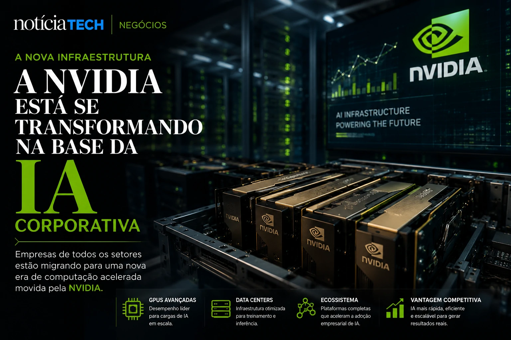
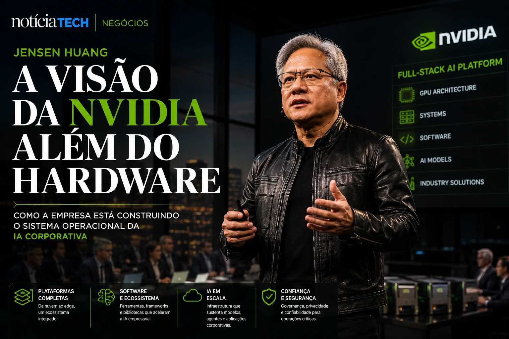

*A corrida pela inteligência artificial corporativa está criando uma nova disputa silenciosa no mercado global: quem controla a infraestrutura computacional que sustenta os sistemas de IA. No centro desse movimento está a NVIDIA, empresa liderada por **Jensen Huang**, que deixou de ser apenas fabricante de chips para se tornar peça estratégica da nova economia digital.*

## A NVIDIA está se transformando na infraestrutura operacional da inteligência artificial corporativa

A estratégia da **NVIDIA** mudou profundamente nos últimos anos. A companhia já não opera apenas como fornecedora de GPUs para games ou processamento gráfico. O foco agora é construir a base computacional que sustenta agentes autônomos, copilotos corporativos, sistemas generativos e operações empresariais movidas por IA.

Empresas de diferentes setores passaram a disputar capacidade computacional para acelerar projetos internos de inteligência artificial. O crescimento de plataformas generativas elevou drasticamente a necessidade de GPUs avançadas, data centers especializados e sistemas otimizados para treinamento e inferência de modelos.

A visão de **Jensen Huang** transformou a empresa em um dos pilares da nova corrida corporativa da IA.

Esse movimento conecta diretamente com a transformação abordada em [A era dos agentes de IA já começou: como Microsoft, OpenAI e Google estão transformando empresas em sistemas autônomos](https://noticiatech.com.br/inteligencia-artificial/a-era-dos-agentes-de-ia-j%C3%A1-come%C3%A7ou-como-microsoft-openai-e-google-est%C3%A3o-transformando-empresas-em-sistemas-aut%C3%B4nomos/), onde o mercado já começa a operar com estruturas cada vez mais automatizadas.

### Por que a infraestrutura virou prioridade estratégica?

A IA generativa aumentou significativamente o consumo computacional das empresas.

Antes, softwares corporativos dependiam principalmente de armazenamento e processamento tradicional. Agora, agentes inteligentes precisam operar:
- inferência em tempo real;
- memória contextual;
- análise multimodal;
- automação contínua;
- treinamento de modelos próprios.

Isso transformou infraestrutura em vantagem competitiva.

## Jensen Huang está posicionando a NVIDIA como “sistema operacional invisível” da IA empresarial

A estratégia da **NVIDIA** não envolve apenas hardware. A companhia expandiu presença em software, frameworks, ecossistemas de IA e plataformas corporativas.

A empresa passou a operar praticamente como uma camada estrutural da economia da inteligência artificial.

O mercado percebe que:
- modelos dependem da infraestrutura da NVIDIA;
- data centers dependem das GPUs da NVIDIA;
- agentes corporativos dependem de capacidade computacional avançada;
- empresas dependem de IA para manter competitividade.

Isso cria um efeito de centralização tecnológica extremamente poderoso.

A movimentação lembra a disputa descrita em [A nova aposta de Sam Altman pode transformar a OpenAI no sistema operacional invisível das empresas](https://noticiatech.com.br/negocios/a-nova-aposta-de-sam-altman-pode-transformar-a-openai-no-sistema-operacional-invis%C3%ADvel-das-empresas/), mas agora aplicada à camada de infraestrutura computacional.

### O que muda para empresas?

Empresas começam a perceber que IA não é apenas software.

A nova fase envolve:
- capacidade computacional;
- estratégia de dados;
- integração de agentes;
- governança operacional;
- infraestrutura escalável.

Isso aumenta a pressão sobre:
- cloud computing;
- data centers;
- custos energéticos;
- segurança operacional;
- soberania tecnológica.

## A corrida pela infraestrutura de IA pode redefinir o mercado global de tecnologia

A disputa atual já não acontece apenas entre modelos de IA. A nova guerra envolve quem controla:
- chips;
- processamento;
- infraestrutura;
- energia computacional;
- plataformas corporativas.

A expansão da **NVIDIA** mostra que a inteligência artificial está entrando em uma fase industrial.

Empresas começam a operar IA como camada permanente da operação corporativa, e não mais como projeto experimental.

Esse cenário também amplia movimentos analisados em [AI Operating Systems: por que empresas começam a substituir softwares isolados por ecossistemas autônomos de IA](https://noticiatech.com.br/negocios/ai-operating-systems-por-que-empresas-come%C3%A7am-a-substituir-softwares-isolados-por-ecossistemas-aut%C3%B4nomos-de-ia/).

### O impacto silencioso da nova economia computacional

A mudança mais importante talvez seja invisível para a maioria das empresas.

Enquanto o mercado discute ferramentas de IA, gigantes de tecnologia estão construindo o verdadeiro núcleo operacional da nova economia digital:
- infraestrutura;
- chips;
- agentes autônomos;
- data centers;
- ecossistemas computacionais.

A consequência pode ser uma nova concentração de poder tecnológico em escala global.

A IA deixou de ser apenas uma camada de software. Ela começa a redefinir toda a arquitetura operacional das empresas modernas — e poucas companhias parecem tão posicionadas para capturar esse movimento quanto a **NVIDIA** de **Jensen Huang**.

---