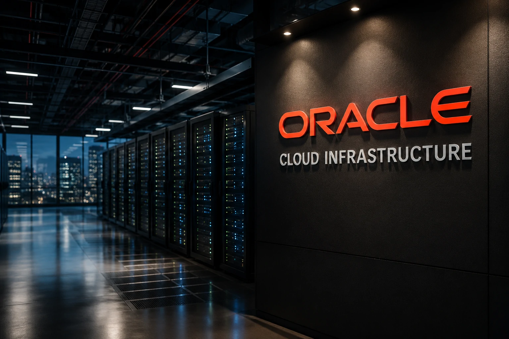

*Durante os últimos dois anos, grande parte da atenção do mercado ficou concentrada em empresas como **OpenAI**, **Google**, **Microsoft**, **Anthropic** e **Nvidia**. No entanto, uma movimentação menos visível começou a redesenhar os bastidores da inteligência artificial. A ascensão da **Oracle Cloud Infrastructure (OCI)** e os investimentos bilionários em capacidade computacional colocaram a **Oracle** novamente entre os protagonistas da transformação tecnológica global.*

## A Oracle está se tornando uma das principais fornecedoras da infraestrutura da inteligência artificial

*O crescimento da infraestrutura especializada para IA está reposicionando a Oracle dentro da cadeia de valor da nova economia digital.*

A corrida da inteligência artificial não depende apenas de modelos avançados.

Ela também exige capacidade computacional, armazenamento, redes de alta performance e data centers capazes de sustentar operações em escala global.

É justamente nesse ponto que a **Oracle** passou a ganhar relevância.

Enquanto muitas empresas disputam a camada de aplicações, a companhia está fortalecendo sua posição na infraestrutura que torna essas aplicações possíveis.

### Por que infraestrutura virou um ativo estratégico?

A expansão da IA generativa elevou drasticamente a demanda por processamento.

Treinar, hospedar e executar modelos avançados exige recursos que poucas organizações conseguem fornecer em escala.

Isso transformou provedores de infraestrutura em peças centrais da cadeia tecnológica.

### O mercado está entrando em uma nova fase

Nos primeiros anos da corrida da IA, a atenção estava concentrada nos modelos.

Agora o foco começa a migrar para a capacidade de sustentar esses modelos operacionalmente.

Esse movimento já apareceu em temas abordados pelo Notícia Tech, como [Google aposta US$ 80 bilhões em IA, infraestrutura computacional e guerra pelo mercado digital](https://noticiatech.com.br/negocios/google-aposta-80-bilhoes-ia-infraestrutura-computacional-guerra-mercado-digital/) e [Jensen Huang acelera visão da Nvidia e transforma IA em infraestrutura estratégica para empresas](https://noticiatech.com.br/negocios/jensen-huang-acelera-vis%C3%A3o-da-nvidia-e-transforma-ia-em-infraestrutura-estrat%C3%A9gica-para-empresas/).

## Larry Ellison voltou ao centro das decisões que moldam a próxima geração da tecnologia

*O fundador da Oracle reaparece como uma das figuras mais influentes na construção da infraestrutura da inteligência artificial.*

Durante anos, muitos investidores associaram a **Oracle** principalmente ao mercado de bancos de dados corporativos.

Essa percepção começa a mudar.

A empresa ampliou sua atuação em nuvem, acelerou investimentos em infraestrutura e passou a disputar espaço em um dos mercados mais estratégicos da década.

### O retorno de um veterano da tecnologia

Poucos executivos acompanharam tantas transformações tecnológicas quanto **Larry Ellison**.

O fundador da Oracle participou da expansão dos bancos de dados, da internet corporativa, da computação em nuvem e agora busca posicionar a empresa no centro da inteligência artificial.

### A importância da visão de longo prazo

Ao contrário de muitas startups de IA, a Oracle possui décadas de relacionamento com grandes empresas.

Essa base instalada cria vantagens competitivas importantes na oferta de soluções corporativas integradas.

Para organizações que operam sistemas críticos, confiança e estabilidade continuam sendo fatores decisivos.

## A disputa pela infraestrutura pode ser mais importante do que a disputa pelos modelos

*Empresas começam a perceber que a infraestrutura necessária para executar IA pode se tornar tão estratégica quanto os próprios modelos.*

A competição entre modelos de IA recebe enorme cobertura da mídia.

No entanto, existe uma batalha paralela acontecendo nos bastidores.

Quem controlar a infraestrutura poderá capturar uma parcela significativa do valor gerado pela nova economia digital.

### O mercado está construindo a nova camada operacional da IA

A inteligência artificial corporativa depende de uma combinação complexa de elementos:

- capacidade computacional;
- armazenamento de dados;
- conectividade;
- segurança;
- governança;
- integração empresarial.

Sem essa fundação, agentes inteligentes não conseguem operar de forma confiável.

### Oportunidade além da geração de conteúdo

A maior parte das discussões públicas sobre IA ainda gira em torno de chatbots e assistentes.

No ambiente corporativo, porém, a transformação ocorre em processos, operações e sistemas.

Isso se conecta diretamente a tendências analisadas pelo Notícia Tech em [OpenAI e Salesforce aceleram transformação dos softwares corporativos](https://noticiatech.com.br/negocios/openai-salesforce-agentic-saas-transformacao-softwares-corporativos/) e [MCP: a infraestrutura que conecta agentes de IA aos sistemas corporativos](https://noticiatech.com.br/inteligencia-artificial/mcp-infraestrutura-conecta-agentes-ia-sistemas-corporativos/).

## Empresas podem se beneficiar de uma nova competição entre gigantes da nuvem

A expansão da Oracle na infraestrutura de IA não afeta apenas investidores.

Ela também pode gerar impactos diretos para organizações que buscam acelerar transformação digital.

Quanto maior a competição entre provedores, maior tende a ser a oferta de soluções especializadas.

### O que muda para empresas?

Empresas ganham mais opções para:

- implementar agentes de IA;
- executar modelos avançados;
- reduzir dependência de um único fornecedor;
- negociar melhores condições de infraestrutura;
- acelerar projetos corporativos de automação.

A diversificação do mercado reduz riscos e amplia possibilidades estratégicas.

### O que observar nos próximos anos?

A próxima fase da inteligência artificial provavelmente será marcada por menos atenção aos modelos isolados e mais foco nos ecossistemas que permitem sua operação.

Nesse cenário, infraestrutura, dados, integração e governança passam a ter importância semelhante à dos próprios modelos.

A corrida da IA continua sendo apresentada como uma disputa entre empresas que criam algoritmos cada vez mais avançados. No entanto, os maiores vencedores podem surgir justamente na camada menos visível do mercado. Enquanto o mundo observa quem desenvolve os modelos mais poderosos, companhias como a **Oracle** trabalham para construir a fundação tecnológica que sustentará a próxima geração de sistemas inteligentes. E, na história da tecnologia, quem controla a infraestrutura frequentemente ocupa uma posição tão estratégica quanto quem controla a inovação visível.

---