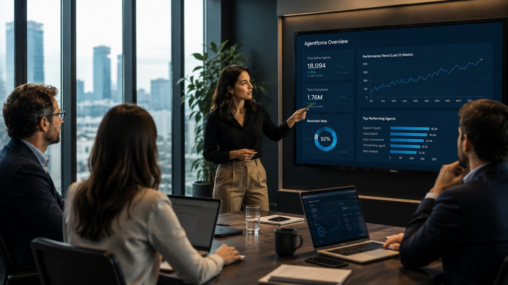
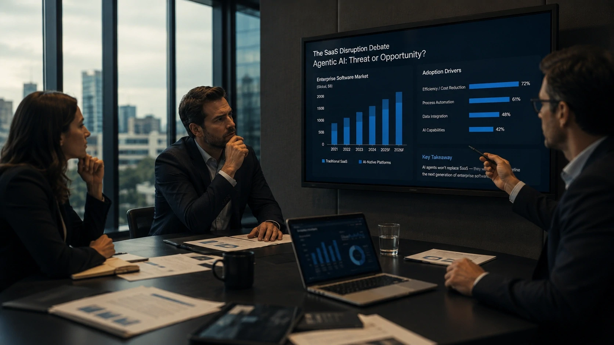

*O debate sobre inteligência artificial deixou de girar apenas em torno de modelos generativos e entrou definitivamente na estrutura operacional das empresas. As declarações recentes de **Marc Benioff**, fundador da **Salesforce**, mostram que a próxima fase da transformação digital pode estar menos ligada à criação de novos softwares e mais relacionada à construção de equipes híbridas formadas por humanos e agentes de IA.*

## Marc Benioff afirma que agentes de IA já estão mudando a forma como empresas contratam

Empresas de tecnologia começam a utilizar agentes de IA não apenas como ferramentas de produtividade, mas como componentes operacionais capazes de alterar decisões estratégicas de contratação.


As declarações recentes de **Marc Benioff** chamaram atenção do mercado após o executivo afirmar que a **Salesforce** praticamente deixou de ampliar seu quadro de engenheiros nos últimos ciclos de expansão. Segundo o CEO, o avanço dos agentes de programação elevou significativamente a produtividade interna.

### O que mudou dentro da Salesforce?

A empresa afirma que ferramentas de IA estão acelerando processos de desenvolvimento, testes e implementação de software.

Isso não significa necessariamente o desaparecimento dos engenheiros.

O que muda é a capacidade de uma mesma equipe produzir mais entregas utilizando agentes especializados.

### A produtividade virou o novo campo de disputa

Durante anos, empresas competiram aumentando equipes.

Agora, a competição começa a migrar para produtividade operacional ampliada por IA.

Esse movimento ajuda a explicar por que companhias estão direcionando bilhões para plataformas de agentes corporativos, infraestrutura de dados e automação avançada.

## A Salesforce tenta transformar agentes de IA em nova camada operacional das empresas

A estratégia da Salesforce não está limitada a adicionar IA dentro do CRM.

O objetivo é posicionar agentes inteligentes como uma camada operacional integrada aos processos corporativos.



A plataforma **Agentforce** tornou-se uma das principais apostas da empresa para os próximos anos. Segundo resultados recentes, iniciativas relacionadas a IA e dados já representam bilhões em receita recorrente anual para a companhia.

### O conceito de empresa agentic

O mercado começa a utilizar o termo "Agentic Enterprise".

A definição descreve organizações onde agentes inteligentes participam ativamente da execução de processos internos.

Esses agentes podem operar suporte, vendas, atendimento, análise de dados e tarefas administrativas.

### Por que o mercado está observando esse movimento?

Porque a Salesforce atende algumas das maiores operações corporativas do mundo.

Quando uma empresa dessa escala altera sua estratégia operacional, investidores, concorrentes e clientes passam a observar o potencial efeito dominó.

Esse movimento possui relação direta com tendências discutidas anteriormente em:

[Satya Nadella acelera aposta da Microsoft em agentes de IA e redefine a próxima disputa do mercado corporativo](https://noticiatech.com.br/negocios/satya-nadella-acelera-aposta-da-microsoft-em-agentes-de-ia-e-redefine-a-pr%C3%B3xima-disputa-do-mercado-corporativo/)

e também:

[A era dos agentes de IA já começou: como Microsoft, OpenAI e Google estão transformando empresas em sistemas autônomos](https://noticiatech.com.br/inteligencia-artificial/a-era-dos-agentes-de-ia-j%C3%A1-come%C3%A7ou-como-microsoft-openai-e-google-est%C3%A3o-transformando-empresas-em-sistemas-aut%C3%B4nomos/)

## O mercado começa a questionar se a IA ameaça ou fortalece o modelo tradicional de software

A ascensão dos agentes gerou uma nova preocupação entre investidores: a chamada tese do "SaaSpocalypse".

A teoria sugere que agentes de IA poderiam reduzir a dependência de softwares corporativos tradicionais.



A preocupação ganhou força após o avanço de ferramentas capazes de criar aplicações personalizadas utilizando linguagem natural.

### O argumento dos críticos

Segundo essa visão, empresas poderiam desenvolver internamente soluções antes dependentes de fornecedores SaaS.

Isso reduziria barreiras técnicas históricas.

Também poderia alterar modelos de licenciamento tradicionais.

### O argumento da Salesforce

**Marc Benioff** segue defendendo o oposto.

Para ele, a IA aumenta o valor das plataformas corporativas porque os agentes precisam de dados estruturados, governança e integração confiável para operar em escala.

Na prática, a discussão está menos relacionada ao desaparecimento do software e mais à redefinição do que significa software corporativo.

## A próxima corrida da IA pode acontecer dentro da estrutura organizacional das empresas

A transformação mais relevante talvez não esteja na tecnologia em si.

O impacto real pode acontecer na forma como empresas organizam trabalho, produtividade e tomada de decisão.

### O que muda para executivos?

Executivos passam a enfrentar novas perguntas:

- Quais funções podem ser ampliadas por agentes?
- Quais processos devem permanecer humanos?
- Como medir produtividade híbrida?
- Como criar governança para decisões automatizadas?

Essas questões começam a ocupar espaço crescente nos conselhos corporativos.

### O que muda para equipes?

Profissionais deixam de competir apenas com outros profissionais.

O novo cenário exige capacidade de trabalhar ao lado de sistemas autônomos.

Habilidades ligadas a contexto de negócios, relacionamento, negociação e supervisão estratégica tendem a ganhar relevância.

### O que isso revela sobre a próxima fase da IA corporativa?

As falas de **Marc Benioff** mostram que o mercado entrou em uma etapa diferente da adoção de inteligência artificial.

A discussão já não está restrita a modelos mais avançados ou novas interfaces conversacionais.

O foco começa a migrar para arquitetura organizacional, produtividade ampliada e integração operacional.

Enquanto muitas empresas ainda experimentam ferramentas isoladas de IA, gigantes como **Salesforce**, **Microsoft**, **OpenAI** e **Google** já disputam quem fornecerá a infraestrutura invisível que sustentará a próxima geração de organizações digitais.

E essa disputa pode redefinir não apenas o software corporativo, mas também a própria lógica de crescimento das empresas nos próximos anos.
```
