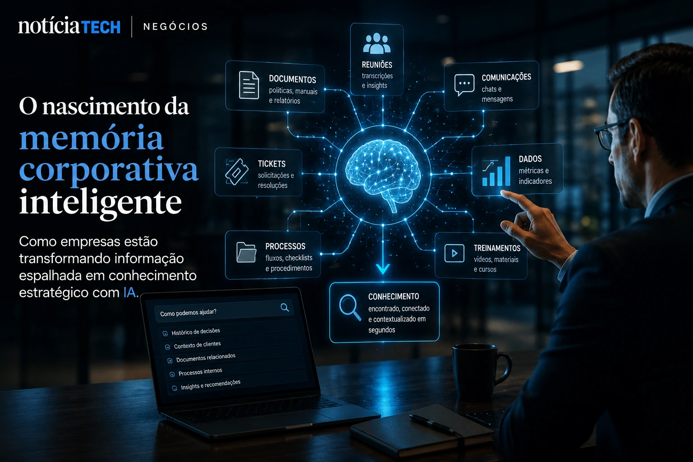
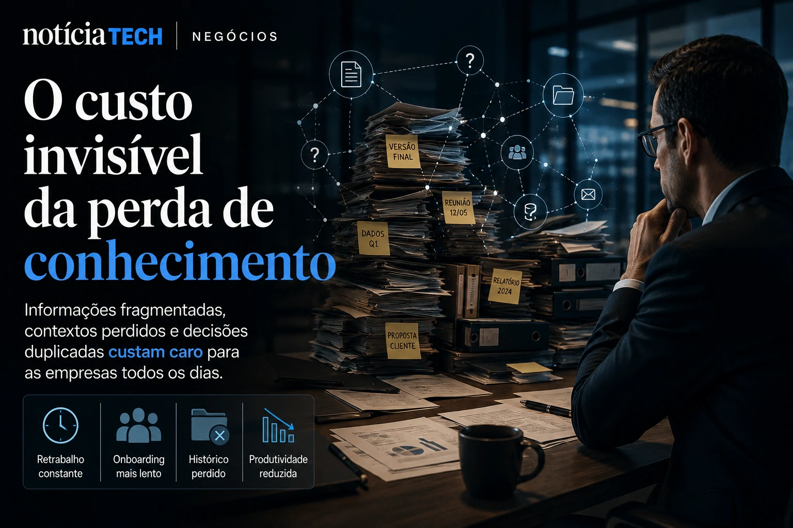
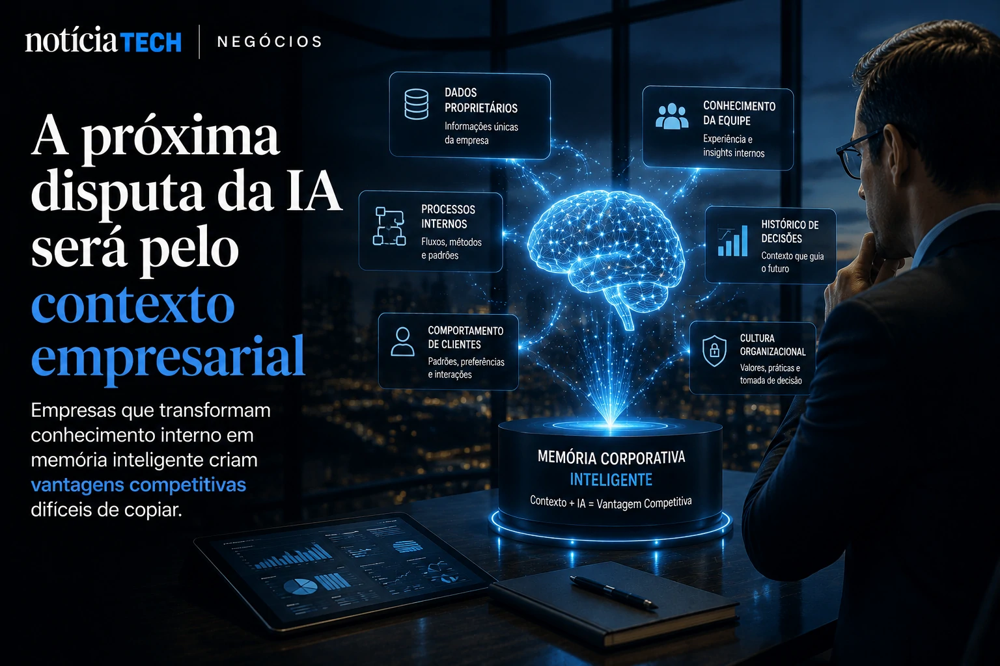

*Durante anos, empresas acumularam documentos, apresentações, reuniões, processos e informações espalhadas entre plataformas, equipes e softwares diferentes. Agora, a ascensão da **IA generativa** está transformando esse caos invisível em um novo ativo estratégico: a memória corporativa inteligente. Em 2026, organizações começam a perceber que o diferencial competitivo não está apenas em adotar IA, mas em ensinar sistemas a entender, conectar e reutilizar conhecimento interno com contexto operacional.*

## O nascimento da “memória corporativa inteligente”

A explosão da **IA generativa** criou um novo desafio dentro das empresas: informação demais e contexto de menos.

Ferramentas de produtividade, CRMs, chats corporativos, reuniões gravadas, tickets de suporte, documentos internos e dashboards geram um volume gigantesco de conhecimento que raramente é reutilizado de forma estratégica.

O problema é que grande parte desse conhecimento fica preso em silos.

Quando um colaborador sai da empresa, processos são perdidos. Quando equipes mudam, decisões precisam ser refeitas. Quando gestores tentam acelerar operações, percebem que informações importantes estão fragmentadas em dezenas de sistemas.

É exatamente nesse cenário que surge a chamada **memória corporativa com IA**.

Na prática, empresas estão utilizando modelos de IA para:

- organizar documentos internos;
- interpretar histórico de decisões;
- contextualizar reuniões;
- criar bases de conhecimento inteligentes;
- acelerar treinamentos;
- recuperar informações operacionais em segundos.

O objetivo não é apenas “buscar arquivos”.

A nova camada estratégica consiste em permitir que sistemas compreendam relações entre informações, contexto histórico, fluxos operacionais e padrões internos da empresa.

Isso muda completamente a forma como organizações lidam com produtividade e tomada de decisão.

Esse movimento se conecta diretamente à transformação dos sistemas corporativos em ambientes cada vez mais autônomos, como já acontece na evolução dos agentes inteligentes discutida em [A era dos agentes de IA já começou: como Microsoft, OpenAI e Google estão transformando empresas em sistemas autônomos](https://noticiatech.com.br/inteligencia-artificial/a-era-dos-agentes-de-ia-j%C3%A1-come%C3%A7ou-como-microsoft-openai-e-google-est%C3%A3o-transformando-empresas-em-sistemas-aut%C3%B4nomos/).

### A diferença entre armazenamento e inteligência contextual

Historicamente, empresas armazenavam dados.

Agora, elas querem interpretar contexto.

Essa mudança parece pequena, mas representa uma transformação estrutural.

Uma base tradicional de documentos exige que o usuário saiba exatamente o que procurar.

Já sistemas modernos alimentados por **LLMs** conseguem:

- resumir históricos complexos;
- correlacionar decisões passadas;
- identificar padrões;
- responder perguntas operacionais;
- sugerir ações futuras com base em contexto anterior.

Na prática, a IA começa a funcionar como uma espécie de “memória operacional coletiva”.

## Empresas começam a perceber o custo invisível da perda de conhecimento

Muitas organizações descobriram tarde demais que parte dos seus gargalos operacionais vinha da incapacidade de reutilizar conhecimento interno.

Em empresas médias e grandes, isso gera impactos silenciosos:

- retrabalho constante;
- decisões duplicadas;
- onboarding lento;
- dependência excessiva de pessoas específicas;
- perda de histórico estratégico;
- baixa eficiência operacional.

O problema ficou ainda mais evidente após a aceleração do trabalho híbrido e remoto.

Com equipes distribuídas, o conhecimento deixou de circular naturalmente.

Ao mesmo tempo, o crescimento acelerado das ferramentas de IA aumentou a expectativa por produtividade instantânea.

Mas existe uma contradição importante:

Uma IA sem contexto interno produz respostas superficiais.

Por isso, cresce rapidamente o interesse por arquiteturas chamadas de:

- **RAG (Retrieval-Augmented Generation)**;
- sistemas de memória persistente;
- knowledge graphs corporativos;
- copilotos empresariais contextualizados.

A ideia central é simples:

Quanto maior a capacidade da IA compreender a operação da empresa, maior seu valor estratégico.

Esse cenário conversa diretamente com outro problema crescente do mercado: o uso desorganizado da IA dentro das organizações, abordado em [Empresas descobrem que IA sem organização interna aumenta custos e reduz produtividade](https://noticiatech.com.br/negocios/empresas-descobrem-que-ia-sem-organiza%C3%A7%C3%A3o-interna-aumenta-custos-e-reduz-produtividade/).

### O risco operacional do conhecimento fragmentado

Empresas começam a perceber que informação descentralizada gera riscos reais.

Em muitos casos:

- áreas diferentes trabalham com versões conflitantes de dados;
- decisões são tomadas sem histórico adequado;
- processos dependem de conhecimento informal;
- equipes perdem tempo procurando contexto.

A consequência é uma operação menos escalável.

Por isso, sistemas de memória corporativa deixam de ser apenas uma tendência tecnológica e passam a ser tratados como infraestrutura estratégica.

## A próxima disputa da IA será pelo contexto empresarial

A corrida da IA está entrando em uma nova fase.

No início, a disputa era por modelos maiores.

Depois, por velocidade.

Agora, o diferencial competitivo começa a migrar para algo mais difícil de replicar: contexto proprietário.

Isso significa que empresas com melhor organização interna de conhecimento terão vantagem operacional relevante nos próximos anos.

Porque modelos de IA genéricos são acessíveis para praticamente todos.

O que não é facilmente replicável é:

- histórico operacional;
- inteligência organizacional;
- processos internos;
- comportamento de clientes;
- cultura decisória;
- dados proprietários contextualizados.

É exatamente por isso que gigantes da tecnologia passaram a investir pesado em sistemas de memória persistente, agentes autônomos e integração profunda entre IA e produtividade corporativa.

Ao mesmo tempo, cresce a preocupação com o chamado **Shadow AI**, fenômeno em que funcionários utilizam ferramentas de IA sem controle corporativo adequado, ampliando riscos de vazamento de dados e perda de governança. Esse movimento já vem sendo observado em [Shadow AI: empresas descobrem que uso invisível de inteligência artificial já virou risco operacional em 2026](https://noticiatech.com.br/negocios/shadow-ai-empresas-descobrem-que-uso-invis%C3%ADvel-de-intelig%C3%AAncia-artificial-j%C3%A1-virou-risco-operacional-em-2026/).

### A IA começa a deixar de ser ferramenta para virar infraestrutura

Talvez essa seja a maior mudança invisível acontecendo agora.

Durante os primeiros anos da IA generativa, muitas empresas tratavam essas soluções como ferramentas isoladas.

Mas o mercado começa a caminhar para outro estágio.

A IA passa a ocupar uma posição estrutural dentro da operação.

Ela deixa de apenas responder perguntas e começa a:

- entender fluxos internos;
- acompanhar processos;
- contextualizar decisões;
- armazenar conhecimento;
- conectar equipes;
- acelerar operações complexas.

No longo prazo, isso pode transformar completamente a maneira como empresas constroem eficiência operacional.

Porque organizações que conseguirem transformar conhecimento interno em memória acessível terão uma vantagem difícil de copiar — especialmente em um cenário onde velocidade de decisão, contexto e automação passam a definir competitividade digital.

---