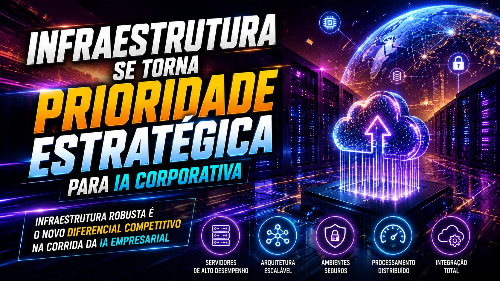

*O mercado de inteligência artificial empresarial está entrando em uma nova fase de consolidação. A aquisição da **Astreya** pela **Cognizant**, em um negócio avaliado em aproximadamente **US$ 600 milhões**, mostra que a corrida pela IA corporativa não é mais apenas sobre modelos — agora é sobre infraestrutura, escala e operação real.*

*Movimento da Cognizant reforça consolidação acelerada do setor de infraestrutura de IA.*

## A consolidação da IA corporativa começou

*Gigantes da tecnologia aceleram aquisições para fortalecer infraestrutura de inteligência artificial.*

O mercado de inteligência artificial está mudando rapidamente.

Nos primeiros anos da explosão da IA generativa, o foco era quase totalmente em modelos.

Quem tinha o modelo mais avançado dominava manchetes, atraía investimentos e capturava mercado.

Mas esse ciclo começou a mudar.

Agora, empresas perceberam que o verdadeiro desafio não está em criar inteligência.

Está em **operacionalizar inteligência**.

E é exatamente por isso que a **Cognizant** decidiu comprar a **Astreya**, uma empresa especializada em infraestrutura tecnológica, operação de data centers e ambientes corporativos de IA.

A aquisição fortalece a posição da empresa em um momento em que a demanda por implantação escalável de IA cresce globalmente. :contentReference[oaicite:2]{index=2}

Esse movimento acompanha uma tendência que já vimos no mercado com a disputa entre **OpenAI** e **Anthropic** pelo controle da implementação de IA nas empresas.

Agora a lógica é clara:

**quem controla a infraestrutura, controla a escalabilidade.**

## Por que infraestrutura virou prioridade no mercado de IA

*Infraestrutura robusta é o novo diferencial competitivo na corrida da IA empresarial.*

Muita gente olha para inteligência artificial e pensa apenas em software.

Mas a realidade corporativa é diferente.

IA em escala exige:

- servidores robustos  
- arquitetura de dados  
- redes de alta performance  
- ambientes seguros  
- integração entre sistemas  
- processamento distribuído  

Sem isso, não existe operação.

A **Astreya** construiu sua reputação justamente nesse campo.

A empresa atua há anos administrando operações complexas de infraestrutura para algumas das maiores empresas de tecnologia do mundo.

E isso tem valor estratégico.

Porque a nova corrida da IA não é só sobre inteligência.

É sobre sustentação operacional.

Esse ponto se conecta diretamente com o crescimento do uso de IA para redução de custos operacionais, onde a infraestrutura é parte crítica da eficiência.

## O que a Cognizant ganha com essa aquisição

A aquisição entrega três vantagens claras para a **Cognizant**.

### Escalabilidade operacional

Com a infraestrutura da Astreya, a Cognizant pode acelerar implementação de IA em clientes corporativos.

Isso reduz tempo de implantação.

E tempo é vantagem competitiva.

### Expansão de portfólio

A empresa amplia sua oferta.

Agora pode atuar não apenas em consultoria e transformação digital, mas também na camada operacional.

Isso aumenta ticket médio.

### Posicionamento estratégico

O mercado de serviços de IA está ficando mais competitivo.

Empresas como **Accenture**, **IBM** e **Capgemini** estão ampliando presença.

Fortalecer infraestrutura é uma defesa competitiva importante.

## O impacto desse movimento para empresas brasileiras

*Mercado brasileiro pode se beneficiar da nova fase de consolidação da IA corporativa.*

No Brasil, esse tipo de movimento costuma antecipar tendências.

O que acontece nos grandes mercados normalmente chega aqui com força.

Especialmente em setores como:

- varejo  
- bancos  
- fintechs  
- logística  
- saúde  
- atendimento ao cliente  

Empresas brasileiras estão aumentando investimento em IA.

Mas enfrentam dificuldades clássicas:

- integração de sistemas  
- infraestrutura limitada  
- baixa maturidade operacional  

Se o mercado global acelerar soluções completas, isso pode reduzir barreiras no Brasil.

Esse cenário se conecta com empresas que já estão usando IA para cobrança e recuperação de receita e buscando maior eficiência operacional.

A infraestrutura certa pode acelerar tudo isso.

## O novo jogo da IA B2B é escala e operação

O mercado está amadurecendo.

E isso muda prioridades.

Antes:

modelo.

Agora:

infraestrutura.

Depois:

execução.

Esse ciclo é natural.

Toda tecnologia passa por isso.

Primeiro inovação.

Depois padronização.

Depois consolidação.

A compra da Astreya pela Cognizant é um sinal claro de que estamos entrando nessa terceira fase.

E isso é importante.

Porque consolidação geralmente significa:

mais competição  
mais eficiência  
mais oferta  
mais pressão por resultados

E no mercado B2B, resultado é o centro de tudo.

## A próxima grande disputa será invisível para o público

Se antes a disputa era pública e visível — modelos, benchmarks e lançamentos — agora ela migra para bastidores.

Infraestrutura.

Operação.

Implementação.

Integração.

É menos glamouroso.

Mas muito mais lucrativo.

E talvez esse seja o ponto mais importante:

a próxima geração de líderes em IA corporativa pode não ser quem cria o melhor modelo.

Pode ser quem entrega o melhor sistema funcionando dentro das empresas.

E essa diferença muda completamente o mercado.