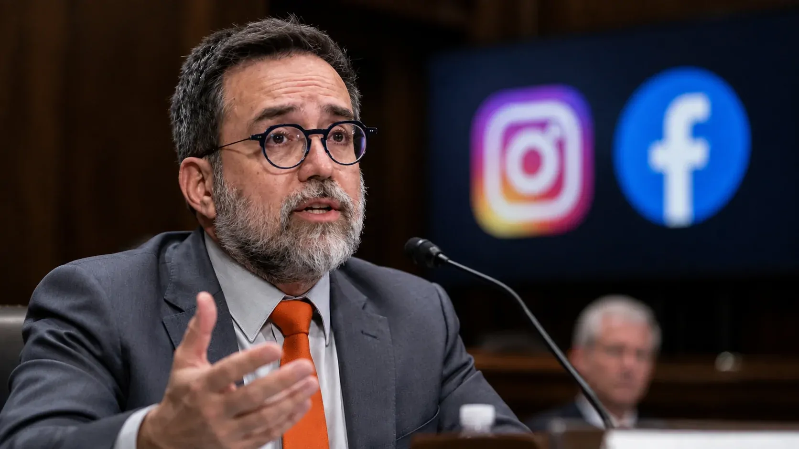
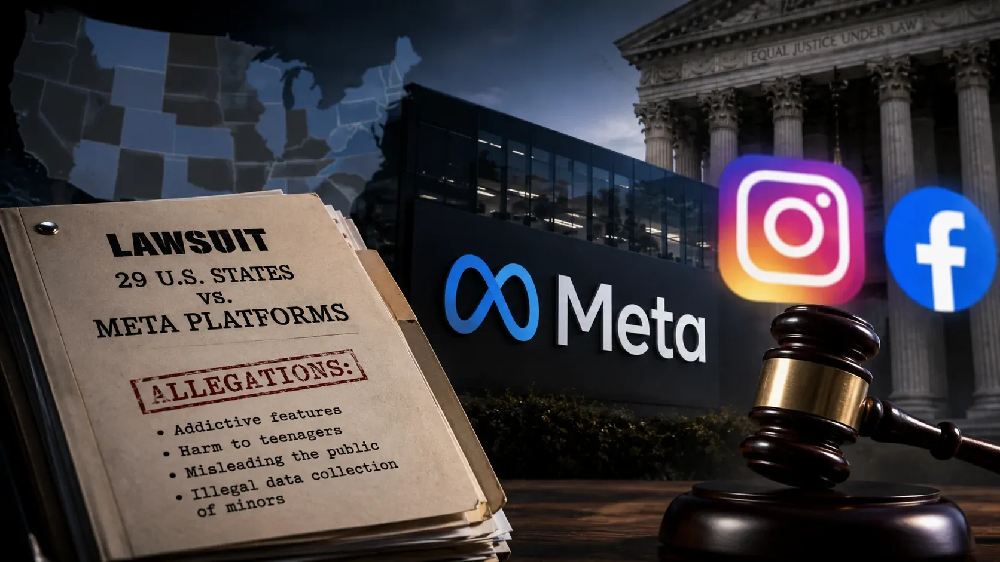
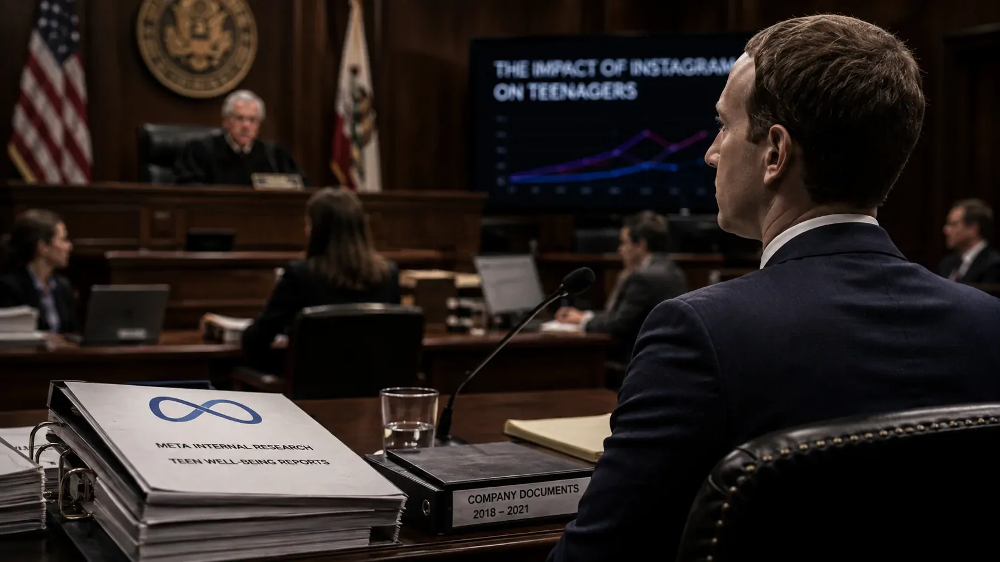

*Um julgamento federal iniciado na Califórnia colocou a **Meta**, dona do **Instagram** e do **Facebook**, no centro de uma disputa que envolve 29 estados americanos, documentos internos, depoimentos de ex-funcionários e acusações de que a empresa teria priorizado engajamento e receita enquanto conhecia problemas relacionados ao uso de suas plataformas por jovens.*

## O que levou a Meta ao tribunal

O processo reúne **29 estados dos Estados Unidos** que acusam a **Meta** de ter desenvolvido recursos do **Instagram** e do **Facebook** capazes de estimular o uso compulsivo por crianças e adolescentes. Os estados também alegam que a empresa enganou o público sobre a segurança das plataformas e coletou dados de usuários menores de 13 anos sem o consentimento exigido dos responsáveis.

### O julgamento começou em agosto

A fase atual começou em **18 de agosto de 2026**, em um tribunal federal de Oakland, na Califórnia. Embora a ação envolva 29 estados, **Califórnia, Colorado, Kentucky e Nova Jersey** conduzem as alegações estaduais neste julgamento. As reivindicações federais apresentadas conjuntamente pelos estados também fazem parte do processo.

O julgamento deve durar aproximadamente seis a oito semanas. Entre as testemunhas previstas estão **Mark Zuckerberg**, CEO da **Meta**, **Adam Mosseri**, chefe do **Instagram**, além de outros executivos, especialistas e funcionários da empresa.

### O que os estados precisam provar

A acusação não se limita a dizer que adolescentes podem sofrer efeitos negativos ao utilizar redes sociais. Os procuradores tentam demonstrar que a **Meta sabia dos problemas**, que determinadas características dos produtos incentivavam o uso prolongado e que a empresa não teria tomado medidas suficientes para reduzir esses riscos.

A defesa da **Meta** contesta essa interpretação. Seus advogados afirmam que os documentos apresentados pelos estados foram retirados de contexto e que a empresa realizou pesquisas e criou ferramentas destinadas a melhorar a segurança e o bem-estar dos adolescentes.

## O que os documentos e depoimentos revelaram

*O depoimento de Arturo Béjar colocou no centro do julgamento os alertas internos sobre segurança e bem-estar de adolescentes.*

Um dos elementos centrais do julgamento são documentos internos e depoimentos de pessoas que trabalharam na **Meta**. O material apresentado pelos estados busca estabelecer uma ligação entre o que a empresa sabia internamente e as decisões tomadas sobre seus produtos.

### Arturo Béjar levou os alertas até Zuckerberg

O principal depoente da primeira semana foi **Arturo Béjar**, ex-diretor de engenharia e responsável por trabalhos relacionados à segurança e ao bem-estar dos usuários. Ele trabalhou no **Facebook** entre 2009 e 2015 e retornou à empresa como consultor entre 2019 e 2021.

Béjar afirmou que levou aos executivos informações sobre experiências prejudiciais enfrentadas por adolescentes no **Instagram**. Segundo seu depoimento, uma pesquisa realizada por sua equipe indicou que **51% dos usuários entrevistados haviam tido uma experiência considerada ruim ou prejudicial nos sete dias anteriores**. Ele também afirmou que os resultados foram encaminhados a executivos, incluindo **Mark Zuckerberg**.

O ex-funcionário declarou que chegou a conversar com Zuckerberg mais de 100 vezes durante seu trabalho na empresa. Em um dos episódios citados no julgamento, Béjar disse que enviou informações diretamente ao CEO e não recebeu resposta.

### A acusação sobre a cultura interna

Béjar também afirmou que a cultura da empresa dificultava mudanças relacionadas à segurança e ao bem-estar. Ele criticou recursos como **rolagem infinita**, reprodução automática de vídeos, contadores de curtidas e ferramentas de controle de tempo.

Segundo o depoimento, mecanismos como o **Take a Break** e o **Quiet Mode** dependiam de ativação voluntária do usuário. Béjar considerou esse modelo insuficiente para adolescentes porque a proteção não seria aplicada automaticamente.

As declarações de Béjar são parte da argumentação dos estados, não uma conclusão judicial definitiva sobre a conduta da **Meta**.

## Por que a rolagem infinita virou parte da disputa

A discussão sobre o desenho dos produtos é importante porque os estados não estão questionando somente o conteúdo publicado pelos usuários. Eles também atacam determinadas **características incorporadas às próprias plataformas**.

### Mais tempo na plataforma significa mais publicidade

A acusação sustenta que recursos como **rolagem infinita**, notificações, recomendações automáticas e curtidas foram desenvolvidos para manter os usuários ativos por mais tempo. A justificativa apresentada pelos estados é que esse comportamento também aumenta as oportunidades de exibição de publicidade.

O próprio Béjar relacionou a quantidade de visualizações à receita publicitária durante seu depoimento. A lógica apresentada por ele é simples: quanto mais conteúdo é consumido, maior é o número de oportunidades para exibir anúncios.

Esse ponto também ajuda a explicar por que o caso ultrapassa a discussão sobre segurança infantil e chega ao **modelo de negócios da Meta**. O debate judicial passa a ser sobre até que ponto uma empresa pode utilizar mecanismos de maximização de engajamento quando seus próprios dados e funcionários apontam riscos para determinados grupos de usuários.

### A Meta diz que não projetou produtos para viciar crianças

A defesa rejeita a caracterização de que **Instagram** e **Facebook** tenham sido deliberadamente projetados para viciar crianças. A empresa também afirma que não permite oficialmente que menores de 13 anos tenham contas e informou que desativou mais de um milhão de contas identificadas como pertencentes a crianças abaixo dessa idade.

A disputa, portanto, não está encerrada pelos depoimentos apresentados até agora. O tribunal ainda precisa avaliar o conjunto das provas, incluindo os documentos internos apresentados pelos dois lados e os depoimentos dos executivos da companhia.

## A cifra de US$ 1,4 trilhão não é uma condenação

*O valor de US$ 1,4 trilhão representa uma possibilidade de penalidades discutida no processo, não uma condenação já determinada.*

O número que mais chamou atenção antes do julgamento foi **US$ 1,4 trilhão**. Mas esse valor precisa ser interpretado corretamente.

### De onde veio o valor

Em julho, a **Meta** informou em uma manifestação judicial que os quatro estados que conduzem as alegações estaduais poderiam buscar penalidades calculadas em até **US$ 1,4 trilhão**. O cálculo considera as penalidades previstas nas leis estaduais e o número de usuários potencialmente afetados.

Isso não significa que um tribunal tenha determinado que a **Meta** deverá pagar US$ 1,4 trilhão. Trata-se de uma estimativa apresentada no contexto da disputa sobre como eventuais penalidades deveriam ser calculadas.

A própria cobertura do julgamento mostra que os valores efetivamente buscados pelos procuradores podem ser muito menores dependendo da tese jurídica aplicada. Por isso, **US$ 1,4 trilhão deve ser tratado como exposição potencial, e não como multa já definida**.

### O resultado pode ir além do dinheiro

O pedido dos estados também inclui mudanças no funcionamento das plataformas. Entre as medidas discutidas estão restrições relacionadas à idade, alterações em recursos de engajamento, controles sobre notificações e mudanças na utilização de dados de menores.

Esse aspecto pode ser mais importante para a **Meta** no longo prazo do que uma penalidade financeira isolada. Se medidas semelhantes forem determinadas em diferentes processos, a empresa poderá ter de alterar partes da experiência oferecida pelo **Instagram** e pelo **Facebook**.

## O caso atual não começou em agosto

O julgamento federal é apenas uma etapa de uma disputa muito maior. A **Meta** enfrenta desde 2022 uma série de processos relacionados ao suposto impacto de suas plataformas sobre crianças e adolescentes.

### Novo México já produziu uma derrota importante

Em março de 2026, um júri no **Novo México** considerou a **Meta** responsável por violações das leis de proteção ao consumidor do estado e determinou **US$ 375 milhões em penalidades civis**.

Em agosto, após uma segunda fase do processo, o juiz determinou mais **US$ 567 milhões** para medidas de reparação e impôs mudanças supervisionadas judicialmente. Com isso, a exposição financeira da **Meta** no caso chegou a **US$ 942 milhões**. A empresa informou que pretende recorrer.

As medidas determinadas no Novo México incluem mudanças relacionadas a notificações, curtidas, limites de uso e proteção de menores, mostrando que os processos estaduais podem produzir consequências práticas para o funcionamento das plataformas.

### Tennessee também está em julgamento

Outro processo estadual entrou em julgamento em **20 de julho de 2026**, no Tennessee. A acusação estadual apresentou documentos internos e argumentou que a **Meta** manteve recursos como reprodução automática, notificações e rolagem infinita mesmo diante de pesquisas e alertas sobre possíveis impactos negativos para adolescentes.

O processo federal envolvendo os 29 estados, portanto, não é um episódio isolado. A **Meta** enfrenta uma sequência de ações em diferentes jurisdições, além de processos de famílias, escolas e outros grupos.

## O que acontece depois do julgamento

*Mark Zuckerberg e outros executivos da Meta estão entre as testemunhas previstas para as próximas etapas do julgamento.*

O processo de Oakland deverá avançar por várias semanas, com depoimentos de executivos e especialistas depois da apresentação das primeiras testemunhas dos estados.

### Zuckerberg e Mosseri estão entre os próximos nomes

**Mark Zuckerberg** e **Adam Mosseri** estão entre os executivos previstos para testemunhar. Os depoimentos poderão colocar diretamente diante do tribunal as decisões e justificativas da liderança da empresa sobre segurança, bem-estar e funcionamento das plataformas.

A defesa deverá continuar argumentando que a **Meta** investiu em segurança, desenvolveu ferramentas de proteção e enfrenta um problema que também existe em outras redes sociais. A empresa também sustenta que os estados exageram os riscos e apresentam documentos fora do contexto.

O caso também acontece em paralelo a outras disputas envolvendo redes sociais. A **Meta** informou em seu relatório corporativo que existem julgamentos estaduais previstos ou esperados para o segundo semestre de 2026 e para 2027, além de novos julgamentos de processos individuais e de distritos escolares.

O histórico recente mostra por que o julgamento atual é acompanhado de perto: no Novo México, uma decisão já obrigou a **Meta** a pagar quase US$ 1 bilhão e a modificar práticas relacionadas à proteção de menores. Agora, os 29 estados tentam obter uma decisão de alcance muito maior.

A dimensão do processo também muda o debate sobre responsabilidade das plataformas. Em vez de discutir apenas se adolescentes deveriam ou não usar redes sociais, os tribunais estão começando a examinar **como as próprias empresas desenham seus produtos, quais informações possuem sobre os riscos e quais medidas adotam quando esses riscos são identificados**.

Esse debate já aparece em outras discussões sobre tecnologia e responsabilidade corporativa. No próprio **Notícia Tech**, a pressão de funcionários de grandes empresas de tecnologia por mudanças relacionadas a riscos mostra como questões de segurança e governança podem deixar de ser apenas problemas técnicos e passar a fazer parte das decisões estratégicas das companhias. **[Funcionários de OpenAI, Google, Anthropic e Meta pedem desaceleração do desenvolvimento de IA](https://noticiatech.com.br/inteligencia-artificial/funcionarios-openai-google-anthropic-meta-pedem-desaceleracao-ia/)**

No caso da **Meta**, porém, a questão agora está nas mãos do tribunal: saber se os documentos, depoimentos e demais provas apresentados pelos estados serão suficientes para demonstrar que a empresa ultrapassou os limites estabelecidos pelas leis de proteção ao consumidor e à privacidade infantil. E, caso isso seja reconhecido, quais mudanças poderão ser impostas ao funcionamento de **Instagram** e **Facebook**.

A disputa ainda está em andamento. O valor de **US$ 1,4 trilhão** continua sendo uma possibilidade calculada no processo, não uma condenação, enquanto os depoimentos de executivos e a análise das provas deverão definir os próximos capítulos de um dos maiores confrontos jurídicos já travados entre autoridades estaduais e uma plataforma de tecnologia.

Para entender como a **Meta** vem transformando sua própria operação para aumentar a automação e a eficiência comercial, vale acompanhar também a análise do **Notícia Tech** sobre como a empresa está automatizando anúncios com inteligência artificial: **[Meta automatiza anúncios com IA e muda como empresas fazem marketing digital](https://noticiatech.com.br/automacao/meta-automatiza-an%C3%BAncios-com-ia-e-muda-como-empresas-fazem-marketing-digital/)**.

---