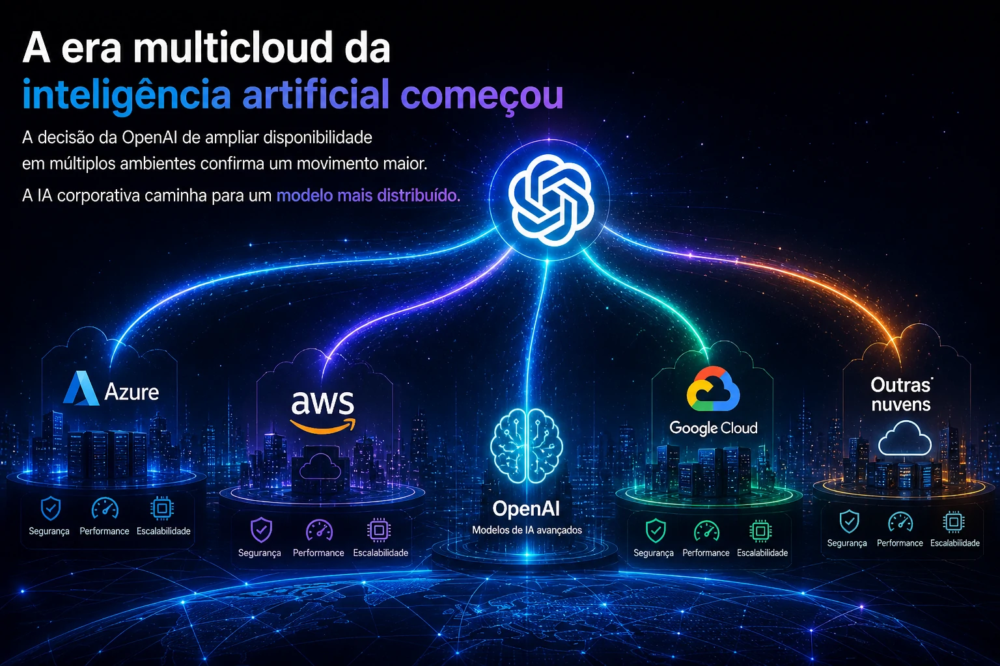

**A relação entre Microsoft e OpenAI entrou em uma nova fase — e isso importa muito mais para empresas do que parece.**

A mudança no acordo entre as gigantes sinaliza algo maior: inteligência artificial corporativa está deixando de ser um ecossistema fechado e entrando em uma lógica mais aberta, flexível e estratégica.

Para empresas brasileiras, isso muda custo, infraestrutura, dependência tecnológica e capacidade de adaptação.

## O fim da exclusividade muda o jogo da IA empresarial

Durante anos, a Microsoft foi a principal porta de entrada empresarial para os modelos da OpenAI, principalmente via Azure. Esse arranjo ajudou a consolidar a liderança da empresa no mercado corporativo de IA.

Agora o cenário mudou.

Com o novo acordo, a OpenAI pode distribuir seus produtos em múltiplas nuvens, ampliando acesso e reduzindo dependência exclusiva da infraestrutura da Microsoft.

Na prática, isso significa que empresas podem começar a pensar IA com mais liberdade estratégica.

Não é apenas uma mudança contratual.

É uma mudança estrutural no mercado.

A nova fase da parceria mantém a Microsoft como parceira estratégica, mas abre espaço para um ecossistema mais flexível de distribuição e integração.

## O risco silencioso de depender de um único fornecedor de IA

Muitas empresas brasileiras estão construindo automações, atendimento, análise de dados e produtividade em cima de um único ecossistema.

Esse modelo tem riscos.

### Custos podem ficar menos previsíveis

Se toda operação depende de uma infraestrutura única, reajustes ou mudanças comerciais impactam diretamente margem e operação.

### Flexibilidade tecnológica fica limitada

Trocar fornecedor depois que processos estão profundamente integrados pode ser caro e lento.

### Inovação pode ficar travada

O mercado está acelerando. Novos modelos surgem rápido. Ficar preso a um único stack reduz capacidade de adaptação.

Esse movimento entre Microsoft e OpenAI reforça uma tendência: empresas precisarão pensar arquitetura de IA como pensam arquitetura de cloud.

## A era multicloud da inteligência artificial começou

A decisão da OpenAI de ampliar disponibilidade em múltiplos ambientes confirma um movimento maior.

A IA corporativa caminha para um modelo mais distribuído.

Isso abre espaço para:

### Negociação de custo

Mais fornecedores significa mais poder comercial.

### Melhor encaixe operacional

Cada empresa pode escolher o ambiente mais compatível com seu stack.

### Redução de risco operacional

Distribuir dependência reduz vulnerabilidade.

A expansão para múltiplas infraestruturas reforça um novo modelo competitivo no mercado de IA empresarial.

## O que empresas brasileiras devem fazer agora

Esse é o momento de revisar estratégia.

Empresas que já usam IA precisam responder algumas perguntas:

### Onde minha IA está hospedada?

Entender a infraestrutura é o primeiro passo.

### Minha operação depende de um único fornecedor?

Se sim, vale mapear alternativas.

### Existe plano B?

Toda operação crítica precisa de redundância estratégica.

Empresas que tratam IA como infraestrutura — e não como ferramenta isolada — terão vantagem competitiva.

O mercado está ficando menos sobre "qual IA usar" e mais sobre "como estruturar IA dentro do negócio".

A nova fase entre Microsoft e OpenAI mostra exatamente isso: o futuro da IA empresarial será menos exclusivo, mais distribuído e muito mais estratégico.