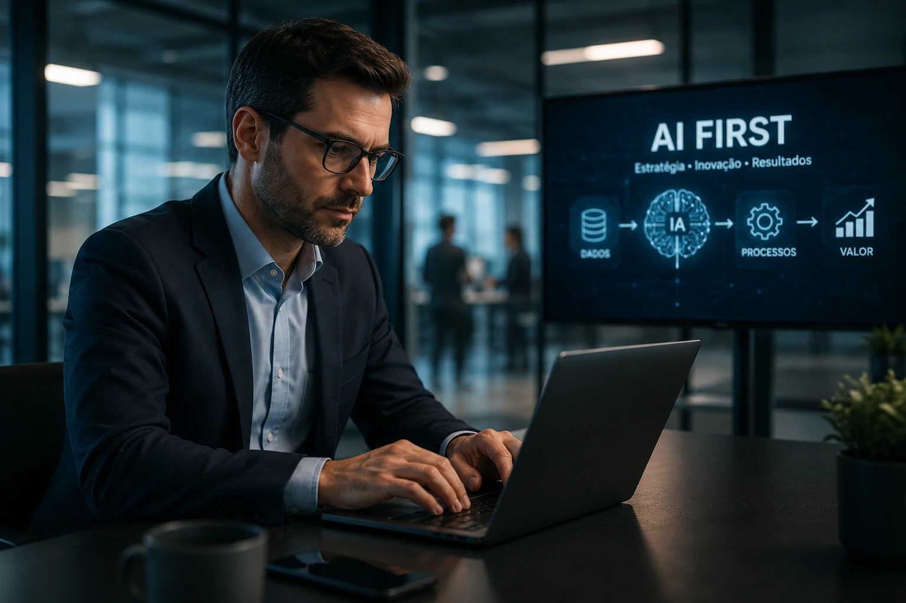
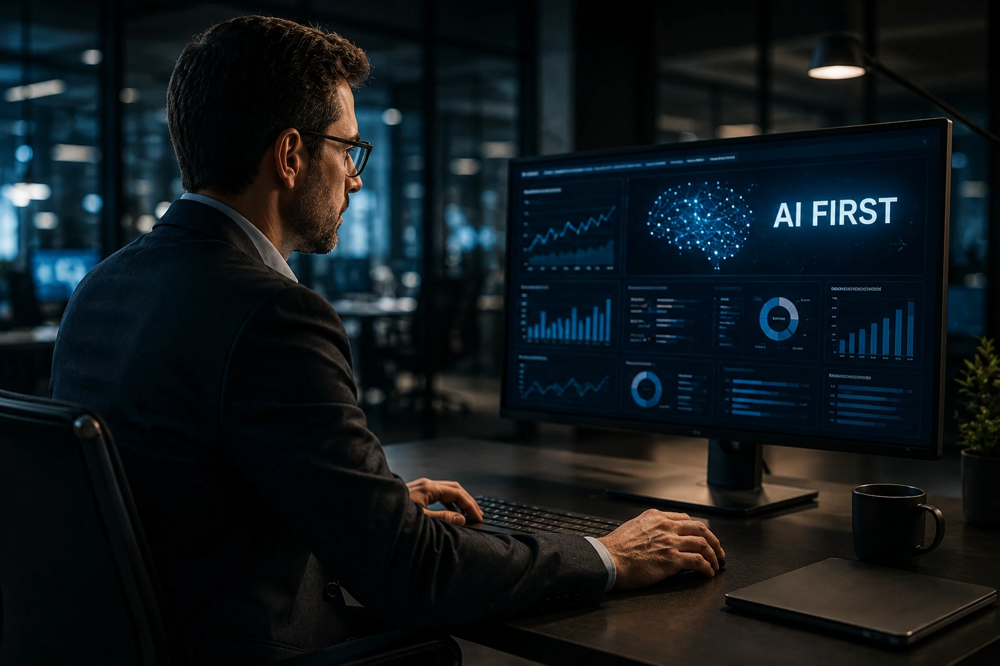
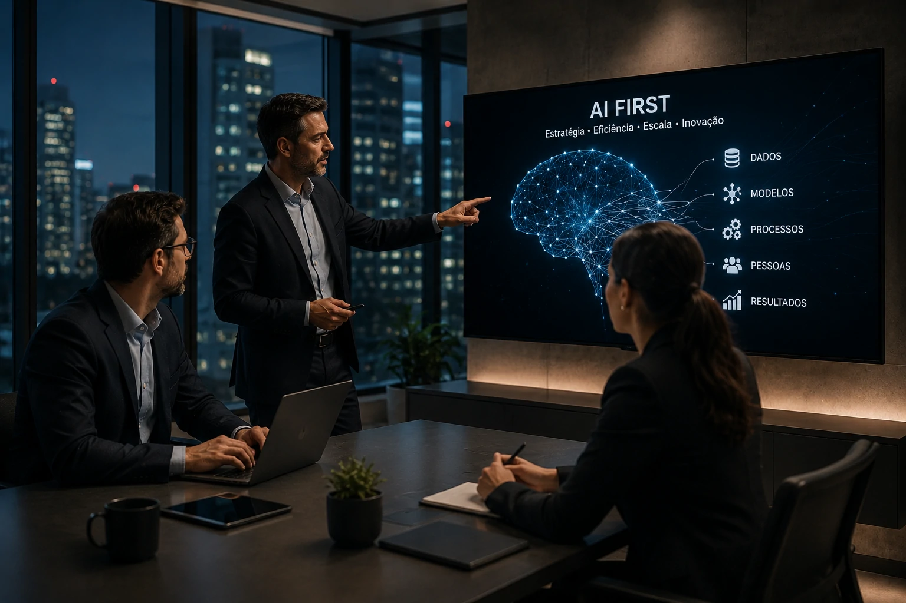

*Nos últimos anos, a inteligência artificial deixou de ser um experimento corporativo para se tornar uma prioridade estratégica. Em vez de simplesmente adicionar ferramentas de IA aos processos existentes, empresas líderes passaram a reorganizar suas operações em torno dessa tecnologia. Esse movimento deu origem ao conceito AI First, uma abordagem que pode redefinir produtividade, inovação e competitividade na próxima década.*

## O que é AI First?

AI First é uma estratégia empresarial que coloca a **Inteligência Artificial** no centro da tomada de decisões, dos processos internos e da criação de produtos.

Em uma organização tradicional, a IA costuma aparecer como uma ferramenta complementar. Já em uma empresa AI First, a pergunta inicial deixa de ser "como executar este processo?" e passa a ser "como a IA pode executar, acelerar ou aprimorar este processo?".

A abordagem representa uma mudança estrutural semelhante à transformação digital observada nos últimos anos, mas com impacto potencialmente mais profundo sobre operações, conhecimento e produtividade.

*AI First significa construir processos pensando primeiro na inteligência artificial e depois na execução operacional.*

### Como surgiu o conceito AI First?

O termo ganhou força após executivos do **Google** defenderem que a empresa deixaria de ser "mobile first" para se tornar "AI First".

A ideia era simples: a inteligência artificial deixaria de ser uma funcionalidade isolada para se tornar a camada central de praticamente todos os produtos digitais.

### Por que o conceito ganhou relevância?

O avanço dos modelos generativos ampliou drasticamente as possibilidades de automação intelectual.

Hoje, tarefas relacionadas à análise, produção de conteúdo, programação, pesquisa, atendimento e suporte à decisão podem ser parcialmente executadas por sistemas de IA.

## Como funciona uma estratégia AI First?

Uma estratégia AI First funciona ao redesenhar processos para que a inteligência artificial participe das operações desde o início.

Em vez de automatizar apenas tarefas específicas, a empresa repensa fluxos inteiros de trabalho.

O objetivo é aumentar velocidade, escala e eficiência operacional.

*Organizações AI First reestruturam fluxos de trabalho para integrar IA desde a origem dos processos.*

### O papel dos dados

Dados se tornam um ativo estratégico ainda mais importante.

Sem informações estruturadas, governadas e acessíveis, os sistemas de IA produzem resultados limitados.

Por isso, muitas empresas investem simultaneamente em governança de dados, arquitetura moderna e integração entre sistemas.

### O papel dos agentes de IA

A ascensão dos **Agentes de IA** acelerou a adoção do modelo AI First.

Ferramentas capazes de executar tarefas complexas ampliam a capacidade operacional das equipes.

Para entender melhor essa evolução, vale explorar o conteúdo sobre [Como funciona o MCP: guia completo para agentes de IA](https://noticiatech.com.br/inteligencia-artificial/como-funciona-mcp-guia-completo-agentes-ia/).

## Quais são os benefícios do modelo AI First?

Empresas AI First buscam transformar inteligência artificial em vantagem competitiva permanente.

Os ganhos normalmente aparecem em produtividade, velocidade de execução e qualidade das decisões.

Além disso, a estratégia cria condições para escalar operações sem crescimento proporcional de custos.

*O principal objetivo do modelo AI First é transformar inteligência artificial em vantagem competitiva sustentável.*

### Maior produtividade

Profissionais conseguem executar mais atividades com menos esforço operacional.

Pesquisas, análises, documentação e tarefas repetitivas podem ser aceleradas significativamente.

Isso permite que equipes concentrem energia em atividades estratégicas.

### Melhor tomada de decisão

Modelos de IA conseguem analisar grandes volumes de informação em poucos segundos.

Quando utilizados corretamente, ajudam gestores a identificar padrões, riscos e oportunidades com mais rapidez.

### Escalabilidade operacional

Empresas conseguem ampliar capacidade sem necessariamente aumentar equipes na mesma proporção.

Esse fator tem atraído atenção crescente de organizações em setores como tecnologia, serviços financeiros, varejo e saúde.

## Quais desafios impedem empresas de se tornarem AI First?

Nem toda organização está preparada para adotar essa abordagem.

A implementação exige mudanças culturais, tecnológicas e organizacionais.

Muitas iniciativas falham porque a empresa tenta implantar IA sem preparar sua infraestrutura ou seus processos.

### Resistência cultural

O principal desafio costuma ser humano.

Profissionais podem enxergar a IA como ameaça em vez de ferramenta de ampliação de capacidades.

Por isso, treinamento e educação se tornam componentes essenciais da transformação.

O conceito de [AI Fluency como vantagem competitiva da inteligência artificial](https://noticiatech.com.br/negocios/ai-fluency-vantagem-competitiva-inteligencia-artificial/) ganha relevância justamente nesse contexto.

### Infraestrutura inadequada

Sistemas fragmentados dificultam integração de modelos de IA.

Empresas com bases de dados isoladas e processos pouco digitalizados enfrentam maior complexidade de implementação.

### Governança e segurança

Quanto mais IA participa de decisões críticas, maior a necessidade de governança.

Questões relacionadas à privacidade, conformidade regulatória e controle de acesso tornam-se fundamentais.

## O futuro das empresas será AI First?

A tendência aponta para uma expansão contínua da abordagem AI First em praticamente todos os setores da economia.

Isso não significa que toda empresa se transformará em uma organização totalmente orientada por inteligência artificial.

No entanto, organizações que ignorarem essa mudança podem enfrentar desvantagens crescentes em produtividade, inovação e competitividade.

Da mesma forma que a transformação digital deixou de ser opcional, a incorporação estratégica da IA tende a se tornar parte da infraestrutura operacional das empresas modernas.

O verdadeiro diferencial competitivo provavelmente não será apenas possuir acesso à inteligência artificial, mas construir uma organização capaz de operar, aprender e evoluir continuamente ao lado dela.

---