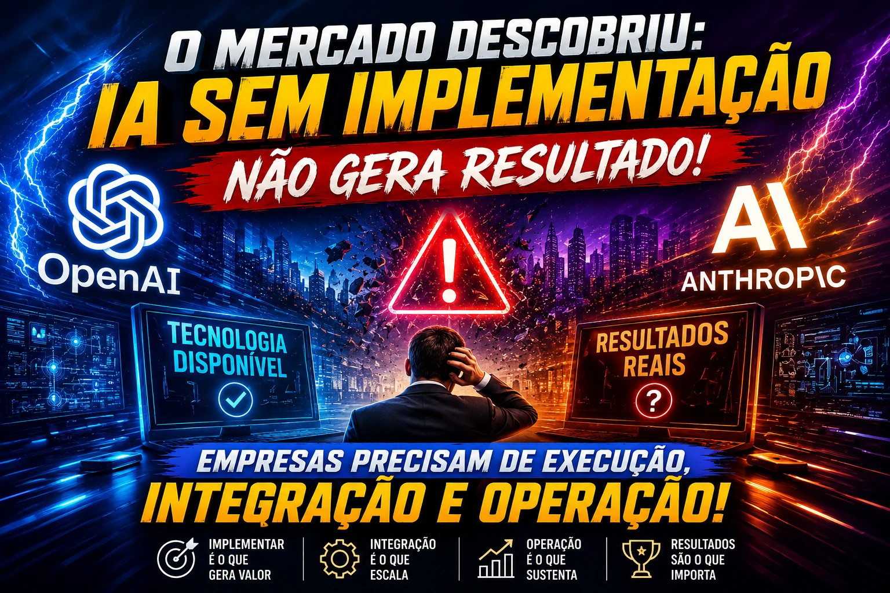
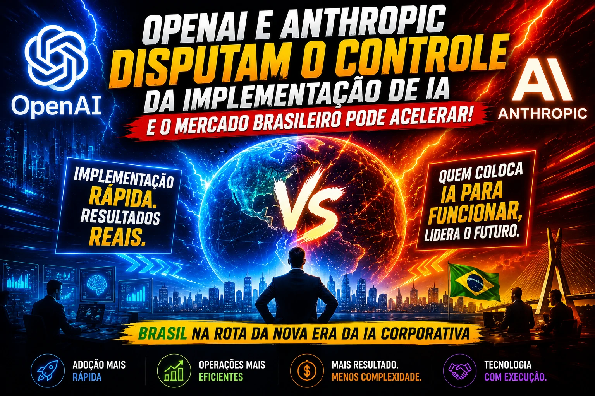
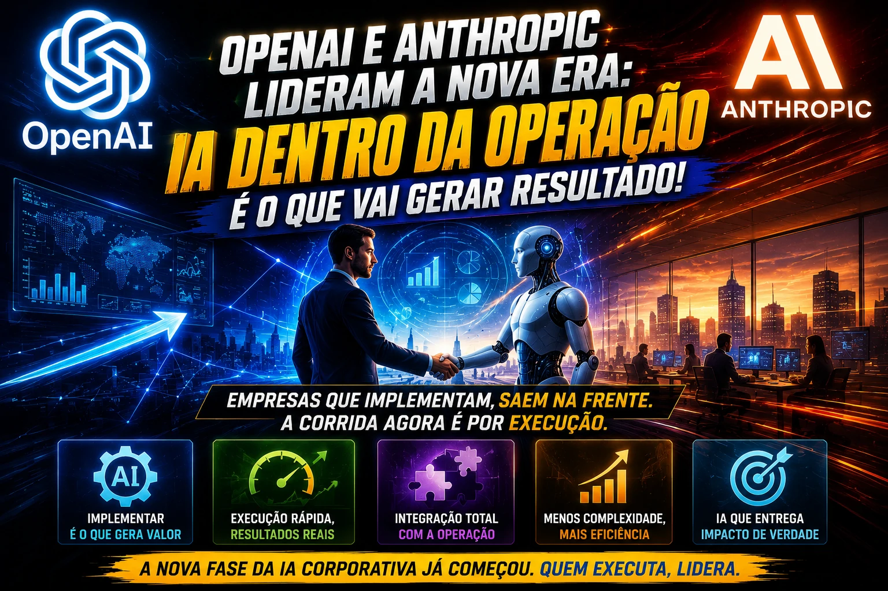

*As gigantes da inteligência artificial estão mudando de estratégia. Depois de dominar a corrida pelos modelos, agora o foco mudou: entrar na operação real das empresas. E esse movimento pode acelerar drasticamente a adoção de IA no mercado corporativo brasileiro.*

*OpenAI e Anthropic ampliam disputa para implantação prática de IA nas empresas.*

## A guerra da IA mudou de fase

Durante os últimos anos, a disputa entre empresas como **OpenAI** e **Anthropic** girou em torno da construção de modelos cada vez mais avançados.

O jogo era simples: quem tivesse o modelo mais poderoso ganhava mercado.

Mas isso está mudando.

Segundo movimentações recentes do mercado, as duas empresas agora estão olhando para um novo território: **aquisição de empresas especializadas em implementação de IA corporativa**.

Na prática, isso muda completamente a dinâmica do setor.

Até aqui, vender IA significava oferecer acesso a APIs, modelos ou plataformas.

Agora, significa ajudar empresas a colocar essa IA dentro da operação.

E isso é um divisor de águas.

## O mercado descobriu que IA sem implementação não gera resultado

*Empresas perceberam que tecnologia sem execução não gera retorno financeiro.*

O grande problema do mercado corporativo nunca foi acesso à IA.

Foi implementação.

Empresas conseguem contratar ferramentas.

Conseguem testar modelos.

Conseguem experimentar automações.

Mas transformar isso em ganho operacional é outra história.

É exatamente esse gargalo que explica por que tantas empresas ainda estão em estágio inicial.

Esse cenário conversa diretamente com um tema que já exploramos sobre como empresas usam IA para reduzir custos operacionais sem aumentar equipes.

A diferença agora é que o mercado entendeu algo importante:

**não basta vender inteligência artificial.**

É preciso vender implantação, integração e operação.

## Por que OpenAI e Anthropic querem empresas de implementação

Esse movimento não é aleatório.

Ele resolve três problemas estratégicos:

### Velocidade de adoção

Quanto mais rápido uma empresa implementa IA, mais rápido ela gera dependência da plataforma.

Isso aumenta retenção.

### Expansão de receita

Em vez de vender apenas uso de modelo, abre-se espaço para serviços, consultoria e integrações.

Modelo SaaS + serviços.

Uma combinação extremamente lucrativa.

### Defesa competitiva

Se a implementação fica nas mãos de terceiros, o relacionamento com o cliente também fica.

Controlar implantação significa controlar expansão.

E isso vale ouro.

## O impacto direto para empresas brasileiras

*Mercado brasileiro pode acelerar integração de IA em vendas, atendimento e operações.*

No Brasil, esse movimento pode acelerar setores inteiros.

Principalmente:

- **CRM**
- automação comercial
- atendimento ao cliente
- marketing
- cobrança
- recuperação de receita
- operação financeira

Empresas brasileiras ainda enfrentam um desafio clássico:

falta de mão de obra especializada para implantação.

Isso já aparece em movimentos recentes de automação empresarial e uso de IA para cobrança e recuperação de receita.

Se grandes players começarem a oferecer implementação como pacote, a barreira de entrada cai.

E isso acelera adoção.

## A nova corrida bilionária da IA corporativa

O mercado está entrando numa nova etapa.

Primeiro veio a corrida pelos modelos.

Depois a corrida pela infraestrutura.

Agora começa a corrida pela implementação.

E essa fase pode ser ainda mais lucrativa.

Porque o orçamento corporativo para transformação operacional é muito maior do que o orçamento para experimentação.

Empresas não querem apenas tecnologia.

Querem resultado.

Querem margem.

Querem eficiência.

E querem isso rápido.

## O futuro da IA B2B será menos sobre tecnologia e mais sobre execução

*Nova fase da IA corporativa prioriza implementação, integração e resultado.*

O mercado começa a amadurecer.

E o amadurecimento muda prioridades.

A pergunta deixou de ser:

"Qual IA é melhor?"

Agora virou:

"Quem consegue implementar mais rápido e gerar resultado primeiro?"

Essa mudança parece simples.

Mas muda tudo.

Para empresas brasileiras, isso significa uma oportunidade importante:

adotar IA de forma mais prática, menos experimental e mais integrada ao negócio.

E para gigantes como **OpenAI** e **Anthropic**, significa uma nova batalha.

Dessa vez, não pela melhor IA.

Mas pelo controle da operação empresarial.