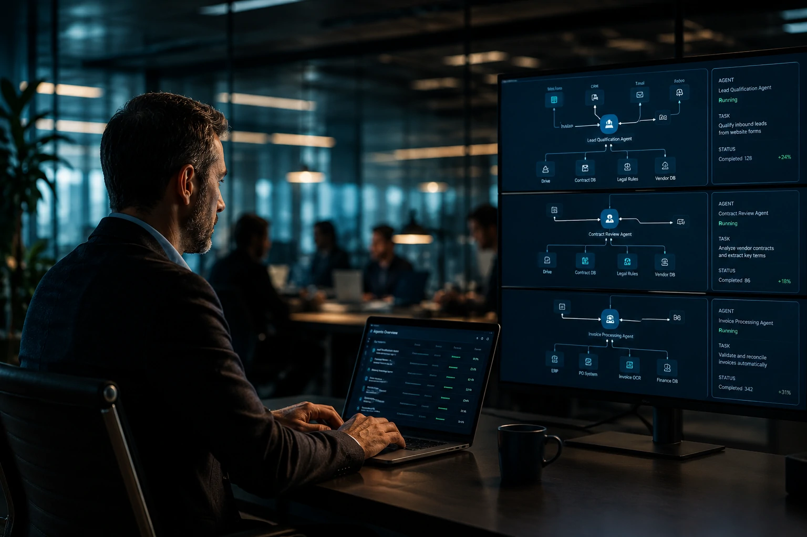
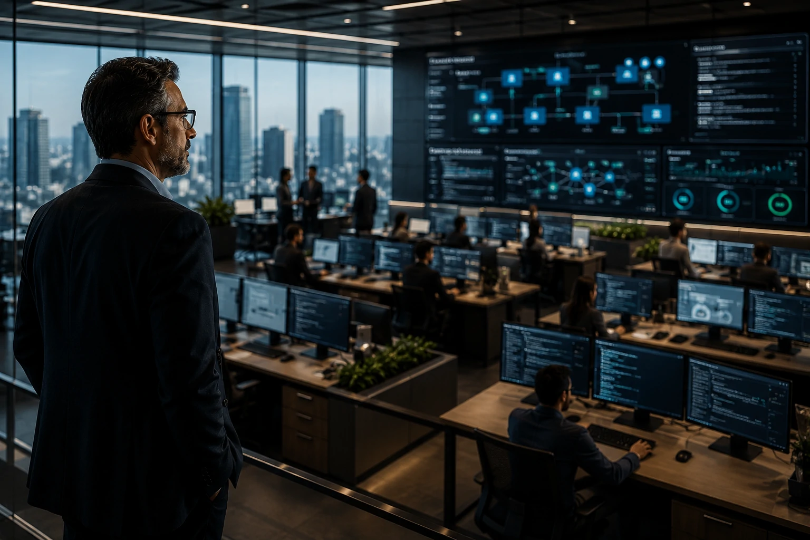

*Uma mudança silenciosa está acontecendo no mercado corporativo. Enquanto o debate público continua concentrado em chatbots e assistentes digitais, gigantes como **OpenAI**, **Salesforce**, **Microsoft** e diversas startups de infraestrutura estão acelerando uma transformação mais profunda: a conversão do software empresarial tradicional em plataformas operadas por agentes autônomos. O movimento pode representar a maior mudança estrutural do mercado de SaaS desde a popularização da computação em nuvem.*

## Agentic SaaS representa a evolução natural do software corporativo

O conceito de **Agentic SaaS** descreve plataformas capazes de executar tarefas de forma autônoma utilizando agentes de IA conectados a dados, processos e sistemas empresariais.

Durante anos, empresas investiram em dashboards, formulários e interfaces cada vez mais sofisticadas. Agora, a lógica começa a mudar. Em vez de acessar dezenas de telas para executar uma atividade, usuários passam a solicitar resultados diretamente para agentes inteligentes.

### O software deixa de ser uma ferramenta e passa a ser um operador

A principal diferença está na camada operacional.

No modelo tradicional, o software disponibiliza recursos para que o usuário execute uma tarefa.

No modelo agentic, o software executa a tarefa e apresenta apenas o resultado final.

Esse movimento já pode ser observado em plataformas corporativas que incorporam agentes capazes de gerar relatórios, atualizar CRMs, criar campanhas, analisar contratos e responder solicitações internas.

### A interface conversacional vira o novo centro da experiência

A ascensão dos agentes reforça uma tendência que já vinha sendo observada em iniciativas da **OpenAI**, da **Microsoft Copilot** e da **Salesforce Agentforce**.

A interface deixa de ser visual e passa a ser contextual.

O usuário descreve o objetivo e o sistema decide como executar a operação.

## OpenAI acelera uma mudança que pode atingir todo o mercado SaaS

A estratégia recente da **OpenAI** mostra que a empresa pretende expandir sua presença para além dos modelos de linguagem.

O foco crescente em agentes, memória persistente, execução de tarefas e integração com ferramentas empresariais sugere um cenário em que a IA se torna uma camada operacional universal.

### O objetivo não é substituir aplicativos isoladamente

A transformação é mais ampla.

Em vez de competir diretamente com cada software corporativo existente, a IA passa a funcionar como uma camada capaz de operar múltiplos sistemas simultaneamente.

Isso reduz a dependência de treinamento, simplifica fluxos de trabalho e diminui o atrito operacional.

### O SaaS entra em uma fase de abstração

Historicamente, empresas precisavam aprender a utilizar cada plataforma.

Agora, a tendência é que agentes aprendam a utilizar as plataformas pelos usuários.

Essa mudança pode reduzir drasticamente a importância das interfaces tradicionais e aumentar o valor de APIs, integrações e infraestrutura de dados.

Esse cenário dialoga diretamente com a evolução descrita em [MCP conecta agentes de IA a sistemas corporativos](https://noticiatech.com.br/inteligencia-artificial/mcp-infraestrutura-conecta-agentes-ia-sistemas-corporativos/), onde a interoperabilidade passa a ser um requisito estratégico.

## Dados estruturados se tornam o ativo mais importante da nova geração de SaaS

Empresas estão descobrindo que agentes só conseguem gerar valor quando possuem acesso a informações organizadas.

Por isso, a disputa pelo futuro do SaaS também é uma disputa pela qualidade dos dados corporativos.

### APIs ganham mais importância que interfaces

Na era dos agentes, APIs deixam de ser apenas mecanismos de integração.

Elas se tornam a principal porta de entrada para operações executadas por IA.

Sistemas sem APIs robustas podem enfrentar dificuldades para competir em um mercado cada vez mais orientado por automação inteligente.

### Data products e knowledge graphs ganham protagonismo

A nova geração de aplicações depende da capacidade de compreender contexto organizacional.

Isso explica o crescimento do interesse por estruturas como:

- Data Products
- Knowledge Graphs
- Context Engineering
- Memória corporativa
- Protocolos de interoperabilidade

A tendência complementa análises já observadas em [AI Data Products](https://noticiatech.com.br/negocios/ai-data-products-dados-corporativos-produtos-agentes-ia/) e em [Context Engineering para empresas](https://noticiatech.com.br/inteligencia-artificial/context-engineering-agentes-ia-empresas/).

## O impacto financeiro pode ser maior que a migração para a nuvem

Empresas começam a perceber que o Agentic SaaS não representa apenas uma atualização tecnológica.

Trata-se de uma mudança econômica.

Ao reduzir etapas manuais, diminuir dependência operacional e acelerar decisões, agentes podem alterar completamente a relação entre pessoas e software.

### Os fornecedores de SaaS precisarão se reinventar

A vantagem competitiva deixa de estar apenas na interface.

Passa a estar na capacidade de fornecer contexto, automação e inteligência operacional.

Plataformas que continuarem focadas apenas em telas e formulários podem enfrentar crescente pressão competitiva.

### Surge uma nova corrida pela infraestrutura invisível

Assim como a computação em nuvem criou vencedores como **Amazon Web Services**, **Microsoft Azure** e **Google Cloud**, a era do Agentic SaaS pode criar uma nova geração de líderes baseada em:

- Infraestrutura para agentes;
- Protocolos de integração;
- Memória corporativa;
- Contexto organizacional;
- Orquestração de múltiplos sistemas.

A questão já não parece ser se agentes irão transformar o mercado de software corporativo.

A questão passa a ser quais empresas conseguirão adaptar seus produtos antes que a inteligência artificial se torne a principal interface de trabalho dentro das organizações.

---