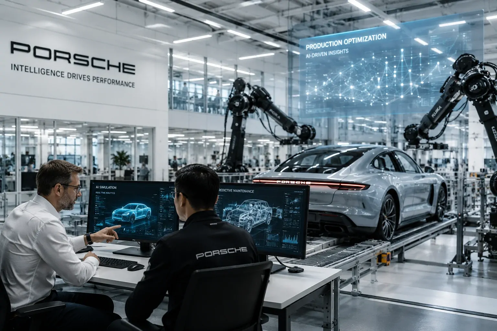
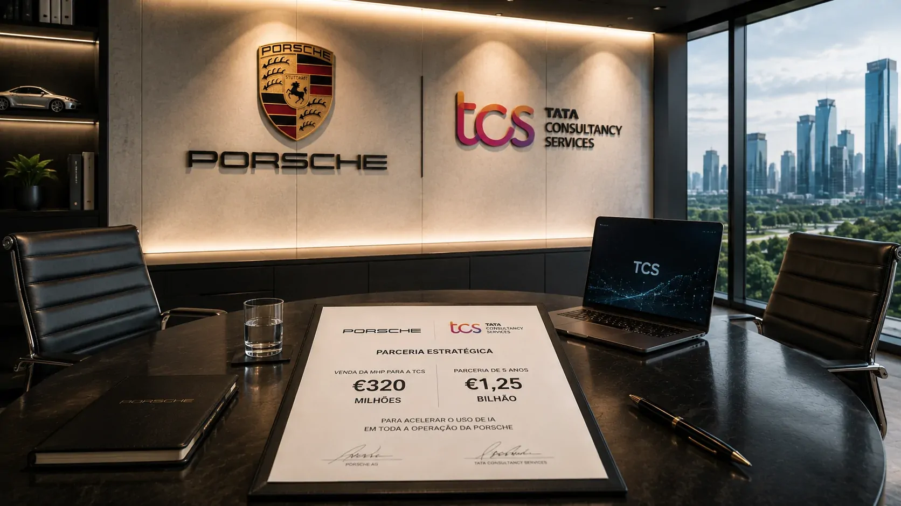
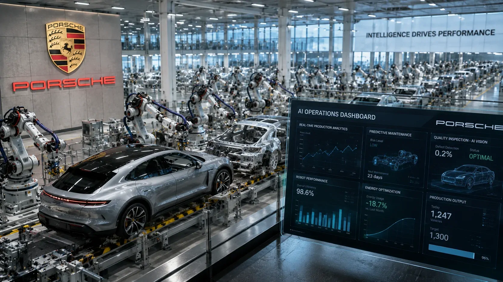

*Em uma operação que parece contraditória à primeira vista, a Porsche vende sua consultoria de tecnologia por €320 milhões, mas simultaneamente fecha um acordo de €1,25 bilhão com a Tata Consultancy Services para ampliar o uso de inteligência artificial. O movimento mostra uma estratégia de separar a propriedade da capacidade tecnológica da necessidade de controlar diretamente essa estrutura.*

## A Porsche vende a MHP, mas não abandona a tecnologia

### O que foi vendido

A **Porsche** assinou um acordo para vender a **MHP Management- und IT-Beratung GmbH**, sua consultoria de gestão e tecnologia, para a **Tata Consultancy Services (TCS)** por um valor empresarial de **€320 milhões**.

A operação envolve 100% da **MHP** e ainda depende das aprovações regulatórias e concorrenciais necessárias. A expectativa é que o negócio seja concluído nos próximos meses.

### Por que a operação chama atenção

A aparente contradição está no fato de a **Porsche** vender uma empresa de tecnologia justamente quando a inteligência artificial ganha importância dentro da indústria automotiva.

Mas a companhia apresenta a operação de outra maneira. A venda faz parte de uma estratégia de concentração no negócio principal, enquanto a parceria com a **TCS** pretende ampliar o acesso a tecnologia, engenharia e inteligência artificial.

A **MHP** também não desaparecerá. A empresa deverá manter sua marca e continuar operando como consultoria independente dentro da estrutura da **TCS**.

## O acordo de €1,25 bilhão muda o significado da venda

*O plano prevê ampliar a aplicação de inteligência artificial em engenharia, manufatura e operações da Porsche.*

### Uma parceria muito maior que a aquisição

A venda de €320 milhões é apenas uma parte da operação. **Porsche** e **TCS** também estabeleceram uma parceria estratégica de cinco anos avaliada em **€1,25 bilhão**.

O objetivo é trabalhar conjuntamente na transformação digital da montadora e ampliar a utilização de **IA** em diferentes áreas da operação.

### O que a Porsche pretende obter

A parceria prevê aplicações em **engenharia, manufatura, operações, experiência do cliente e transformação empresarial**.

Isso significa que a inteligência artificial não está sendo tratada apenas como uma ferramenta para desenvolvimento de software ou atendimento. A intenção é incorporá-la a processos que fazem parte da cadeia de valor da fabricante.

O acordo transforma a venda da **MHP** em uma operação mais ampla de reorganização tecnológica, na qual a Porsche reduz a participação societária direta, mas amplia sua relação estratégica com a estrutura tecnológica.

## A IA passa a entrar no coração da operação

### Da experimentação para a execução

A **TCS** pretende criar um **AI Mobility Centre of Excellence** dedicado à Porsche. A estrutura terá como objetivo transformar casos de uso de IA em soluções escaláveis para o setor automotivo.

Esse ponto é relevante porque o desafio empresarial da IA não termina quando uma empresa escolhe um modelo. É necessário conectar tecnologia a processos, sistemas, dados e operações reais.

O movimento da **Porsche** segue justamente essa lógica de transformar capacidade tecnológica em aplicações que possam ser utilizadas em escala.

### Uma mudança na relação entre montadora e tecnologia

A **Porsche** continuará fornecendo conhecimento sobre seus produtos, processos e operação automotiva, enquanto a **TCS** acrescentará capacidade em IA, engenharia, tecnologia e transformação empresarial.

Essa combinação pode permitir que a montadora concentre recursos no desenvolvimento de seus produtos e utilize uma estrutura tecnológica especializada para acelerar determinadas aplicações.

O movimento também se conecta a uma discussão mais ampla sobre **IA em operações empresariais**. Empresas que levam inteligência artificial para processos críticos precisam integrar modelos, dados, sistemas e governança em vez de tratar a tecnologia como uma ferramenta isolada.

## A MHP continua sendo importante para a Porsche

*Porsche e TCS estruturam uma parceria de cinco anos para ampliar o uso de IA na cadeia de valor automotiva.*

### O que a MHP leva para a nova estrutura

A **MHP** possui mais de 30 anos de atuação em consultoria de gestão e tecnologia e experiência em transformação de empresas automotivas e industriais.

A empresa trabalha com áreas como **inteligência artificial, digitalização da manufatura, SAP, cadeia de suprimentos, mobilidade conectada e transformação digital**.

Depois da aquisição, essa experiência será combinada à escala global da **TCS**, criando uma estrutura com maior capacidade para atender projetos tecnológicos de grande porte.

### Por que a Porsche mantém a parceria

A mudança de proprietário não significa que a **Porsche** perderá acesso à **MHP**. Pelo contrário, a empresa afirma que a colaboração de longo prazo continuará.

A **MHP** permanecerá como parceira da Porsche em projetos de digitalização e transformação, especialmente aqueles relacionados à inteligência artificial.

Isso ajuda a explicar a lógica econômica do negócio: **a Porsche deixa de controlar diretamente a consultoria, mas mantém uma relação estratégica com ela por meio da TCS**.

## O que a operação revela sobre a estratégia de IA da Porsche

### Menos propriedade, mais capacidade

O aspecto mais interessante da operação é que a **Porsche** não parece estar tratando tecnologia como algo que necessariamente precisa permanecer dentro de sua estrutura societária.

A empresa está concentrando seu negócio principal e, ao mesmo tempo, contratando uma capacidade tecnológica de escala maior.

Essa distinção pode se tornar importante para outras empresas que enfrentam a mesma escolha: construir internamente todas as capacidades de IA ou combinar conhecimento próprio com parceiros especializados.

### A inteligência artificial como infraestrutura operacional

A parceria também mostra uma mudança de foco.

A discussão empresarial sobre IA começa a avançar de ferramentas individuais para aplicações integradas à operação. Na indústria automotiva, isso pode envolver engenharia, produção, cadeia de suprimentos, experiência do cliente e plataformas digitais.

Esse movimento acompanha uma transformação mais ampla do setor, em que a inteligência artificial começa a participar não apenas da operação industrial, mas também da própria experiência digital dos veículos. O Notícia Tech já analisou esse movimento em **[como Gemini e ChatGPT podem influenciar os carros inteligentes e a indústria automotiva](https://noticiatech.com.br/inteligencia-artificial/gemini-chatgpt-carros-inteligentes-industria-automotiva/)**.

A **Porsche** já possui um histórico de utilização da **MHP** em transformação tecnológica. Agora, a parceria com a **TCS** cria uma estrutura para tentar ampliar essa capacidade.

Para empresas que acompanham essa transformação, o ponto central é que **IA aplicada ao negócio exige mais do que acesso a modelos: exige integração, engenharia e capacidade de execução**.

## O próximo teste será transformar o investimento em resultados

*O desafio agora será transformar a parceria tecnológica em aplicações de IA capazes de gerar resultados concretos na operação.*

### O dinheiro ainda precisa virar produtividade

O acordo de **€1,25 bilhão** estabelece uma escala relevante para a parceria, mas o valor anunciado não significa que todos os ganhos já estejam garantidos.

A medida mais importante será a capacidade de transformar os projetos de inteligência artificial em resultados concretos para a operação da **Porsche**.

Isso inclui ganhos de eficiência, velocidade de desenvolvimento, resiliência operacional e novas aplicações digitais, objetivos associados à transformação planejada pelas empresas.

### O que o mercado deve acompanhar

Os próximos meses serão importantes para observar a conclusão da aquisição, a estruturação do centro de excelência e os primeiros projetos colocados em escala.

Também será relevante acompanhar se a parceria conseguirá transformar IA em capacidade operacional permanente, em vez de limitar sua utilização a projetos isolados.

Esse ponto é particularmente importante porque a adoção empresarial de inteligência artificial exige mudanças na maneira como tecnologia, processos e governança trabalham juntos. O conceito de **AI Operations** ajuda a entender essa transição e pode ser aprofundado neste conteúdo do Notícia Tech sobre **[como a IA está transformando operações e governança com agentes de IA nas empresas](https://noticiatech.com.br/inteligencia-artificial/ai-operations-governanca-agentes-ia-empresas/)**.

A operação da **Porsche** ainda não permite concluir que esse modelo será adotado por toda a indústria. Mas ela oferece um sinal concreto de como uma grande empresa pode escolher concentrar-se em seu negócio principal enquanto utiliza uma parceria tecnológica de longo prazo para acelerar a adoção de IA.

---