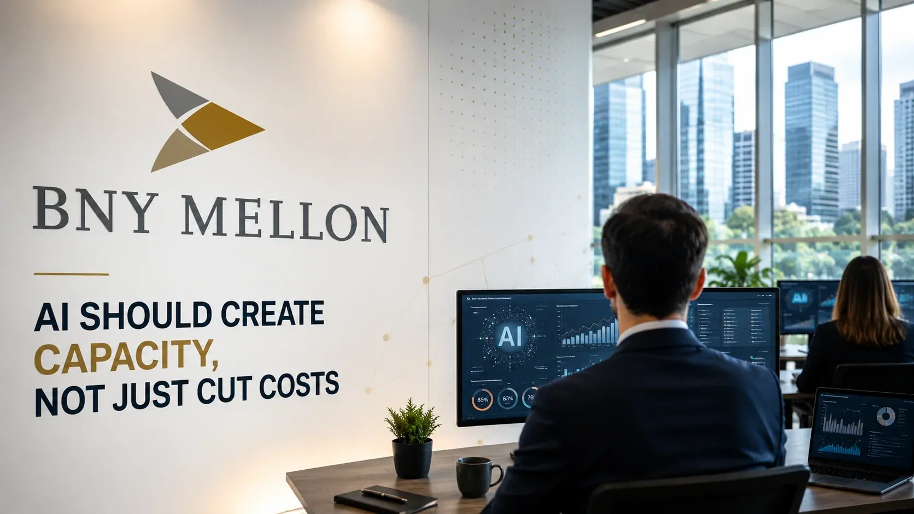

*Robin Vince, CEO do **BNY**, está defendendo uma visão de inteligência artificial que vai além da simples redução de custos. Para ele, o ganho mais importante pode estar na capacidade que a tecnologia libera para pessoas e empresas fazerem mais, desenvolverem novos produtos e ampliarem o valor entregue aos clientes.*

## Quem é Robin Vince e qual banco ele comanda

### Da carreira no Goldman Sachs ao comando do BNY

**Robin Vince** é presidente do conselho e CEO do **BNY**, uma das principais instituições financeiras dos Estados Unidos. Ele assumiu o comando executivo do banco em 2022, depois de construir uma longa carreira no **Goldman Sachs**, onde ocupou posições de liderança em áreas como gestão de risco, operações, tesouraria e negócios internacionais.

A trajetória ajuda a explicar por que sua avaliação sobre **inteligência artificial** chama atenção. Vince não está falando sobre IA apenas como observador do mercado, mas como executivo responsável por uma instituição que opera em uma infraestrutura financeira de grande escala.

Em 2025, Vince também assumiu a presidência do conselho do **BNY**, ampliando sua influência sobre a estratégia de longo prazo da companhia.

### Por que o BNY é relevante nessa discussão

O **BNY** não é um banco tradicional focado apenas no atendimento ao consumidor. A companhia atua em serviços financeiros e na infraestrutura dos mercados, administrando, movimentando e protegendo ativos para clientes ao redor do mundo.

Essa característica coloca a IA diante de problemas concretos de escala, dados, segurança, produtividade e tomada de decisão.

A relevância de Vince aumentou ainda mais em julho de 2026, quando ele foi nomeado para os conselhos da **OpenAI Foundation** e da **OpenAI Group PBC**, aproximando sua experiência no setor financeiro da estratégia de uma das empresas mais importantes da atual corrida pela IA.

## A visão de Vince: IA deve criar capacidade

*Para Robin Vince, o ganho da IA não termina na eficiência: a tecnologia pode liberar capacidade para atividades de maior valor.*

### O que significa criar capacidade

A diferença parece pequena, mas muda a maneira como uma empresa pode medir o retorno de seus investimentos em IA.

Quando uma ferramenta automatiza uma tarefa, o resultado mais imediato é uma economia de tempo. A interpretação tradicional termina aí: menos horas significariam menor custo.

A visão defendida por **Robin Vince** acrescenta uma segunda etapa. Se a empresa economiza tempo em determinada atividade, ela pode usar essa capacidade liberada para atender mais clientes, desenvolver produtos, melhorar processos ou concentrar profissionais em decisões mais complexas.

Nesse modelo, eficiência deixa de ser apenas uma métrica de redução e passa a funcionar como um recurso que pode ser reinvestido.

### O limite de pensar apenas em corte de custos

Uma estratégia baseada exclusivamente em redução de despesas pode enxergar a IA como substituta de tarefas. Já uma estratégia de criação de capacidade procura entender o que a organização consegue fazer depois que essas tarefas ficam mais rápidas ou parcialmente automatizadas.

Essa distinção é importante porque o impacto econômico da IA não depende apenas de quantas atividades uma empresa consegue automatizar.

Também depende de **onde a capacidade liberada será aplicada**.

É justamente nesse ponto que a visão do CEO do **BNY** se torna relevante para gestores. O investimento em IA começa a fazer mais sentido quando está conectado a uma mudança concreta no funcionamento do negócio, e não quando a tecnologia é adotada apenas porque se tornou prioridade no mercado.

## Como o BNY está transformando IA em infraestrutura empresarial

### Da experimentação para a integração

A estratégia do **BNY** mostra que a visão de Vince não está limitada a uma declaração sobre produtividade.

A instituição vem construindo uma plataforma corporativa própria de IA chamada **Eliza**, concebida para integrar diferentes modelos e aplicações de inteligência artificial dentro da organização. O banco também trabalha com sistemas multiagentes e soluções que atuam ao lado de funcionários.

Essa abordagem representa uma mudança importante: em vez de distribuir ferramentas isoladas para funcionários, a empresa procura incorporar IA aos próprios processos.

O objetivo passa a ser transformar a tecnologia em uma camada permanente da operação.

### Onde aparece a criação de capacidade

O **BNY** afirma que sua estratégia de IA busca aumentar eficiência, inovação e qualidade dos serviços prestados aos clientes, ao mesmo tempo em que cria capacidade para que seus profissionais possam dedicar mais tempo a trabalhos de maior valor.

Essa lógica também aparece no planejamento estratégico da instituição para 2026.

A empresa pretende avançar da disponibilização ampla de IA para uma integração mais profunda entre dados, plataformas, processos e produtos. Isso é relevante porque o verdadeiro ganho de escala tende a aparecer quando a IA deixa de ser uma ferramenta separada e passa a fazer parte do fluxo operacional.

Essa mudança ajuda a explicar por que a discussão sobre IA empresarial está avançando de **adoção de ferramentas** para **reestruturação de processos**.

## O que muda para empresas que adotam IA

*Quando tarefas repetitivas são aceleradas, o desafio passa a ser decidir onde aplicar a capacidade liberada pela IA.*

### Produtividade não é o mesmo que transformação

Uma empresa pode implementar um assistente de IA e obter ganhos de produtividade sem alterar sua estrutura de negócios.

Isso acontece quando a tecnologia apenas acelera uma tarefa existente.

A transformação começa em outro ponto: quando a organização usa essa capacidade adicional para mudar processos, desenvolver produtos, atender clientes de maneira diferente ou tomar decisões com mais velocidade e qualidade.

Por isso, a experiência do **BNY** oferece uma referência interessante. O banco está tentando conectar IA a uma arquitetura corporativa mais ampla, envolvendo dados, segurança, governança, aplicações e pessoas.

### A capacidade liberada precisa de uma estratégia

Existe, porém, uma condição importante nessa equação: liberar capacidade não significa automaticamente gerar crescimento.

Se uma empresa automatiza uma atividade e não possui uma estratégia para utilizar o tempo, os recursos ou os dados liberados, parte do potencial econômico da IA pode permanecer inexplorado.

É por isso que a discussão proposta por Vince coloca uma responsabilidade adicional sobre os gestores.

A pergunta deixa de ser apenas **“quanto a IA consegue economizar?”** e passa a incluir **“o que a empresa conseguirá fazer com aquilo que a IA tornou possível?”**

Essa mudança também se conecta ao debate sobre como a inteligência artificial está alterando a própria percepção de valor dentro das empresas. O Notícia Tech já analisou essa transformação em **[IA muda o valor das empresas de tecnologia](https://noticiatech.com.br/negocios/ia-muda-valor-empresas-tecnologia/)**, mostrando como a tecnologia pode mudar a forma como o mercado avalia negócios e empresas.

## Por que a estratégia do BNY interessa ao mercado

### A IA entra na agenda de crescimento

A experiência do **BNY** mostra uma tendência importante na adoção corporativa de IA: os investimentos começam a ser tratados como parte da estratégia de crescimento, e não apenas como projetos de tecnologia.

Quando a IA é incorporada aos produtos e processos, o retorno pode aparecer em diferentes pontos da organização.

Pode estar na redução de tarefas manuais, na aceleração de análises, na melhoria de decisões ou na capacidade de atender clientes com estruturas que antes exigiriam mais recursos.

Para grandes empresas, essa combinação pode ser mais importante do que uma simples redução do custo de uma tarefa específica.

### O desafio passa a ser escalar com segurança

O setor financeiro também evidencia outro problema: quanto mais profunda é a integração da IA, maior é a necessidade de governança.

Dados sensíveis, decisões financeiras, controles internos e requisitos regulatórios tornam insuficiente a estratégia de simplesmente liberar acesso a modelos de IA.

O **BNY** vem tratando segurança, governança e integração como partes da mesma estratégia. Isso indica que a criação de capacidade depende também de criar mecanismos para controlar como essa capacidade será utilizada.

Esse ponto é especialmente relevante diante do avanço dos agentes de IA, que podem executar ações com maior autonomia dentro das empresas. O Notícia Tech já analisou esse desafio em **[Agentes de IA e o novo problema das empresas](https://noticiatech.com.br/inteligencia-artificial/agentes-ia-responsabilidade-empresas-acoes-autonomas/)**, mostrando como a autonomia desses sistemas cria uma nova discussão sobre responsabilidade quando eles passam a agir diretamente sobre processos corporativos.

## A próxima disputa será por capacidade, não apenas por eficiência

*O próximo estágio da IA empresarial pode ser definido menos pela quantidade de tarefas automatizadas e mais pela capacidade adicional que as organizações conseguem transformar em crescimento.*

### O que Robin Vince está sinalizando

A fala de **Robin Vince** ganha importância porque sintetiza uma mudança na forma como grandes empresas podem interpretar o retorno da IA.

Durante a primeira fase da adoção corporativa, a pergunta predominante era quanto trabalho poderia ser automatizado. Agora, uma questão mais estratégica começa a aparecer: quanto trabalho de maior valor uma organização consegue realizar quando a IA assume parte das atividades operacionais.

Não significa que redução de custos deixou de ser importante.

Significa que ela pode ser apenas uma das etapas do processo.

### O que observar nos próximos meses

A evolução dessa estratégia dependerá da capacidade das empresas de transformar ganhos de produtividade em novos resultados econômicos.

Será necessário observar se a capacidade liberada realmente será convertida em novos produtos, expansão comercial, atendimento melhor, inovação e trabalho de maior valor.

Também será importante acompanhar se outras grandes instituições começarão a adotar uma linguagem semelhante ao falar sobre seus investimentos em IA.

Se isso acontecer, a mudança será mais profunda do que uma alteração de vocabulário corporativo. A própria forma de calcular o retorno da inteligência artificial poderá começar a migrar de **“quanto conseguimos economizar?”** para **“quanto mais conseguimos fazer?”**.

É essa segunda pergunta que torna a visão de **Robin Vince** especialmente relevante para a próxima fase da IA nos negócios.

---